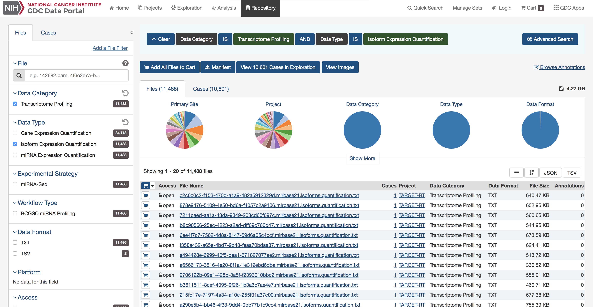

# 103: Public Data Resources and Bioconductor

## Instructor name(s) and contact information

* Levi Waldron^[City University of New York, New York, NY, USA]
* Benjamin Haibe-Kain^[Princess Margaret Cancer Center, Toronto, Canada]
* Sean Davis^[Center for Cancer Research, National Cancer Institute, National Institutes of Health, Bethesda, MD, USA]

## Syllabus

### Workshop Description 

The goal of this workshop is to introduce Bioconductor packages for finding,
accessing, and using large-scale public data resources including the 
Gene Expression Omnibus [GEO](https://www.ncbi.nlm.nih.gov/geo), Sequence
Read Archive [SRA](https://www.ncbi.nlm.nih.gov/sra), the Genomic Data
Commons [GDC](https://portal.gdc.cancer.gov/), and Bioconductor-hosted 
curated data resources for metagenomics, pharmacogenomics [PharmacoDB](http://pharmacodb.ca/), and The Cancer 
Genome Atlas.

### Pre-requisites

* Basic knowledge of R syntax
* Familiarity with the ExpressionSet and SummarizedExperiment classes
* Basic familiarity with 'omics technologies such as microarray and NGS sequencing

Interested students can prepare by reviewing vignettes of the packages listed in "R/Bioconductor packages used" to gain background on aspects of interest to them.

Some more general background on these resources is published in @Kannan2016-yv.

### Workshop Participation 

Each component will include runnable examples of typical usage that students are encouraged to run during demonstration of that component.

### R/Bioconductor packages used

* *[GEOquery](http://bioconductor.org/packages/GEOquery)*: Access to the NCBI Gene Expression Omnibus (GEO), a public repository of gene expression (primarily microarray) data.
* *[GenomicDataCommons](http://bioconductor.org/packages/GenomicDataCommons)*: Access to the NIH / NCI Genomic Data Commons RESTful service.
* *[SRAdbV2](https://github.com/seandavi/SRAdbV2)*: A compilation of metadata from the NCBI Sequence Read Archive, the largest public repository of sequencing data from the next generation of sequencing platforms, and tools
* *[curatedTCGAData](http://bioconductor.org/packages/curatedTCGAData)*: Curated data from The Cancer Genome Atlas (TCGA) as MultiAssayExperiment Objects
* *[curatedMetagenomicData](http://bioconductor.org/packages/curatedMetagenomicData)*: Curated metagenomic data of the human microbiome
* *[HMP16SData](http://bioconductor.org/packages/HMP16SData)*: Curated metagenomic data of the human microbiome
* *[PharmacoGx](http://bioconductor.org/packages/PharmacoGx)*: Curated large-scale preclinical pharmacogenomic data and basic analysis tools


### Time outline

This is a 1h45m workshop.

| Activity                            | Time    |
|-------------------------------------|---------|
| Overview | 10m |
| GEOquery | 15m |
| GenomicDataCommons | 20m |
| Sequence Read Archive | 20m |
| curatedTCGAData   | 10m |
| curatedMetagenomicData and HMP16SData | 15m |
| PharmacoGx | 20m |

### Workshop goals and objectives

Bioconductor provides access to significant amounts of publicly available 
experimental  data. This workshop introduces students to Bioconductor
interfaces to the NCBI's Gene Expression Omnibus, Genomic Data Commons,
Sequence Read Archive and PharmacoDB. It additionally introduces curated resources 
providing The Cancer Genome Atlas, the Human Microbiome Project and other 
microbiome studies, and major pharmacogenomic studies, as native Bioconductor
objects ready for analysis and comparison to in-house datasets.

### Learning goals

* search NCBI resources for publicly available 'omics data
* quickly use data from the TCGA and the Human Microbiome Project

### Learning objectives

* find and download processed microarray and RNA-seq datasets from the Gene Expression Omnibus
* find and download 'omics data from the Genomic Data Commons and Sequence Read Archive
* download and manipulate data from The Cancer Genome Atlas and Human Microbiome Project
* download and explore pharmacogenomics data

## Overview


Before proceeding, ensure that the following packages are installed.


```r
required_pkgs = c(
  "TCGAbiolinks", 
  "GEOquery", 
  "GenomicDataCommons",
  "limma",
  "curatedTCGAData",
  "recount",
  "curatedMetagenomicData",
  "phyloseq",
  "HMP16SData",
  "caTools",
  "piano",
  "isa",
  "VennDiagram",
  "downloader",
	"gdata",
	"AnnotationDbi",
	"hgu133a.db",
  "PharmacoGx")
BiocManager::install(required_pkgs)
```

## GEOquery

[@Sean2007-cv]

The NCBI Gene Expression Omnibus (GEO) serves as a public repository for a wide range of high-throughput experimental data. These data include single and dual channel microarray-based experiments measuring mRNA, genomic DNA, and protein abundance, as well as non-array techniques such as serial analysis of gene expression (SAGE), mass spectrometry proteomic data, and high-throughput sequencing data.
The *[GEOquery](http://bioconductor.org/packages/GEOquery)* package [@Sean2007-cv] forms a bridge between this public repository and the analysis capabilities
in Bioconductor.

### Overview of GEO

At the most basic level of organization of GEO, there are four basic entity types.  The first three (Sample, Platform, and Series) are supplied by users; the fourth, the dataset, is compiled and curated by GEO staff from the user-submitted data. See [the GEO home page](https://www.ncbi.nlm.nih.gov/geo/) for more information.

#### Platforms

A Platform record describes the list of elements on the array (e.g., cDNAs, oligonucleotide probesets, ORFs, antibodies) or the list of elements that may be detected and quantified in that experiment (e.g., SAGE tags, peptides). Each Platform record is assigned a unique and stable GEO accession number (GPLxxx). A Platform may reference many Samples that have been submitted by multiple submitters.

#### Samples

A Sample record describes the conditions under which an individual Sample was handled, the manipulations it underwent, and the abundance measurement of each element derived from it. Each Sample record is assigned a unique and stable GEO accession number (GSMxxx). A Sample entity must reference only one Platform and may be included in multiple Series.

#### Series

A Series record defines a set of related Samples considered to be part of a group, how the Samples are related, and if and how they are ordered. A Series provides a focal point and description of the experiment as a whole. Series records may also contain tables describing extracted data, summary conclusions, or analyses. Each Series record is assigned a unique and stable GEO accession number (GSExxx).  Series records are available in a couple of formats which are handled by GEOquery independently.  The smaller and new GSEMatrix files are quite fast to parse; a simple flag is used by GEOquery to choose to use GSEMatrix files (see below).

#### Datasets

GEO DataSets (GDSxxx) are curated sets of GEO Sample data. There are hundreds of GEO datasets available, but GEO discontinued creating 
GDS records several years ago. We mention them here for completeness only.

### Getting Started using GEOquery

Getting data from GEO is really quite easy.  There is only one command that is needed, `getGEO`.  This one function interprets its input to determine how to get the data from GEO and then parse the data into useful R data structures.


```r
library(GEOquery)
```

With the library loaded, we are free to access any GEO accession. 

### Use case: MDS plot of cancer data

The data we are going to access are from [this paper](https://doi.org/10.1158/1055-9965.EPI-17-0461). 

> Background: The tumor microenvironment is an important factor in cancer immunotherapy response. To further understand how a tumor affects the local immune system, we analyzed immune gene expression differences between matching normal and tumor tissue.Methods: We analyzed public and new gene expression data from solid cancers and isolated immune cell populations. We also determined the correlation between CD8, FoxP3 IHC, and our gene signatures.Results: We observed that regulatory T cells (Tregs) were one of the main drivers of immune gene expression differences between normal and tumor tissue. A tumor-specific CD8 signature was slightly lower in tumor tissue compared with normal of most (12 of 16) cancers, whereas a Treg signature was higher in tumor tissue of all cancers except liver. Clustering by Treg signature found two groups in colorectal cancer datasets. The high Treg cluster had more samples that were consensus molecular subtype 1/4, right-sided, and microsatellite-instable, compared with the low Treg cluster. Finally, we found that the correlation between signature and IHC was low in our small dataset, but samples in the high Treg cluster had significantly more CD8+ and FoxP3+ cells compared with the low Treg cluster.Conclusions: Treg gene expression is highly indicative of the overall tumor immune environment.Impact: In comparison with the consensus molecular subtype and microsatellite status, the Treg signature identifies more colorectal tumors with high immune activation that may benefit from cancer immunotherapy. 

In this little exercise, we will:

1. Access public omics data using the GEOquery package
2. Convert the public omics data to a `SummarizedExperiment` object.
3. Perform a simple unsupervised analysis to visualize these public data.

Use the [GEOquery] package to fetch data about [GSE103512].


```r
gse = getGEO("GSE103512")[[1]]
```

Note that `getGEO`, when used to retrieve *GSE* records, returns a list. The members of the list each represent
one *GEO Platform*, since each *GSE* record can contain multiple related datasets (eg., gene expression and DNA methylation). 
In this case, the list is of length one, but it is still necessary to grab the first elment. 

The first step--a detail--is to convert from the older Bioconductor data structure (GEOquery was written in 2007), the `ExpressionSet`, to the newer `SummarizedExperiment`. One line suffices.


```r
library(SummarizedExperiment)
se = as(gse, "SummarizedExperiment")
```

Examine two variables of interest, cancer type and tumor/normal status. 


```r
with(colData(se),table(`cancer.type.ch1`,`normal.ch1`))
```

```
##                normal.ch1
## cancer.type.ch1 no yes
##           BC    65  10
##           CRC   57  12
##           NSCLC 60   9
##           PCA   60   7
```

Filter gene expression by variance to find most informative genes.


```r
sds = apply(assay(se, 'exprs'),1,sd)
dat = assay(se, 'exprs')[order(sds,decreasing = TRUE)[1:500],]
```

Perform [multidimensional scaling] and prepare for plotting. We will be using ggplot2, so
we need to make a data.frame before plotting. 


```r
mdsvals = cmdscale(dist(t(dat)))
mdsvals = as.data.frame(mdsvals)
mdsvals$Type=factor(colData(se)[,'cancer.type.ch1'])
mdsvals$Normal = factor(colData(se)[,'normal.ch1'])
head(mdsvals)
```

```
##                   V1        V2 Type Normal
## GSM2772660  8.531331 -18.57115   BC     no
## GSM2772661  8.991591 -13.63764   BC     no
## GSM2772662 10.788973 -13.48403   BC     no
## GSM2772663  3.127105 -19.13529   BC     no
## GSM2772664 13.056599 -13.88711   BC     no
## GSM2772665  7.903717 -13.24731   BC     no
```

And do the plot.


```r
library(ggplot2)
ggplot(mdsvals, aes(x=V1,y=V2,shape=Normal,color=Type)) + 
    geom_point( alpha=0.6) + theme(text=element_text(size = 18))
```


[R]: https://cran.r-project.org/
[GEOquery]: https://bioconductor.org/packages/GEOquery
[GSE103512]: https://www.ncbi.nlm.nih.gov/geo/query/acc.cgi?acc=GSE103512
[multidimensional scaling]: https://en.wikipedia.org/wiki/Multidimensional_scaling

### Accessing Raw Data from GEO

NCBI GEO accepts (but has not always required) raw data such as .CEL files, .CDF files, images, etc. It is also not uncommon for some RNA-seq or other sequencing datasets to supply *only* raw data (with accompanying sample information, of course), necessitating  Sometimes, it is useful to get quick access to such data.  A single function, `getGEOSuppFiles`, can take as an argument a GEO accession and will download all the raw data associate with that accession.  By default, the function will create a directory in the current working directory to store the raw data for the chosen GEO accession.

## GenomicDataCommons

From the [Genomic Data Commons (GDC) website](https://gdc.nci.nih.gov/about-gdc):

> The National Cancer Institute's (NCI's) Genomic Data Commons (GDC) is
a data sharing platform that promotes precision medicine in
oncology. It is not just a database or a tool; it is an expandable
knowledge network supporting the import and standardization of genomic
and clinical data from cancer research programs.
> The GDC contains NCI-generated data from some of the largest and most
comprehensive cancer genomic datasets, including The Cancer Genome
Atlas (TCGA) and Therapeutically Applicable Research to Generate
Effective Therapies (TARGET). For the first time, these datasets have
been harmonized using a common set of bioinformatics pipelines, so
that the data can be directly compared.
> As a growing knowledge system for cancer, the GDC also enables
researchers to submit data, and harmonizes these data for import into
the GDC. As more researchers add clinical and genomic data to the GDC,
it will become an even more powerful tool for making discoveries about
the molecular basis of cancer that may lead to better care for
patients.

The
[data model for the GDC is complex](https://gdc.cancer.gov/developers/gdc-data-model/gdc-data-model-components),
but it worth a quick overview and a graphical representation is included here. 


 The
GDC API exposes these nodes and edges in a somewhat simplified set
of
[RESTful](https://en.wikipedia.org/wiki/Representational_state_transfer) endpoints.

### Quickstart

This quickstart section is just meant to show basic
functionality. More details of functionality are included further on
in this vignette and in function-specific help.

To report bugs or problems, either
[submit a new issue](https://github.com/Bioconductor/GenomicDataCommons/issues)
or submit a `bug.report(package='GenomicDataCommons')` from within R (which will
redirect you to the new issue on GitHub).

#### Installation

Installation of the *[GenomicDataCommons](http://bioconductor.org/packages/GenomicDataCommons)* package is
identical to installation of other Bioconductor packages.


```r
install.packages('BiocManager')
BiocManager::install('GenomicDataCommons')
```

After installation, load the library in order to use it.


```r
library(GenomicDataCommons)
```

#### Check connectivity and status

The *[GenomicDataCommons](http://bioconductor.org/packages/GenomicDataCommons)* package relies on having network
connectivity. In addition, the NCI GDC API must also be operational
and not under maintenance. Checking `status` can be used to check this
connectivity and functionality.


```r
GenomicDataCommons::status()
```

```
## $commit
## [1] "e9e20d6f97f2bf6dd3b3261e36ead57c56a4c7cc"
## 
## $data_release
## [1] "Data Release 12.0 - June 13, 2018"
## 
## $status
## [1] "OK"
## 
## $tag
## [1] "1.14.1"
## 
## $version
## [1] 1
```

#### Find data

The following code builds a `manifest` that can be used to guide the
download of raw data. Here, filtering finds gene expression files
quantified as raw counts using `HTSeq` from ovarian cancer patients.


```r
ge_manifest = files() %>%
    filter( ~ cases.project.project_id == 'TCGA-OV' &
                type == 'gene_expression' &
                analysis.workflow_type == 'HTSeq - Counts') %>%
    manifest()
```

#### Download data

After  the 379 gene expression files
specified in the query above. Using multiple processes to do the download very
significantly speeds up the transfer in many cases.  On a standard 1Gb
connection, the following completes in about 30 seconds. The first time the 
data are downloaded, R will ask to create a cache directory (see `?gdc_cache`
for details of setting and interacting with the cache). Resulting
downloaded files will be stored in the cache directory. Future access to 
the same files will be directly from the cache, alleviating multiple downloads.


```r
fnames = lapply(ge_manifest$id[1:20],gdcdata)
```

If the download had included controlled-access data, the download above would
have needed to include a `token`.  Details are available in
[the authentication section below](#authentication).

#### Metadata queries

The *[GenomicDataCommons](http://bioconductor.org/packages/GenomicDataCommons)* can access the significant clinical, demographic, biospecimen, and annotation information contained in the NCI GDC. 


```r
expands = c("diagnoses","annotations",
             "demographic","exposures")
projResults = projects() %>%
    results(size=10)
str(projResults,list.len=5)
```

```
## List of 8
##  $ dbgap_accession_number: chr [1:10] "phs001179" "phs000470" NA NA ...
##  $ disease_type          :List of 10
##   ..$ FM-AD    : chr [1:23] "Germ Cell Neoplasms" "Acinar Cell Neoplasms" "Miscellaneous Tumors" "Thymic Epithelial Neoplasms" ...
##   ..$ TARGET-RT: chr "Rhabdoid Tumor"
##   ..$ TCGA-UCS : chr "Uterine Carcinosarcoma"
##   ..$ TCGA-LUSC: chr "Lung Squamous Cell Carcinoma"
##   ..$ TCGA-BRCA: chr "Breast Invasive Carcinoma"
##   .. [list output truncated]
##  $ released              : logi [1:10] TRUE TRUE TRUE TRUE TRUE TRUE ...
##  $ state                 : chr [1:10] "open" "open" "open" "open" ...
##  $ primary_site          :List of 10
##   ..$ FM-AD    : chr [1:42] "Kidney" "Testis" "Unknown" "Other and unspecified parts of biliary tract" ...
##   ..$ TARGET-RT: chr "Kidney"
##   ..$ TCGA-UCS : chr "Uterus"
##   ..$ TCGA-LUSC: chr "Lung"
##   ..$ TCGA-BRCA: chr "Breast"
##   .. [list output truncated]
##   [list output truncated]
##  - attr(*, "row.names")= int [1:10] 1 2 3 4 5 6 7 8 9 10
##  - attr(*, "class")= chr [1:3] "GDCprojectsResults" "GDCResults" "list"
```

```r
names(projResults)
```

```
## [1] "dbgap_accession_number" "disease_type"          
## [3] "released"               "state"                 
## [5] "primary_site"           "project_id"            
## [7] "id"                     "name"
```

```r
# or listviewer::jsonedit(clinResults)
```

### Basic design

This package design is meant to have some similarities to the "hadleyverse"
approach of dplyr. Roughly, the functionality for finding and accessing files
and metadata can be divided into:

1. Simple query constructors based on GDC API endpoints.
2. A set of verbs that when applied, adjust filtering, field selection, and
faceting (fields for aggregation) and result in a new query object (an
endomorphism)
3. A set of verbs that take a query and return results from the GDC

In addition, there are exhiliary functions for asking the GDC API for
information about available and default fields, slicing BAM files, and
downloading actual data files.  Here is an overview of functionality[^10].


- Creating a query
    - `projects()`
    - `cases()`
    - `files()`
    - `annotations()`
- Manipulating a query
    - `filter()`
    - `facet()`
    - `select()`
- Introspection on the GDC API fields
    - `mapping()`
    - `available_fields()`
    - `default_fields()`
    - `grep_fields()`
    - `field_picker()`
    - `available_values()`
    - `available_expand()`
- Executing an API call to retrieve query results
    - `results()`
    - `count()`
    - `response()`
- Raw data file downloads
    - `gdcdata()`
    - `transfer()`
    - `gdc_client()`
- Summarizing and aggregating field values (faceting)
    - `aggregations()`
- Authentication
    - `gdc_token()`
- BAM file slicing
    - `slicing()`

[^10]: See individual function and methods documentation for specific details.


### Usage

There are two main classes of operations when working with the NCI GDC.

1. [Querying metadata and finding data files](#querying-metadata) (e.g., finding
all gene expression quantifications data files for all colon cancer patients).
2. [Transferring raw or processed data](#datafile-access-and-download) from the
GDC to another computer (e.g., downloading raw or processed data)

Both classes of operation are reviewed in detail in the following sections.

## Querying metadata

Vast amounts of metadata about cases (patients, basically), files, projects, and
so-called annotations are available via the NCI GDC API. Typically, one will
want to query metadata to either focus in on a set of files for download or
transfer *or* to perform so-called aggregations (pivot-tables, facets, similar
to the R `table()` functionality).

Querying metadata starts with [creating a "blank" query](#creating-a-query). One
will often then want to [`filter`](#filtering) the query to limit results prior
to [retrieving results](#retrieving-results). The GenomicDataCommons package has
[helper functions for listing fields](#fields-and-values) that are available for
filtering.

In addition to fetching results, the GDC API allows
[faceting, or aggregating,](#facets-and-aggregation), useful for compiling
reports, generating dashboards, or building user interfaces to GDC data (see GDC
web query interface for a non-R-based example).

#### Creating a query

The *[GenomicDataCommons](http://bioconductor.org/packages/GenomicDataCommons)* package accesses the *same*
API as the *GDC* website. Therefore, a useful approach, particularly for
beginning users is to examine the filters available on the 
[GDC repository pages](https://portal.gdc.cancer.gov/repository)
to find appropriate filtering criteria. From there, converting those checkboxes
to a GenomicDataCommons `query()` is relatively straightforward. Note that only 
a small subset of the `available_fields()` are available by default on the website.



A query of the GDC starts its life in R. Queries follow the four metadata
endpoints available at the GDC.  In particular, there are four convenience
functions that each create `GDCQuery` objects (actually, specific subclasses of
`GDCQuery`):

- `projects()`
- `cases()`
- `files()`
- `annotations()`


```r
pquery = projects()
```

The `pquery` object is now an object of (S3) class, `GDCQuery` (and
`gdc_projects` and `list`). The object contains the following elements:

- fields: This is a character vector of the fields that will be returned when we
[retrieve data](#retrieving-results). If no fields are specified to, for
example, the `projects()` function, the default fields from the GDC are used
(see `default_fields()`)
- filters: This will contain results after calling the
[`filter()` method](#filtering) and will be used to filter results on
[retrieval](#retrieving-results).
- facets: A character vector of field names that will be used for
[aggregating data](#facets-and-aggregation) in a call to `aggregations()`.
- archive: One of either "default" or ["legacy"](https://gdc-portal.nci.nih.gov/legacy-archive/).
- token: A character(1) token from the GDC. See
[the authentication section](#authentication) for details, but note that, in
general, the token is not necessary for metadata query and retrieval, only for
actual data download.

Looking at the actual object (get used to using `str()`!), note that the query
contains no results.


```r
str(pquery)
```

```
## List of 5
##  $ fields : chr [1:16] "awg_review" "dbgap_accession_number" "disease_type" "in_review" ...
##  $ filters: NULL
##  $ facets : NULL
##  $ legacy : logi FALSE
##  $ expand : NULL
##  - attr(*, "class")= chr [1:3] "gdc_projects" "GDCQuery" "list"
```
#### Retrieving results

[[ GDC pagination documentation ]](https://docs.gdc.cancer.gov/API/Users_Guide/Search_and_Retrieval/#size-and-from)

[[ GDC sorting documentation ]](https://docs.gdc.cancer.gov/API/Users_Guide/Search_and_Retrieval/#sort)

With a query object available, the next step is to retrieve results from the
GDC. The GenomicDataCommons package.  The most basic type of results we can get
is a simple `count()` of records available that satisfy the filter criteria.
Note that we have not set any filters, so a `count()` here will represent all
the project records publicly available at the GDC in the "default" archive"


```r
pcount = count(pquery)
# or
pcount = pquery %>% count()
pcount
```

```
## [1] 40
```

The `results()` method will fetch actual results.


```r
presults = pquery %>% results()
```
These results are
returned from the GDC in [JSON](http://www.json.org/) format and
converted into a (potentially nested) list in R. The `str()` method is useful
for taking a quick glimpse of the data.


```r
str(presults)
```

```
## List of 8
##  $ dbgap_accession_number: chr [1:10] "phs001179" "phs000470" NA NA ...
##  $ disease_type          :List of 10
##   ..$ FM-AD    : chr [1:23] "Germ Cell Neoplasms" "Acinar Cell Neoplasms" "Miscellaneous Tumors" "Thymic Epithelial Neoplasms" ...
##   ..$ TARGET-RT: chr "Rhabdoid Tumor"
##   ..$ TCGA-UCS : chr "Uterine Carcinosarcoma"
##   ..$ TCGA-LUSC: chr "Lung Squamous Cell Carcinoma"
##   ..$ TCGA-BRCA: chr "Breast Invasive Carcinoma"
##   ..$ TCGA-SKCM: chr "Skin Cutaneous Melanoma"
##   ..$ TARGET-OS: chr "Osteosarcoma"
##   ..$ TCGA-THYM: chr "Thymoma"
##   ..$ TARGET-WT: chr "High-Risk Wilms Tumor"
##   ..$ TCGA-ESCA: chr "Esophageal Carcinoma"
##  $ released              : logi [1:10] TRUE TRUE TRUE TRUE TRUE TRUE ...
##  $ state                 : chr [1:10] "open" "open" "open" "open" ...
##  $ primary_site          :List of 10
##   ..$ FM-AD    : chr [1:42] "Kidney" "Testis" "Unknown" "Other and unspecified parts of biliary tract" ...
##   ..$ TARGET-RT: chr "Kidney"
##   ..$ TCGA-UCS : chr "Uterus"
##   ..$ TCGA-LUSC: chr "Lung"
##   ..$ TCGA-BRCA: chr "Breast"
##   ..$ TCGA-SKCM: chr "Skin"
##   ..$ TARGET-OS: chr "Bone"
##   ..$ TCGA-THYM: chr "Thymus"
##   ..$ TARGET-WT: chr "Kidney"
##   ..$ TCGA-ESCA: chr "Esophagus"
##  $ project_id            : chr [1:10] "FM-AD" "TARGET-RT" "TCGA-UCS" "TCGA-LUSC" ...
##  $ id                    : chr [1:10] "FM-AD" "TARGET-RT" "TCGA-UCS" "TCGA-LUSC" ...
##  $ name                  : chr [1:10] "Foundation Medicine Adult Cancer Clinical Dataset (FM-AD)" "Rhabdoid Tumor" "Uterine Carcinosarcoma" "Lung Squamous Cell Carcinoma" ...
##  - attr(*, "row.names")= int [1:10] 1 2 3 4 5 6 7 8 9 10
##  - attr(*, "class")= chr [1:3] "GDCprojectsResults" "GDCResults" "list"
```

A default of only 10 records are returned. We can use the `size` and `from`
arguments to `results()` to either page through results or to change the number
of results. Finally, there is a convenience method, `results_all()` that will
simply fetch all the available results given a query. Note that `results_all()`
may take a long time and return HUGE result sets if not used carefully. Use of a
combination of `count()` and `results()` to get a sense of the expected data
size is probably warranted before calling `results_all()`


```r
length(ids(presults))
```

```
## [1] 10
```

```r
presults = pquery %>% results_all()
length(ids(presults))
```

```
## [1] 40
```

```r
# includes all records
length(ids(presults)) == count(pquery)
```

```
## [1] TRUE
```

Extracting subsets of
results or manipulating the results into a more conventional R data
structure is not easily generalizable.  However,
the
[purrr](https://github.com/hadley/purrr),
[rlist](https://renkun.me/rlist/),
and [data.tree](https://cran.r-project.org/web/packages/data.tree/vignettes/data.tree.html) packages
are all potentially of interest for manipulating complex, nested list
structures. For viewing the results in an interactive viewer, consider the
[listviewer](https://github.com/timelyportfolio/listviewer) package.


#### Fields and Values

[[ GDC `fields` documentation ]](https://docs.gdc.cancer.gov/API/Users_Guide/Search_and_Retrieval/#fields)

Central to querying and retrieving data from the GDC is the ability to specify
which fields to return, filtering by fields and values, and faceting or
aggregating. The GenomicDataCommons package includes two simple functions,
`available_fields()` and `default_fields()`. Each can operate on a character(1)
endpoint name ("cases", "files", "annotations", or "projects") or a `GDCQuery`
object.


```r
default_fields('files')
```

```
##  [1] "access"                "acl"                  
##  [3] "batch_id"              "created_datetime"     
##  [5] "data_category"         "data_format"          
##  [7] "data_type"             "error_type"           
##  [9] "experimental_strategy" "file_autocomplete"    
## [11] "file_id"               "file_name"            
## [13] "file_size"             "file_state"           
## [15] "imaging_date"          "magnification"        
## [17] "md5sum"                "origin"               
## [19] "platform"              "read_pair_number"     
## [21] "revision"              "state"                
## [23] "state_comment"         "submitter_id"         
## [25] "tags"                  "type"                 
## [27] "updated_datetime"
```

```r
# The number of fields available for files endpoint
length(available_fields('files'))
```

```
## [1] 703
```

```r
# The first few fields available for files endpoint
head(available_fields('files'))
```

```
## [1] "access"                    "acl"                      
## [3] "analysis.analysis_id"      "analysis.analysis_type"   
## [5] "analysis.batch_id"         "analysis.created_datetime"
```

The fields to be returned by a query can be specified following a similar
paradigm to that of the dplyr package. The `select()` function is a verb that
resets the fields slot of a `GDCQuery`; note that this is not quite analogous to
the dplyr `select()` verb that limits from already-present fields. We
*completely replace* the fields when using `select()` on a `GDCQuery`.


```r
# Default fields here
qcases = cases()
qcases$fields
```

```
##  [1] "aliquot_ids"              "analyte_ids"             
##  [3] "batch_id"                 "case_autocomplete"       
##  [5] "case_id"                  "created_datetime"        
##  [7] "days_to_index"            "days_to_lost_to_followup"
##  [9] "disease_type"             "index_date"              
## [11] "lost_to_followup"         "portion_ids"             
## [13] "primary_site"             "sample_ids"              
## [15] "slide_ids"                "state"                   
## [17] "submitter_aliquot_ids"    "submitter_analyte_ids"   
## [19] "submitter_id"             "submitter_portion_ids"   
## [21] "submitter_sample_ids"     "submitter_slide_ids"     
## [23] "updated_datetime"
```

```r
# set up query to use ALL available fields
# Note that checking of fields is done by select()
qcases = cases() %>% GenomicDataCommons::select(available_fields('cases'))
head(qcases$fields)
```

```
## [1] "case_id"                   "aliquot_ids"              
## [3] "analyte_ids"               "annotations.annotation_id"
## [5] "annotations.batch_id"      "annotations.case_id"
```

Finding fields of interest is such a common operation that the
GenomicDataCommons includes the `grep_fields()` function and the
`field_picker()` widget. See the appropriate help pages for details.

#### Facets and aggregation

[[ GDC `facet` documentation ]](https://docs.gdc.cancer.gov/API/Users_Guide/Search_and_Retrieval/#facets)

The GDC API offers a feature known as aggregation or faceting. By
specifying one or more fields (of appropriate type), the GDC can
return to us a count of the number of records matching each potential
value. This is similar to the R `table` method. Multiple fields can be
returned at once, but the GDC API does not have a cross-tabulation
feature; all aggregations are only on one field at a time. Results of
`aggregation()` calls come back as a list of data.frames (actually,
tibbles).


```r
# total number of files of a specific type
res = files() %>% facet(c('type','data_type')) %>% aggregations()
res$type
```

```
##                            key doc_count
## 1      simple_somatic_mutation     64015
## 2   annotated_somatic_mutation     63580
## 3                aligned_reads     45985
## 4          copy_number_segment     44752
## 5              gene_expression     34713
## 6                  slide_image     30036
## 7       biospecimen_supplement     25151
## 8             mirna_expression     22976
## 9          clinical_supplement     12496
## 10      methylation_beta_value     12359
## 11 aggregated_somatic_mutation       186
## 12     masked_somatic_mutation       132
```

Using `aggregations()` is an also easy way to learn the contents of individual
fields and forms the basis for faceted search pages.

#### Filtering

[[ GDC `filtering` documentation ]](https://docs.gdc.cancer.gov/API/Users_Guide/Search_and_Retrieval/#filters-specifying-the-query)

The GenomicDataCommons package uses a form of non-standard evaluation to specify
R-like queries that are then translated into an R list. That R list is, upon
calling a method that fetches results from the GDC API, translated into the
appropriate JSON string. The R expression uses the formula interface as
suggested by Hadley Wickham in his [vignette on non-standard evaluation](https://cran.r-project.org/web/packages/dplyr/vignettes/nse.html)

> It’s best to use a formula because a formula captures both the expression to
evaluate and the environment where the evaluation occurs. This is important if
the expression is a mixture of variables in a data frame and objects in the
local environment [for example].

For the user, these details will not be too important except to note that a
filter expression must begin with a "~".


```r
qfiles = files()
qfiles %>% count() # all files
```

```
## [1] 356381
```
To limit the file type, we can refer back to the
[section on faceting](#facets-and-aggregation) to see the possible values for
the file field "type". For example, to filter file results to only
"gene_expression" files, we simply specify a filter.


```r
qfiles = files() %>% filter(~ type == 'gene_expression')
# here is what the filter looks like after translation
str(get_filter(qfiles))
```

```
## List of 2
##  $ op     : 'scalar' chr "="
##  $ content:List of 2
##   ..$ field: chr "type"
##   ..$ value: chr "gene_expression"
```

What if we want to create a filter based on the project ('TCGA-OVCA', for
example)? Well, we have a couple of possible ways to discover available fields.
The first is based on base R functionality and some intuition.


```r
grep('pro',available_fields('files'),value=TRUE)
```

```
##  [1] "cases.diagnoses.progression_free_survival"               
##  [2] "cases.diagnoses.progression_free_survival_event"         
##  [3] "cases.diagnoses.progression_or_recurrence"               
##  [4] "cases.project.awg_review"                                
##  [5] "cases.project.dbgap_accession_number"                    
##  [6] "cases.project.disease_type"                              
##  [7] "cases.project.in_review"                                 
##  [8] "cases.project.intended_release_date"                     
##  [9] "cases.project.is_legacy"                                 
## [10] "cases.project.name"                                      
## [11] "cases.project.primary_site"                              
## [12] "cases.project.program.dbgap_accession_number"            
## [13] "cases.project.program.name"                              
## [14] "cases.project.program.program_id"                        
## [15] "cases.project.project_id"                                
## [16] "cases.project.releasable"                                
## [17] "cases.project.released"                                  
## [18] "cases.project.release_requested"                         
## [19] "cases.project.request_submission"                        
## [20] "cases.project.state"                                     
## [21] "cases.project.submission_enabled"                        
## [22] "cases.samples.days_to_sample_procurement"                
## [23] "cases.samples.method_of_sample_procurement"              
## [24] "cases.samples.portions.slides.number_proliferating_cells"
## [25] "cases.tissue_source_site.project"
```

Interestingly, the project information is "nested" inside the case. We don't
need to know that detail other than to know that we now have a few potential
guesses for where our information might be in the files records.  We need to
know where because we need to construct the appropriate filter.


```r
files() %>% facet('cases.project.project_id') %>% aggregations()
```

```
## $cases.project.project_id
##            key doc_count
## 1        FM-AD     36134
## 2    TCGA-BRCA     31511
## 3    TCGA-LUAD     17051
## 4    TCGA-UCEC     16130
## 5    TCGA-HNSC     15266
## 6      TCGA-OV     15057
## 7    TCGA-THCA     14420
## 8    TCGA-LUSC     15323
## 9     TCGA-LGG     14723
## 10   TCGA-KIRC     15082
## 11   TCGA-PRAD     14287
## 12   TCGA-COAD     14270
## 13    TCGA-GBM     11973
## 14   TCGA-SKCM     12724
## 15   TCGA-STAD     12845
## 16   TCGA-BLCA     11710
## 17   TCGA-LIHC     10814
## 18   TCGA-CESC      8593
## 19   TCGA-KIRP      8506
## 20   TCGA-SARC      7493
## 21   TCGA-PAAD      5306
## 22   TCGA-ESCA      5270
## 23   TCGA-PCPG      5032
## 24   TCGA-READ      4918
## 25   TCGA-TGCT      4217
## 26   TCGA-THYM      3444
## 27   TCGA-LAML      3960
## 28  TARGET-NBL      2795
## 29    TCGA-ACC      2546
## 30   TCGA-KICH      2324
## 31   TCGA-MESO      2330
## 32  TARGET-AML      2170
## 33    TCGA-UVM      2179
## 34    TCGA-UCS      1658
## 35   TARGET-WT      1406
## 36   TCGA-DLBC      1330
## 37   TCGA-CHOL      1348
## 38   TARGET-OS        47
## 39   TARGET-RT       174
## 40 TARGET-CCSK        15
```

We note that `cases.project.project_id` looks like it is a good fit. We also
note that `TCGA-OV` is the correct project_id, not `TCGA-OVCA`. Note that
*unlike with dplyr and friends, the `filter()` method here **replaces** the
filter and does not build on any previous filters*.


```r
qfiles = files() %>%
    filter( ~ cases.project.project_id == 'TCGA-OV' & type == 'gene_expression')
str(get_filter(qfiles))
```

```
## List of 2
##  $ op     : 'scalar' chr "and"
##  $ content:List of 2
##   ..$ :List of 2
##   .. ..$ op     : 'scalar' chr "="
##   .. ..$ content:List of 2
##   .. .. ..$ field: chr "cases.project.project_id"
##   .. .. ..$ value: chr "TCGA-OV"
##   ..$ :List of 2
##   .. ..$ op     : 'scalar' chr "="
##   .. ..$ content:List of 2
##   .. .. ..$ field: chr "type"
##   .. .. ..$ value: chr "gene_expression"
```

```r
qfiles %>% count()
```

```
## [1] 1137
```

Asking for a `count()` of results given these new filter criteria gives `r
qfiles %>% count()` results.  Generating a manifest for bulk downloads is as
simple as asking for the manifest from the current query.


```r
manifest_df = qfiles %>% manifest()
head(manifest_df)
```

```
## # A tibble: 6 x 5
##   id                filename                  md5               size state
##   <chr>             <chr>                     <chr>            <int> <chr>
## 1 567ced20-00cf-46… b2552f6f-dd15-410f-a621-… 9af0d993c40aec… 258324 live 
## 2 05692746-1770-47… 701b8c71-6c05-4e5b-ac10-… 8e9816f4d9b871… 526537 live 
## 3 e2d47640-8565-43… b2552f6f-dd15-410f-a621-… e05190ed65c8a8… 543367 live 
## 4 bc6dab72-dc5a-4c… a1c4f19e-079e-47e7-8939-… 110d8cda0ccdf6… 253059 live 
## 5 0a176c20-f3f3-4b… 01eac123-1e21-440d-9495-… b40921f17128a9… 540592 live 
## 6 2ae73487-7acf-42… 12c8b289-b9d0-4697-b3a6-… 4d3c2b951d94f0… 549437 live
```

Note that we might still not be quite there. Looking at filenames, there are
suspiciously named files that might include "FPKM", "FPKM-UQ", or "counts".
Another round of `grep` and `available_fields`, looking for "type" turned up
that the field "analysis.workflow_type" has the appropriate filter criteria.


```r
qfiles = files() %>% filter( ~ cases.project.project_id == 'TCGA-OV' &
                            type == 'gene_expression' &
                            analysis.workflow_type == 'HTSeq - Counts')
manifest_df = qfiles %>% manifest()
nrow(manifest_df)
```

```
## [1] 379
```

The GDC Data Transfer Tool can be used (from R, `transfer()` or from the
command-line) to orchestrate high-performance, restartable transfers of all the
files in the manifest. See [the bulk downloads section](bulk-downloads) for
details.


### Authentication

[[ GDC authentication documentation ]](https://docs.gdc.cancer.gov/API/Users_Guide/Search_and_Retrieval/#facets)

The GDC offers both "controlled-access" and "open" data. As of this
writing, only data stored as files is "controlled-access"; that is,
metadata accessible via the GDC is all "open" data and some files are
"open" and some are "controlled-access". Controlled-access data are
only available
after
[going through the process of obtaining access.](https://gdc.cancer.gov/access-data/obtaining-access-controlled-data)

After controlled-access to one or more datasets has been granted,
logging into the GDC web portal will allow you
to
[access a GDC authentication token](https://docs.gdc.cancer.gov/Data_Portal/Users_Guide/Authentication/#gdc-authentication-tokens),
which can be downloaded and then used to access available
controlled-access data via the GenomicDataCommons package.

The GenomicDataCommons uses authentication tokens only for downloading
data (see `transfer` and `gdcdata` documentation). The package
includes a helper function, `gdc_token`, that looks for the token to
be stored in one of three ways (resolved in this order):

1. As a string stored in the environment variable, `GDC_TOKEN`
2. As a file, stored in the file named by the environment variable,
   `GDC_TOKEN_FILE`
3. In a file in the user home directory, called `.gdc_token`

As a concrete example:


```r
token = gdc_token()
transfer(...,token=token)
# or
transfer(...,token=get_token())
```


### Datafile access and download

The `gdcdata` function takes a character vector of one or more file
ids. A simple way of producing such a vector is to produce a
`manifest` data frame and then pass in the first column, which will
contain file ids.


```r
fnames = gdcdata(manifest_df$id[1:2],progress=FALSE)
```

Note that for controlled-access data, a
GDC [authentication token](#authentication) is required. Using the
`BiocParallel` package may be useful for downloading in parallel,
particularly for large numbers of smallish files.

The bulk download functionality is only efficient (as of v1.2.0 of the
GDC Data Transfer Tool) for relatively large files, so use this
approach only when transferring BAM files or larger VCF files, for
example. Otherwise, consider using the approach shown above, perhaps
in parallel.


```r
fnames = gdcdata(manifest_df$id[3:10], access_method = 'client')
```


## Sequence Read Archive

## Accessing The Cancer Genome Atlas (TCGA)

We summarize two approaches to accessing TCGA data:
1. *[TCGAbiolinks](http://bioconductor.org/packages/TCGAbiolinks)*:
    a. data access through *[GenomicDataCommons](http://bioconductor.org/packages/GenomicDataCommons)*
    b. provides data both from the legacy Firehose pipeline used by the TCGA
    publications (alignments based on hg18 and hg19 builds[^11]), and the GDC
    harmonized GRCh38 pipeline[^12].
    c. downloads files from the Genomic Data Commons, and provides conversion to `(Ranged)SummarizedExperiment` where possible
2. *[curatedTCGAData](http://bioconductor.org/packages/curatedTCGAData)*: 
    a. data access through *[ExperimentHub](http://bioconductor.org/packages/ExperimentHub)*
    b. provides data from the legacy Firehose pipeline[^11]
    c. provides individual assays as `(Ranged)SummarizedExperiment` and `RaggedExperiment`, integrates multiple assays within and across cancer types using `MultiAssayExperiment`

[^11]: https://confluence.broadinstitute.org/display/GDAC/FAQ#FAQ-Q%C2%A0Whatreferencegenomebuildareyouusing
[^12]: https://gdc.cancer.gov/about-data/data-harmonization-and-generation/genomic-data-harmonization-0

### TCGAbiolinks

We demonstrate here generating a `RangedSummarizedExperiment` for RNA-seq data
from adrenocortical carcinoma (ACC). For additional information and options, see
the TCGAbiolinks vignettes[^13].

Load packages:


Search for matching data:

```r
library(TCGAbiolinks)
library(SummarizedExperiment)
query <- GDCquery(project = "TCGA-ACC",
                           data.category = "Gene expression",
                           data.type = "Gene expression quantification",
                           platform = "Illumina HiSeq", 
                           file.type  = "normalized_results",
                           experimental.strategy = "RNA-Seq",
                           legacy = TRUE)
```

Download data and convert it to `RangedSummarizedExperiment`:

```r
gdcdir <- file.path("Waldron_PublicData", "GDCdata")
GDCdownload(query, method = "api", files.per.chunk = 10,
            directory = gdcdir)
ACCse <- GDCprepare(query, directory = gdcdir)
ACCse
```

[^13]: https://bioconductor.org/packages/release/bioc/vignettes/TCGAbiolinks/inst/doc/download_prepare.html

### curatedTCGAData: Curated Data From The Cancer Genome Atlas as MultiAssayExperiment Objects

*[curatedTCGAData](http://bioconductor.org/packages/curatedTCGAData)* does not interface with the Genomic Data Commons, but downloads data from Bioconductor's *[ExperimentHub](http://bioconductor.org/packages/ExperimentHub)*.


```r
library(curatedTCGAData)
library(MultiAssayExperiment)
```


By default, the `curatedTCGAData()` function will only show available datasets,
and not download anything. The arguments are shown here only for demonstration,
the same result is obtained with no arguments:


```r
curatedTCGAData(diseaseCode = "*", assays = "*")
```

```
## Please see the list below for available cohorts and assays
```

```
## Available Cancer codes:
##  ACC BLCA BRCA CESC CHOL COAD DLBC ESCA GBM HNSC KICH
##  KIRC KIRP LAML LGG LIHC LUAD LUSC MESO OV PAAD PCPG
##  PRAD READ SARC SKCM STAD TGCT THCA THYM UCEC UCS UVM 
## Available Data Types:
##  CNACGH CNASeq CNASNP CNVSNP GISTICA GISTICT
##  Methylation miRNAArray miRNASeqGene mRNAArray
##  Mutation RNASeq2GeneNorm RNASeqGene RPPAArray
```

Check potential files to be downloaded for adrenocortical carcinoma (ACC):

```r
curatedTCGAData(diseaseCode = "ACC")
```

```
##                                  ACC_CNASNP 
##                   "ACC_CNASNP-20160128.rda" 
##                                  ACC_CNVSNP 
##                   "ACC_CNVSNP-20160128.rda" 
##                        ACC_GISTIC_AllByGene 
##         "ACC_GISTIC_AllByGene-20160128.rda" 
##                ACC_GISTIC_ThresholdedByGene 
## "ACC_GISTIC_ThresholdedByGene-20160128.rda" 
##                             ACC_Methylation 
##              "ACC_Methylation-20160128.rda" 
##                            ACC_miRNASeqGene 
##             "ACC_miRNASeqGene-20160128.rda" 
##                                ACC_Mutation 
##                 "ACC_Mutation-20160128.rda" 
##                         ACC_RNASeq2GeneNorm 
##          "ACC_RNASeq2GeneNorm-20160128.rda" 
##                               ACC_RPPAArray 
##                "ACC_RPPAArray-20160128.rda"
```

Actually download the reverse phase protein array (RPPA) and RNA-seq data for ACC

```r
ACCmae <- curatedTCGAData("ACC", c("RPPAArray", "RNASeq2GeneNorm"), 
                          dry.run=FALSE)
ACCmae
```

```
## A MultiAssayExperiment object of 2 listed
##  experiments with user-defined names and respective classes. 
##  Containing an ExperimentList class object of length 2: 
##  [1] ACC_RNASeq2GeneNorm-20160128: SummarizedExperiment with 20501 rows and 79 columns 
##  [2] ACC_RPPAArray-20160128: SummarizedExperiment with 192 rows and 46 columns 
## Features: 
##  experiments() - obtain the ExperimentList instance 
##  colData() - the primary/phenotype DataFrame 
##  sampleMap() - the sample availability DataFrame 
##  `$`, `[`, `[[` - extract colData columns, subset, or experiment 
##  *Format() - convert into a long or wide DataFrame 
##  assays() - convert ExperimentList to a SimpleList of matrices
```

**Note**. Data will be downloaded the first time the above command is run; subsequent times it will be loaded from local cache.

This object contains 822 columns of clinical, pathological, specimen, and subtypes data in its `colData`, merged from all available data levels (1-4) of the Firehose pipeline:


```r
dim(colData(ACCmae))
```

```
## [1]  79 822
```

```r
head(colnames(colData(ACCmae)))
```

```
## [1] "patientID"             "years_to_birth"        "vital_status"         
## [4] "days_to_death"         "days_to_last_followup" "tumor_tissue_site"
```

See the *[MultiAssayExperiment](http://bioconductor.org/packages/MultiAssayExperiment)* vignette [@Ramos2017-nq] and the *Workflow for Multi-omics Analysis with MultiAssayExperiment* workshop for details on using this object.

#### Subtype information

Some cancer datasets contain associated subtype information within the
clinical datasets provided. This subtype information is included in the
metadata of `colData` of the `MultiAssayExperiment` object. To obtain these
variable names, run the `metadata` function on the `colData` of the object
such as:


```r
head(metadata(colData(ACCmae))[["subtypes"]])
```

```
##         ACC_annotations   ACC_subtype
## 1            Patient_ID        SAMPLE
## 2 histological_subtypes     Histology
## 3         mrna_subtypes       C1A/C1B
## 4         mrna_subtypes       mRNA_K4
## 5                  cimp    MethyLevel
## 6     microrna_subtypes miRNA cluster
```

## recount: Reproducible RNA-seq Analysis Using recount2

The *[recount](http://bioconductor.org/packages/recount)*[@Collado-Torres2017-ww] package provides
uniformly processed `RangedSummarizedExperiment` objects at the gene, exon, or
exon-exon junctions level, the raw counts, the phenotype metadata used, the urls
to sample coverage bigWig files and mean coverage bigWig file, for every study
available. The `RangedSummarizedExperiment` objects can be used for differential
expression analysis. These are also accessible through a web interface [^14].


```
## No methods found in package 'IRanges' for request: 'subset' when loading 'derfinder'
```

*[recount](http://bioconductor.org/packages/recount)* provides a search function:

```r
library(recount)
project_info <- abstract_search('GSE32465')
```

It is not an ExperimentHub package, so downloading and serializing is slightly more involved in involves two steps: first, download the gene-level RangedSummarizedExperiment data:

```r
download_study(project_info$project)
```

```
## 2018-07-19 20:24:34 downloading file rse_gene.Rdata to SRP009615
```
followed by loading the data

```r
load(file.path(project_info$project, 'rse_gene.Rdata'))
```


[^14]: https://jhubiostatistics.shinyapps.io/recount/

## curated*Data packages for standardized cancer transcriptomes

There are focused databases of cancer microarray data for several cancer types, which can be useful for researchers of those cancer types or for methodological development:
* *[curatedOvarianData](http://bioconductor.org/packages/curatedOvarianData)*[@Ganzfried2013-mc]: Clinically Annotated Data for the Ovarian Cancer Transcriptome (data available with additional options through the *[MetaGxOvarian](http://bioconductor.org/packages/MetaGxOvarian)* package).
* *[curatedBladderData](http://bioconductor.org/packages/curatedBladderData)*: Clinically Annotated Data for the Bladder Cancer Transcriptome
* *[curatedCRCData](http://bioconductor.org/packages/curatedCRCData)*: Clinically Annotated Data for the Colorectal Cancer Transcriptome

These provide data from the Gene Expression Omnibus and other sources, but use a formally vocabulary for clinicopathological data and use a common pipeline for preprocessing of microarray data (for Affymetrix, other for other platforms the processed data are provided as processed by original study authors), merging probesets, and mapping to gene symbols. The pipeline is described by @Ganzfried2013-mc.

## Microbiome data

Bioconductor provides curated resources of microbiome data.  Most microbiome data are generated either by targeted amplicon sequencing (usually of variable regions of the 16S ribosomal RNA gene) or by metagenomic shotgun sequencing (MGX). These two approaches are analyzed by different sequence analysis tools, but downstream statistical and ecological analysis can involve any of the following types of data:
* taxonomic abundance at different levels of the taxonomic hierarchy
* phylogenetic distances and the phylogenetic tree of life
* metabolic potential of the microbiome
* abundance of microbial genes and gene families

A review of types and properties of microbiome data is provided by [@Morgan2012-mq].

### curatedMetagenomicData: Curated and processed metagenomic data through ExperimentHub


`curatedMetagenomicData`[@Pasolli2017-gf] provides 6 types of processed data for >30 publicly available whole-metagenome shotgun sequencing datasets (obtained from the Sequence Read Archive):

1. Species-level taxonomic profiles, expressed as relative abundance from kingdom to strain level
2. Presence of unique, clade-specific markers
3. Abundance of unique, clade-specific markers
4. Abundance of gene families
5. Metabolic pathway coverage
6. Metabolic pathway abundance

Types 1-3 are generated by 
[MetaPhlAn2](http://huttenhower.sph.harvard.edu/metaphlan2); 4-6 are generated by [HUMAnN2](http://huttenhower.sph.harvard.edu/humann2).

Currently, `curatedMetagenomicData` provides:

* 6386 samples from 31 datasets, primarily of the human gut but including body sites profiled in the Human Microbiome Project
* Processed data from whole-metagenome shotgun metagenomics, with manually-curated metadata, as integrated and documented Bioconductor 
ExpressionSet objects
* ~80 fields of specimen metadata from original papers, supplementary files, and websites, with manual curation to standardize annotations
* Processing of data through the [MetaPhlAn2](http://huttenhower.sph.harvard.edu/metaphlan2) pipeline for taxonomic abundance, and [HUMAnN2](http://huttenhower.sph.harvard.edu/humann2) pipeline for metabolic analysis
* These represent ~100TB of raw sequencing data, but the processed data provided are much smaller.

These datasets are documented in the 
[reference manual](https://bioconductor.org/packages/devel/data/experiment/manuals/curatedMetagenomicData/man/curatedMetagenomicData.pdf).

This is an *[ExperimentHub](http://bioconductor.org/packages/ExperimentHub)* package, and its main workhorse function is `curatedMetagenomicData()`:

The manually curated metadata for all available samples are provided in a single table `combined_metadata`:


```r
library(curatedMetagenomicData)
?combined_metadata
View(data.frame(combined_metadata))
```

The main function provides a `list` of `ExpressionSet` objects:

```r
oral <- c("BritoIL_2016.metaphlan_bugs_list.oralcavity",
          "Castro-NallarE_2015.metaphlan_bugs_list.oralcavity")
esl <- curatedMetagenomicData(oral, dryrun = FALSE)
```

```
## Working on BritoIL_2016.metaphlan_bugs_list.oralcavity
```

```
## snapshotDate(): 2018-07-17
```

```
## see ?curatedMetagenomicData and browseVignettes('curatedMetagenomicData') for documentation
```

```
## downloading 0 resources
```

```
## loading from cache 
##     '/home/lwaldron//.ExperimentHub/1179'
```

```
## Working on Castro-NallarE_2015.metaphlan_bugs_list.oralcavity
```

```
## snapshotDate(): 2018-07-17
```

```
## see ?curatedMetagenomicData and browseVignettes('curatedMetagenomicData') for documentation
```

```
## downloading 0 resources
```

```
## loading from cache 
##     '/home/lwaldron//.ExperimentHub/391'
```


```r
esl
```

```
## List of length 2
## names(2): BritoIL_2016.metaphlan_bugs_list.oralcavity ...
```

These `ExpressionSet` objects can also be converted to *[phyloseq](http://bioconductor.org/packages/phyloseq)* object for ecological analysis and differential abundance analysis using the *[DESeq2](http://bioconductor.org/packages/DESeq2)* package, using the `ExpressionSet2phyloseq()` function:

```r
ExpressionSet2phyloseq( esl[[1]], phylogenetictree = TRUE)
```

```
## Loading required namespace: phyloseq
```

```
## phyloseq-class experiment-level object
## otu_table()   OTU Table:         [ 535 taxa and 140 samples ]
## sample_data() Sample Data:       [ 140 samples by 17 sample variables ]
## tax_table()   Taxonomy Table:    [ 535 taxa by 8 taxonomic ranks ]
## phy_tree()    Phylogenetic Tree: [ 535 tips and 534 internal nodes ]
```

See the documentation of *[phyloseq](http://bioconductor.org/packages/phyloseq)* for more on ecological and differential abundance analysis of the microbiome.

### HMP16SData: 16S rRNA Sequencing Data from the Human Microbiome Project


```r
suppressPackageStartupMessages(library(HMP16SData))
```

```
## snapshotDate(): 2018-07-17
```

*[HMP16SData](http://bioconductor.org/packages/HMP16SData)*[@Schiffer2018-qy] is a Bioconductor ExperimentData package of the Human Microbiome Project (HMP) 16S rRNA sequencing data. Taxonomic count data files are provided as downloaded from the HMP Data Analysis and Coordination Center from its QIIME pipeline. Processed data is provided as `SummarizedExperiment` class objects via *[ExperimentHub](http://bioconductor.org/packages/ExperimentHub)*. Like other ExperimentHub-based packages, a convenience function does downloading, automatic local caching, and serializing of a Bioconductor data class. This returns taxonomic counts from the V1-3 variable region of the 16S rRNA gene, along with the unrestricted participant data and phylogenetic tree. 

```r
V13()
```

```
## snapshotDate(): 2018-07-17
```

```
## see ?HMP16SData and browseVignettes('HMP16SData') for documentation
```

```
## downloading 0 resources
```

```
## loading from cache 
##     '/home/lwaldron//.ExperimentHub/1117'
```

```
## class: SummarizedExperiment 
## dim: 43140 2898 
## metadata(2): experimentData phylogeneticTree
## assays(1): 16SrRNA
## rownames(43140): OTU_97.1 OTU_97.10 ... OTU_97.9997 OTU_97.9999
## rowData names(7): CONSENSUS_LINEAGE SUPERKINGDOM ... FAMILY GENUS
## colnames(2898): 700013549 700014386 ... 700114963 700114965
## colData names(7): RSID VISITNO ... HMP_BODY_SUBSITE SRS_SAMPLE_ID
```

This can also be converted to *[phyloseq](http://bioconductor.org/packages/phyloseq)* for ecological and differential abundance analysis; see the *[HMP16SData](http://bioconductor.org/packages/HMP16SData)* vignette for details.
    
## Pharmacogenomics

Pharmacogenomics holds great promise for the development of biomarkers of drug response and the design of new therapeutic options, which are key challenges in precision medicine. However, such data are scattered and lack standards for efficient access and analysis, consequently preventing the realization of the full potential of pharmacogenomics. To address these issues, we implemented PharmacoGx, an easy-to-use, open source package for integrative analysis of multiple pharmacogenomic datasets. We  demonstrate here the utility of our package in comparing large drug sensitivity datasets, such as the Genomics of Drug Sensitivity in Cancer [GDSC](https://www.cancerrxgene.org/) and the Cancer Cell Line Encyclopedia [CCLE](https://portals.broadinstitute.org/ccle), or use large drug perturbation data from the Connectivity Map [CAMP](https://clue.io/cmap)for drug repurposing.

These case studies were published in Smirnov, Petr, et al. [PharmacoGx: an R package for analysis of large pharmacogenomic datasets." Bioinformatics 32.8 (2015): 1244-1246](https://academic.oup.com/bioinformatics/article/32/8/1244/1744214/PharmacoGx-an-R-package-for-analysis-of-large).

### Getting started 

Let us first load the `PharmacoGx`library.


```r
library(PharmacoGx)
```

```
## Warning: no DISPLAY variable so Tk is not available
```

We can now access large-scale preclinical pharmacogenomic datasets that have been fully curated for ease of use.

### Overview of PharmacoGx datasets (PharmacoSets)

To efficiently store and analyze large pharmacogenomic datasets, we developed the `PharmacoSet` class (also referred to as `PSet`), which acts as a data container storing pharmacological and molecular data along with experimental metadata (detailed structure provided in Supplementary materials). This class enables efficient implementation of curated annotations for cell lines, drug compounds and molecular features, which facilitates comparisons between different datasets stored as `PharmacoSet` objects.

[Structure of the PharmacoSet class](Waldron_PublicData/PharmacoSet_structure.png)

To get a list of all the available `PharmacoSets` in PharmacoGx, we can use the àvailablePSets` function, which returns a table providing key information for each dataset.


```r
availablePSets()
```

```
##                       PSet.Name Dataset.Type Available.Molecular.Profiles
## CCLE_2013             CCLE_2013  sensitivity                 rna/mutation
## CCLE                       CCLE  sensitivity      rna/rnaseq/mutation/cnv
## GDSC_2013             GDSC_2013  sensitivity                 rna/mutation
## GDSC                       GDSC  sensitivity rna/rna2/mutation/fusion/cnv
## GDSC1000               GDSC1000  sensitivity                          rna
## gCSI                       gCSI  sensitivity                   rnaseq/cnv
## FIMM                       FIMM  sensitivity                             
## CTRPv2                   CTRPv2  sensitivity                             
## CMAP                       CMAP perturbation                          rna
## L1000_compounds L1000_compounds perturbation                          rna
## L1000_genetic     L1000_genetic perturbation                          rna
##                             Date.Updated
## CCLE_2013       Tue Sep 15 18:50:07 2015
## CCLE            Thu Dec 10 18:17:14 2015
## GDSC_2013       Mon Oct  5 16:07:54 2015
## GDSC            Wed Dec 30 10:44:21 2015
## GDSC1000        Thu Aug 25 11:13:00 2016
## gCSI            Mon Jun 13 18:50:12 2016
## FIMM             Mon Oct 3 17:14:00 2016
## CTRPv2          Thu Aug 25 11:15:00 2016
## CMAP            Mon Sep 21 02:38:45 2015
## L1000_compounds Mon Jan 25 12:51:00 2016
## L1000_genetic   Mon Jan 25 12:51:00 2016
##                                                                                                  URL
## CCLE_2013       https://www.pmgenomics.ca/bhklab/sites/default/files/downloads/CCLE_Nature2013.RData
## CCLE                       https://www.pmgenomics.ca/bhklab/sites/default/files/downloads/CCLE.RData
## GDSC_2013        https://www.pmgenomics.ca/bhklab/sites/default/files/downloads/CGP_Nature2013.RData
## GDSC                       https://www.pmgenomics.ca/bhklab/sites/default/files/downloads/GDSC.RData
## GDSC1000               https://www.pmgenomics.ca/bhklab/sites/default/files/downloads/GDSC1000.RData
## gCSI                       https://www.pmgenomics.ca/bhklab/sites/default/files/downloads/gCSI.RData
## FIMM                       https://www.pmgenomics.ca/bhklab/sites/default/files/downloads/FIMM.RData
## CTRPv2                   https://www.pmgenomics.ca/bhklab/sites/default/files/downloads/CTRPv2.RData
## CMAP                       https://www.pmgenomics.ca/bhklab/sites/default/files/downloads/CMAP.RData
## L1000_compounds https://www.pmgenomics.ca/bhklab/sites/default/files/downloads/L1000_compounds.RData
## L1000_genetic     https://www.pmgenomics.ca/bhklab/sites/default/files/downloads/L1000_genetic.RData
```
There are currently 11 datasets available in PharmacoGx, including 8 sensitivity datasets and 3 perturbation datasets (see below).

#### Drug Sensitivity Datasets

Drug sensitivity datasets refer to pharmacogenomic data where cancer cells are molecularly profiled at baseline (before drug treatment), and the effect of drug treatment on cell viability is measured using a pharmacological assay (e.g., Cell Titer-Glo). These datasets can be used for biomarker discovery by correlating the molecular features of cancer cells to their response to drugs of interest.

[Schematic view of the drug sensitivity datasets.](Waldron_PublicData/Drug_sensitivity.png)


```r
psets <- availablePSets()
psets[psets[ , "Dataset.Type"] == "sensitivity", ]
```

```
##           PSet.Name Dataset.Type Available.Molecular.Profiles
## CCLE_2013 CCLE_2013  sensitivity                 rna/mutation
## CCLE           CCLE  sensitivity      rna/rnaseq/mutation/cnv
## GDSC_2013 GDSC_2013  sensitivity                 rna/mutation
## GDSC           GDSC  sensitivity rna/rna2/mutation/fusion/cnv
## GDSC1000   GDSC1000  sensitivity                          rna
## gCSI           gCSI  sensitivity                   rnaseq/cnv
## FIMM           FIMM  sensitivity                             
## CTRPv2       CTRPv2  sensitivity                             
##                       Date.Updated
## CCLE_2013 Tue Sep 15 18:50:07 2015
## CCLE      Thu Dec 10 18:17:14 2015
## GDSC_2013 Mon Oct  5 16:07:54 2015
## GDSC      Wed Dec 30 10:44:21 2015
## GDSC1000  Thu Aug 25 11:13:00 2016
## gCSI      Mon Jun 13 18:50:12 2016
## FIMM       Mon Oct 3 17:14:00 2016
## CTRPv2    Thu Aug 25 11:15:00 2016
##                                                                                            URL
## CCLE_2013 https://www.pmgenomics.ca/bhklab/sites/default/files/downloads/CCLE_Nature2013.RData
## CCLE                 https://www.pmgenomics.ca/bhklab/sites/default/files/downloads/CCLE.RData
## GDSC_2013  https://www.pmgenomics.ca/bhklab/sites/default/files/downloads/CGP_Nature2013.RData
## GDSC                 https://www.pmgenomics.ca/bhklab/sites/default/files/downloads/GDSC.RData
## GDSC1000         https://www.pmgenomics.ca/bhklab/sites/default/files/downloads/GDSC1000.RData
## gCSI                 https://www.pmgenomics.ca/bhklab/sites/default/files/downloads/gCSI.RData
## FIMM                 https://www.pmgenomics.ca/bhklab/sites/default/files/downloads/FIMM.RData
## CTRPv2             https://www.pmgenomics.ca/bhklab/sites/default/files/downloads/CTRPv2.RData
```

#### Drug Perturbation Datasets

Drug perturbation datasets refer to pharmacogenomic data where gene expression profiles are measured before and after short-term (e.g., 6h) drug treatment to identify genes that are up- and down-regulated due to the drug treatment. These datasets can be to classify drug (drug taxonomy), infer their mechanism of action, or find drugs with similar effects (drug repurposing).

[Schematic view of drug perturbation datasets](Waldron_PublicData/Drug_perturbation.png)


```r
psets <- availablePSets()
psets[psets[ , "Dataset.Type"] == "perturbation", ]
```

```
##                       PSet.Name Dataset.Type Available.Molecular.Profiles
## CMAP                       CMAP perturbation                          rna
## L1000_compounds L1000_compounds perturbation                          rna
## L1000_genetic     L1000_genetic perturbation                          rna
##                             Date.Updated
## CMAP            Mon Sep 21 02:38:45 2015
## L1000_compounds Mon Jan 25 12:51:00 2016
## L1000_genetic   Mon Jan 25 12:51:00 2016
##                                                                                                  URL
## CMAP                       https://www.pmgenomics.ca/bhklab/sites/default/files/downloads/CMAP.RData
## L1000_compounds https://www.pmgenomics.ca/bhklab/sites/default/files/downloads/L1000_compounds.RData
## L1000_genetic     https://www.pmgenomics.ca/bhklab/sites/default/files/downloads/L1000_genetic.RData
```


## Bibliography
