# Analysis of single-cell RNA-seq data: Dimensionality reduction, clustering, and lineage inference

Authors:
    Diya Das^[University of California at Berkeley, Berkeley, CA, USA],
    Kelly Street^[University of California at Berkeley, Berkeley, CA, USA],
    Davide Risso^[Weill Cornell Medicine, New York, NY, USA]
Last modified: 28 June, 2018.

## Overview

### Description

This workshop will be presented as a lab session (brief introduction followed by hands-on coding)
that instructs participants in a Bioconductor workflow for the analysis of single-cell RNA-sequencing data, in three parts:
1. dimensionality reduction that accounts for zero inflation, over-dispersion, and batch effects
2. cell clustering that employs a resampling-based approach resulting in robust and stable clusters
3. lineage trajectory analysis that uncovers continuous, branching developmental processes

We will provide worked examples for lab sessions, and a set of stand-alone notes in this repository.

Note to organizers: A previous version of this workshop was well-attended at BioC 2017,
but the tools presented have been significantly updated for
interoperability (most notably, through the use of the `SingleCellExperiment` class), and we have been receiving many requests to provide an
updated workflow. We plan to incorporate feedback from this workshop into a revised version of our F1000 Workflow.

### Pre-requisites

We expect basic knowledge of R syntax. Some familiarity with S4 objects may be helpful, but not required.
More importantly, participants should be familiar with the concept and design of RNA-sequencing experiments. Direct experience with single-cell RNA-seq is not required, and the main challenges of single-cell RNA-seq compared to bulk RNA-seq will be illustrated.

### Participation

This will be a hands-on workshop, in which each student, using their laptop, will analyze a provided example datasets. The workshop will be a mix of example code that the instructors will show to the students (available through this repository) and short exercises.

### _R_ / _Bioconductor_ packages used

1. _zinbwave_ : https://bioconductor.org/packages/zinbwave
2. _clusterExperiment_: https://bioconductor.org/packages/clusterExperiment
3. _slingshot_: https://bioconductor.org/packages/slingshot

### Time outline

| Activity                                   | Time |
|--------------------------------------------|------|
| Intro to single-cell RNA-seq analysis      | 15m  |
| zinbwave (dimensionality reduction)        | 30m  |
| clusterExperiment (clustering)             | 30m  |
| slingshot (lineage trajectory analysis)    | 30m  |
| Questions / extensions                     | 15m  |

### Workshop goals and objectives

Learning goals

* describe the goals of single-cell RNA-seq analysis 
* identify the main steps of a typical single-cell RNA-seq analysis
* evaluate the results of each step in terms of model fit 
* synthesize results of successive steps to interpret biological significance and develop biological models
* apply this workflow to carry out a complete analysis of other single-cell RNA-seq datasets

Learning objectives

* compute and interpret low-dimensional representations of single-cell data
* identify and remove sources of technical variation from the data
* identify sub-populations of cells (clusters) and evaluate their robustness
* infer lineage trajectories corresponding to differentiating cells
* order cells by developmental "pseudotime"
* identify genes that play an important role in cell differentiation 

## Getting started


The workflow presented in this workshop consists of four main steps:

1. dimensionality reduction accounting for zero inflation and over-dispersion and adjusting for gene and cell-level covariates, using the `zinbwave` Bioconductor package;
2. robust and stable cell clustering using resampling-based sequential ensemble clustering, as implemented in the `clusterExperiment` Bioconductor package;
3. inference of cell lineages and ordering of the cells by developmental progression along lineages, using the `slingshot` R package; and
4. DE analysis along lineages.

<div class="figure">

<p class="caption">(\#fig:schema)Workflow for analyzing scRNA-seq datasets. On the right, main plots generated by the workflow.</p>
</div>

Throughout the workflow, we use a single `SingleCellExperiment` object to store the scRNA-seq data along with any gene or cell-level metadata available from the experiment.

### The data

<div class="figure" style="text-align: center">

<p class="caption">(\#fig:stemcelldiff)Stem cell differentiation in the mouse olfactory epithelium. This figure was reproduced with kind permission from Fletcher et al. (2017).</p>
</div>

This workshop uses data from a scRNA-seq study of stem cell differentiation in the mouse olfactory epithelium (OE) [@Fletcher2017]. The olfactory epithelium contains mature olfactory sensory neurons (mOSN) that are continuously renewed in the epithelium via neurogenesis through the differentiation of globose basal cells (GBC), which are the actively proliferating cells in the epithelium. When a severe injury to the entire tissue happens, the olfactory epithelium can regenerate from normally quiescent stem cells called horizontal basal cells (HBC), which become activated to differentiate and reconstitute all major cell types in the epithelium.

The scRNA-seq dataset we use as a case study was generated to study the differentitation of HBC stem cells into different cell types present in the olfactory epithelium. To map the developmental trajectories of the multiple cell lineages arising from HBCs, scRNA-seq was performed on FACS-purified cells using the Fluidigm C1 microfluidics cell capture platform followed by Illumina sequencing. The expression level of each gene in a given cell was quantified by counting the total number of reads mapping to it. Cells were then assigned to different lineages using a statistical analysis pipeline analogous to that in the present workflow. Finally, results were validated experimentally using in vivo lineage tracing. Details on data generation and statistical methods are available in [@Fletcher2017; @Risso2017; @Street2017; @Risso2018].

In this workshop, we describe a sequence of steps to recover the lineages found in the original study, starting from the genes x cells matrix of raw counts publicly-available at https://www.ncbi.nlm.nih.gov/geo/query/acc.cgi?acc=GSE95601.

The following packages are needed.


```r
# Bioconductor
library(BiocParallel)
library(SingleCellExperiment)
library(clusterExperiment)
library(scone)
library(zinbwave)
library(slingshot)

# CRAN
library(gam)
library(RColorBrewer)

set.seed(20)
```

### Parallel computing

The `BiocParallel` package can be used to allow for parallel computing in `zinbwave`. Here, we use a single CPU to run the function, `register`ing the serial mode of `BiocParallel`. Users that have access to more than one core in their system are encouraged to use multiple cores to increase speed.


```r
register(SerialParam())
```

## The `SingleCellExperiment` class

Counts for all genes in each cell are available as part of the GitHub R package `drisso/fletcher2017data`. Before filtering, the dataset has 849 cells and 28,361 detected genes (i.e., genes with non-zero read counts). 


```r
library(fletcher2017data)

data(fletcher)
fletcher
```

```
## class: SingleCellExperiment 
## dim: 28284 849 
## metadata(0):
## assays(1): counts
## rownames(28284): Xkr4 LOC102640625 ... Ggcx.1 eGFP
## rowData names(0):
## colnames(849): OEP01_N706_S501 OEP01_N701_S501 ... OEL23_N704_S503
##   OEL23_N703_S502
## colData names(19): Experiment Batch ... CreER ERCC_reads
## reducedDimNames(0):
## spikeNames(0):
```

Throughout the workshop, we use the class `SingleCellExperiment` to keep track of the counts and their associated metadata within a single object. 

<div class="figure">

<p class="caption">(\#fig:sce_schema)Schematic view of the SingleCellExperiment class.</p>
</div>

The cell-level metadata contain quality control measures, sequencing batch ID, and cluster and lineage labels from the original publication [@Fletcher2017]. Cells with a cluster label of `-2` were not assigned to any cluster in the original publication.


```r
colData(fletcher)
```

```
## DataFrame with 849 rows and 19 columns
##                          Experiment    Batch publishedClusters    NREADS
##                            <factor> <factor>         <numeric> <numeric>
## OEP01_N706_S501     K5ERRY_UI_96HPT      Y01                 1   3313260
## OEP01_N701_S501     K5ERRY_UI_96HPT      Y01                 1   2902430
## OEP01_N707_S507     K5ERRY_UI_96HPT      Y01                 1   2307940
## OEP01_N705_S501     K5ERRY_UI_96HPT      Y01                 1   3337400
## OEP01_N704_S507     K5ERRY_UI_96HPT      Y01                -2    117892
## ...                             ...      ...               ...       ...
## OEL23_N704_S510 K5ERP63CKO_UI_14DPT      P14                -2   2407440
## OEL23_N705_S502 K5ERP63CKO_UI_14DPT      P14                -2   2308940
## OEL23_N706_S502 K5ERP63CKO_UI_14DPT      P14                12   2215640
## OEL23_N704_S503 K5ERP63CKO_UI_14DPT      P14                12   2673790
## OEL23_N703_S502 K5ERP63CKO_UI_14DPT      P14                 7   2450320
##                  NALIGNED    RALIGN TOTAL_DUP    PRIMER
##                 <numeric> <numeric> <numeric> <numeric>
## OEP01_N706_S501   3167600   95.6035   47.9943 0.0154566
## OEP01_N701_S501   2757790   95.0167    45.015 0.0182066
## OEP01_N707_S507   2178350   94.3852   43.7832 0.0219196
## OEP01_N705_S501   3183720   95.3952   43.2688 0.0183041
## OEP01_N704_S507     98628   83.6596   18.0576 0.0623744
## ...                   ...       ...       ...       ...
## OEL23_N704_S510   2305060   95.7472   47.1489 0.0159111
## OEL23_N705_S502   2203300   95.4244   62.5638 0.0195812
## OEL23_N706_S502   2108490   95.1637   50.6643 0.0182207
## OEL23_N704_S503   2568300   96.0546   60.5481 0.0155611
## OEL23_N703_S502   2363500   96.4567   48.4164 0.0122704
##                 PCT_RIBOSOMAL_BASES PCT_CODING_BASES PCT_UTR_BASES
##                           <numeric>        <numeric>     <numeric>
## OEP01_N706_S501               2e-06          0.20013      0.230654
## OEP01_N701_S501                   0         0.182461       0.20181
## OEP01_N707_S507                   0         0.152627      0.207897
## OEP01_N705_S501               2e-06         0.169514      0.207342
## OEP01_N704_S507             1.4e-05         0.110724      0.199174
## ...                             ...              ...           ...
## OEL23_N704_S510                   0         0.287346      0.314104
## OEL23_N705_S502                   0         0.337264      0.297077
## OEL23_N706_S502               7e-06         0.244333      0.262663
## OEL23_N704_S503                   0         0.343203      0.338217
## OEL23_N703_S502               8e-06         0.259367      0.238239
##                 PCT_INTRONIC_BASES PCT_INTERGENIC_BASES PCT_MRNA_BASES
##                          <numeric>            <numeric>      <numeric>
## OEP01_N706_S501           0.404205             0.165009       0.430784
## OEP01_N701_S501           0.465702             0.150027       0.384271
## OEP01_N707_S507           0.511416              0.12806       0.360524
## OEP01_N705_S501           0.457556             0.165586       0.376856
## OEP01_N704_S507           0.489514             0.200573       0.309898
## ...                            ...                  ...            ...
## OEL23_N704_S510           0.250658             0.147892        0.60145
## OEL23_N705_S502           0.230214             0.135445       0.634341
## OEL23_N706_S502           0.355899             0.137097       0.506997
## OEL23_N704_S503           0.174696             0.143885        0.68142
## OEL23_N703_S502           0.376091             0.126294       0.497606
##                 MEDIAN_CV_COVERAGE MEDIAN_5PRIME_BIAS MEDIAN_3PRIME_BIAS
##                          <numeric>          <numeric>          <numeric>
## OEP01_N706_S501           0.843857           0.061028           0.521079
## OEP01_N701_S501            0.91437            0.03335           0.373993
## OEP01_N707_S507           0.955405           0.014606            0.49123
## OEP01_N705_S501            0.81663           0.101798           0.525238
## OEP01_N704_S507            1.19978                  0           0.706512
## ...                            ...                ...                ...
## OEL23_N704_S510           0.698455           0.198224           0.419745
## OEL23_N705_S502           0.830816           0.105091           0.398755
## OEL23_N706_S502           0.805627           0.103363           0.431862
## OEL23_N704_S503           0.745201           0.118615            0.38422
## OEL23_N703_S502           0.711685           0.196725           0.377926
##                     CreER ERCC_reads
##                 <numeric>  <numeric>
## OEP01_N706_S501         1      10516
## OEP01_N701_S501      3022       9331
## OEP01_N707_S507      2329       7386
## OEP01_N705_S501       717       6387
## OEP01_N704_S507        60        992
## ...                   ...        ...
## OEL23_N704_S510       659          0
## OEL23_N705_S502      1552          0
## OEL23_N706_S502         0          0
## OEL23_N704_S503         0          0
## OEL23_N703_S502      2222          0
```


## Pre-processing

Using the Bioconductor package `scone`, we remove low-quality cells according to the quality control filter implemented in the function `metric_sample_filter` and based on the following criteria (Figure \@ref(fig:scone)): (1) Filter out samples with low total number of reads or low alignment percentage and (2) filter out samples with a low detection rate for housekeeping genes. See the [scone vignette](https://www.bioconductor.org/packages/release/bioc/vignettes/scone/inst/doc/sconeTutorial.html) for details on the filtering procedure.

### Sample filtering


```r
# QC-metric-based sample-filtering
data("housekeeping")
hk = rownames(fletcher)[toupper(rownames(fletcher)) %in% housekeeping$V1]

mfilt <- metric_sample_filter(counts(fletcher), 
                              nreads = colData(fletcher)$NREADS,
                              ralign = colData(fletcher)$RALIGN,
                              pos_controls = rownames(fletcher) %in% hk,
                              zcut = 3, mixture = FALSE,
                              plot = TRUE)
```

<div class="figure">
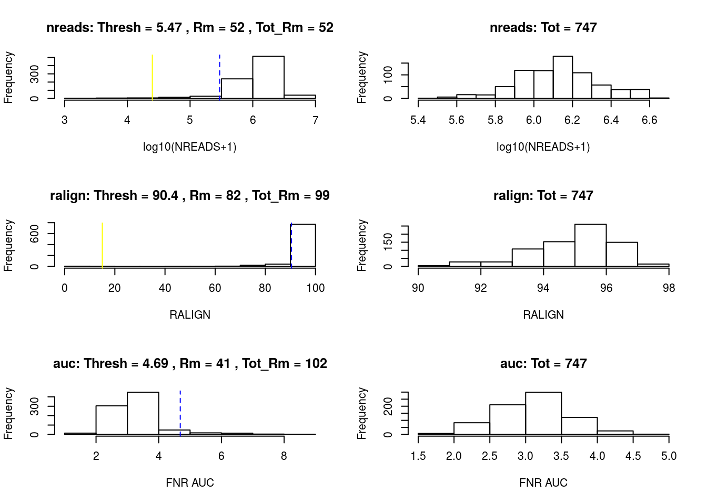
<p class="caption">(\#fig:scone)SCONE: Filtering of low-quality cells.</p>
</div>


```r
# Simplify to a single logical
mfilt <- !apply(simplify2array(mfilt[!is.na(mfilt)]), 1, any)
filtered <- fletcher[, mfilt]
dim(filtered)
```

```
## [1] 28284   747
```

After sample filtering, we are left with 747 good quality cells.

Finally, for computational efficiency, we retain only the 1,000 most variable genes. This seems to be a reasonnable choice for the illustrative purpose of this workflow, as we are able to recover the biological signal found in the published analysis ([@Fletcher2017]). In general, however, we recommend care in selecting a gene filtering scheme, as an appropriate choice is dataset-dependent.

We can use to functions from the `clusterExperiment` package to compute a filter statistics based on the variance (`makeFilterStats`) and to apply the filter to the data (`filterData`).


```r
filtered <- makeFilterStats(filtered, filterStats="var", transFun = log1p)
filtered <- filterData(filtered, percentile=1000, filterStats="var")
filtered
```

```
## class: SingleCellExperiment 
## dim: 1000 747 
## metadata(0):
## assays(1): counts
## rownames(1000): Cbr2 Cyp2f2 ... Rnf13 Atp7b
## rowData names(1): var
## colnames(747): OEP01_N706_S501 OEP01_N701_S501 ... OEL23_N704_S503
##   OEL23_N703_S502
## colData names(19): Experiment Batch ... CreER ERCC_reads
## reducedDimNames(0):
## spikeNames(0):
```

In the original work [@Fletcher2017], cells were clustered into 14 different clusters, with 151 cells not assigned to any cluster (i.e., cluster label of `-2`). 


```r
publishedClusters <- colData(filtered)[, "publishedClusters"]
col_clus <- c("transparent", "#1B9E77", "antiquewhite2", "cyan", "#E7298A", 
              "#A6CEE3", "#666666", "#E6AB02", "#FFED6F", "darkorchid2", 
              "#B3DE69", "#FF7F00", "#A6761D", "#1F78B4")
names(col_clus) <- sort(unique(publishedClusters))
table(publishedClusters)
```

```
## publishedClusters
##  -2   1   2   3   4   5   7   8   9  10  11  12  14  15 
## 151  90  25  54  35  93  58  27  74  26  21  35  26  32
```

## Normalization and dimensionality reduction: ZINB-WaVE

In scRNA-seq analysis, dimensionality reduction is often used as a preliminary step prior to downstream analyses, such as clustering, cell lineage and pseudotime ordering, and the identification of DE genes. This allows the data to become more tractable, both from a statistical (cf. curse of dimensionality) and computational point of view. Additionally, technical noise can be reduced while preserving the often intrinsically low-dimensional signal of interest [@Peer2017; @Pierson2015; @Risso2017].

Here, we perform dimensionality reduction using the zero-inflated negative binomial-based wanted variation extraction (ZINB-WaVE) method implemented in the Bioconductor R package `zinbwave`. The method fits a ZINB model that accounts for zero inflation (dropouts), over-dispersion, and the count nature of the data. The model can include a cell-level intercept, which serves as a global-scaling normalization factor. The user can also specify both gene-level and cell-level covariates. The inclusion of observed and unobserved cell-level covariates enables normalization for complex, non-linear effects (often referred to as batch effects), while gene-level covariates may be used to adjust for sequence composition effects (e.g., gene length and GC-content effects). A schematic view of the ZINB-WaVE model is provided in Figure \@ref(fig:zinbschema). For greater detail about the ZINB-WaVE model and estimation procedure, please refer to the original manuscript [@Risso2017].

<div class="figure">

<p class="caption">(\#fig:zinbschema)ZINB-WaVE: Schematic view of the ZINB-WaVE model. This figure was reproduced with kind permission from Risso et al. (2017).</p>
</div>

As with most dimensionality reduction methods, the user needs to specify the number of dimensions for the new low-dimensional space. Here, we use `K = 50` dimensions and adjust for batch effects via the matrix `X`.


```r
clustered <- zinbwave(filtered, K = 50, X = "~ Batch", residuals = TRUE, normalizedValues = TRUE)))
```

Note that the `fletcher2017data` package includes the object `clustered` that already contains the ZINB-WaVE factors. We can load such objects to avoid waiting for the computations.


```r
data(clustered)
```

### Normalization

The function `zinbwave` returns a `SingleCellExperiment` object that includes normalized expression measures, defined as deviance residuals from the fit of the ZINB-WaVE model with user-specified gene- and cell-level covariates. Such residuals can be used for visualization purposes (e.g., in heatmaps, boxplots). Note that, in this case, the low-dimensional matrix `W` is not included in the computation of residuals to avoid the removal of the biological signal of interest.


```r
assayNames(clustered)
```

```
## [1] "normalizedValues" "residuals"        "counts"
```

```r
norm <- assay(clustered, "normalizedValues")
norm[1:3,1:3]
```

```
##        OEP01_N706_S501 OEP01_N701_S501 OEP01_N707_S507
## Cbr2          4.531898        4.369185       -4.142982
## Cyp2f2        4.359680        4.324476        4.124527
## Gstm1         4.724216        4.621898        4.403587
```

### Dimensionality reduction

The `zinbwave` function's main use is to perform dimensionality reduction. The resulting low-dimensional matrix `W` is stored in the `reducedDim` slot named `zinbwave`.


```r
reducedDimNames(clustered)
```

```
## [1] "zinbwave"
```

```r
W <- reducedDim(clustered, "zinbwave")
dim(W)
```

```
## [1] 747  50
```

```r
W[1:3, 1:3]
```

```
##                        W1        W2          W3
## OEP01_N706_S501 0.5494761 1.1745361 -0.93175747
## OEP01_N701_S501 0.4116797 0.3015379 -0.46922527
## OEP01_N707_S507 0.7394759 0.3365600 -0.07959226
```


The low-rank matrix `W` can be visualized in two dimensions by performing multi-dimensional scaling (MDS) using the Euclidian distance. To verify that `W` indeed captures the biological signal of interest, we display the MDS results in a scatterplot with colors corresponding to the original published clusters (Figure \@ref(fig:mdsW)).  


```r
W <- reducedDim(clustered)
d <- dist(W)
fit <- cmdscale(d, eig = TRUE, k = 2)
plot(fit$points, col = col_clus[as.character(publishedClusters)], main = "",
     pch = 20, xlab = "Component 1", ylab = "Component 2")
legend(x = "topleft", legend = unique(names(col_clus)), cex = .5, fill = unique(col_clus), title = "Sample")
```

<div class="figure">
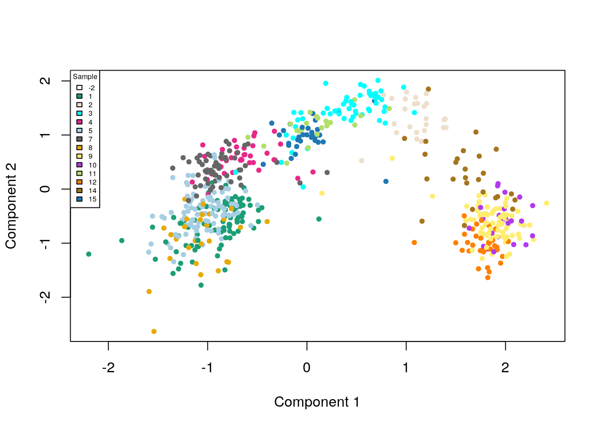
<p class="caption">(\#fig:mdsW)ZINB-WaVE: MDS of the low-dimensional matrix W, where each point represents a cell and cells are color-coded by original published clustering.</p>
</div>

## Cell clustering: RSEC

The next step is to cluster the cells according to the low-dimensional matrix `W` computed in the previous step. We use the resampling-based sequential ensemble clustering (RSEC) framework implemented in the `RSEC` function from the Bioconductor R package `clusterExperiment`. Specifically, given a set of user-supplied base clustering algorithms and associated tuning parameters (e.g., _k_-means, with a range of values for _k_), RSEC generates a collection of candidate clusterings, with the option of resampling cells and using a sequential tight clustering procedure as in [@Tseng2005]. A consensus clustering is obtained based on the levels of co-clustering of samples across the candidate clusterings. The consensus clustering is further condensed by merging similar clusters, which is done by creating a hierarchy of clusters, working up the tree, and testing for differential expression between sister nodes, with nodes of insufficient DE collapsed. As in supervised learning, resampling greatly improves the stability of clusters and considering an ensemble of methods and tuning parameters allows us to capitalize on the different strengths of the base algorithms and avoid the subjective selection of tuning parameters. 


```r
clustered <- RSEC(clustered, k0s = 4:15, alphas = c(0.1),
                  betas = 0.8, reduceMethod="zinbwave",
                  clusterFunction = "hierarchical01", minSizes=1,
                  ncores = NCORES, isCount=FALSE,
                  dendroReduce="zinbwave",
                  subsampleArgs = list(resamp.num=100,
                                       clusterFunction="kmeans",
                                       clusterArgs=list(nstart=10)),
                  verbose=TRUE,
                  consensusProportion = 0.7,
                  mergeMethod = "none", random.seed=424242,
                  consensusMinSize = 10)
```

Again, the previously loaded `clustered` object already contains the results of the `RSEC` run above, so we do not evaluate the above chunk here.


```r
clustered
```

```
## class: ClusterExperiment 
## dim: 1000 747 
## reducedDimNames: zinbwave 
## filterStats: var 
## -----------
## Primary cluster type: makeConsensus 
## Primary cluster label: makeConsensus 
## Table of clusters (of primary clustering):
##  -1  c1  c2  c3  c4  c5  c6  c7 
## 184 145 119 105 100  48  33  13 
## Total number of clusterings: 13 
## Dendrogram run on 'makeConsensus' (cluster index: 1)
## -----------
## Workflow progress:
## clusterMany run? Yes 
## makeConsensus run? Yes 
## makeDendrogram run? Yes 
## mergeClusters run? No
```

Note that the results of the `RSEC` function is an object of the `ClusterExperiment` class, which extends the `SingleCellExperiment` class, by adding additional information on the clustering results.


```r
is(clustered, "SingleCellExperiment")
```

```
## [1] TRUE
```

```r
slotNames(clustered)
```

```
##  [1] "transformation"            "clusterMatrix"            
##  [3] "primaryIndex"              "clusterInfo"              
##  [5] "clusterTypes"              "dendro_samples"           
##  [7] "dendro_clusters"           "dendro_index"             
##  [9] "dendro_outbranch"          "coClustering"             
## [11] "clusterLegend"             "orderSamples"             
## [13] "merge_index"               "merge_dendrocluster_index"
## [15] "merge_method"              "merge_demethod"           
## [17] "merge_cutoff"              "merge_nodeProp"           
## [19] "merge_nodeMerge"           "int_elementMetadata"      
## [21] "int_colData"               "int_metadata"             
## [23] "reducedDims"               "rowRanges"                
## [25] "colData"                   "assays"                   
## [27] "NAMES"                     "elementMetadata"          
## [29] "metadata"
```

The resulting candidate clusterings can be visualized using the `plotClusters` function (Figure \@ref(fig:examinemakeConsensus)), where columns correspond to cells and rows to different clusterings. Each sample is color-coded based on its clustering for that row, where the colors have been chosen to try to match up clusters that show large overlap accross rows. The first row correspond to a consensus clustering across all candidate clusterings.


```r
plotClusters(clustered)
```

<div class="figure">
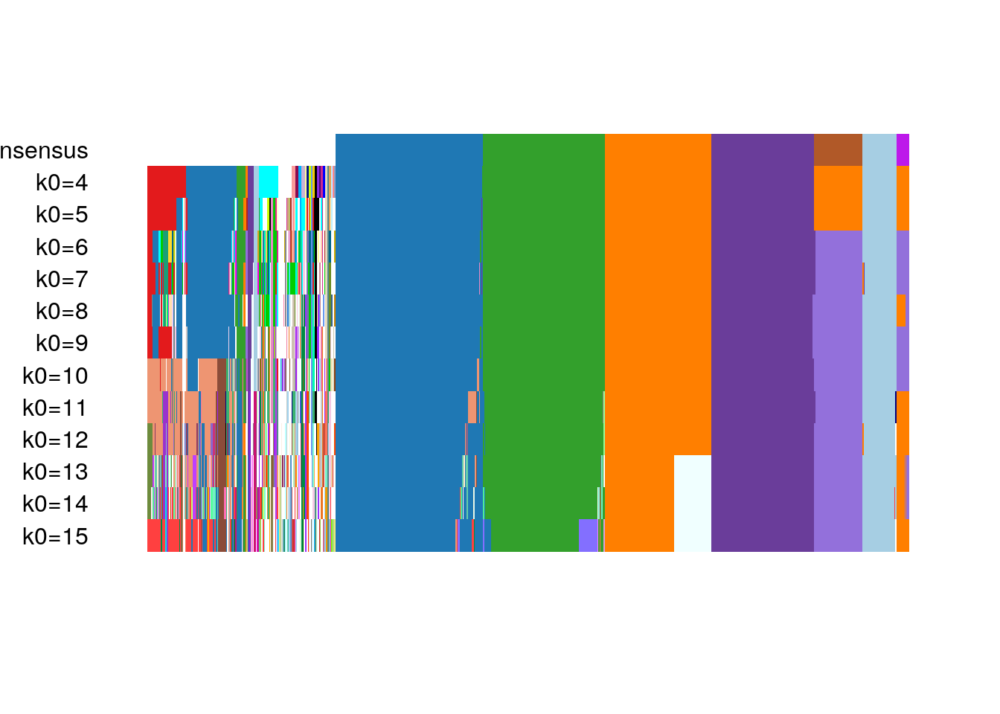
<p class="caption">(\#fig:examinemakeConsensus)RSEC: Candidate clusterings found using the function RSEC from the clusterExperiment package.</p>
</div>

The `plotCoClustering` function produces a heatmap of the co-clustering matrix, which records, for each pair of cells, the proportion of times they were clustered together across the candidate clusters (Figure \@ref(fig:plotcoclust)). 


```r
plotCoClustering(clustered)
```

<div class="figure">
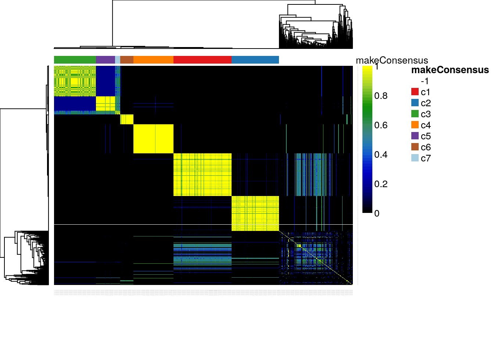
<p class="caption">(\#fig:plotcoclust)RSEC: Heatmap of co-clustering matrix.</p>
</div>

The distribution of cells across the consensus clusters can be visualized in Figure \@ref(fig:barplotOurs) and is as follows:


```r
table(primaryClusterNamed(clustered))
```

```
## 
##  -1  c1  c2  c3  c4  c5  c6  c7 
## 184 145 119 105 100  48  33  13
```


```r
plotBarplot(clustered, legend = FALSE)
```

<div class="figure">
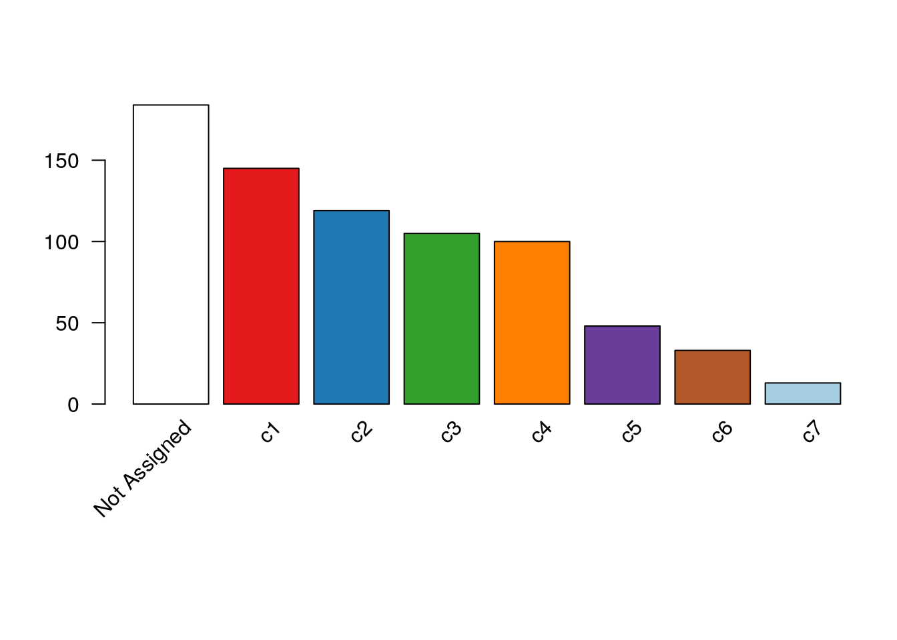
<p class="caption">(\#fig:barplotOurs)RSEC: Barplot of number of cells per cluster for our workflow's RSEC clustering.</p>
</div>

The distribution of cells in our clustering overall agrees with that in the original published clustering (Figure \@ref(fig:addPublishedClusters)), the main difference being that several of the published clusters were merged here into single clusters. This discrepancy is likely caused by the fact that we started with the top 1,000 genes, which might not be enough to discriminate between closely related clusters.


```r
clustered <- addClusterings(clustered, colData(clustered)$publishedClusters, 
                     clusterLabel = "publishedClusters")

## change default color to match with Figure 7
clusterLegend(clustered)$publishedClusters[, "color"] <- 
  col_clus[clusterLegend(clustered)$publishedClusters[, "name"]]

plotBarplot(clustered, whichClusters=c("makeConsensus", "publishedClusters"),
            xlab = "", legend = FALSE,missingColor="white")
```

<div class="figure">
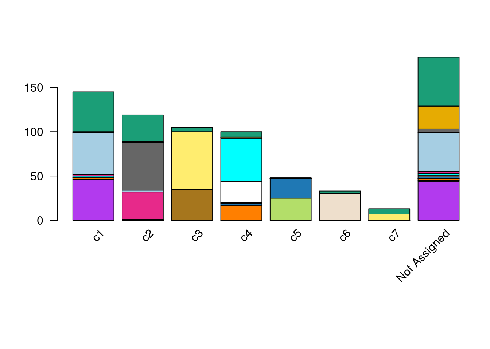
<p class="caption">(\#fig:addPublishedClusters)RSEC: Barplot of number of cells per cluster, for our workflow's RSEC clustering, color-coded by original published clustering.</p>
</div>
 

```r
plotClustersTable(clustered, whichClusters=c("makeConsensus","publishedClusters"))
```

<div class="figure">
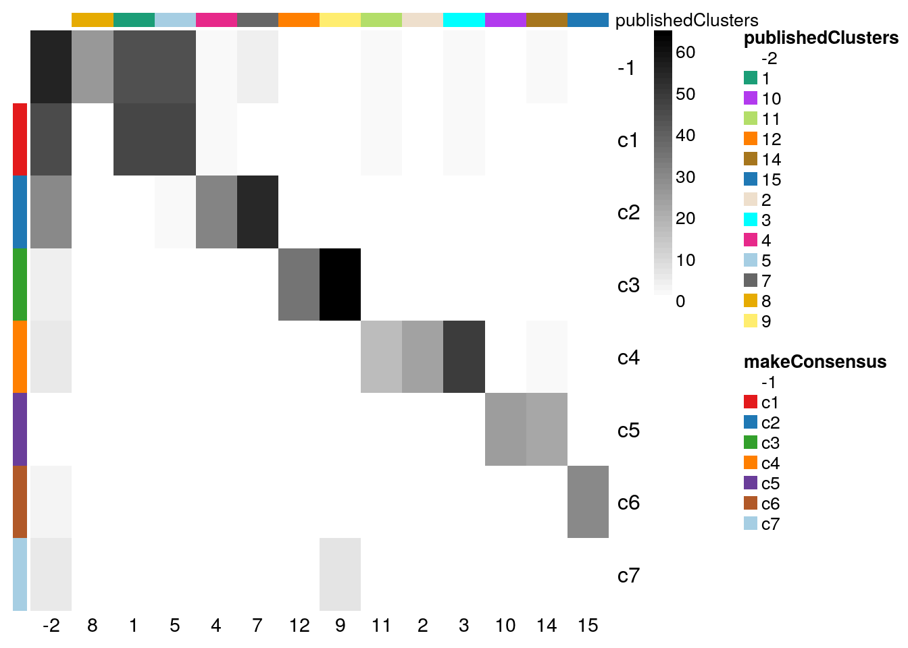
<p class="caption">(\#fig:addPublishedClusters2)RSEC: Confusion matrix of number of cells per cluster, for our workflow's RSEC clustering and the original published clustering.</p>
</div>

Figure \@ref(fig:heatmapsClusters) displays a heatmap of the normalized expression measures for the 1,000 most variable genes, where cells are clustered according to the RSEC consensus.


```r
# Set colors for additional sample data
experimentColors <- bigPalette[1:nlevels(colData(clustered)$Experiment)]
batchColors <- bigPalette[1:nlevels(colData(clustered)$Batch)]
metaColors <- list("Experiment" = experimentColors,
                   "Batch" = batchColors)

plotHeatmap(clustered, 
            whichClusters = c("makeConsensus","publishedClusters"), clusterFeaturesData = "all",
            clusterSamplesData = "dendrogramValue", breaks = 0.99,
            colData = c("Batch", "Experiment"),
            clusterLegend = metaColors, annLegend = FALSE, main = "")
```

<div class="figure">
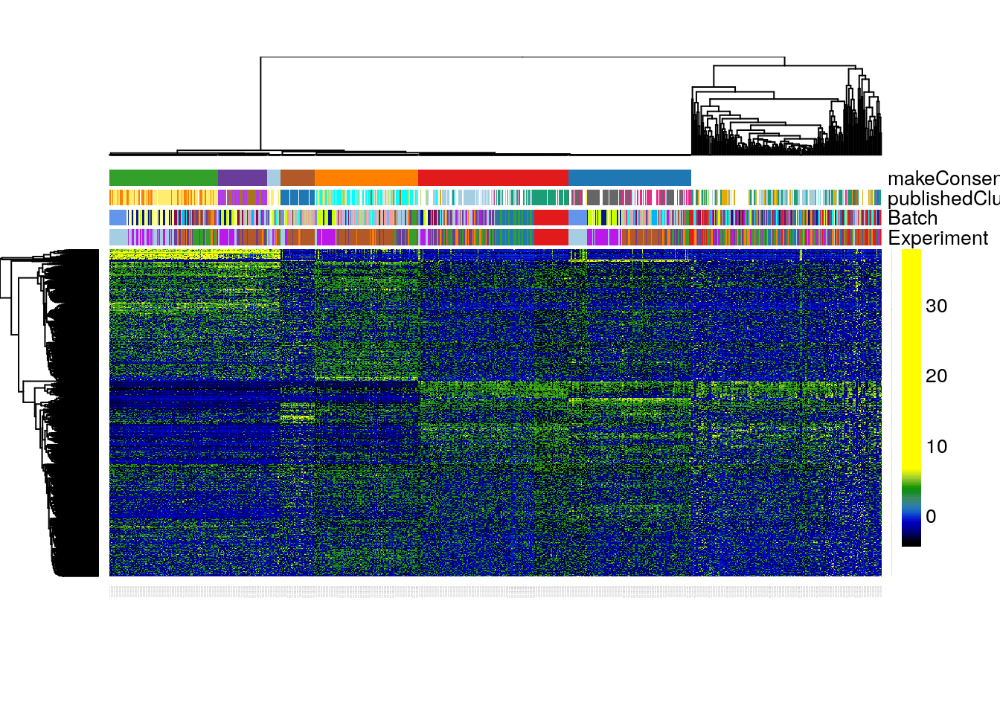
<p class="caption">(\#fig:heatmapsClusters)RSEC: Heatmap of the normalized expression measures for the 1,000 most variable genes, where rows correspond to genes and columns to cells ordered by RSEC clusters.</p>
</div>

Finally, we can visualize the cells in a two-dimensional space using the MDS of the low-dimensional matrix `W` and coloring the cells according to their newly-found RSEC clusters (Figure \@ref(fig:mdsWce)); this is anologous to Figure \@ref(fig:mdsW) for the original published clusters.


```r
plotReducedDims(clustered,whichCluster="primary",reducedDim="zinbwave",pch=20,
	xlab = "Component1", ylab = "Component2",legendTitle="Sample",main="",
	plotUnassigned=FALSE
)
```

<div class="figure">
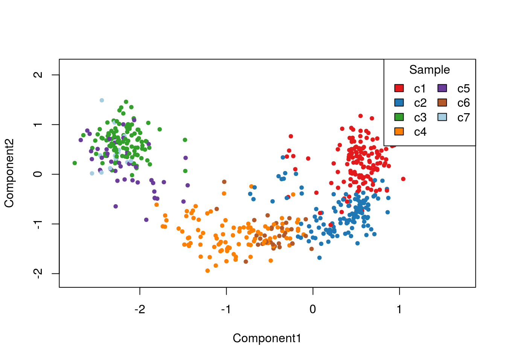
<p class="caption">(\#fig:mdsWce)RSEC: MDS of the low-dimensional matrix W, where each point represents a cell and cells are color-coded by RSEC clustering.</p>
</div>

## Cell lineage and pseudotime inference: Slingshot

We now demonstrate how to use the Bioconductor package `slingshot` to infer branching cell lineages and order cells by developmental progression along each lineage. The method, proposed in [@Street2017], comprises two main steps: (1) The inference of the global lineage structure (i.e., the number of lineages and where they branch) using a minimum spanning tree (MST) on the clusters identified above by `RSEC` and (2) the inference of cell pseudotime variables along each lineage using a novel method of simultaneous principal curves. The approach in (1) allows the identification of any number of novel lineages, while also accommodating the use of domain-specific knowledge to supervise parts of the tree (e.g., known terminal states); the approach in (2) yields robust pseudotimes for smooth, branching lineages. 

This analysis is performed out by the `slingshot` function and the results are stored in a `SlingshotDataSet` object. The minimal input to this function is a low-dimensional representation of the cells and a set of cluster labels; these can be separate objects (ie. a matrix and a vector) or, as below, components of a `SingleCellExperiment` object. When a `SingleCellExperiment` object is provided as input, the ouput will be an updated object containing a `SlingshotDataSet` as an element of the `int_metadata` list, which can be accessed through the `SlingshotDataSet` function. For more low-level control of the lineage inference procedure, the two steps may be run separately via the functions `getLineages` and `getCurves`.

From the original published work, we know that the starting cluster should correspond to HBCs and the end clusters to MV, mOSN, and mSUS cells. Additionally, we know that GBCs should be at a junction before the differentiation between MV and mOSN cells (Figure \@ref(fig:stemcelldiff)). The correspondance between the clusters we found here and the original clusters is as follows.


```r
table(data.frame(original = publishedClusters, ours = primaryClusterNamed(clustered)))
```

```
##         ours
## original -1 c1 c2 c3 c4 c5 c6 c7
##       -2 55 45 30  5  6  1  3  6
##       1  44 46  0  0  0  0  0  0
##       2   1  0  0  0 24  0  0  0
##       3   2  2  1  0 49  0  0  0
##       4   2  2 31  0  0  0  0  0
##       5  44 47  2  0  0  0  0  0
##       7   4  0 54  0  0  0  0  0
##       8  26  1  0  0  0  0  0  0
##       9   0  0  1 65  1  0  0  7
##       10  1  0  0  0  0 25  0  0
##       11  2  2  0  0 17  0  0  0
##       12  0  0  0 35  0  0  0  0
##       14  2  0  0  0  2 22  0  0
##       15  1  0  0  0  1  0 30  0
```

Cluster name | Description | Color | Correspondence
-------------|-------------|-------| ----------
c1 | HBC | red | original 1, 5
c2 | mSUS | blue | original 4, 7
c3 | mOSN  | green | original 9, 12 
c4 | GBC | orange | original 2, 3, 11
c5 | Immature Neuron | purple | original 10, 14
c6 | MV | brown | original 15
c7 | mOSN | light blue | original 9

To infer lineages and pseudotimes, we will apply Slingshot to the 4-dimensional MDS of the low-dimensional matrix `W`. We found that the Slingshot results were robust to the number of dimensions _k_ for the MDS (we tried _k_ from 2 to 5). Here, we use a semi-supervised version of Slingshot, where we only provide the identity of the start cluster but not of the end clusters.


```r
pseudoCe <- clustered[,!primaryClusterNamed(clustered) %in% c("-1")]
X <- reducedDim(pseudoCe,type="zinbwave")
mds <- cmdscale(dist(X), eig = TRUE, k = 4)
lineages <- slingshot(mds$points, clusterLabels = primaryClusterNamed(pseudoCe), start.clus = "c1")
```

Before discussing the simultaneous principal curves, we examine the global structure of the lineages by plotting the MST on the clusters. This shows that our implementation has recovered the lineages found in the published work (Figure \@ref(fig:tree)). The `slingshot` package also includes functionality for 3-dimensional visualization as in Figure \@ref(fig:stemcelldiff), using the `plot3d` function from the package `rgl`.


```r
colorCl<-convertClusterLegend(pseudoCe,whichCluster="primary",output="matrixColors")[,1]
pairs(lineages, type="lineages", col = colorCl)
```

<div class="figure">
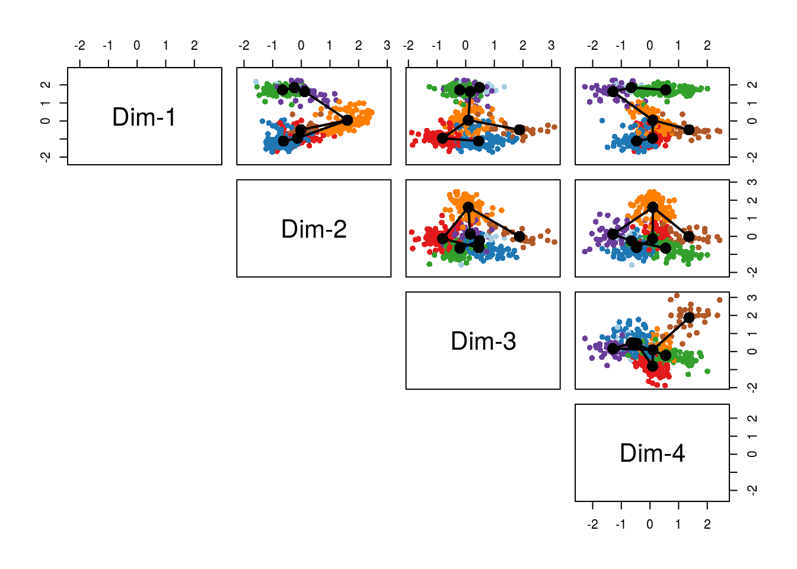
<p class="caption">(\#fig:tree)Slingshot: Cells color-coded by cluster in a 4-dimensional MDS space, with connecting lines between cluster centers representing the inferred global lineage structure.</p>
</div>

Having found the global lineage structure, `slingshot` then constructed a set of smooth, branching curves in order to infer the corresponding pseudotime variables. Simultaneous principal curves are constructed from the individual cells along each lineage, rather than the cell clusters. During this iterative process, a cell may even be reassigned to a different lineage if it is significantly closer to the corresopnding curve. This makes `slingshot` less reliant on the original clustering and generally more stable. The final curves are shown in Figure \@ref(fig:curves).


```r
pairs(lineages, type="curves", col = colorCl)
```

<div class="figure">
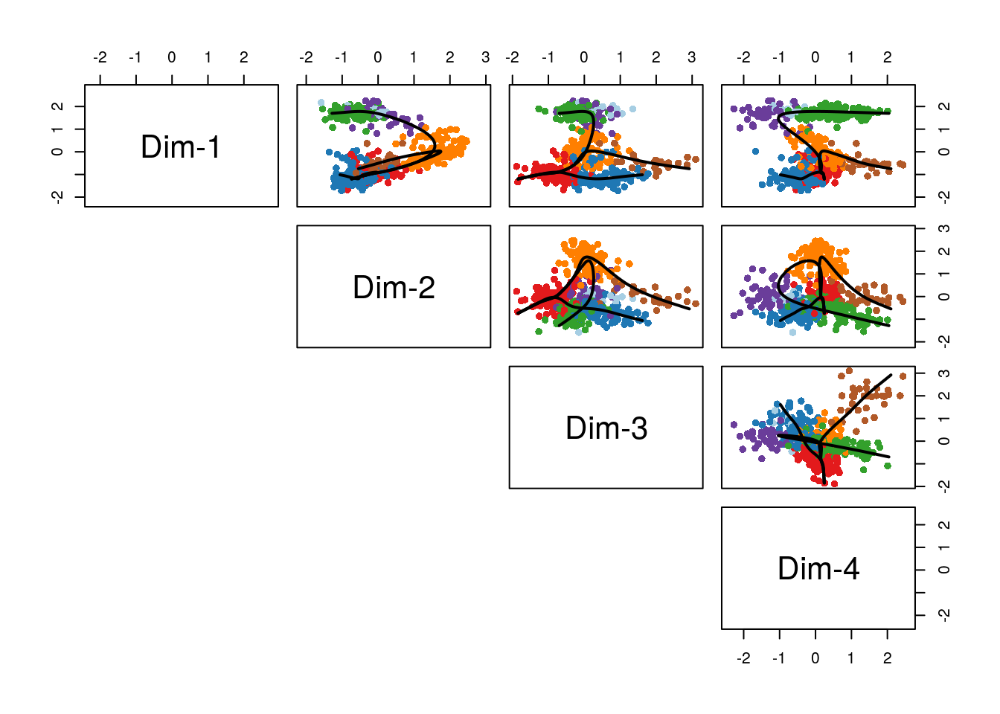
<p class="caption">(\#fig:curves)Slingshot: Cells color-coded by cluster in a 4-dimensional MDS space, with smooth curves representing each inferred lineage.</p>
</div>


```r
lineages
```

```
## class: SlingshotDataSet 
## 
##  Samples Dimensions
##      563          4
## 
## lineages: 3 
## Lineage1: c1  c4  c5  c7  c3  
## Lineage2: c1  c4  c6  
## Lineage3: c1  c2  
## 
## curves: 3 
## Curve1: Length: 9.5222	Samples: 361.18
## Curve2: Length: 7.8207	Samples: 234.02
## Curve3: Length: 4.2823	Samples: 254.86
```

As an alternative, we could have incorporated the MDS results into the `clustered` object and applied `slingshot` directly to it. Here, we need to specify that we want to use the MDS results, because `slingshot` would otherwise use the first element of the `reducedDims` list (in this case, the 10-dimensional `W` matrix from `zinbwave`).


```r
reducedDim(pseudoCe, "MDS") <- mds$points
pseudoCe <- slingshot(pseudoCe, reducedDim = "MDS", start.clus = "c1")
pseudoCe
```

```
## class: ClusterExperiment 
## dim: 1000 563 
## reducedDimNames: zinbwave MDS 
## filterStats: var 
## -----------
## Primary cluster type: makeConsensus 
## Primary cluster label: makeConsensus 
## Table of clusters (of primary clustering):
##  c1  c2  c3  c4  c5  c6  c7 
## 145 119 105 100  48  33  13 
## Total number of clusterings: 14 
## No dendrogram present
## -----------
## Workflow progress:
## clusterMany run? Yes 
## makeConsensus run? Yes 
## makeDendrogram run? No 
## mergeClusters run? No
```

```r
colData(pseudoCe)
```

```
## DataFrame with 563 rows and 23 columns
##                          Experiment    Batch publishedClusters    NREADS
##                            <factor> <factor>         <numeric> <numeric>
## OEP01_N706_S501     K5ERRY_UI_96HPT      Y01                 1   3313260
## OEP01_N701_S501     K5ERRY_UI_96HPT      Y01                 1   2902430
## OEP01_N707_S507     K5ERRY_UI_96HPT      Y01                 1   2307940
## OEP01_N705_S501     K5ERRY_UI_96HPT      Y01                 1   3337400
## OEP01_N702_S508     K5ERRY_UI_96HPT      Y01                -2    525096
## ...                             ...      ...               ...       ...
## OEL23_N704_S510 K5ERP63CKO_UI_14DPT      P14                -2   2407440
## OEL23_N705_S502 K5ERP63CKO_UI_14DPT      P14                -2   2308940
## OEL23_N706_S502 K5ERP63CKO_UI_14DPT      P14                12   2215640
## OEL23_N704_S503 K5ERP63CKO_UI_14DPT      P14                12   2673790
## OEL23_N703_S502 K5ERP63CKO_UI_14DPT      P14                 7   2450320
##                  NALIGNED    RALIGN TOTAL_DUP    PRIMER
##                 <numeric> <numeric> <numeric> <numeric>
## OEP01_N706_S501   3167600   95.6035   47.9943 0.0154566
## OEP01_N701_S501   2757790   95.0167    45.015 0.0182066
## OEP01_N707_S507   2178350   94.3852   43.7832 0.0219196
## OEP01_N705_S501   3183720   95.3952   43.2688 0.0183041
## OEP01_N702_S508    484847   92.3349    18.806 0.0248804
## ...                   ...       ...       ...       ...
## OEL23_N704_S510   2305060   95.7472   47.1489 0.0159111
## OEL23_N705_S502   2203300   95.4244   62.5638 0.0195812
## OEL23_N706_S502   2108490   95.1637   50.6643 0.0182207
## OEL23_N704_S503   2568300   96.0546   60.5481 0.0155611
## OEL23_N703_S502   2363500   96.4567   48.4164 0.0122704
##                 PCT_RIBOSOMAL_BASES PCT_CODING_BASES PCT_UTR_BASES
##                           <numeric>        <numeric>     <numeric>
## OEP01_N706_S501               2e-06          0.20013      0.230654
## OEP01_N701_S501                   0         0.182461       0.20181
## OEP01_N707_S507                   0         0.152627      0.207897
## OEP01_N705_S501               2e-06         0.169514      0.207342
## OEP01_N702_S508                   0         0.130247      0.230848
## ...                             ...              ...           ...
## OEL23_N704_S510                   0         0.287346      0.314104
## OEL23_N705_S502                   0         0.337264      0.297077
## OEL23_N706_S502               7e-06         0.244333      0.262663
## OEL23_N704_S503                   0         0.343203      0.338217
## OEL23_N703_S502               8e-06         0.259367      0.238239
##                 PCT_INTRONIC_BASES PCT_INTERGENIC_BASES PCT_MRNA_BASES
##                          <numeric>            <numeric>      <numeric>
## OEP01_N706_S501           0.404205             0.165009       0.430784
## OEP01_N701_S501           0.465702             0.150027       0.384271
## OEP01_N707_S507           0.511416              0.12806       0.360524
## OEP01_N705_S501           0.457556             0.165586       0.376856
## OEP01_N702_S508           0.477167             0.161738       0.361095
## ...                            ...                  ...            ...
## OEL23_N704_S510           0.250658             0.147892        0.60145
## OEL23_N705_S502           0.230214             0.135445       0.634341
## OEL23_N706_S502           0.355899             0.137097       0.506997
## OEL23_N704_S503           0.174696             0.143885        0.68142
## OEL23_N703_S502           0.376091             0.126294       0.497606
##                 MEDIAN_CV_COVERAGE MEDIAN_5PRIME_BIAS MEDIAN_3PRIME_BIAS
##                          <numeric>          <numeric>          <numeric>
## OEP01_N706_S501           0.843857           0.061028           0.521079
## OEP01_N701_S501            0.91437            0.03335           0.373993
## OEP01_N707_S507           0.955405           0.014606            0.49123
## OEP01_N705_S501            0.81663           0.101798           0.525238
## OEP01_N702_S508            1.13937                  0           0.671565
## ...                            ...                ...                ...
## OEL23_N704_S510           0.698455           0.198224           0.419745
## OEL23_N705_S502           0.830816           0.105091           0.398755
## OEL23_N706_S502           0.805627           0.103363           0.431862
## OEL23_N704_S503           0.745201           0.118615            0.38422
## OEL23_N703_S502           0.711685           0.196725           0.377926
##                     CreER ERCC_reads slingClusters slingPseudotime_1
##                 <numeric>  <numeric>   <character>         <numeric>
## OEP01_N706_S501         1      10516            c1                NA
## OEP01_N701_S501      3022       9331            c1  1.17515653761044
## OEP01_N707_S507      2329       7386            c1  1.05748079781731
## OEP01_N705_S501       717       6387            c1  1.60358158878545
## OEP01_N702_S508         6       1218            c1  1.15877575705362
## ...                   ...        ...           ...               ...
## OEL23_N704_S510       659          0            c2                NA
## OEL23_N705_S502      1552          0            c2                NA
## OEL23_N706_S502         0          0            c3  8.14395128888675
## OEL23_N704_S503         0          0            c3  8.53434676157714
## OEL23_N703_S502      2222          0            c2                NA
##                 slingPseudotime_2 slingPseudotime_3
##                         <numeric>         <numeric>
## OEP01_N706_S501                NA 0.697871418266869
## OEP01_N701_S501  1.16494701596924  1.14847054886023
## OEP01_N707_S507  1.06066237725119  1.03504665341862
## OEP01_N705_S501  1.60908934773813  1.44641122178585
## OEP01_N702_S508  1.16613825160874   1.4234303656098
## ...                           ...               ...
## OEL23_N704_S510                NA  2.01886955959061
## OEL23_N705_S502                NA  3.75361856214768
## OEL23_N706_S502                NA                NA
## OEL23_N704_S503                NA                NA
## OEL23_N703_S502                NA  2.74672712926307
```

The result of `slingshot` applied to a `ClusterExperiment` object is still of class `ClusterExperiment`. Note that we did not specify a set of cluster labels, implying that `slingshot` should use the default `primaryClusterNamed` vector.

In the workflow, we recover a reasonable ordering of the clusters using the largely unsupervised version of `slingshot`. However, in some other cases, we have noticed that we need to give more guidance to the algorithm to find the correct ordering. `getLineages` has the option for the user to provide known end cluster(s), which represents a constraint on the MST requiring those clusters to be leaf nodes. Here is the code to use `slingshot` in a supervised setting, where we know that clusters `c3`, `c6` and `c2` represent terminal cell fates.


```r
pseudoCeSup <- slingshot(pseudoCe, reducedDim = "MDS", start.clus = "c1",
                          end.clus = c("c3", "c6", "c2"))
```

## Differential expression analysis along lineages

After assigning the cells to lineages and ordering them within lineages, we are interested in finding genes that have non-constant expression patterns over pseudotime. 

More formally, for each lineage, we use the robust local regression method loess to model in a flexible, non-linear manner the relationship between a gene's normalized expression measures and pseudotime. We then can test the null hypothesis of no change over time for each gene using the `gam` package. We implement this approach for the neuronal lineage and display the expression measures of the top 100 genes by p-value in the heatmap of Figure \@ref(fig:heatmapsignificant). 	


```r
t <- colData(pseudoCe)$slingPseudotime_1
y <- transformData(pseudoCe)
gam.pval <- apply(y,1,function(z){
  d <- data.frame(z=z, t=t)
  tmp <- gam(z ~ lo(t), data=d)
  p <- summary(tmp)[4][[1]][1,5]
  p
})
```


```r
topgenes <- names(sort(gam.pval, decreasing = FALSE))[1:100]

pseudoCe1 <- pseudoCe[,!is.na(t)]
orderSamples(pseudoCe1)<-order(t[!is.na(t)])

plotHeatmap(pseudoCe1[topgenes,], clusterSamplesData = "orderSamplesValue", breaks = .99)
```

<div class="figure">
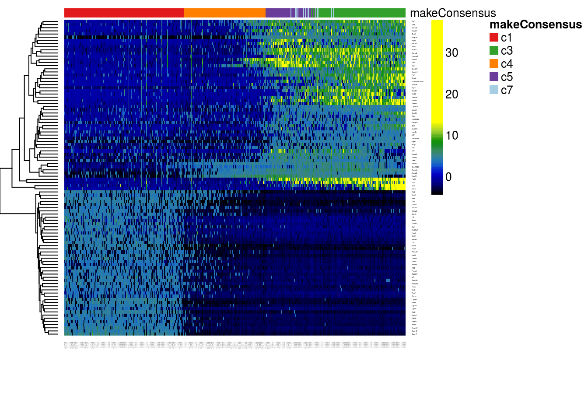
<p class="caption">(\#fig:heatmapsignificant)DE: Heatmap of the normalized expression measures for the 100 most significantly DE genes for the neuronal lineage, where rows correspond to genes and columns to cells ordered by pseudotime.</p>
</div>

