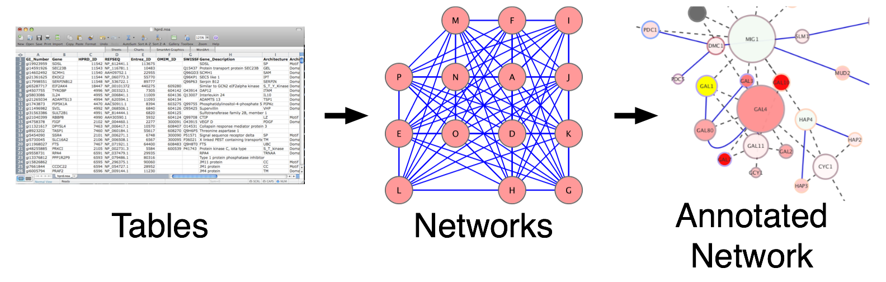
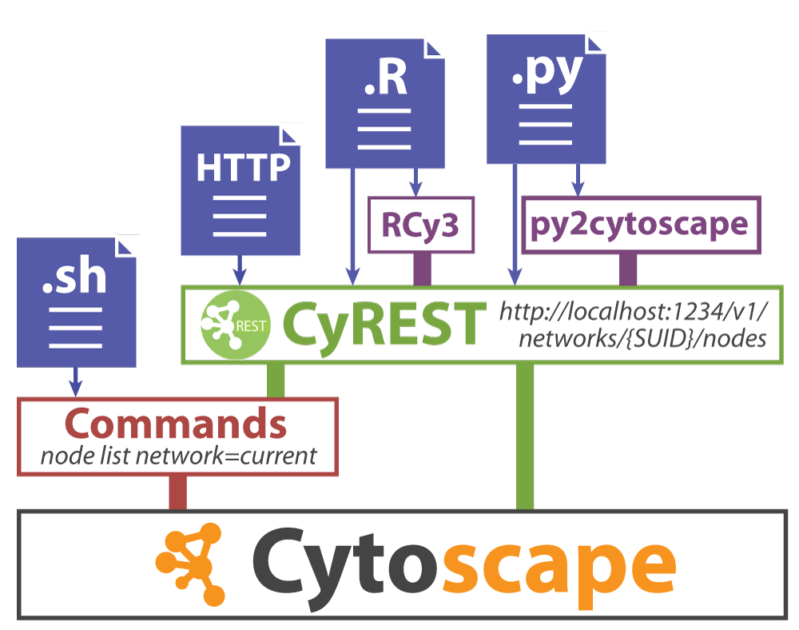
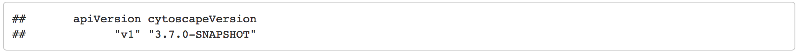
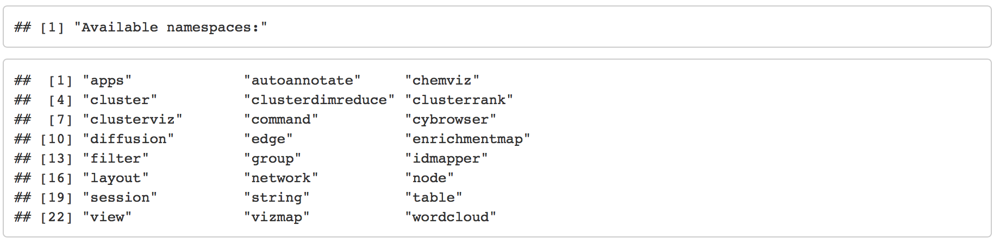
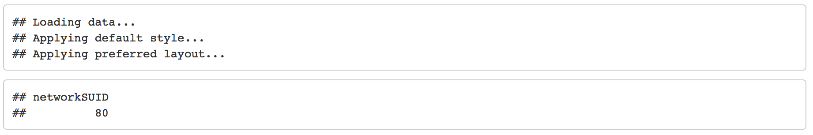
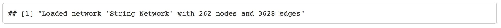
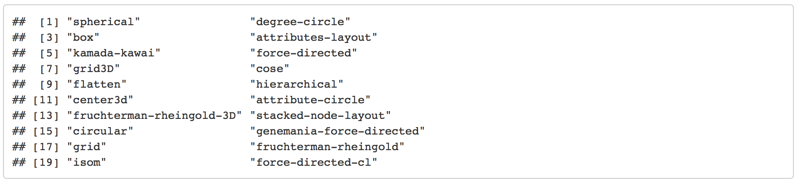

# Cytoscape Automation in R using Rcy3

##Overview

### Instructor(s) name(s) and contact information

* Ruth Isserlin - ruth dot isserlin (at) utoronto (dot) ca
* Brendan Innes - brendan (dot) innes (at) mail (dot) utoronto (dot) ca
* Jeff Wong - jvwong (at) gmail (dot) com 
* Gary Bader - gary (dot) bader (at) utoronto (dot) ca

### Workshop Description

Cytoscape is one of the most popular applications for network analysis and visualization. In this workshop, we will demonstrate new capabilities to integrate Cytoscape into programmatic workflows and pipelines using R. We will begin with an overview of network biology themes and concepts, and then we will translate these into Cytoscape terms for practical applications. The bulk of the workshop will be a hands-on demonstration of accessing and controlling Cytoscape from R to perform a network analysis of tumor expression data.

### Workshop prerequisites:
* Basic knowledge of R syntax
* Basic knowledge of Cytoscape software
* Familiarity with network biology concepts

### Background:
* “How to visually interpret biological data using networks.” Merico D, Gfeller D, Bader GD. Nature Biotechnology 2009 Oct 27, 921-924 - http://baderlab.org/Publications?action=AttachFile&do=view&target=2009_Merico_Primer_NatBiotech_Oct.pdf
* “CyREST: Turbocharging Cytoscape Access for External Tools via a RESTful API”. Keiichiro Ono, Tanja Muetze, Georgi Kolishovski, Paul Shannon, Barry Demchak.F1000Res. 2015 Aug 5;4:478. - https://f1000research.com/articles/4-478/v1

### Workshop Participation
Participants are required to bring a laptop with Cytoscape, R, and RStudio installed.  Installation instructions will be provided in the weeks preceding the workshop.  The workshop will consist of a lecture and lab.

### R / Bioconductor packages used
* RCy3

### Time outline

| Activity                                       | Time |
|------------------------------------------------|------|
| Introduction                                   | 15m  |
| Driving Cytoscape from R                       | 15m  |
| Creating, retrieving and manipulating networks | 15m  |
| Summary                                        | 10m  |


### Workshop goals and objectives

Learning goals

* Know when and how to use Cytoscape in your research area
* Generalize network analysis methods to multiple problem domains
* Integrate Cytoscape into your bioinformatics pipelines

Learning objectives

* Programmatic control over Cytoscape from R
* Publish, share and export networks

## Background
### Cytoscape
<div id="left_logo">{width=100px}</div>

  * [Cytoscape](www.cytoscape.org)[@cytoscape] is a freely available open-source, cross platform network analysis software.  
  * [Cytoscape](www.cytoscape.org)[@cytoscape] can visualize complex networks and help integrate them with any other data type.  
  * [Cytoscape](www.cytoscape.org)[@cytoscape] has an active developer and user base with more than **300** community created apps available from the (Cytoscape App Store)[apps.cytoscape.org].

```{r cytoapps, echo=FALSE, fig.cap="Available Cytoscape Apps"}
knitr::include_graphics("./230_Isserlin_RCy3_intro/images/Apps-4.png")
```


### Overview of network biology themes and concepts
#### Why Networks?
Networks are everywhere...

  * Molecular Networks
  * Cell-Cell communication Networks
  * Computer networks
  * Social Networks
  * Internet
  
Networks are powerful tools...

  * Reduce complexity
  * More efficient than tables
  * Great for data integration
  * Intuitive visualization
  
Often data in our pipelines are represented as data.frames, tables, matrices, vectors or lists.  Sometimes we represent this data as heatmaps, plots or graphs in efforts to summarize the results visually.  Network visualization offers an additional method that readily incorporates many different data types and variables into a single picture. 


```{r table2network, echo=FALSE, fig.cap="Translating data to networks"}

```

In order to translate your data into a network it is important to define the entities and their relationships.  Entities and relationships can be anything. They can be user defined or they can be queried from a database.

Examples of Networks and their associated entities:

  * **Protein - Protein interaction network** - is a directed or undirected network where nodes in the network are proteins or genes and edges represent how those proteins interact.   
  * **Gene - gene interaction network** - nodes in the network are genes and edges can represent synthetic lethality i.e. two genes have a connection if deleting both of them cause a decrease in fitness.  
  * **Coexpression network** - nodes in the network are genes or proteins and edges represent the degree of co-expression the two genes have.  Often the edges are associated with a correlation score (i.e. pearson correlation) and edges are filtered by a defined threshold.  If no threshold is specified all genes will be connected to all other genes creating a hairball.
  * **Enrichment Map** - nodes in the networks are groups of genes from pathways or functions (i.e. genesets) and edges represent pathway crosstalk ( genes in common).
  * **Social network** -  nodes in the network are individuals and edges are some sort of social interaction between two individuals, for example, friends on Facebook, linked in LinkedIN, ...
  * **Copublication network** - a specialization of the social network for research purposes. Nodes in the network are individuals and edges between any two individuals for those who have co-authored a publication together.
  

### Networks as Tools
Networks can be used for two main purposes but often go hand in hand.  

**Analysis**

 * Topological properties - including number of nodes, number of edges, node degree, average clustering coeffecients, shortest path lengths, density, and many more.  Topological properties can help gain insights into the structure and organization of the resulting biological networks as well as help highlight specific node or regions of the network.  
 * Hubs and subnetworks - a hub is generally a highly connected node in a scale-free network.  Removal of hubs cause rapid breakdown of the underlying network.  Subnetworks are interconnected regions of the network and can be defined by any user defined parameter.  
 * Cluster, classify, and diffuse  
 * Data integration
 
**Visualization**

 * Data overlays
 * Layouts and animation
 * Exploratory analysis
 * Context and interpretation
 
## Translating biological data into Cytoscape using RCy3

Networks offer us a useful way to represent our biological data.  But how do we seemlessly translate our data from R into Cytoscape?

```{r cytoscapeRcy3, echo=FALSE, fig.cap="Different ways to communicate with Cytoscape"}

```

There are multiple ways to communicate with Cytoscape programmatically.  There are two main complementary portals,**cyRest**[@cyrest] and **Commands**, that form the foundation.  cyRest transforms Cytoscape in to a REST (Representational State Transfer) enabled service where it essentially listens for events through a predefined port (by default port 1234).  The cyRest functionality started as an app add in but has now been incorporated into the main release. Commands, on the other hand, offer a mechanism whereby app developers can expose their functionality to other apps or to user through the command interface.  Prior to the implementation of cyRest many of the basic network functions were first available as commands so there is some overlap between the two different methods.  \@ref(fig:cytoscapeRcy3) shows the different ways you can call Cytoscape.

### Set up
```{r include=FALSE}
evalcytoscape = FALSE
```


In order to create networks in Cytoscape from R you need:

 * **RCy3** - a biocondutor package
 
```{r installRcy3}
if(!"RCy3" %in% installed.packages()){
    install.packages("BiocManager")
    BiocManager::install("RCy3")
}
library(RCy3)
```

 * **Cytoscape** - Download and install [Cytoscape 3.6.1.](cytoscape.org/download.php) or higher.  Java 9 in not supported.  Please make sure that Java 8 is installed.
   * Install additional cytoscape apps that will be used in this workshop.  If using cytoscape 3.6.1 or older the apps need to manually installed through the [app manager](http://manual.cytoscape.org/en/latest/App_Manager.html#installing-apps) in Cytoscape or through your [web browser](https://apps.cytoscape.org/help/getstarted_app_install).  (click on the method to see detailed instructions)
     * [Functional Enrichment Collection](http://apps.cytoscape.org/apps/functionalenrichmentcollection) -a collection of apps to retrieve networks and pathways, integrate and explore the data, perfomr functional enrichment analysis, and interpret and display your results.
     * [EnrichmentMap Pipeline Collection](http://apps.cytoscape.org/apps/enrichmentmappipelinecollection) - a collection of apps including EnrichmentMap, AutoAnnotate, WordCloud and clusterMaker2 used to visualize and analysis enrichment results.

If you are using Cytoscape 3.7 or higher (Cytoscape 3.7 will be released in August 2018) then apps can be installed directly from R.
```{r installapps, eval=evalcytoscape}
#list of cytoscape apps to install
installation_responses <- c()

#list of app to install
cyto_app_toinstall <- c("clustermaker2", "enrichmentmap", "autoannotate", "wordcloud", "stringapp", "aMatReader")

cytoscape_version <- unlist(strsplit( cytoscapeVersionInfo()['cytoscapeVersion'],split = "\\."))
if(length(cytoscape_version) == 3 && as.numeric(cytoscape_version[1]>=3) 
   && as.numeric(cytoscape_version[2]>=7)){
  for(i in 1:length(cyto_app_toinstall)){
    #check to see if the app is installed.  Only install it if it hasn't been installed
    if(!grep(commandsGET(paste("apps status app=\"", cyto_app_toinstall[i],"\"", sep="")), 
             pattern = "status: Installed")){
      installation_response <-commandsGET(paste("apps install app=\"", 
                                                cyto_app_toinstall[i],"\"", sep=""))
      installation_responses <- c(installation_responses,installation_response)
    } else{
      installation_responses <- c(installation_responses,"already installed")
    }
  }
  installation_summary <- data.frame(name = cyto_app_toinstall, 
                                     status = installation_responses)
  
  knitr::kable(list(installation_summary),
  booktabs = TRUE, caption = 'A Summary of automated app installation'
)
}


```
   

**Make sure that Cytoscape is open**
```{r eval=evalcytoscape}
 cytoscapePing ()
```


```{r cytoscapeping, echo=FALSE, eval=!evalcytoscape}
knitr::include_graphics("./230_Isserlin_RCy3_intro/images/screenshot_cytoscapeping.png")
```

### Getting started
####Confirm that Cytoscape is installed and opened
```{r eval=evalcytoscape}
 cytoscapeVersionInfo ()
```


```{r cytoscapeversion, echo=FALSE, eval=!evalcytoscape}

```

####Browse available functions, commands and arguments
Depending on what apps you have installed there is different functionality available.  

To see all the functions available in RCy3 package
```{r}
help(package=RCy3)
```

Open swagger docs for live instances of CyREST API.  The CyREST  API list all the functions available in a base distribution of cytoscape.  The below command will launch the swagger documentation in a web browser.  Functions are clustered into categories.  Expanding individual categories will show all the option available.  Further expanding an individual command will show detailed documentation for the function, input, outputs and allow you to try and run the function.  Running the function will show the url used for the query and all returned responses. 
```{r eval=evalcytoscape}
cyrestAPI()  # CyREST API

```

As mentioned above, there are two ways to interact with Cytoscape, through the Cyrest Api or commands.  To see the available commands in swagger similiar to the Cyrest Api.
```{r eval=evalcytoscape}
commandsAPI()  # Commands API
```

To get information about an individual command from the R environment you can also use the commandsHelp function.  Simply specify what command you would like to get information on by adding its name to the command.  For example "commandsHelp("help string")"
```{r eval=evalcytoscape}
commandsHelp("help")
```


```{r cytoscapeavailcom, echo=FALSE, eval=!evalcytoscape}

```

### Cytoscape Basics
Create a Cytoscape network from some basic R objects
```{r}
nodes <- data.frame(id=c("node 0","node 1","node 2","node 3"),
           group=c("A","A","B","B"), # categorical strings
           score=as.integer(c(20,10,15,5)), # integers
           stringsAsFactors=FALSE)
edges <- data.frame(source=c("node 0","node 0","node 0","node 2"),
           target=c("node 1","node 2","node 3","node 3"),
           interaction=c("inhibits","interacts","activates","interacts"),  # optional
           weight=c(5.1,3.0,5.2,9.9), # numeric
           stringsAsFactors=FALSE)
```

```{r, echo=FALSE, results='asis'}
knitr::kable(
  list(nodes,edges),
  booktabs = TRUE,
  caption = 'A table of example nodes and edges.'
)
```


```{r eval=evalcytoscape}
createNetworkFromDataFrames(nodes,edges, title="my first network", collection="DataFrame Example")
```


```{r networkload1, echo=FALSE, eval=!evalcytoscape}

```

Remember. All networks we make are created in Cytoscape so get an image of the resulting network and include it in your current analysis if desired.

```{r initial_network_screenshot, include=TRUE}
initial_network_png_file_name <- paste(getwd(),"/230_Isserlin_RCy3_intro/images/","initial_example_network.png",sep="")

```

```{r eval=evalcytoscape}
if(file.exists(initial_network_png_file_name)){
  #cytoscape hangs waiting for user response if file alreayd exists.  Remove it first
  file.remove(initial_network_png_file_name)
  } 

#export the network
exportImage(initial_network_png_file_name, type = "png")
```

```{r initialnetwork, echo=FALSE, fig.cap="Example network created from dataframe"}
knitr::include_graphics(initial_network_png_file_name)
```

### Example Data Set
We downloaded gene expression data from the Ovarian Serous Cystadenocarcinoma project of The Cancer Genome Atlas (TCGA)[@TCGA], http://cancergenome.nih.gov via the Genomic Data Commons (GDC) portal[@GDC] on 2017-06-14 using TCGABiolinks R package[@TCGABiolinks]. The data includes 300 samples available as RNA-seq data, with reads mapped to a reference genome using MapSplice[@MapSplice] and read counts per transcript determined using the RSEM method[@RSEM]. RNA-seq data are labeled as ‘RNA-Seq V2’, see details at: https://wiki.nci.nih.gov/display/TCGA/RNASeq+Version+2). The RNA-SeqV2 data consists of raw counts similar to regular RNA-seq but RSEM (RNA-Seq by Expectation Maximization) data can be used with the edgeR method. The expression dataset of 300 tumours, with 79 classified as Immunoreactive, 72 classified as Mesenchymal, 69 classified as Differentiated, and 80 classified as Proliferative samples(class definitions were obtained from Verhaak et al.[@OV] Supplementary Table 1, third column). RNA-seq read counts were converted to CPM values and genes with CPM > 1 in at least 50 of the samples are retained for further study (50 is the minimal sample size in the classes).  The data was normalized and differential expression was calculated for each cancer class relative to the rest of the samples. 

There are two data files:
 1. Expression matrix - containing the normalized expression for each gene across all 300 samples.
 1. Gene ranks - containing the p-values, FDR and foldchange values for the 4 comparisons (mesenchymal vs rest, differential vs rest, proliferative vs rest and immunoreactive vs rest)
 
 
```{r}
RNASeq_expression_matrix <- read.table( 
  "./230_Isserlin_RCy3_intro/data/TCGA_OV_RNAseq_expression.txt",  
  header = TRUE, sep = "\t", quote="\"", stringsAsFactors = FALSE)

RNASeq_gene_scores <- read.table( 
  "./230_Isserlin_RCy3_intro/data/TCGA_OV_RNAseq_All_edgeR_scores.txt",  
  header = TRUE, sep = "\t", quote="\"", stringsAsFactors = FALSE)
```
### Finding Network Data
How do I represent *my* data as a network?

Unfortunately, there is not a simple answer.  **It depends on your biological question!**   

Example use cases:

 1. Omics data - I have a *fill in the blank* (microarray, RNASeq, Proteomics, ATACseq, MicroRNA, GWAS ...) dataset.  I have normalized and scored my data. How do I overlay my data on existing interaction data? 
 1. Coexpression data - I have a dataset that represents relationships.  How do I represent it as a network. 
 1. Omics data - I have a *fill in the blank* (microarray, RNASeq, Proteomics, ATACseq, MicroRNA, GWAS ...) dataset.  I have normalized and scored my data.  I have run my data through a functional enrichment tool and now have a set of enriched terms associated with my dataset. How do I represent my functional enrichments as a network?

### Use Case 1 - How are my top genes related?

Omics data - I have a *fill in the blank* (microarray, RNASeq, Proteomics, ATACseq, MicroRNA, GWAS ...) dataset.  I have normalized and scored my data. How do I overlay my data on existing interaction data? 

There are endless amounts of databases storing interaction data. 

```{r ppidb, echo=FALSE, fig.cap="Info graphic of some of the available pathway databases"}
knitr::include_graphics("./230_Isserlin_RCy3_intro/images/interaction-dbs.png")
```

Thankfully we don't have to query each independentally.  In addition to many specialized (for example, for specific molecules, interaction type, or species) interaction databases there are also databases that collate these databases to create a broad resource that is easier to use. For example:

 * [StringApp](http://apps.cytoscape.org/apps/stringapp) - is a protein - protein and protein- chemical database that imports data from [String](string-db.org)[@string] (which itself includes data from multiple species, coexpression, text-mining,existing databases, and genomic context), [STITCH] into a unified, queriable database.
 * [PSICQUIC](https://psicquic.github.io/)[@psicquic] - a REST-ful service that is the responsibility of the database provider to set up and maintain.  PSICQUIC is an additional interface that allows users to search all available databases (that support this REST-ful service).  The databases are required to represent their interaction data in Proteomic Standards Initiative - molecular interaction (PSI-MI) format. To see a list of all the available data source see [here](http://www.ebi.ac.uk/Tools/webservices/psicquic/registry/registry?action=STATUS)
 * [nDex](http://home.ndexbio.org/index/)[@ndex] - a network data exchange repository. 
 * [GeneMANIA](http://genemania.org/)[@genemania] - contains multiple networks (shared domains, physical intearctions, pathways, predicted, co-expression, genetic interactions and co-localized network).  Given a set of genes GeneMANIA selects and weights networks that optimize the connectivity between the query genes.  GeneMANIA will also return additional genes that are highly related to your query set.

Get a subset of genes of interest from our scored data:
```{r}
top_mesenchymal_genes <- RNASeq_gene_scores[which(RNASeq_gene_scores$FDR.mesen < 0.05 & RNASeq_gene_scores$logFC.mesen > 2),]
head(top_mesenchymal_genes)
```

We are going to query the String Database to get all interactions found for our set of top Mesenchymal genes.

Reminder: to see the parameters required by the string function or to find the right string function you can use commandsHelp.
```{r eval=evalcytoscape}
commandsHelp("help string")
```


```{r availablestring, echo=FALSE, eval=!evalcytoscape}
knitr::include_graphics("./230_Isserlin_RCy3_intro/images/screenshot_availablestringcommands.png")
```

```{r eval=evalcytoscape}
commandsHelp("help string protein query")
```

```{r availablestringarg, echo=FALSE, eval=!evalcytoscape}
knitr::include_graphics("./230_Isserlin_RCy3_intro/images/screenshot_availablestringarguments.png")
```

```{r eval=evalcytoscape}
mesen_string_interaction_cmd <- paste('string protein query taxonID=9606 limit=150 cutoff=0.9 query="',paste(top_mesenchymal_genes$Name, collapse=","),'"',sep="")
commandsGET(mesen_string_interaction_cmd)
```


```{r stringnetworkload, echo=FALSE, eval=!evalcytoscape}

```

Get a screenshot of the initial network
```{r initial_string_network_screenshot, include=TRUE}
initial_string_network_png_file_name <- paste(getwd(),"/230_Isserlin_RCy3_intro/images/","initial_string_network.png",sep="")

```

```{r eval=evalcytoscape}
if(file.exists(initial_string_network_png_file_name)){
  #cytoscape hangs waiting for user response if file alreayd exists.  Remove it first
  response <- file.remove(initial_string_network_png_file_name)
} 

response <- exportImage(initial_string_network_png_file_name, type = "png")
```

```{r initialstringnetwork, echo=FALSE, fig.cap="Initial network returned by String from our set of Mesenchymal query genes"}
knitr::include_graphics(initial_string_network_png_file_name)
```


Layout the network
```{r eval=evalcytoscape}
layoutNetwork('force-directed')
```

Check what other layout algorithms are available to try out
```{r eval=evalcytoscape}
getLayoutNames()
```

```{r availablelayouts, echo=FALSE, eval=!evalcytoscape}

```
Get the paramaters for a specific layout
```{r eval=evalcytoscape}
getLayoutPropertyNames(layout.name='force-directed')
```


```{r availablelayoutargs, echo=FALSE, eval=!evalcytoscape}
knitr::include_graphics("./230_Isserlin_RCy3_intro/images/screenshot_availablelayoutarguments.png")
```

Re-layout the network using the force directed layout but specify some of the parameters 
```{r eval=evalcytoscape}
layoutNetwork('force-directed defaultSpringCoefficient=0.0000008 defaultSpringLength=70')
```


Get a screenshot of the re-laid out network
```{r relayout_string_network_screenshot, include=TRUE}
relayout_string_network_png_file_name <- paste(getwd(),"/230_Isserlin_RCy3_intro/images/","relayout_string_network.png",sep="")

```

```{r eval=evalcytoscape}
if(file.exists(relayout_string_network_png_file_name)){
  #cytoscape hangs waiting for user response if file alreayd exists.  Remove it first
  response<- file.remove(relayout_string_network_png_file_name)
  } 
response <- exportImage(relayout_string_network_png_file_name, type = "png")
```


```{r relayoutstringnetwork, echo=FALSE, fig.cap="Initial network returned by String from our set of Mesenchymal query genes"}
knitr::include_graphics(relayout_string_network_png_file_name)
```

Overlay our expression data on the String network.  
To do this we will be using the loadTableData funtion from RCy3. It is important to make sure that  that your identifiers types match up.  You can check what is used by String by pulling in the column names of the node attribute table.

```{r eval=evalcytoscape}
getTableColumnNames('node')
```

If you are unsure of what each column is and want to further verify the column to use you can also pull in the entire node attribute table.
```{r eval=evalcytoscape}
node_attribute_table_topmesen <- getTableColumns(table="node")
head(node_attribute_table_topmesen[,3:7])
```


```{r tablecolumns, echo=FALSE, eval=!evalcytoscape}
knitr::include_graphics("./230_Isserlin_RCy3_intro/images/screenshot_nodetable.png")
```

The column "display name" contains HGNC gene names which are also found in our Ovarian Cancer dataset.

To import our expression data we will match our dataset to the "display name" node attribute.

```{r eval=evalcytoscape}
?loadTableData

loadTableData(RNASeq_gene_scores,table.key.column = "display name",data.key.column = "Name")  #default data.frame key is row.names
```


```{r loadnodeattribute, echo=FALSE, eval=!evalcytoscape}
knitr::include_graphics("./230_Isserlin_RCy3_intro/images/screenshot_nodeattributeload.png")
```

Modify the Visual Style
Create your own visual style to visualize your expression data on the String network. 

Start with a default style
```{r eval=evalcytoscape}
style.name = "MesenchymalStyle"
defaults.list <- list(NODE_SHAPE="ellipse",
                 NODE_SIZE=60,
                 NODE_FILL_COLOR="#AAAAAA",
                 EDGE_TRANSPARENCY=120)
node.label.map <- mapVisualProperty('node label','display name','p') # p for passthrough; nothing else needed
createVisualStyle(style.name, defaults.list, list(node.label.map))
setVisualStyle(style.name=style.name)
```


```{r vs, echo=FALSE, eval=!evalcytoscape}
knitr::include_graphics("./230_Isserlin_RCy3_intro/images/screenshot_visualstyleapplied.png")
```

Update your created style with a mapping for the Mesenchymal logFC expression. The first step is to grab the column data from Cytoscape (we can reuse the node_attribute table concept from above but we have to call the function again as we have since added our expression data) and pull out the min and max to define our data mapping range of values.

**Note**: you could define the min and max based on the entire dataset or just the subset that is represented in Cytoscape currently.  The two methods will give you different results.  If you intend on comparing different networks created with the same dataset then it is best to calculate the min and max from the entire dataset as oppposed to a subset. 

```{r}
min.mesen.logfc = min(RNASeq_gene_scores$logFC.mesen,na.rm=TRUE)
max.mesen.logfc = max(RNASeq_gene_scores$logFC.mesen,na.rm=TRUE)
data.values = c(min.mesen.logfc,0,max.mesen.logfc)
```


Next, we use the RColorBrewer package to help us pick good colors to pair with our data values.
```{r}
library(RColorBrewer)
display.brewer.all(length(data.values), colorblindFriendly=TRUE, type="div") # div,qual,seq,all
node.colors <- c(rev(brewer.pal(length(data.values), "RdBu")))
```

Map the colors to our data value and update our visual style. 
```{r eval=evalcytoscape} 
setNodeColorMapping("logFC.mesen", data.values, node.colors, style.name=style.name)
```

Remember, String includes your query proteins as well as other proteins that associate with your query proteins (including the strongest connection first).  Not all of the proteins in this network are your top hits.  How can we visualize which proteins are our top Mesenchymal hits?

Add a different border color or change the node shape for our top hits.

```{r eval=evalcytoscape}
getNodeShapes()

#select the Nodes of interest
#selectNode(nodes = top_mesenchymal_genes$Name, by.col="display name")
setNodeShapeBypass(node.names = top_mesenchymal_genes$Name, new.shapes = "TRIANGLE")
```


```{r nodeshapes, echo=FALSE, eval=!evalcytoscape}
knitr::include_graphics("./230_Isserlin_RCy3_intro/images/screenshot_availablenodeshapes.png")
```

Change the size of the node to be correlated with the Mesenchymal p-value. 

```{r eval=evalcytoscape}
setNodeSizeMapping(table.column = 'LR.mesen', table.column.values = c(min(RNASeq_gene_scores$LR.mesen), mean(RNASeq_gene_scores$LR.mesen), max(RNASeq_gene_scores$LR.mesen)), sizes = c(30, 60, 100),mapping.type = "c")
```

Get a screenshot of the resulting network
```{r mesen_string_network_screenshot, include=TRUE}
mesen_string_network_png_file_name <- paste(getwd(),"/230_Isserlin_RCy3_intro/images/","mesen_string_network.png",sep="")

```

```{r eval=evalcytoscape}
if(file.exists(mesen_string_network_png_file_name)){
  #cytoscape hangs waiting for user response if file alreayd exists.  Remove it first
  response<- file.remove(mesen_string_network_png_file_name)
  } 
response <- exportImage(mesen_string_network_png_file_name, type = "png")
```

```{r mesenstringnetwork, echo=FALSE, fig.cap="Formatted String network from our set of Mesenchymal query genes.  Annotated with our expressin data"}
knitr::include_graphics(mesen_string_network_png_file_name)
```

### Use Case 2 - Which genes have similar expression.

Instead of quering existing resources look for correlations in your own dataset to find out which genes have similar expression.  There are many tools that can analyze your data for correlation.  A popular tool is WCGNA which takes expression data and calculates functional modules.  As a simple example we can transform our expression dataset into a correlation matrix.  We can then filter the resulting corrleation matrix and look at just the strongest correlation in Cytoscape.

```{r}

RNASeq_expression <- RNASeq_expression_matrix[,3:ncol(RNASeq_expression_matrix)]

rownames(RNASeq_expression) <- RNASeq_expression_matrix$Name
RNAseq_correlation_matrix <- cor(t(RNASeq_expression), method="pearson")

#set the diagonal of matrix to zero - eliminate self-correlation
RNAseq_correlation_matrix[ 
  row(RNAseq_correlation_matrix) == col(RNAseq_correlation_matrix) ] <- 0

# set all correlations that are less than 0.9 to zero
RNAseq_correlation_matrix[which(RNAseq_correlation_matrix<0.90)] <- 0

#write out the correlation file
correlation_filename <- paste(getwd(), "230_Isserlin_RCy3_intro/data/TCGA_OV_RNAseq_expression_correlation_matrix.txt", sep="/") 
write.table( RNAseq_correlation_matrix,  file = correlation_filename, col.names  = TRUE, row.names = FALSE, sep = "\t", quote=FALSE)

```

Use the CyRest call to access the aMatReader functionality.

```{r eval=evalcytoscape}
amat_url <- "aMatReader/v1/import"
amat_params = list(files = list(correlation_filename),
                   delimiter = "TAB",
                   undirected = FALSE,
                   ignoreZeros = TRUE,
                   interactionName = "correlated with",
                   rowNames = FALSE
                   )
 
response <- cyrestPOST(operation = amat_url, body = amat_params, base.url = "http://localhost:1234")

current_network_id <- response$data["suid"]
```

Compute the nodes currently in the network
```{r}
#get the set of nodes that have no correlations
cor_sums <- rowSums(RNAseq_correlation_matrix)

#delete nodes that have no correlation edges
nodes_to_be_deleted <- names(cor_sums)[which(cor_sums ==0)]

head(nodes_to_be_deleted)
```

```{r eval=evalcytoscape}

#delete nodes that have no correlation edges
selectNodes(nodes = nodes_to_be_deleted, by.col = "name")
deleteSelectedNodes()

#relayout network
layoutNetwork('force-directed')

```


```{r eval=evalcytoscape}
renameNetwork("Coexpression_network_pear0_95")
```


Modify the visualization to see where each genes is predominantly expressed.  Look at the 4 different p-values associated with each gene and color the nodes accordingly.

Load in the scoring data.  Specify the cancer type where the genes has the lowest FDR value.

```{r}
nodes_in_network <- names(cor_sums)[which(cor_sums >0)]

#add an additional column to the gene scores table to indicate in which samples
# the gene is significant
node_class <- vector(length = length(nodes_in_network),mode = "character")
for(i in 1:length(nodes_in_network)){
  current_row <- which(RNASeq_gene_scores$Name == nodes_in_network[i])
  min_pvalue <- min(RNASeq_gene_scores[current_row,
                                       grep(colnames(RNASeq_gene_scores), pattern = "FDR")])
  if(RNASeq_gene_scores$FDR.mesen[current_row] <=min_pvalue){
    node_class[i] <- paste(node_class[i],"mesen",sep = " ")
  }
  if(RNASeq_gene_scores$FDR.diff[current_row] <=min_pvalue){
    node_class[i] <- paste(node_class[i],"diff",sep = " ")
  }
  if(RNASeq_gene_scores$FDR.prolif[current_row] <=min_pvalue){
    node_class[i] <- paste(node_class[i],"prolif",sep = " ")
  }
  if(RNASeq_gene_scores$FDR.immuno[current_row] <=min_pvalue){
    node_class[i] <- paste(node_class[i],"immuno",sep = " ")
  }
}
node_class <- trimws(node_class)
node_class_df <-data.frame(name=nodes_in_network, node_class,stringsAsFactors = FALSE)

```

Map the new node attribute to the network
```{r eval=evalcytoscape}
loadTableData(RNASeq_gene_scores,table.key.column = "name",data.key.column = "Name")  #default data.frame key is row.names

loadTableData(node_class_df,table.key.column = "name",data.key.column = "name")  #default data.frame key is row.names


```

Create a color mapping for the different cancer types.

```{r eval=evalcytoscape}
#create a new mapping with the different types
unique_types <- sort(unique(node_class))

coul = brewer.pal(4, "Set1") 
 
# I can add more tones to this palette :
coul = colorRampPalette(coul)(length(unique_types))

setNodeColorMapping(table.column = "node_class",table.column.values = unique_types,
                    colors = coul,mapping.type = "d")
```


## References
