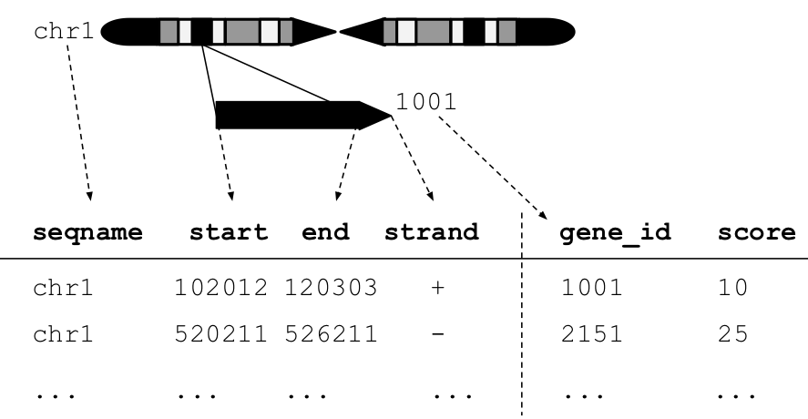

# 240: Fluent genomic data analysis with plyranges

## Instructor names and contact information

* Stuart Lee (lee.s@wehi.edu.au)
* Michael Lawrence (michafla@gmail.com)

## Workshop Description

In this workshop, we will give an overview of how to perform low-level
analyses of genomic data using the  grammar of genomic data transformation
defined in the plyranges package. We will cover:

- introduction to GRanges
- overview of the core verbs for arithmetic, restriction, and aggregation of GRanges objects
- performing joins between GRanges objects
- designing pipelines to quickly explore data from AnnotationHub
- reading BAM and other file types as GRanges objects

The workshop will be a computer lab, in which the participants will be able to 
ask questions and interact with the instructors.

### Pre-requisites

This workshop is self-contained however familiarity with the following would be useful:

- plyranges [vignette](https://sa-lee.github.io/plyranges/articles/an-introduction.html)
- the GenomicRanges and IRanges packages
- tidyverse approaches to data analysis

### Workshop Participation

Students will work through an Rmarkdown document while the instructors respond 
to any questions they have.

### _R_ / _Bioconductor_ packages used

- plyranges
- airway
- AnnotationHub
- GenomicRanges
- IRanges
- S4Vectors

### Time outline


| Activity                     | Time |
|------------------------------|------|
| Overview of GRanges          | 5m   |
| The plyranges grammar        | 20m  |
| I/O and data pipelines       | 20m  |

## Workshop goals and objectives

### Learning goals

* Understand that GRanges follows tidy data principles
* Apply the plyranges grammar to genomic data analysis

### Learning objectives

* Use AnnotationHub to find and summarise data
* Read files into R as GRanges objects
* Perform coverage analysis 
* Build data pipelines for analysis based on GRanges

## Workshop


## Introduction 

### What is plyranges?

The plyranges package is a domain specific language (DSL) built on top of the 
IRanges and GenomicRanges packages (@Lee2018; @Lawrence2013-wg). 
It is designed to quickly and coherently 
analyse genomic data in the form of GRanges objects (more on those later!) and 
from a wide variety of genomic data file types. For users who are familiar with 
the tidyverse, the grammar that plyranges implements will look familiar but with
a few modifications for genomic specific tasks.

### Why use plyranges?

The grammar that plyranges develops is helpful for reasoning
about genomics data analysis, and provides a way of developing 
short readable analysis pipelines. We have tried to emphasise consistency 
and code readability by following the design principles outlined by @Green1996-qg.

One of the goals of plyranges is to provide an alternative entry point 
to analysing genomics data with Bioconductor, especially for R beginners and 
R users who are more familiar with the tidyverse approach to data analysis. 
As a result, we have de-emphasised the use of more complicated data structures 
provided by core Bioconductor packages that are useful for programming with.

### Who is this workshop for?

This workshop is intended for new users of Bioconductor, users who are
interested to learn about grammar based approaches for data analysis,
and users who are interested in learning how to use R to perform analyses
like those available in the command line packages BEDTools (@Quinlan2010-gc).

If that's you, let's begin!

## Setup

To participate in this workshop you'll need to have R >= 3.5 and install
the plyranges, AnnotationHub, and airway Bioconductor 3.7 packages 
(@R-AnnotationHub; @R-airway). You can achieve this
by installing the BiocManager package from CRAN, loading it then running the
install command:


```r
install.packages("BiocManager")
library(BiocManager)
install(c("plyranges", "AnnotationHub", "airway"))
```

## What are GRanges objects?


<div class="figure">

<p class="caption">(\#fig:GRanges)An illustration of a GRanges data object for a single sample from an RNA-seq experiment. The core components of the object include a seqname column (representing the chromosome), a ranges column which consists of start and end coordinates for a genomic region, and a strand identifier (either positive, negative, or unstranded). Metadata are included as columns to the right of the dotted line as annotations (gene_id) or range level covariates (score).</p>
</div>


The plyranges package is built on the core Bioconductor data structure
GRanges. It is very similar to the base R data.frame but with appropriate
semantics for a genomics experiment: it has fixed columns
for the chromosome, start and end coordinates, and the strand, along
with an arbitrary set of additional columns, consisting of
measurements or metadata specific to the data type or experiment
(figure \@ref(fig:GRanges)).  

GRanges balances flexibility with formal
constraints, so that it is applicable to virtually any genomic
workflow, while also being semantically rich enough to support
high-level operations on genomic ranges. As a core data structure,
GRanges enables compatibility between plyranges and the rest of
Bioconductor.

Since a GRanges object is similar to a data.frame, we can use plyranges
to construct a GRanges object from a data.frame. We'll start by supposing we 
have a data.frame of genes from the yeast genome:


```r
library(plyranges, quietly = TRUE)
genes <- data.frame(seqnames = "VI", 
                    start = c(3322, 3030, 1437,  5066, 6426, 836),
                    end = c(3846, 3338, 2615, 5521, 7565, 1363),
                    strand = c("-", "-", "-", "+", "+", "+"),
                    gene_id=c("YFL064C", "YFL065C", "YFL066C", 
                              "YFL063W", "YFL062W", "YFL067W"),
                    stringsAsFactors = FALSE)
gr <- as_granges(genes)
gr
#> GRanges object with 6 ranges and 1 metadata column:
#>       seqnames    ranges strand |     gene_id
#>          <Rle> <IRanges>  <Rle> | <character>
#>   [1]       VI 3322-3846      - |     YFL064C
#>   [2]       VI 3030-3338      - |     YFL065C
#>   [3]       VI 1437-2615      - |     YFL066C
#>   [4]       VI 5066-5521      + |     YFL063W
#>   [5]       VI 6426-7565      + |     YFL062W
#>   [6]       VI  836-1363      + |     YFL067W
#>   -------
#>   seqinfo: 1 sequence from an unspecified genome; no seqlengths
```

The `as_granges` method takes a data.frame and allows you to quickly convert
it to a GRanges object (and can you can also specify which columns in the 
data.frame correspond to the columns in the GRanges).

A GRanges object follows tidy data principles: it is a rectangular
table corresponding to a single biological context (@Wickham2014-jc). 
Each row contains
a single observation and each column is a variable describing the
observations. In the example above, each row corresponds to a single gene, and
each column contains information about those genes. As GRanges are tidy,
we have constructed plyranges to follow and extend the grammar in the R package
dplyr.

## The Grammar

Here we provide a quick overview of the functions available in plyranges
and illustrate their use with some toy examples (see 
\@ref(appendix) for an overview). In the final section we
provide two worked examples (with exercises) that show you can use
plyranges to explore publicly available genomics data and perform coverage
analysis of BAM files.

### Core verbs

The plyranges grammar is simply a set of verbs that define actions to 
be performed on a GRanges (for a complete list see the appendix). 
Verbs can be composed together using the pipe 
operator, `%>%`, which can be read as 'then'. Here's a simple pipeline: first
we will add two columns, one corresponding to the gene_type and another with
the GC content (which we make up by drawing from a uniform distribution). 
Second we will remove genes if they have a width less than 400bp.


```r
set.seed(2018-07-28)
gr2 <- gr %>%
  mutate(gene_type = "ORF",
         gc_content = runif(n())) %>%
  filter(width > 400)
gr2
#> GRanges object with 5 ranges and 3 metadata columns:
#>       seqnames    ranges strand |     gene_id   gene_type
#>          <Rle> <IRanges>  <Rle> | <character> <character>
#>   [1]       VI 3322-3846      - |     YFL064C         ORF
#>   [2]       VI 1437-2615      - |     YFL066C         ORF
#>   [3]       VI 5066-5521      + |     YFL063W         ORF
#>   [4]       VI 6426-7565      + |     YFL062W         ORF
#>   [5]       VI  836-1363      + |     YFL067W         ORF
#>              gc_content
#>               <numeric>
#>   [1]  0.49319754820317
#>   [2] 0.216616344172508
#>   [3] 0.747259315103292
#>   [4] 0.907683959929273
#>   [5] 0.221016310621053
#>   -------
#>   seqinfo: 1 sequence from an unspecified genome; no seqlengths
```

The `mutate()` function is used to add columns, here we've added one column
called gene_type where all values are set to "ORF" (standing for open reading
frame) and another called gc_content with random uniform values. The `n()`
operator returns the number of ranges in GRanges object, but can only
be evaluated inside of one of the plyranges verbs. 

The `filter()` operation returns ranges if the expression evaluates to TRUE. 
Multiple expressions can be composed together and will be evaluated as `&`


```r
gr2 %>%
  filter(strand == "+", gc_content > 0.5)
#> GRanges object with 2 ranges and 3 metadata columns:
#>       seqnames    ranges strand |     gene_id   gene_type
#>          <Rle> <IRanges>  <Rle> | <character> <character>
#>   [1]       VI 5066-5521      + |     YFL063W         ORF
#>   [2]       VI 6426-7565      + |     YFL062W         ORF
#>              gc_content
#>               <numeric>
#>   [1] 0.747259315103292
#>   [2] 0.907683959929273
#>   -------
#>   seqinfo: 1 sequence from an unspecified genome; no seqlengths
# is the same as using `&`
gr2 %>% 
  filter(strand == "+" & gc_content > 0.5)
#> GRanges object with 2 ranges and 3 metadata columns:
#>       seqnames    ranges strand |     gene_id   gene_type
#>          <Rle> <IRanges>  <Rle> | <character> <character>
#>   [1]       VI 5066-5521      + |     YFL063W         ORF
#>   [2]       VI 6426-7565      + |     YFL062W         ORF
#>              gc_content
#>               <numeric>
#>   [1] 0.747259315103292
#>   [2] 0.907683959929273
#>   -------
#>   seqinfo: 1 sequence from an unspecified genome; no seqlengths
# but different from using or '|'
gr2 %>%
  filter(strand == "+" | gc_content > 0.5)
#> GRanges object with 3 ranges and 3 metadata columns:
#>       seqnames    ranges strand |     gene_id   gene_type
#>          <Rle> <IRanges>  <Rle> | <character> <character>
#>   [1]       VI 5066-5521      + |     YFL063W         ORF
#>   [2]       VI 6426-7565      + |     YFL062W         ORF
#>   [3]       VI  836-1363      + |     YFL067W         ORF
#>              gc_content
#>               <numeric>
#>   [1] 0.747259315103292
#>   [2] 0.907683959929273
#>   [3] 0.221016310621053
#>   -------
#>   seqinfo: 1 sequence from an unspecified genome; no seqlengths
```

Now that we have some measurements over our genes, we are most likely
interested in performing the favourite tasks of a biological data scientist:
taking averages and counting. This is achieved with the `summarise()` verb
which will return a DataFrame object (Why is this the case?).


```r
gr2 %>%
  summarise(avg_gc = mean(gc_content), 
            n = n())
#> DataFrame with 1 row and 2 columns
#>              avg_gc         n
#>           <numeric> <integer>
#> 1 0.517154695605859         5
```

which isn't very exciting when performed without `summarise()`'s best
friend the `group_by()` operator:


```r
gr2 %>%
  group_by(strand) %>%
  summarise(avg_gc = mean(gc_content),
            n = n())
#> DataFrame with 2 rows and 3 columns
#>   strand            avg_gc         n
#>    <Rle>         <numeric> <integer>
#> 1      + 0.625319861884539         3
#> 2      - 0.354906946187839         2
```

The `group_by()` operator causes `plyranges` verbs to behave differently.
Instead of acting on all the ranges in a GRanges object, the verbs act within
each group of ranges defined by the values in the grouping column(s).
The `group_by()` operator does not change the appearance the of a GRanges object
(well for the most part):


```r
by_strand <- gr2 %>%
  group_by(strand)
by_strand
#> GRanges object with 5 ranges and 3 metadata columns:
#> Groups: strand [2]
#>       seqnames    ranges strand |     gene_id   gene_type
#>          <Rle> <IRanges>  <Rle> | <character> <character>
#>   [1]       VI 3322-3846      - |     YFL064C         ORF
#>   [2]       VI 1437-2615      - |     YFL066C         ORF
#>   [3]       VI 5066-5521      + |     YFL063W         ORF
#>   [4]       VI 6426-7565      + |     YFL062W         ORF
#>   [5]       VI  836-1363      + |     YFL067W         ORF
#>              gc_content
#>               <numeric>
#>   [1]  0.49319754820317
#>   [2] 0.216616344172508
#>   [3] 0.747259315103292
#>   [4] 0.907683959929273
#>   [5] 0.221016310621053
#>   -------
#>   seqinfo: 1 sequence from an unspecified genome; no seqlengths
```

Now any verb we apply to our grouped GRanges, acts on each partition:


```r
by_strand %>%
  filter(n() > 2)
#> GRanges object with 3 ranges and 3 metadata columns:
#> Groups: strand [1]
#>       seqnames    ranges strand |     gene_id   gene_type
#>          <Rle> <IRanges>  <Rle> | <character> <character>
#>   [1]       VI 5066-5521      + |     YFL063W         ORF
#>   [2]       VI 6426-7565      + |     YFL062W         ORF
#>   [3]       VI  836-1363      + |     YFL067W         ORF
#>              gc_content
#>               <numeric>
#>   [1] 0.747259315103292
#>   [2] 0.907683959929273
#>   [3] 0.221016310621053
#>   -------
#>   seqinfo: 1 sequence from an unspecified genome; no seqlengths
by_strand %>%
  mutate(avg_gc_strand = mean(gc_content))
#> GRanges object with 5 ranges and 4 metadata columns:
#> Groups: strand [2]
#>       seqnames    ranges strand |     gene_id   gene_type
#>          <Rle> <IRanges>  <Rle> | <character> <character>
#>   [1]       VI 3322-3846      - |     YFL064C         ORF
#>   [2]       VI 1437-2615      - |     YFL066C         ORF
#>   [3]       VI 5066-5521      + |     YFL063W         ORF
#>   [4]       VI 6426-7565      + |     YFL062W         ORF
#>   [5]       VI  836-1363      + |     YFL067W         ORF
#>              gc_content     avg_gc_strand
#>               <numeric>         <numeric>
#>   [1]  0.49319754820317 0.354906946187839
#>   [2] 0.216616344172508 0.354906946187839
#>   [3] 0.747259315103292 0.625319861884539
#>   [4] 0.907683959929273 0.625319861884539
#>   [5] 0.221016310621053 0.625319861884539
#>   -------
#>   seqinfo: 1 sequence from an unspecified genome; no seqlengths
```

To remove grouping use the `ungroup()` verb:

```r
by_strand %>%
  ungroup()
#> GRanges object with 5 ranges and 3 metadata columns:
#>       seqnames    ranges strand |     gene_id   gene_type
#>          <Rle> <IRanges>  <Rle> | <character> <character>
#>   [1]       VI 3322-3846      - |     YFL064C         ORF
#>   [2]       VI 1437-2615      - |     YFL066C         ORF
#>   [3]       VI 5066-5521      + |     YFL063W         ORF
#>   [4]       VI 6426-7565      + |     YFL062W         ORF
#>   [5]       VI  836-1363      + |     YFL067W         ORF
#>              gc_content
#>               <numeric>
#>   [1]  0.49319754820317
#>   [2] 0.216616344172508
#>   [3] 0.747259315103292
#>   [4] 0.907683959929273
#>   [5] 0.221016310621053
#>   -------
#>   seqinfo: 1 sequence from an unspecified genome; no seqlengths
```

Finally, metadata columns can be selected using the `select()` verb:


```r
gr2 %>%
  select(gene_id, gene_type)
#> GRanges object with 5 ranges and 2 metadata columns:
#>       seqnames    ranges strand |     gene_id   gene_type
#>          <Rle> <IRanges>  <Rle> | <character> <character>
#>   [1]       VI 3322-3846      - |     YFL064C         ORF
#>   [2]       VI 1437-2615      - |     YFL066C         ORF
#>   [3]       VI 5066-5521      + |     YFL063W         ORF
#>   [4]       VI 6426-7565      + |     YFL062W         ORF
#>   [5]       VI  836-1363      + |     YFL067W         ORF
#>   -------
#>   seqinfo: 1 sequence from an unspecified genome; no seqlengths
# is the same as not selecting gc_content
gr2 %>%
  select(-gc_content)
#> GRanges object with 5 ranges and 2 metadata columns:
#>       seqnames    ranges strand |     gene_id   gene_type
#>          <Rle> <IRanges>  <Rle> | <character> <character>
#>   [1]       VI 3322-3846      - |     YFL064C         ORF
#>   [2]       VI 1437-2615      - |     YFL066C         ORF
#>   [3]       VI 5066-5521      + |     YFL063W         ORF
#>   [4]       VI 6426-7565      + |     YFL062W         ORF
#>   [5]       VI  836-1363      + |     YFL067W         ORF
#>   -------
#>   seqinfo: 1 sequence from an unspecified genome; no seqlengths
# you can also select by metadata column index
gr2 %>%
  select(1:2)
#> GRanges object with 5 ranges and 2 metadata columns:
#>       seqnames    ranges strand |     gene_id   gene_type
#>          <Rle> <IRanges>  <Rle> | <character> <character>
#>   [1]       VI 3322-3846      - |     YFL064C         ORF
#>   [2]       VI 1437-2615      - |     YFL066C         ORF
#>   [3]       VI 5066-5521      + |     YFL063W         ORF
#>   [4]       VI 6426-7565      + |     YFL062W         ORF
#>   [5]       VI  836-1363      + |     YFL067W         ORF
#>   -------
#>   seqinfo: 1 sequence from an unspecified genome; no seqlengths
```

### Verbs specific to GRanges

We have seen how you can perform restriction and aggregation on GRanges,
but what about specific actions for genomics data analysis, like arithmetic,
nearest neighbours or finding overlaps?

#### Arithmetic

Arithmetic operations transform range coordinates, as defined by their
_start_, _end_ and _width_  columns. These three variables are mutually
dependent so we have to take care when modifying them. 
For example, changing the _width_ column needs to change
either the _start_, _end_ or both to preserve integrity of the
GRanges:


```r
# by default setting width will fix the starting coordinate
gr %>%
  mutate(width = width + 1)
#> GRanges object with 6 ranges and 1 metadata column:
#>       seqnames    ranges strand |     gene_id
#>          <Rle> <IRanges>  <Rle> | <character>
#>   [1]       VI 3322-3847      - |     YFL064C
#>   [2]       VI 3030-3339      - |     YFL065C
#>   [3]       VI 1437-2616      - |     YFL066C
#>   [4]       VI 5066-5522      + |     YFL063W
#>   [5]       VI 6426-7566      + |     YFL062W
#>   [6]       VI  836-1364      + |     YFL067W
#>   -------
#>   seqinfo: 1 sequence from an unspecified genome; no seqlengths
```

We introduce the `anchor_direction()` operator to clarify these 
modifications. Supported anchor points include the start `anchor_start()`, 
end `anchor_end()` and midpoint `anchor_center()`:


```r
gr %>%
  anchor_end() %>%
  mutate(width = width * 2)
#> GRanges object with 6 ranges and 1 metadata column:
#>       seqnames    ranges strand |     gene_id
#>          <Rle> <IRanges>  <Rle> | <character>
#>   [1]       VI 2797-3846      - |     YFL064C
#>   [2]       VI 2721-3338      - |     YFL065C
#>   [3]       VI  258-2615      - |     YFL066C
#>   [4]       VI 4610-5521      + |     YFL063W
#>   [5]       VI 5286-7565      + |     YFL062W
#>   [6]       VI  308-1363      + |     YFL067W
#>   -------
#>   seqinfo: 1 sequence from an unspecified genome; no seqlengths

gr %>%
  anchor_center() %>%
  mutate(width = width * 2)
#> GRanges object with 6 ranges and 1 metadata column:
#>       seqnames    ranges strand |     gene_id
#>          <Rle> <IRanges>  <Rle> | <character>
#>   [1]       VI 3059-4108      - |     YFL064C
#>   [2]       VI 2875-3492      - |     YFL065C
#>   [3]       VI  847-3204      - |     YFL066C
#>   [4]       VI 4838-5749      + |     YFL063W
#>   [5]       VI 5856-8135      + |     YFL062W
#>   [6]       VI  572-1627      + |     YFL067W
#>   -------
#>   seqinfo: 1 sequence from an unspecified genome; no seqlengths
```

Note that the anchoring modifier introduces an important departure from the 
IRanges and GenomicRanges packages: by default we ignore the strandedness of 
a GRanges object, and instead we provide verbs that make stranded actions 
explicit. In this case of anchoring we provide the `anchor_3p()` and 
`anchor_5p()` to perform anchoring on the 3' and 5' ends of a range.

The table in the appendix provides a complete list of arithmetic options
available in plyranges.

#### Genomic aggregation

There are two verbs that can be used to aggregate over nearest neighbours:
`reduce_ranges()` and `disjoin_ranges()`.
The reduce verb merges overlapping and neighbouring ranges:

```r
gr %>% reduce_ranges()
#> GRanges object with 5 ranges and 0 metadata columns:
#>       seqnames    ranges strand
#>          <Rle> <IRanges>  <Rle>
#>   [1]       VI  836-1363      *
#>   [2]       VI 1437-2615      *
#>   [3]       VI 3030-3846      *
#>   [4]       VI 5066-5521      *
#>   [5]       VI 6426-7565      *
#>   -------
#>   seqinfo: 1 sequence from an unspecified genome; no seqlengths
```
We could find out which genes are overlapping each other by aggregating
over the gene_id column and storing the result in a List column:

```r
gr %>% 
  reduce_ranges(gene_id = List(gene_id))
#> GRanges object with 5 ranges and 1 metadata column:
#>       seqnames    ranges strand |         gene_id
#>          <Rle> <IRanges>  <Rle> | <CharacterList>
#>   [1]       VI  836-1363      * |         YFL067W
#>   [2]       VI 1437-2615      * |         YFL066C
#>   [3]       VI 3030-3846      * | YFL065C,YFL064C
#>   [4]       VI 5066-5521      * |         YFL063W
#>   [5]       VI 6426-7565      * |         YFL062W
#>   -------
#>   seqinfo: 1 sequence from an unspecified genome; no seqlengths
```

The disjoin verb takes the union of end points over all ranges, and results
in an expanded range


```r
gr %>% 
  disjoin_ranges(gene_id = List(gene_id))
#> GRanges object with 7 ranges and 1 metadata column:
#>       seqnames    ranges strand |         gene_id
#>          <Rle> <IRanges>  <Rle> | <CharacterList>
#>   [1]       VI  836-1363      * |         YFL067W
#>   [2]       VI 1437-2615      * |         YFL066C
#>   [3]       VI 3030-3321      * |         YFL065C
#>   [4]       VI 3322-3338      * | YFL064C,YFL065C
#>   [5]       VI 3339-3846      * |         YFL064C
#>   [6]       VI 5066-5521      * |         YFL063W
#>   [7]       VI 6426-7565      * |         YFL062W
#>   -------
#>   seqinfo: 1 sequence from an unspecified genome; no seqlengths
```

You may have noticed that the resulting range are now unstranded, to take
into account stranded features use the _directed_ prefix.

#### Overlaps  

Another important class of operations for genomics data analysis is finding
overlaps or nearest neighbours. Here's where we will 
introduce the `plyranges` join operators and the overlap aggregation 
operators.

Now let's now suppose we have some additional measurements that we have 
obtained from a new experiment on yeast. These measurements are for three different
replicates and represent single nucleotide or insertion deletion intensities 
from an array. Our
collaborator has given us three different data.frames with the data but they
all have names inconsistent with the GRanges data structure. Our goal is to 
unify these into a single GRanges object with column for each measurement
and column for the sample identifier.

Here's our data:


```r
set.seed(66+105+111+99+49+56)

pos <- sample(1:10000, size = 100)
size <- sample(1:3, size = 100, replace = TRUE)
rep1 <- data.frame(chr = "VI", 
                  pos = pos,
                  size = size,
                  X = rnorm(100, mean = 2),
                  Y = rnorm(100, mean = 1))

rep2 <- data.frame(chrom = "VI", 
                  st = pos,
                  width = size,
                  X = rnorm(100, mean = 0.5, sd = 3),
                  Y = rnorm(100, sd = 2))

rep3 <- data.frame(chromosome = "VI", 
                  start = pos,
                  width = size,
                  X = rnorm(100, mean = 2, sd = 3),
                  Y = rnorm(100, mean = 4, sd = 0.5))
```

For each replicate we want to construct a GRanges object:


```r
# we can tell as_granges which columns in the data.frame
# are the seqnames, and range coordinates
rep1 <- as_granges(rep1, seqnames = chr, start = pos, width = size)
rep2 <- as_granges(rep2, seqnames = chrom, start = st)
rep3 <- as_granges(rep3, seqnames = chromosome)
```

And to construct our final GRanges object we can bind all our replicates 
together:


```r
intensities <- bind_ranges(rep1, rep2, rep3, .id = "replicate")
# sort by the starting coordinate
arrange(intensities, start)
#> GRanges object with 300 ranges and 3 metadata columns:
#>         seqnames    ranges strand |                  X                  Y
#>            <Rle> <IRanges>  <Rle> |          <numeric>          <numeric>
#>     [1]       VI    99-100      * |   2.18077108319727   1.15893283880961
#>     [2]       VI    99-100      * |  -1.14331853023759  -1.84545382593297
#>     [3]       VI    99-100      * |   4.42535734042167   3.53884540635964
#>     [4]       VI   110-111      * |   1.41581829875993 -0.262026041514519
#>     [5]       VI   110-111      * | 0.0203313104969627  -1.18095384044377
#>     ...      ...       ...    ... .                ...                ...
#>   [296]       VI 9671-9673      * |  0.756423808063998  -0.24544579405238
#>   [297]       VI 9671-9673      * |  0.715559817063897    4.6963376859667
#>   [298]       VI 9838-9839      * |   1.83836043312615  0.267996156074214
#>   [299]       VI 9838-9839      * |  -4.62774336616852  -3.45271032367217
#>   [300]       VI 9838-9839      * | -0.285141455604857   4.16118336728783
#>           replicate
#>         <character>
#>     [1]           1
#>     [2]           2
#>     [3]           3
#>     [4]           1
#>     [5]           2
#>     ...         ...
#>   [296]           2
#>   [297]           3
#>   [298]           1
#>   [299]           2
#>   [300]           3
#>   -------
#>   seqinfo: 1 sequence from an unspecified genome; no seqlengths
```

Now we would like to filter our positions if they overlap one of the genes
we have, one way we could achieve this is with the `filter_by_overlaps()`
operator:


```r
olap <- filter_by_overlaps(intensities, gr)
olap
#> GRanges object with 108 ranges and 3 metadata columns:
#>         seqnames    ranges strand |                  X                  Y
#>            <Rle> <IRanges>  <Rle> |          <numeric>          <numeric>
#>     [1]       VI 3300-3302      * |   2.26035109119553   1.06568454447289
#>     [2]       VI 1045-1047      * |   2.21864775104592   1.08876098679654
#>     [3]       VI 3791-3793      * |   2.64672161626967   1.49683387927811
#>     [4]       VI      6503      * |   2.97614069143102 -0.842974371427135
#>     [5]       VI 2613-2615      * |  0.829706619102562   1.00867596057383
#>     ...      ...       ...    ... .                ...                ...
#>   [104]       VI      2288      * |   4.51377823089056   3.98977444171162
#>   [105]       VI      7191      * |  -3.91180888573709    5.0451068476909
#>   [106]       VI      5490      * |    6.8026659440345   4.71157047258809
#>   [107]       VI 5268-5270      * |  -1.40753324511308   4.48936193681021
#>   [108]       VI      7333      * | -0.807795033496545   4.12171733927051
#>           replicate
#>         <character>
#>     [1]           1
#>     [2]           1
#>     [3]           1
#>     [4]           1
#>     [5]           1
#>     ...         ...
#>   [104]           3
#>   [105]           3
#>   [106]           3
#>   [107]           3
#>   [108]           3
#>   -------
#>   seqinfo: 1 sequence from an unspecified genome; no seqlengths
```

Another option would be to perform a join operation. A join
acts on two GRanges objects, a query and a subject. The join operator
retains the metadata from the query and subject
ranges. All join operators generate a set of hits based on overlap or 
proximity of ranges and use those hits to merge the two datasets in different
ways (figure \ref{fig:olaps-fig}, provides an overview of the overlap joins). 
We can further restrict the matching by whether the query is completely _within_
the subject, and adding the _directed_ suffix ensures that 
matching ranges have the same direction (strand).

<div class="figure">

<p class="caption">(\#fig:olaps-fig)Illustration of the three overlap join operators. Each join takes query and subject range as input (black and light gray rectangles, respectively). An index for the join is computed, returning a Hits object, which contains the indices of where the subject overlaps the query range. This index is used to expand the query ranges by where it was 'hit' by the subject ranges. The join semantics alter what is returned: for an \textbf{inner} join the query range is returned for each match, for an \textbf{intersect} the intersection is taken between overlapping ranges, and for a \textbf{left} join all query ranges are returned even if the subject range does not overlap them. This principle is gnerally applied through the plyranges package for both overlaps and nearest neighbour operations.</p>
</div>

Going back to our example, the overlap inner join will return all intensities
that overlap a gene and propagate which gene_id a given intensity belongs to:

```r
olap <- join_overlap_inner(intensities, gr)
```

If we wanted to return all intensities regardless of overlap we could use
the left join, and  a missing value will be propagated to the gene_id
column if there isn't any overlap.


```r
join_overlap_left(intensities, gr)
#> GRanges object with 300 ranges and 4 metadata columns:
#>         seqnames    ranges strand |                  X                  Y
#>            <Rle> <IRanges>  <Rle> |          <numeric>          <numeric>
#>     [1]       VI 3300-3302      * |   2.26035109119553   1.06568454447289
#>     [2]       VI 1045-1047      * |   2.21864775104592   1.08876098679654
#>     [3]       VI 4206-4207      * |   3.08931723239393    2.4388720191285
#>     [4]       VI 3791-3793      * |   2.64672161626967   1.49683387927811
#>     [5]       VI      6503      * |   2.97614069143102 -0.842974371427135
#>     ...      ...       ...    ... .                ...                ...
#>   [296]       VI 8881-8882      * |   4.15079125018189   4.47576275354234
#>   [297]       VI      7333      * | -0.807795033496545   4.12171733927051
#>   [298]       VI   715-716      * | -0.988759384492962   3.53496809806709
#>   [299]       VI   426-428      * |   10.5245928564545   3.52355010049711
#>   [300]       VI 9187-9188      * |   1.15204426681652   4.12867380190036
#>           replicate     gene_id
#>         <character> <character>
#>     [1]           1     YFL065C
#>     [2]           1     YFL067W
#>     [3]           1        <NA>
#>     [4]           1     YFL064C
#>     [5]           1     YFL062W
#>     ...         ...         ...
#>   [296]           3        <NA>
#>   [297]           3     YFL062W
#>   [298]           3        <NA>
#>   [299]           3        <NA>
#>   [300]           3        <NA>
#>   -------
#>   seqinfo: 2 sequences from an unspecified genome; no seqlengths
```

If we are interested in finding how much overlap there is we could use 
an intersect join. For example we could compute the fraction of overlap 
of the genes with themselves:


```r
gr %>%
  mutate(gene_length = width) %>% 
  join_overlap_intersect(gr, suffix = c(".query", ".subject")) %>% 
  filter(gene_id.query != gene_id.subject) %>%
  mutate(folap = width / gene_length)
#> GRanges object with 2 ranges and 4 metadata columns:
#>       seqnames    ranges strand | gene_id.query gene_length
#>          <Rle> <IRanges>  <Rle> |   <character>   <integer>
#>   [1]       VI 3322-3338      - |       YFL064C         525
#>   [2]       VI 3322-3338      - |       YFL065C         309
#>       gene_id.subject              folap
#>           <character>          <numeric>
#>   [1]         YFL065C 0.0323809523809524
#>   [2]         YFL064C 0.0550161812297735
#>   -------
#>   seqinfo: 1 sequence from an unspecified genome; no seqlengths
```
### Exercises

There are of course many more functions available in plyranges but hopefully
the previous examples are sufficient to give you an idea of how to incorporate
plyranges into your genomic workflows.

Here's a few exercises to help you familiar with the verbs:

1. Find the average intensity of the X and Y measurements for each each replicate
over all positions in the intensities object
1. Add a new column to the intensities object that is the distance from
each position to its closest gene (hint IRanges::distance)
1. Find flanking regions downstream of the genes in gr that have width of 8bp
(hint: type: flank_ and see what comes up!)
1. Are any of the intensities positions within the flanking region? (use an
overlap join to find out!)

## Data import and creating pipelines

Here we provide some realistic examples of using plyranges to import genomic
data and perform exploratory analyses.

### Worked example: exploring BigWig files from AnnotationHub

In the workflow of ChIP-seq data analysis, we are often interested in 
finding peaks from islands of coverage over a chromosome. Here we will use plyranges
to explore ChiP-seq data from the Human Epigenome Roadmap project @Roadmap-Epigenomics-Consortium2015-pr.

#### Extracting data from AnnotationHub

This data is available on Bioconductor's AnnotationHub. First we construct
an AnnotationHub, and then `query()` for all bigWigFiles related to 
the project that correspond to the following conditions:

1. are from methylation marks (H3K4ME in the title)
2. correspond to primary T CD8+ memory cells from peripheral blood
3. correspond to unimputed log10 P-values 

First we construct a hub that contains all references to the EpigenomeRoadMap
data and extract the metadata as a data.frame:


```r
library(AnnotationHub)
library(magrittr)
ah <- AnnotationHub()
#> snapshotDate(): 2018-06-27
roadmap_hub <- ah %>% 
  query("EpigenomeRoadMap") 

# extract2 is just a call to `[[` 
metadata <- ah %>% 
  query("Metadata") %>% 
  extract2(names(.))
#> downloading 0 resources
#> loading from cache 
#>     '/home/mramos//.AnnotationHub/47270'

head(metadata)
#>    EID    GROUP   COLOR          MNEMONIC
#> 1 E001      ESC #924965            ESC.I3
#> 2 E002      ESC #924965           ESC.WA7
#> 3 E003      ESC #924965            ESC.H1
#> 4 E004 ES-deriv #4178AE ESDR.H1.BMP4.MESO
#> 5 E005 ES-deriv #4178AE ESDR.H1.BMP4.TROP
#> 6 E006 ES-deriv #4178AE       ESDR.H1.MSC
#>                                     STD_NAME
#> 1                                ES-I3 Cells
#> 2                               ES-WA7 Cells
#> 3                                   H1 Cells
#> 4 H1 BMP4 Derived Mesendoderm Cultured Cells
#> 5 H1 BMP4 Derived Trophoblast Cultured Cells
#> 6          H1 Derived Mesenchymal Stem Cells
#>                                   EDACC_NAME     ANATOMY           TYPE
#> 1                            ES-I3_Cell_Line         ESC PrimaryCulture
#> 2                           ES-WA7_Cell_Line         ESC PrimaryCulture
#> 3                               H1_Cell_Line         ESC PrimaryCulture
#> 4 H1_BMP4_Derived_Mesendoderm_Cultured_Cells ESC_DERIVED     ESCDerived
#> 5 H1_BMP4_Derived_Trophoblast_Cultured_Cells ESC_DERIVED     ESCDerived
#> 6          H1_Derived_Mesenchymal_Stem_Cells ESC_DERIVED     ESCDerived
#>   AGE    SEX SOLID_LIQUID ETHNICITY SINGLEDONOR_COMPOSITE
#> 1  CL Female         <NA>      <NA>                    SD
#> 2  CL Female         <NA>      <NA>                    SD
#> 3  CL   Male         <NA>      <NA>                    SD
#> 4  CL   Male         <NA>      <NA>                    SD
#> 5  CL   Male         <NA>      <NA>                    SD
#> 6  CL   Male         <NA>      <NA>                    SD
```

To find out the name of the sample corresponding to 
primary memory T-cells we can filter the data.frame. We extract the 
sample ID corresponding to our filter.


```r
primary_tcells <-  metadata %>% 
  filter(ANATOMY == "BLOOD") %>% 
  filter(TYPE == "PrimaryCell") %>% 
  filter(EDACC_NAME == "CD8_Memory_Primary_Cells") %>% 
  extract2("EID") %>% 
  as.character()
primary_tcells
#> [1] "E048"
```

Now we can take our roadmap hub and query it based on our other conditions:


```r
methylation_files <- roadmap_hub %>% 
  query("BigWig") %>% 
  query(primary_tcells) %>% 
  query("H3K4ME[1-3]") %>% 
  query("pval.signal")

methylation_files
#> AnnotationHub with 5 records
#> # snapshotDate(): 2018-06-27 
#> # $dataprovider: BroadInstitute
#> # $species: Homo sapiens
#> # $rdataclass: BigWigFile
#> # additional mcols(): taxonomyid, genome, description,
#> #   coordinate_1_based, maintainer, rdatadateadded, preparerclass,
#> #   tags, rdatapath, sourceurl, sourcetype 
#> # retrieve records with, e.g., 'object[["AH33454"]]' 
#> 
#>             title                                  
#>   AH33454 | E048-H3K4me1.pval.signal.bigwig        
#>   AH33455 | E048-H3K4me3.pval.signal.bigwig        
#>   AH39974 | E048-H3K4me1.imputed.pval.signal.bigwig
#>   AH40101 | E048-H3K4me2.imputed.pval.signal.bigwig
#>   AH40228 | E048-H3K4me3.imputed.pval.signal.bigwig
```

So we'll take the first two entries and download them as BigWigFiles:


```r
bw_files <- lapply(c("AH33454", "AH33455"), function(id) ah[[id]]) 
#> downloading 0 resources
#> loading from cache 
#>     '/home/mramos//.AnnotationHub/38894'
#> downloading 0 resources
#> loading from cache 
#>     '/home/mramos//.AnnotationHub/38895'
names(bw_files) <- c("HK34ME1", "HK34ME3")
```

We have our desired BigWig files so now we can we can start analysing them.

#### Reading BigWig files

For this analysis, we will call peaks from islands of scores
over chromosome 10.

First, we extract the genome information from the first BigWig file and filter
to get the range for chromosome 10. This range will be used as a filter when 
reading the file.


```r
chr10_ranges <- bw_files %>% 
  extract2(1L) %>% 
  get_genome_info() %>%
  filter(seqnames == "chr10")
```

Then we read the BigWig file only extracting scores if they overlap chromosome
10. We also add the genome build information to the resulting ranges. This
book-keeping is good practice as it ensures the integrity of any 
downstream operations such as finding overlaps.


```r
# a function to read our bigwig files
read_chr10_scores <- function(file) {
  read_bigwig(file, overlap_ranges = chr10_ranges) %>% 
    set_genome_info(genome = "hg19")
}
# apply the function to each file
chr10_scores <- lapply(bw_files, read_chr10_scores) 
# bind the ranges to a single GRAnges object
# and add a column to identify the ranges by signal type
chr10_scores <- bind_ranges(chr10_scores, .id = "signal_type")
chr10_scores
#> GRanges object with 11268683 ranges and 2 metadata columns:
#>              seqnames              ranges strand |              score
#>                 <Rle>           <IRanges>  <Rle> |          <numeric>
#>          [1]    chr10             1-60612      * | 0.0394200012087822
#>          [2]    chr10         60613-60784      * |  0.154219999909401
#>          [3]    chr10         60785-60832      * |  0.354730010032654
#>          [4]    chr10         60833-61004      * |  0.154219999909401
#>          [5]    chr10         61005-61455      * | 0.0394200012087822
#>          ...      ...                 ...    ... .                ...
#>   [11268679]    chr10 135524731-135524739      * | 0.0704099982976913
#>   [11268680]    chr10 135524740-135524780      * |  0.132530003786087
#>   [11268681]    chr10 135524781-135524789      * |  0.245049998164177
#>   [11268682]    chr10 135524790-135524811      * |  0.450120002031326
#>   [11268683]    chr10 135524812-135524842      * |  0.619729995727539
#>              signal_type
#>              <character>
#>          [1]     HK34ME1
#>          [2]     HK34ME1
#>          [3]     HK34ME1
#>          [4]     HK34ME1
#>          [5]     HK34ME1
#>          ...         ...
#>   [11268679]     HK34ME3
#>   [11268680]     HK34ME3
#>   [11268681]     HK34ME3
#>   [11268682]     HK34ME3
#>   [11268683]     HK34ME3
#>   -------
#>   seqinfo: 25 sequences from hg19 genome
```
Since we want to call peaks over each signal type, we will create a grouped
GRanges object:


```r
chr10_scores_by_signal <- chr10_scores %>% 
    group_by(signal_type)
```

We can then filter to find the coordinates of the peak containing the maximum
score for each signal.
We can then find a 5000 nt region centred around the maximum position 
by anchoring and modifying the width. 


```r
chr10_max_score_region <- chr10_scores_by_signal %>%
  filter(score == max(score)) %>% 
  ungroup() %>% 
  anchor_center() %>%
  mutate(width = 5000)
```

Finally, the overlap inner join is used to restrict the chromosome 10
coverage islands, to the islands that are contained in the 5000nt region that 
surrounds the max peak for each signal type.


```r
peak_region <- chr10_scores %>%
    join_overlap_inner(chr10_max_score_region) %>% 
    filter(signal_type.x == signal_type.y) 
# the filter ensures overlapping correct methlyation signal
```

#### Exercises

1. Use the `reduce_ranges()` function to find all peaks for each signal type.
2. How could you annotate the scores to find out which genes overlap
each peak found in 1.?
3. Plot a 1000nt window centred around the maximum scores for each signal type 
using the `ggbio` or `Gviz` package.

### Worked example: coverage analysis of BAM files

A common quality control check in a genomics workflow is to perform coverage
analysis over features of interest or over the entire genome (again
we see the bioinformatician's love of counting things). Here we use the 
airway package to compute coverage histograms and show how you can read BAM
files into memory as GRanges objects with plyranges.

First let's gather all the BAM files available to use in airway (see
`browseVignettes("airway")` for more information about the data and how it 
was prepared):


```r
bfs <- system.file("extdata", package = "airway") %>% 
    dir(pattern = ".bam", 
        full.names = TRUE)
# get sample names (everything after the underscore)
names(bfs) <- bfs %>% 
    basename() %>% 
    sub("_[^_]+$", "", .)
```

To start let's look at a single BAM file, we can compute the coverage of 
the alignments over all contigs in the BAM as follows:


```r
first_bam_cvg <- bfs %>% 
    extract2(1) %>% 
    compute_coverage()
first_bam_cvg
#> GRanges object with 11423 ranges and 1 metadata column:
#>             seqnames            ranges strand |     score
#>                <Rle>         <IRanges>  <Rle> | <integer>
#>       [1]          1        1-11053772      * |         0
#>       [2]          1 11053773-11053835      * |         1
#>       [3]          1 11053836-11053839      * |         0
#>       [4]          1 11053840-11053902      * |         1
#>       [5]          1 11053903-11067865      * |         0
#>       ...        ...               ...    ... .       ...
#>   [11419] GL000210.1           1-27682      * |         0
#>   [11420] GL000231.1           1-27386      * |         0
#>   [11421] GL000229.1           1-19913      * |         0
#>   [11422] GL000226.1           1-15008      * |         0
#>   [11423] GL000207.1            1-4262      * |         0
#>   -------
#>   seqinfo: 84 sequences from an unspecified genome
```

Here the coverage is computed without the entire BAM file being read into
memory. Notice that the score here is the count of the number of alignments
that cover a given range. To compute a coverage histogram, that is the number
of number of bases that have a given coverage score for each contig we can
simply use `summarise()`:


```r
first_bam_cvg %>% 
    group_by(seqnames, score) %>% 
    summarise(n_bases_covered = sum(width))
#> DataFrame with 277 rows and 3 columns
#>     seqnames     score n_bases_covered
#>        <Rle> <integer>       <integer>
#> 1          1         0       249202844
#> 2         10         0       135534747
#> 3         11         0       135006516
#> 4         12         0       133851895
#> 5         13         0       115169878
#> ...      ...       ...             ...
#> 273        1       189               3
#> 274        1       191               3
#> 275        1       192               3
#> 276        1       193               2
#> 277        1       194               1
```

For RNA-seq experiments we are often interested in splitting up alignments
based on whether the alignment has skipped a region from the reference (
that is, there is an "N" in the cigar string, indicating an intron). 

In plyranges this can be achieved with the `chop_by_introns()`, that will
split up an alignment if there's an intron. This results in a grouped ranges 
object.

To begin we can read the BAM file using `read_bam()`, this does not read the 
entire BAM into memory but instead waits for further functions to be applied 
to it.

```r
# no index present in directory so we use index = NULL
split_bam <- bfs %>% 
    extract2(1) %>% 
    read_bam(index = NULL) 
# nothing has been read
split_bam
#> DeferredGenomicRanges object with 0 ranges and 0 metadata columns:
#>    seqnames    ranges strand
#>       <Rle> <IRanges>  <Rle>
#>   -------
#>   seqinfo: no sequences
```

For example we can select elements from the BAM file 
to be included in the resulting GRanges to load alignments into memory:


```r
split_bam %>% 
    select(flag)
#> DeferredGenomicRanges object with 14282 ranges and 4 metadata columns:
#>           seqnames            ranges strand |      flag       cigar
#>              <Rle>         <IRanges>  <Rle> | <integer> <character>
#>       [1]        1 11053773-11053835      + |        99         63M
#>       [2]        1 11053840-11053902      - |       147         63M
#>       [3]        1 11067866-11067928      + |       163         63M
#>       [4]        1 11067931-11067993      - |        83         63M
#>       [5]        1 11072708-11072770      + |        99         63M
#>       ...      ...               ...    ... .       ...         ...
#>   [14278]        1 11364733-11364795      - |       147         63M
#>   [14279]        1 11365866-11365928      + |       163         63M
#>   [14280]        1 11365987-11366049      - |        83         63M
#>   [14281]        1 11386063-11386123      + |        99       2S61M
#>   [14282]        1 11386132-11386194      - |       147         63M
#>              qwidth     njunc
#>           <integer> <integer>
#>       [1]        63         0
#>       [2]        63         0
#>       [3]        63         0
#>       [4]        63         0
#>       [5]        63         0
#>       ...       ...       ...
#>   [14278]        63         0
#>   [14279]        63         0
#>   [14280]        63         0
#>   [14281]        63         0
#>   [14282]        63         0
#>   -------
#>   seqinfo: 84 sequences from an unspecified genome
```

Finally, we can split our alignments using the `chop_by_introns()`:


```r
split_bam <- split_bam %>% 
    chop_by_introns()
split_bam
#> GRanges object with 18124 ranges and 4 metadata columns:
#> Groups: introns [14282]
#>           seqnames            ranges strand |       cigar    qwidth
#>              <Rle>         <IRanges>  <Rle> | <character> <integer>
#>       [1]        1 11053773-11053835      + |         63M        63
#>       [2]        1 11053840-11053902      - |         63M        63
#>       [3]        1 11067866-11067928      + |         63M        63
#>       [4]        1 11067931-11067993      - |         63M        63
#>       [5]        1 11072708-11072770      + |         63M        63
#>       ...      ...               ...    ... .         ...       ...
#>   [18120]        1 11364733-11364795      - |         63M        63
#>   [18121]        1 11365866-11365928      + |         63M        63
#>   [18122]        1 11365987-11366049      - |         63M        63
#>   [18123]        1 11386063-11386123      + |       2S61M        63
#>   [18124]        1 11386132-11386194      - |         63M        63
#>               njunc   introns
#>           <integer> <integer>
#>       [1]         0         1
#>       [2]         0         2
#>       [3]         0         3
#>       [4]         0         4
#>       [5]         0         5
#>       ...       ...       ...
#>   [18120]         0     14278
#>   [18121]         0     14279
#>   [18122]         0     14280
#>   [18123]         0     14281
#>   [18124]         0     14282
#>   -------
#>   seqinfo: 84 sequences from an unspecified genome
# look at all the junction reads 
split_bam %>% 
    filter(n() >= 2)
#> GRanges object with 7675 ranges and 4 metadata columns:
#> Groups: introns [3833]
#>          seqnames            ranges strand |        cigar    qwidth
#>             <Rle>         <IRanges>  <Rle> |  <character> <integer>
#>      [1]        1 11072744-11072800      + |    57M972N6M        63
#>      [2]        1 11073773-11073778      + |    57M972N6M        63
#>      [3]        1 11072745-11072800      - |    56M972N7M        63
#>      [4]        1 11073773-11073779      - |    56M972N7M        63
#>      [5]        1 11072746-11072800      + |    55M972N8M        63
#>      ...      ...               ...    ... .          ...       ...
#>   [7671]        1 11345701-11345716      + | 47M11583N16M        63
#>   [7672]        1 11334089-11334117      - | 29M11583N34M        63
#>   [7673]        1 11345701-11345734      - | 29M11583N34M        63
#>   [7674]        1 11334109-11334117      - |  9M11583N54M        63
#>   [7675]        1 11345701-11345754      - |  9M11583N54M        63
#>              njunc   introns
#>          <integer> <integer>
#>      [1]         1        11
#>      [2]         1        11
#>      [3]         1        12
#>      [4]         1        12
#>      [5]         1        13
#>      ...       ...       ...
#>   [7671]         1     13913
#>   [7672]         1     13915
#>   [7673]         1     13915
#>   [7674]         1     13916
#>   [7675]         1     13916
#>   -------
#>   seqinfo: 84 sequences from an unspecified genome
```


#### Exercises 

1. Compute the total depth of coverage across all features.
1. How could you compute the proportion of bases covered over an entire genome?
(hint: `get_genome_info` and `S4Vectors::merge`)
1. How could you compute the strand specific genome wide coverage?
1. Create a workflow for computing the strand specific coverage for all BAM
files.
1. For each sample plot total breadth of coverage against the number of bases
covered faceted by each sample name.

## What's next?

The grammar based approach for analysing data provides a consistent approach
for analysing genomics experiments with Bioconductor. We have explored
how plyranges can enable you to perform common analysis tasks required of 
a bioinformatician. As plyranges is still a new and growing package, there is 
definite room for improvement (and likely bugs), if you have any problems using
it or think things could be easier or clearer please file an issue on 
[github](https://github.com/sa-lee/plyranges). Contributions from the Bioconductor
community are also more than welcome!


## Appendix {#appendix}

Category               Verb                            Description
--------------------- ------------------------------- --------------------------------------------------------------------
                        ***summarise()***               aggregate over column(s)
  Aggregation           *disjoin\_ranges()*             aggregate column(s) over the union of end coordinates
                        *reduce\_ranges()*              aggregate column(s) by merging overlapping and neighbouring ranges
                        ***mutate()***                  modifies any column
                        ***select()***                  select columns
  Arithmetic (Unary)    ***arrange()***                 sort by columns
                        *stretch()*                     extend range by fixed amount
                        *shift\_(direction)*            shift coordinates
                        *flank\_(direction)*            generate flanking regions
                        *%intersection%*                row-wise intersection
                        *%union%*                       row-wise union
                        *compute\_coverage*             coverage over all ranges
  Arithmetic (Binary)   *%setdiff%*                     row-wise set difference
                        *between()*                     row-wise gap range
                        *span()*                        row-wise spanning range
                        *join\_overlap\_()*             merge by overlapping ranges
                        *join\_nearest*                 merge by nearest neighbour ranges
                        *join\_follow*                  merge by following ranges
  Merging               *join\_precedes*                merge by preceding ranges
                        *union\_ranges*                 range-wise union
                        *intersect\_ranges*             range-wise intersect
                        *setdiff\_ranges*               range-wise set difference
                        *complement\_ranges*            range-wise union
                        *anchor\_direction()*           fix coordinates at direction
  Modifier              ***group\_by()***               partition by column(s)
                        *group\_by\_overlaps()*         partition by overlaps
                        ***filter()***                  subset rows
  Restriction           *filter\_by\_overlaps()*        subset by overlap
                        *filter\_by\_non\_overlaps()*   subset by no overlap

  : Overview of the plyranges grammar. The core verbs are briefly
  described and categorised into one of: aggregation, unary or binary
  arithmetic, merging, modifier, or restriction. A verb is given bold
  text if its origin is from the dplyr grammar.
