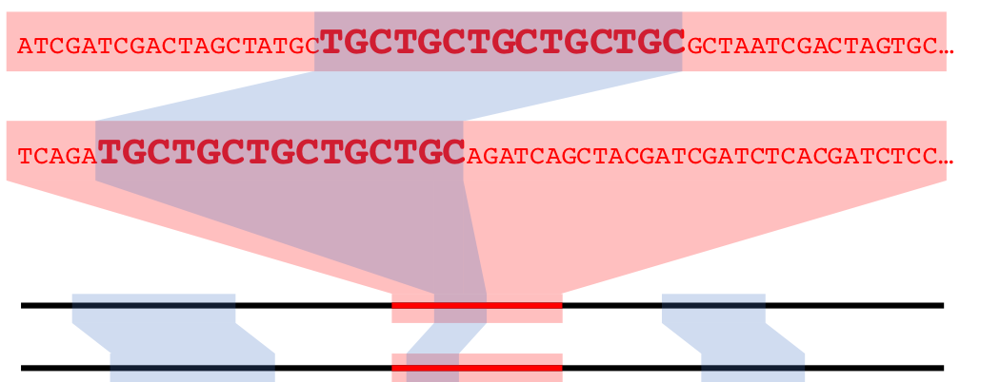
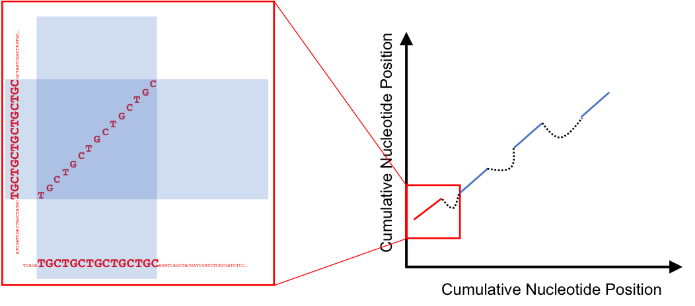

# 250: Working with genomic data in R with the DECIPHER package

Authors:
    Nicholas Cooley^[University of Pittsburgh]
Last Modified: 18 July, 2018
    
<!--
  bookdown::render_book("", "bookdown::gitbook")
-->

## Overview

### Workshop Description

In this workshop we will give an introduction to working with biological
sequence data in R using the Biostrings and DECIPHER packages. We will cover:

* Importing, viewing, and manipulating genomes in R
* Construction of sequence databases for organizing genomes
* Mapping syntenic regions between genomes with the FindSynteny function
* Understanding, accessing, and viewing objects of class Synteny
* Using syntenic information to predict orthologous genes
* Alignment of sequences and genomes with DECIPHER
* Downstream analyses enabled by syntenic mapping

### Pre-requisites

* Familiarity with Biostrings
* Familiarity with DECIPHER Databases [^1]

[^1]: [Wright, E. S. The R Journal 2016, 8 (1), 352–359.](https://journal.r-project.org/archive/2016-1/wright.pdf)

### Workshop Participation

This will be a lab where participants follow along on their computers.

### _R_ / _Bioconductor_ packages used

* Biostrings
* DECIPHER
* stringr
* FindHomology

### Time outline

| Activity                          | Time |
|-----------------------------------|------|
| Packages/Introduction             | 5m   |
| Basic commands for sequences      | 5m   |
| Sequence databases                | 10m  |
| Demonstration of synteny mapping  | 10m  |
| Explanation of function arguments | 10m  |
| Dissecting Synteny objects        | 10m  |
| Visualization of syntenic blocks  | 10m  |
| Alignment of syntenic regions     | 10m  |
| Ortholog prediction from Synteny  | 10m  |
| Constructing phylogenetic trees   | 10m  |

## Workshop goals and objectives

### Learning goals

* Understand a simple workflow for analysis of sequences in R and DECIPHER
* Learn the basic use and appropriate application of functions within DECIPHER

### Learning objectives

* Learn basic commands for working with sequences in R
* Import genomes from online repositories or local files
* Map synteny between genomes
* Analyze a synteny map among multiple genomes
* Develop an understanding of the data structures involved
* Predict orthologs from syntenic maps
* Select core and pan genomes from predicted orthologs
* Construct and interpret phylogenetic trees

#### Introduction

In this worshop we will be walking through a comparative genomics pipeline using functions within the R package DECIPHER, and within a package that is currently under construction under the name FindHomology.

#### Context

Lipid membranes are ubiquitious in living organisms, however the individual lipid molecules that compose membranes have a wide variety of structures. The biosynthesis of common lipid molecules is well understood, conversely the biosynthesis of more exotic lipid molecules is not. The genomes selected today are from the archaeal phylum Thaumarchaeota, which are known for being anammox archaea, and are important in the nitrogen cycle. In addition to that, these archaea all produce a series of unusual lipids. Since these lipids are shared across the entire phylum from which these genomes are pulled, it is possible that the biosynthetic genes responsible for lipid construction are shared across the selected genomes, and part of their 'core' genome.

Archaea are relatively newly characterized as organisms. First classified in the '70s[^2], for their deviations from Prokaryotes, many Archaea are noteable for being isolated from extreme environments. Despite the colorful beginnings of their classification, not all Archaea are extremophiles.

[^2]: [(1) Woese, C. R.; Fox, G. E. Proc. Natl. Acad. Sci. 1977, 74 (11), 5088–5090.](https://www.ncbi.nlm.nih.gov/pmc/articles/PMC432104/)

```{r Grand Prismatic, echo = FALSE, fig.cap = "Grand Prismatic Spring in Yellowstone National Park[^3]", out.height = "75%", out.width = "75%", fig.align = "center"}

```

The aforementioned unusual lipds[^4] are striking in their differences from those common in both Eukaryotes and Prokaryotes.

[^3]: [Grand Prismatic Spring](https://commons.wikimedia.org/wiki/File:Grand_prismatic_spring.jpg)

[^4]: [(1) Caforio, A.; Driessen, A. J. M. Biochimica et Biophysica Acta - Molecular and Cell Biology of Lipids. Elsevier November 1, 2017, pp 1325–1339.](https://www.ncbi.nlm.nih.gov/pubmed/28007654)

```{r Lipids, echo = FALSE, fig.cap = "A. A generic lipid with phosphatidyl serine head group B. A generic Archaeal lipid C. A more exotic Archaeal lipid", out.height = "50%", out.width = "50%", fig.align = "center"}

```

Whereas Lipid construction in eucharyotes and prokaryotes relies on iterative incorporation of malonyl-CoA units, archaea utilize the melvonate pathway to construct their lipids through iterative incorporation of dimethylallyl pyrophosphate. Which is responsible for the iterative methyl groups extant to the lipid chain in **B** above. Archaeal lipids are also notable for their lack of ester linkages between the alkyl chain, and glyerol. Even more interesting, and as yet uncharacterized, Archaea incorporate a range of ring structures into their lipids, and additionally appear to *fuse lipid tails together in the bilayer*, as shown above in **C**. 

#### The above is interesting, but so what?

Our goal with this workshop is to show how functions within DECIPHER, in addition to those found within FindHomology can be used to predict homologs between genomes, as well as predict the core genome of a given set of genomes. As stated above, the chemistry and biology involved in some of the construction of archaeal lipids is unknown. Hypothetically, as this chemistry is universal in these organisms, the genes responsible could all be homologs, and be identified as part of the core genome. Further we can compare the core and pan genomes of this set.

To begin with, we will load the required packages:
DECIPHER and FindHomology will provide tools to complete the phylogenetic analysis, while phytools will provide visualization tools, specifically for the visualization of tangelograms, and stringr is used for a specific string operation.

#### Packages and Sequences

```{r things to load}
suppressMessages(library(DECIPHER))
library(FindHomology)
library(stringr)
```

#### Genomes, and DECIPHER databases

The first step in this process is selecting the genomes we want to work with. There are several ways to do this, especially when accessing publically available genomes through the NCBI. Entrez Direct[^5] provides powerful unix command line tools, if that's your flavor, but the NCBI Genome List, and other search tools are easily accessible, and have a lower barrier to to entry.

[^5]: [Entrez Direct](https://www.ncbi.nlm.nih.gov/books/NBK179288/)

For the purposes of this workshop, we will be using a set of preselected genomes that will be accessed via ftp addresses. These are loaded with the FindHomology Package and can be accessed easily.

```{r package data}
data("GeneCallAdds")
data("GenomeAdds")
data("GenomeIDs")
```

We have now loaded in a character vector for ftp addresses for genomic fasta files `GenomeAdds`, a character vector of ftp addresses for genomic GFF files `GeneCallAdds` that we will be using to collect gene boundaries, strandedness, and annotations. And lastly a vector of abbreviated names for the genomes we are working with.

FindHomology contains a simple parser function for GFF files that allows us to grab gene boundaries and annotations.

```{r}
GeneCalls <- FindHomology::GFFParser(GFFAddress = GeneCallAdds,
                                     Verbose = TRUE)
```

If you choose to mimic this work on your own, there are a few ways to get gene calls(the gene boundaries, and strandedness), and annotations, such as Prodigal[^7] (for gene calls) and Prokka[^8] (for annotations). Using the NCBI annotations is simple and conducive for this workshop. However if you are working on sequence data that you have generated or collected yourself, NCBI annotations will not be available. Additionally, a Gene Caller within the DECIPHER package is currently under construction.

[^7]: [(1) Hyatt, D.; Chen, G.-L.; LoCascio, P. F.; Land, M. L.; Larimer, F. W.; Hauser, L. J. BMC Bioinformatics 2010, 11 (1), 119.](https://www.ncbi.nlm.nih.gov/pmc/articles/PMC2848648/)
[^8]: [(1) Seemann, T. Bioinformatics 2014, 30 (14), 2068–2069.](https://www.ncbi.nlm.nih.gov/pubmed/24642063)

#### DECIPHER and Databases

DECIPHER works with sequence data through SQL databases. There are several reasons for this.

```{r DataBases, echo = FALSE, fig.cap = "Databases are compressable and easily shareable", out.height = "75%", out.width = "75%", fig.align = "center"}

```

Databases provide large improvements in file organization. Currently, a personalized analysis pipeline could include anywhere from one to tens of programs, all of which may take in similar data, or outputs of previous steps, or may output more files than a user needs. DECIPHER's use of databases allows for sequence data to be stored in an organized format that eliminates this kind of redundancy.

Use of databases also allows for a non-destructive workflow. Sequence data in the database can be accessed as needed, but cannot be accidentally manipulated. Databases are also shareable, allowing for accession by multiple users at once.

Additionally, constructing a database in DECIPHER is relatively easy.

In your own work, it can be inadvisable to use `tempfile()` to specify the location of your .sqlite file, especially if it will be a file you use repeatedly, or takes a significant amount of time to create, or that you will eventually need to share with collaborators. However for this workhshop, it is fine.

We can access our databases through either a database connection, or simply a filepath to the database. In this code chunk below, we will use a database connection.

```{r decipher part 1}

DBPath <- tempfile()

DBConn <- dbConnect(SQLite(),
                    DBPath)

for (i in seq_along(GenomeAdds)) {
  Seqs2DB(seqs = GenomeAdds[i],
          type = "FASTA",
          dbFile = DBConn,
          identifier = as.character(i),
          tblName = "Seqs",
          verbose = FALSE)
}

dbDisconnect(DBConn)
```

Identifying details of the database can be viewed in your default browser: `BrowseDB(DBPath)`

#### Comparison of genomes

Comparison of genomes will be accomplished with Synteny. Generically when regions in a genome are the same, they are syntenic matches. Often observing this phenomenon is accomplished through matching runs of reciprocal best blast hits. If in genome 1, genes A-B-C are reciprocal best blast hits to genes Z-Y-X in genome 2, the region encompassing those genes would be considered syntenic.

In DECIPHER this is accomplished using k-mer matching, runs of an exact match of length k are identified and recorded as a syntenic hit.

```{r Simple Synteny Example, echo = FALSE, fig.cap = "A syntenic hit in nucleotide space", out.height = "100%", out.width = "100%", fig.align = "center"}

```

We can visualize syntenic hits as above, with co-linear representations of genomes with some graphical links to signify the locations and lengths of syntenic hits. Or we can employ a dotplot, which utilizes the cumulative nucleotide positions of two genomes as the x and y axes in a generic plot.

```{r Simple DotPlot, echo = FALSE, fig.cap = "A syntenic hit, and several hits being chained toegher into a syntenic block", out.height = "100%", out.width = "100%", fig.align = "center"}

```

Syntenic Hits can be chained together, if they are close *enough*, to form larger syntenic blocks. The enough part, has to be measured in nucleotide distance between the hits in question, in both genomes. This also means that syntenic hits can be chained together with differing distances between them in each genome. Making syntenic blocks different lengths in corresponding genomes. Additionally, chaining of hits allows for utilizing smaller syntenic hits that may appear insignificant on their own, to be grouped in with other nearby hits to increase their significance.

DECIPHER's `FindSynteny` function allows users to control the degree to which hits and blocks are recorded through the argument `minScore`, or a minimum score required for a block, or hit, to be kept as a real syntenic match.

In this workflow, we will be determining Synteny between genomes before we consider the gene calls we have already collected. Which stands in contrast to how many current synteny finding programs work. In the code below `FindSyntey()` will perform pairways analysis of every set of genomes provided to it. 

```{r decipher part 2}
# Here we will use a file path instead of a dbconnection
SyntenyObject <- FindSynteny(dbFile = DBPath,
                             verbose = TRUE)
```

There are multiple ways to view objects of class `synteny`. It has default view options for `plot()`. By default, colors are assigned as a ramp from the first nucleotide position, to the last nucleotide position of the *query* genome, or the first genome selected, and wherever syntenic hits are observed, the bar representing the *subject* genome is marked with the section of the color ramp indicating the syntenic hit in the *query*.

Plotting genomes 2 and 3, which are very syntenic, provides a good example of this. Grey uncolored space in the subject genome indicates a lack of syntenic blocks in that region. In some places, the ramp reverses, indicating an inversion, while in others, blocks are reordered from the default color bar, indicating possible rearrangements.

```{r plotdefault}
plot(SyntenyObject[2:3, 2:3])
```

Because visualizing large numbers of syntenic hits in genome sized sequences can be non-trivial, additional commands can be passed to plot in order to modify coloring schemes. `frequency` causes bars representing genomes to be colored by **how syntenic** that particular region (as determined by cumulative nucleotide position) of the genome is, indiscriminate of where that hit is in a corresponding genome. Once again genomes 2 and 3 in our set are good examples of this. They are highly syntenic, which this option shows well, but the rearrangements present are no longer shown.

```{r plotfrequency}
plot(SyntenyObject[2:3, 2:3],
     "frequency")
```

Because visualizing large numbers of syntenic hits in genome sized sequences can be non-trivial, additional commands can be passed to plot in order to modify coloring schemes. `neighbor` tries to provide each syntenic hit with a unique color, and additionally draws linear connections between them to facilitate better visualization. This can be a useful alternative to the default plotting, if many rearrangements are present in a way that you want to view.

```{r plotneighbors}
plot(SyntenyObject[2:3, 2:3],
     "neighbor")
```

Plotting is a useful tool in analzying sequence data, however sometimes plots of genome sized sequence data can be a bit overwhelming. Plotting our entire database, 8 sequences, though good at representing the complexity present here in this workshop, can be daunting to make sense of quickly if you are unused to looking at figures of this type frequently.

```{r plotneighbors2}
plot(SyntenyObject,
     "neighbor")
```


The most useful way to visualize Synteny data *in my opinion* is through a dot plot, which can be accessed via the `pairs()`. Dot plots, as explained above, utilize each genome being compared, as an axis in a normal x-y scatter plot. Where a *dot* - really a **very** short line, representing a run of nucleotides or amino acids -  is shown, that x,y coordinate is a syntenic hit. Hits can also be chained together into blocks of syntenic hits.

```{r small pairs plot}
pairs(SyntenyObject[2:3, 2:3], labels = GenomeIDs[2:3])
```

Syntenic hits are shown in the upper left, while syntenic blocks are shown in the bottom left. In the upper triangle,hits in black are co-linear, while hits in red are inverted. In the bottom triangle, blocks are colored by score.

Pairs plots are *my* personal favorite way to visualize syntenic information, but, they can become overwhelming as the number of genomes compared increases. They provide very clear depictions of rearrangements and inversions.

```{r large pairs plot}
pairs(SyntenyObject,
      labels = GenomeIDs)
```

#### Predict homology between genes that are linked by syntenic hits

The FindHomology package contains 5 functions, the second of which is below. `NucleotideOverlap` takes in an object of class `Synteny`, and a list of gene calls. We previously generated the object `SyntenyObject`, using DECIPHER's function `FindSynteny`, and a list of gene calls and annotations using `GFFParser`. Here we will use these two objects to build what is functionally a list of pairs of genes that are linked by syntenic hits. These linking of hits are used as  predictions of homology. A single position in the object of class `Synteny` represents a pairwise comparison between two genomes. The corresponding position in `NucleotideOverlap`'s output object, is generated from that pairwise comparison, and the gene calls for each genome involved.

This is a fun object to scroll through, but is often very long, representing thousands of paired genes and is not represented well visually, a simple example would be:

| Genome 1 | Genome 2 | # of Nucleotides |
|----------|----------|------------------|
| Gene A   | Gene Z   |             25L  | 
| Gene B   | Gene Y   |           1251L  |
| Gene C   | Gene X   |            145L  |
| Gene ... | Gene ... |             ...  |

The reason we name this "MatrixObject" below is because the shape and dimensions of our data are dependent upon our synteny object. As in, if our Synteny object was built from 5 genomes, that object is a 5 x 5 matrix. NucleotideOverlap accesses the upper triangle of that object to build a 5 x 5 matrix where each position is built from data in the analogous position from the Synteny object. `MatrixObject[[1]][1, 2]` below was created from `SyntenyObject[[1]][1, 2]` and so on and so forth.

```{r find homology part 1}
MatrixObject <- NucleotideOverlap(SyntenyObject = SyntenyObject,
                                  GeneCalls = GeneCalls,
                                  Verbose = TRUE)
```

The function `Catalog` takes in the output of `NucleotideOverlap` and returns a list of matrices. These matrices represent agglomerated sets of pairs. The idea being, if gene **A** in genome **1** was paired by nucleotide overlap to genes **B** and **C** in genomes **2** and **3** respectively by `NucleotideOverLap`, and additionally gene **B** in genome **2** was similarly paired with gene **C** in genome **3**. With the assumption that these linkages indicate homology, gene **A** is predicted to be homologous to genes **B** and **C**, and gene **B** is predicted to be homologous to gene **C**. 

| Genome 1 | Genome 2 | Genome 3 |
|----------|----------|----------|
| Gene A   | Gene B   | NA       |
| NA       | Gene B   | Gene C   |
| Gene A   | NA       | Gene C   |

`Catalog` will return every agglomerated set of pairs, of every size possible for the given set of genomes. From a matrix with a single row, indicating a pair of genes that are predicted to have no other homologs anywhere else in the set of genomes, to a large matrix indicating that homologs are located in every genome, and are all predicted to be homologous to each other.

```{r find homology part 2}
Homologs <- Catalog(MatrixObject,
                    Verbose = TRUE)
```

We can visualize this object as a histogram of the size of these agglomerations, by the number of pairs included in each agglomerated group. Where **1** represents pairs of genes where neither gene is linked to any other gene, *from other genomes*. Where **28** *in this case* represents fully linked sets of pairs, where each gene in the set is predicted to be a homolog of *every other gene in the set*.

```{r find homology objects part 1}
hist(sapply(Homologs,
            function(x) nrow(x)),
     main = "Size of Agglomerations",
     ylab = "Number of Sets",
     xlab = "Numer of Gene Pairs",
     breaks = 27L)
```

We can collect these fully linked sets. For any `N` number of genomes, a set of genes where each genome contains a homolog, and those homologs in turn have agreeing homologs in every other genome, the number of rows of this matrix will be `N * (N-1) / 2`.

You could additionally query this list for any other presence absence pattern that you may be interested in, especially if it can be easily linked to the number of rows in each matrix.

```{r determine core sets}
MaxRows <- max(sapply(Homologs,
                      function(x) nrow(x)))
CoreSet <- which(sapply(Homologs,
                        function(x) nrow(x)) == MaxRows)
```

The second to last function in FindHomology, `CoreAligner`, collects the genes in these sets, from their respective genomes, aligns the respective sets, and then concatonates the alignments. Creating a concatonated core genome for this set of genomes. This function relies on a few DECIPHER functions internally, and utilizes DECIPHER's database functionality to perform that collection of genes. Additionally, we can use a few more DECIPHER functions to create a distance matrix from our concatonated core genome, and create a phylogenetic tree from that concatonated core.

```{r align core genes}
CoreGenome <- CoreAligner(Homologs[CoreSet],
                          PATH = DBPath,
                          GeneCalls = GeneCalls,
                          Verbose = TRUE)
CoreDist <- DistanceMatrix(myXStringSet = CoreGenome,
                           verbose = FALSE,
                           correction = "Jukes-Cantor")
CoreDend <- IdClusters(myDistMatrix = CoreDist,
                       myXStringSet = CoreGenome,
                       method = "NJ",
                       verbose = FALSE,
                       showPlot = TRUE,
                       type = "dendrogram")
```

We can now finally tidy up our workspace and unlink our temp file.

```{r tidy up our workspace, echo = TRUE}
unlink(DBPath)
```

We are also interested in the pan genome, and FindHomolog's `LogicalPan` function allows us to utilize the Homologs object, and the list of GeneCall dataframes, to create a presence absence matrix of the pan genome.

```{r build pan genome}
PanGenomeMatrix <- LogicalPan(HomologList = Homologs,
                              GeneCalls = GeneCalls,
                              Verbose = TRUE,
                              Plot = FALSE)
```

We can visualize this matrix if we so choose.

```{r}
image(t(PanGenomeMatrix), col = c("white", "blue"),
      main = "Presence Absence")
```

PanGenomeMatrix represents every homolog set, and every singleton gene in our genomes.

This matrix is constructed from the object `Homologs` which is a list of matrices. Each matrix represents of a set of predicted homologous pairs. Some of the sets are small, say a single pair. Some are large, encompassing genes in every genome in our set. However, the one thing this matrix is missing is singleton genes from each genome. Genes that have no predicted homologs by our method.

And we can create a dendrogram from this matrix.

```{r create dendrogram from pan genome}
PanGenome <- dist(PanGenomeMatrix,
                  method = "binary")
PanDend <- IdClusters(myDistMatrix = PanGenome,
                      method = "NJ",
                      type = "dendrogram",
                      showPlot = TRUE,
                      verbose = FALSE)
```

We can, additionally, create a simple tangleogram from these two phylogenetic trees. Allowing a comparison of the core, and pan genomes. The core is on the left, while the pan is on the right.

```{r simple tangleogram}
tf1 <- tempfile()
tf2 <- tempfile()

WriteDendrogram(x =PanDend,
                file = tf1)

WriteDendrogram(x = CoreDend,
                file = tf2)

unlink(tf1)
unlink(tf2)
layout(matrix(1:2, nrow = 1L))
p <- par(mar = c(5, 2, 1, 2))
plot(CoreDend, horiz = TRUE, leaflab = "none")
par(mar = c(5, 2, 1, 2))
plot(PanDend, horiz = TRUE, xlim = c(0, attr(PanDend, "height")), leaflab = "none")
C.Ord <- unlist(CoreDend)
P.Ord <- unlist(PanDend)
segments(-0.10, seq_along(C.Ord), -0.01, match(C.Ord, P.Ord), xpd = NA, col = "blue")
par(p)
```

The proposition at the beginning of this workshop was that a specific set of genes, that may not normally be included in a core genome, could be included in the core genome, for this set of Archaea. Specifically, genes involved in some of the unusual chemistry that Archaea do with their lipids. If we wanted to really prove this, a significant amount of lab work would also be required. However we can collect the annotations for all of the sets of homologs that have been predicted, and see how much these annotations agree, and if any of these annotations provide evidence for our proposition.

```{r collect annotations}
CoreGenes <- matrix(data = NA_integer_,
                        ncol = length(GeneCalls),
                        nrow = length(CoreSet))
CoreAnnotations <- matrix(data = NA_character_,
                              ncol = length(GeneCalls),
                              nrow = length(CoreSet))
for (i in seq_len(ncol(CoreGenes))) {
  for (j in seq_len(nrow(CoreGenes))) {
    CoreGenes[j, i] <- unique(Homologs[CoreSet[j]][[1]][, i])[!is.na(unique(Homologs[CoreSet[j]][[1]][, i]))]
    CoreAnnotations[j, i] <- GeneCalls[[i]][CoreGenes[j, i], "Annotation"]
  }
}

CoreAnnotations <- t(CoreAnnotations)
CoreAnnotations <- data.frame(CoreAnnotations,
                                  stringsAsFactors = FALSE)
```

The annotations for each core set can now be viewed. Some provide near-universal agreement, while others indicate genes of similar family and function, but potentially not an exact match.

```{r view annotations}
CoreAnnotations[, c(1L, 3L)]
```

There are 60 of these! 

```{r more annotations}
CoreAnnotations[, 2L]
```

Now, a little insider baseball is that the unique chemistry we're interested in is often the chemistry of radicals, especially in biological systems, where the process is tightly controlled by enzymes. A quick perusal of all the sets of annotations provides two sets that support our original hypothesis.

```{r potential hits of interest}
CoreAnnotations[, c(17L, 31L)]
```

This concludes the workshop, as any analysis after this would require work in a wet lab. Hopefully this was a useful showcase for the power of using DECIPHER to analyze sets of genomic data. The package FindHomology is currently located on github, and is still under construction. Upon completion, it will be available on Bioconductor.

Thank you for your time and attention! We hope you learned something, and if you come back to this at a later date and have any questions, concerns, or comments, feel free to [email me](npc19@pitt.edu), or you can [tweet](https://twitter.com/npcooley) at me.


