# 510: Maintaining your Bioconductor package

## Instructor name and contact information

* Nitesh Turaga ^[Roswell Park Comprehensive Cancer Center, Buffalo, NY] (<nitesh.turaga@roswellpark.org>)

## Workshop Description

Once an R package is accepted into Bioconductor, maintaining it is an
active responsibility undertaken by the package developers and
maintainers. In this short workshop, we will cover how to maintain a
Bioconductor package using existing infrastructure. Bioconductor hosts
a range of tools which maintainers can use such as daily build
reports, landing page badges, RSS feeds, download stats, support site
questions, and the bioc-devel mailing list. Some packages have their
own continuous integration hook setup on their github pages which
would be an additional tool maintainers can use to monitor their
package. We will also highlight one particular git practice which need
to be done while updating and maintaining your package on out git
system.

### Pre-requisites

Accepted Bioconductor package or plans to contribute a Bioconductor
package in the future.

### Participation

Students will be expected to follow along with their laptops if they
choose to, although it is not needed.

### Time outline: 50 mins short workshop

* Introduction: 10 mins
    * Why maintain your package
    * Infrastructure used for maintenance
* Outline how to use infrastructure: 35 mins
	* Build report
	* Version numbering
	* Landing page badges
	* Download statistics
	* RSS feeds
	* Support site, Bioc-devel mailing list
    * Github
        * Sync package with Github / Bioconductor before every change
	    * Github issues
* Round up of resources available: 5 mins
* Acknowledgements

### Workshop goals and objectives

* Gain knowledge of how to track Bioconductor packages via download
  statistics, RSS feeds.
* Understand the importance of supporting their user community and how
  to do so using the support site and bioc-devel mailing list.
* Maintain their package and fix bugs using build reports, continuous
  integration tools.
* Update their package consistently on both Github and Bioconductor
  private git server.

## Introduction

**Maintainer** - Who should people contact if they have a problem with
this package? You must have someones name and email address here. You
must make sure this is up to date and accurate.

Maintaining it is an active responsibility undertaken by the package
developers and maintainers. Users contact developers for various
reasons.

**Keep your email up to date in the DESCRIPTION file!**

	Maintainer: Who to complain to <your_fault@fix.it>

or

	Authors@R: c(
		person("Complain", "here", email="your_fault@fix.it", role=c("aut", "cre"),
		person("Don't", "Complain", role="aut"))
	)

**NOTE:** There should be only 1 maintainer (one "cre"). But all authors
get credit for the package.

Interchangeable terminology

*Bioconductor maintainers* <-> *Bioconductor developers* <-> *Package developer* <-> *developer*

### Why maintain your package

1. Changes in underlying code (upstream dependencies of your package)
   might break your package.

1. Packages using web resources might fail because of change of
   location of these resources.

1. Bug fixes reported or discovered due to usage.

1. Feature requests from users.

1. Improvements in the science behind your package, which lead to
   updates.

1. It leads to wide spread usage of your package.

1. It's **required**, also a good practice that users appreciate.

1. Poorly maintained packages get deprecated if they fail build and
   check on Bioconductor during release cycles. (Bioconductor is
   fairly serious about this)

### Infrastructure used for maintenance

**Build machines** are dedicated towards building your package
*daily*. As a maintainer it's useful to check your package build
report once a week, both in the current RELEASE and DEVEL cycle.

http://bioconductor.org/checkResults/

Build machines cover three platforms (Linux, Windows and OS X) over
RELEASE and DEVEL versions of Bioconductor.

**Version control** - Since last year, GIT has been the primary version
control system.

## Outline how to use infrastructure

Everything you need is on the Bioconductor website. As a developer the link
with most important resources,

http://bioconductor.org/developers/

###	Build report

Report of the build status of your package. It posts at around 11AM
EST (can change sometimes) and is located on the time stamp at the top
of the page.

Two versions of the build report.

* Bioconductor RELEASE version

	http://bioconductor.org/checkResults/release/bioc-LATEST/

* Bioconductor development version

	http://bioconductor.org/checkResults/devel/bioc-LATEST/

Six build machines in total at Bioconductor.

DEVEL (3 for devel)

1. Linux (malbec1)
2. Windows (tokay1)
3. OS X (merida1)

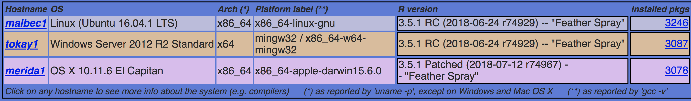

RELEASE (3 for release)

1. Linux (malbec2)
2. Windows (tokay2)
3. OS X (merida2)

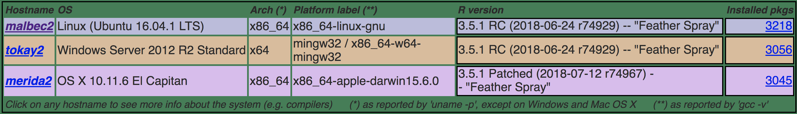

#### What is running on these machines?

##### INSTALL

  Command:

	  /home/biocbuild/bbs-3.7-bioc/R/bin/R CMD INSTALL a4

  http://bioconductor.org/checkResults/release/bioc-LATEST/a4/malbec2-install.html

  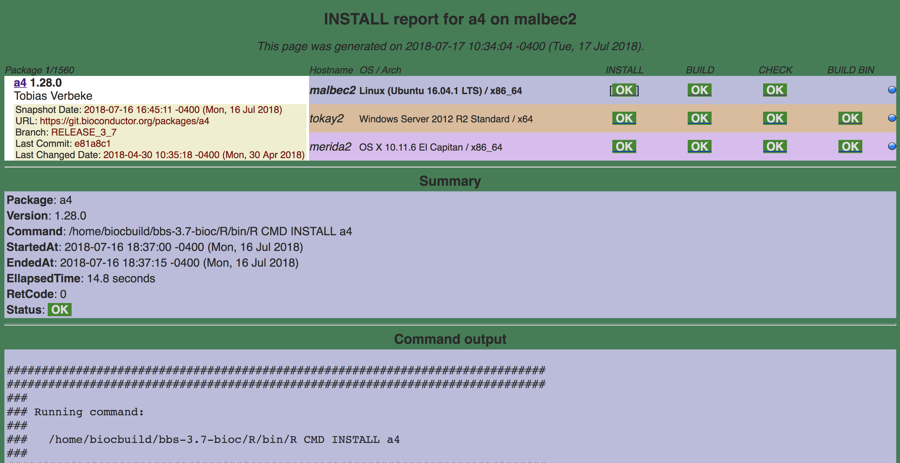

##### BUILD

  Command:

	/home/biocbuild/bbs-3.7-bioc/R/bin/R CMD build a4

  http://bioconductor.org/checkResults/release/bioc-LATEST/a4/malbec2-buildsrc.html

  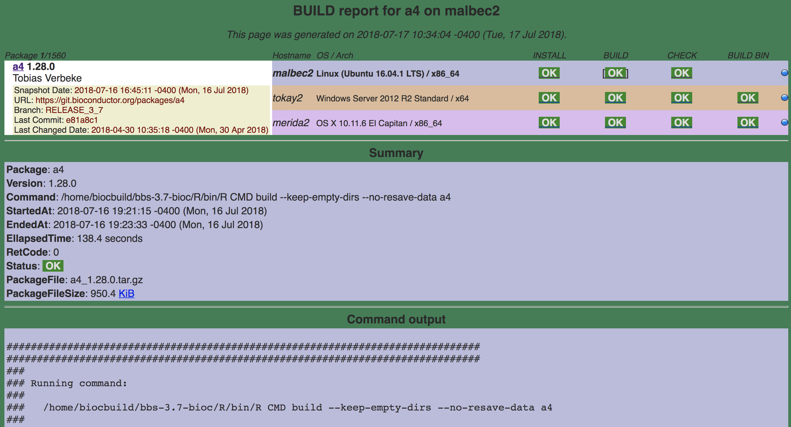

##### CHECK

  Command:

	/home/biocbuild/bbs-3.7-bioc/R/bin/R CMD check a4_1.28.0.tar.gz

  http://bioconductor.org/checkResults/release/bioc-LATEST/a4/malbec2-checksrc.html

  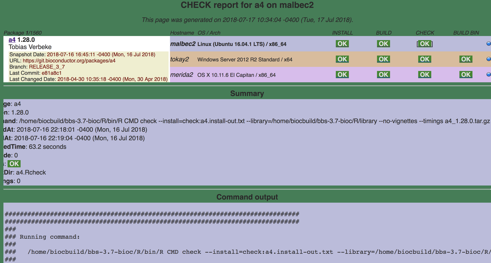

##### BUILD BIN

This makes the tar ball which is specific to the platform and
propagates it to main repository.

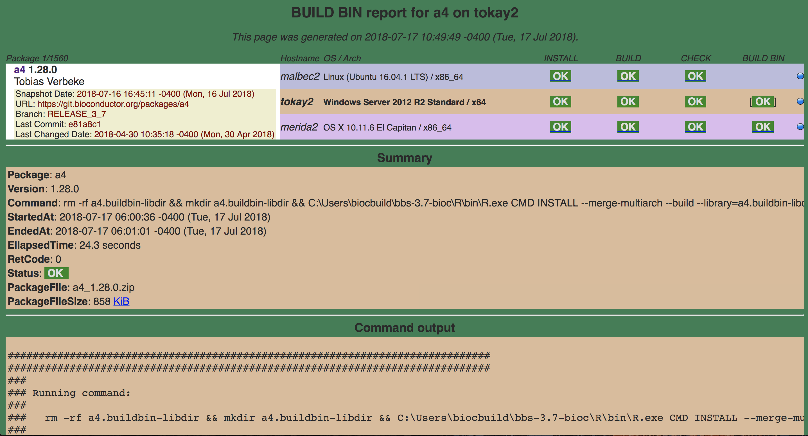

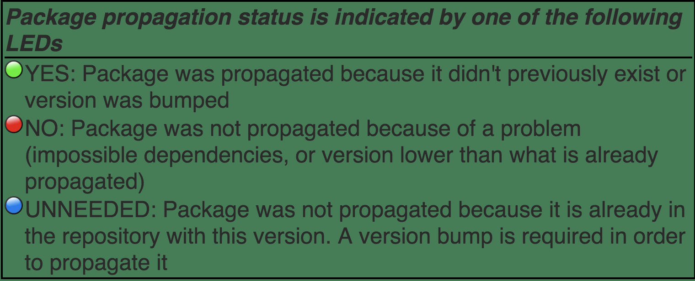

The build machines display a status for each package. They indicate
different things.

 *TIMEOUT* - INSTALL, BUILD, CHECK or BUILD BIN of package took more
 than 40 minutes

 *ERROR* - INSTALL, BUILD or BUILD BIN of package failed, or CHECK
 produced errors

 *WARNINGS* - CHECK of package produced warnings

 *OK* - INSTALL, BUILD, CHECK or BUILD BIN of package was OK

 *NotNeeded* - INSTALL of package was not needed (click on glyph to see why)

 *skipped* - CHECK or BUILD BIN of package was skipped because the
 BUILD step failed

 *NA*- BUILD, CHECK or BUILD BIN result is not available because of an
 anomaly in the Build System

**NOTE:** The build machines run these commands a little differently
and the maintainers need not do it the same way.

#### Exercise:

Question:

	Filter packages on the DEVEL build machines which have a WARNING on their
	build report. List the top 5 packages from this filter.

Question:

	What is the timestamp on DEVEL build report of the package BiocParallel?

### Version Numbering

Version numbering is crucial to getting your package to build on the
Bioconductor build machines. Every time you want to push a change,
it's important that you make a version number update if you want to
your package to propagate to your users. The package is not built
unless there is a version number update.

https://bioconductor.org/developers/how-to/version-numbering/ 

#### Exercise:

Question:

	A very common developer question is, "I made a commit and pushed to my
	package, but the new build was not triggered. Why wasn't the
	build triggered?"
	 
	The immediate response is to check if they issued a version bump. How
	would someone check this?

Question:

	What is the version number next to the RELEASE and devel versions
	of your package? Do they align with Bioconductor policy as given
	on https://bioconductor.org/developers/how-to/version-numbering/ ?

###	Landing page badges

What are badges?

Badges can indicate the `HEALTH` and `realiability` of a package. A reason
users look at the badges is to get a sense of which packages to use in their
analysis. Active maintainers, useful posts and how long the package is in
Bioconductor sway users towards packages.

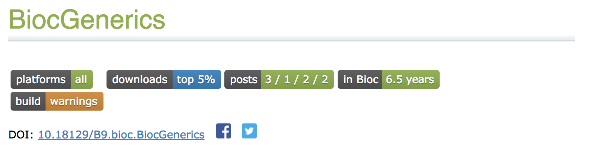

Badges indicate the following:

1. **platforms** availability of the package

1. **downloads** statistics

1. **posts** on support.bioconductor.org which are related to that package
based on the `tag`.

1. **in Bioc** how long the package has been in Bioconductor.

1. **build** current build status.

Where can I find these badges?

- Landing page to go to `RELEASE`

	bioconductor.org/packages/release/BiocGenerics

- Landing page to go to `devel`

	bioconductor.org/packages/devel/BiocGenerics

**NOTE:** After a push is made it can take up to 48 hours for it to
appear on the build report and landing pages - ie. we do one pull,
build, check, propagate in 24 hours - so if your commit was after the pull
for the day it wont be until the following day

###	Download statistics

The number reported next to each package name is the download score,
that is, the average number of distinct IPs that `hit` the package
each month for the last 12 months (not counting the current month).

   http://bioconductor.org/packages/stats/

Top 75 packages as of July 17th 3:15pm EST,

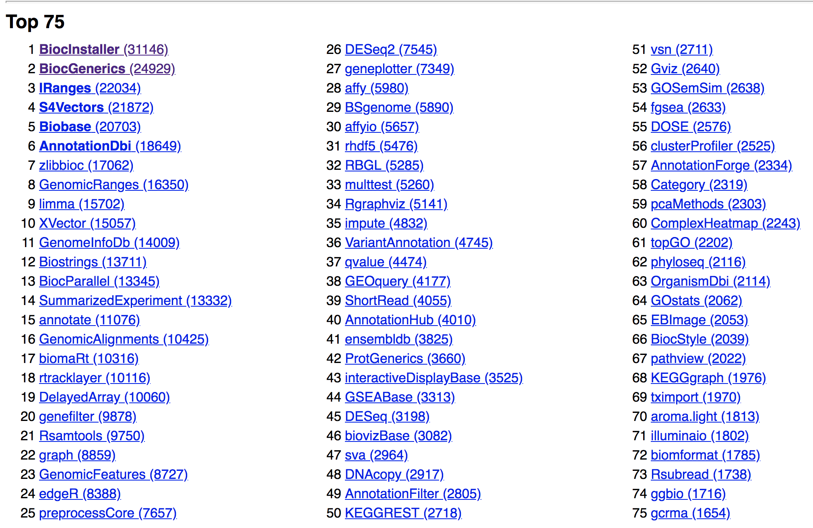

BiocGenerics Download statistics,

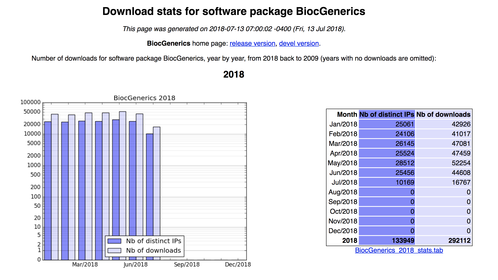

#### Exercise:

Question:

	Get the download statistics to the package you maintain or the package
	you use the most. Next, get the month in 2017 with the most number of
	downloads.

###	RSS feeds

RSS feeds help developers keep track of the development going on in
Bioconductor across all packages. There are multiple ways to use RSS
feeds, and you can use the application of your choice to subscribe to
the feeds.

[Blog which shows the 12 best RSS reader apps](https://zapier.com/blog/best-rss-feed-reader-apps/) across all platforms.

Links for RSS feeds,

   http://bioconductor.org/developers/rss-feeds/

Git log published on the website. The git log hosts the last 500
commits to bioconductor across all packages in the development branch
of Bioconductor.

http://bioconductor.org/developers/gitlog/

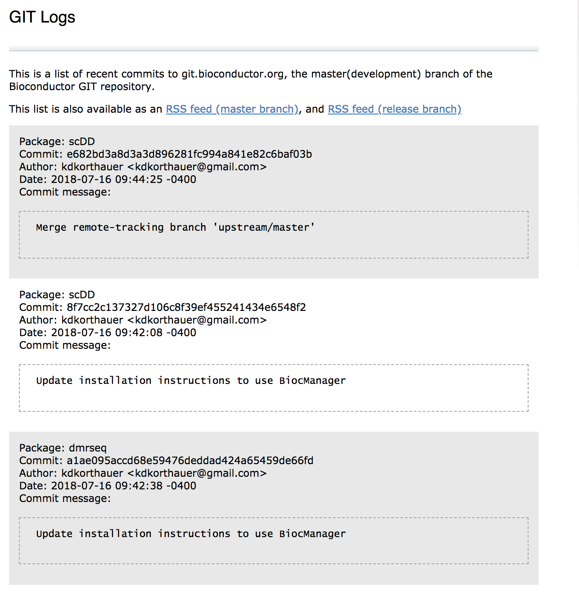

#### Exercise: 

Question:
	
	Take a package of your choice and subscribe to the RSS feed. Use a
	tool from the given link, or one of your own liking. (I use
	"feedly" the chrome extension)

###	Support site, Bioc-devel mailing list

Support infrastructure set up for Bioconductor **users** to be in
touch with maintainers.

#### Mailing list

The mailing list `bioc-devel` is for all questions related package
development, infrastructure, package support. If a question is
misplaced, the author will be pointed to the correct location to ask
the question.

https://stat.ethz.ch/mailman/listinfo/bioc-devel

#### Support site

Public support site, with easy to use interface to ask questions among
the broader community. Any and all end-user questions are welcome here.

http://support.bioconductor.org/

### GitHub

Optional, but recommended.

#### Sync package with Github / Bioconductor before every change

Do this every time there is an update on your package from your end, or,
before you start developing.

Help with Git (most canonical location),

	http://bioconductor.org/developers/how-to/git/

Sync package from Bioconductor repository  to Github repository

http://bioconductor.org/developers/how-to/git/sync-existing-repositories/

#### Github issues

Github issues are more developer centric than mailing list and support
site questions. This needs to be posted directly on the development
repositories of individual packages. Each package maintainer can
choose to do their development on Github giving an interface for
issues.

The Bioconductor core team manages issues on the repositories
maintained under the [Bioconductor Organization on Github](https://github.com/Bioconductor).

The packages maintained by Bioconductor core follow the structure

	https://github.com/Bioconductor/<PACKAGE_NAME>/issues

Example: https://github.com/Bioconductor/GenomicRanges/issues

## Round up of resources available

Material covered in this workshop very briefly, highlighting

1. Build machines, what commands the build machines run and what
   information is displayed on the build reports.

1. How to check the `HEALTH` of your package with badges on the
   landing pages.

1. Download statistics of packages.

1. RSS feeds and subscribing to them, checking package development
   across bioconductor with GIT logs.

1. Support sites, mailing lists and where to get specific support as a
   maintainer.

1. Github and social coding with issues.

There is plenty of infrastructure not covered in this short workshop,

1. Docker containers.

1. AWS - Amazon Machine images(AMIs).

1. BiocCredentials Application for SSH key processing for developers.

1. Git + Bioconductor private git server.

1. Single package builder during package contribution.

1. Github and webhooks for continuous integration.

## Acknowledgements

The [Bioconductor core team](https://www.bioconductor.org/about/core-team/).
