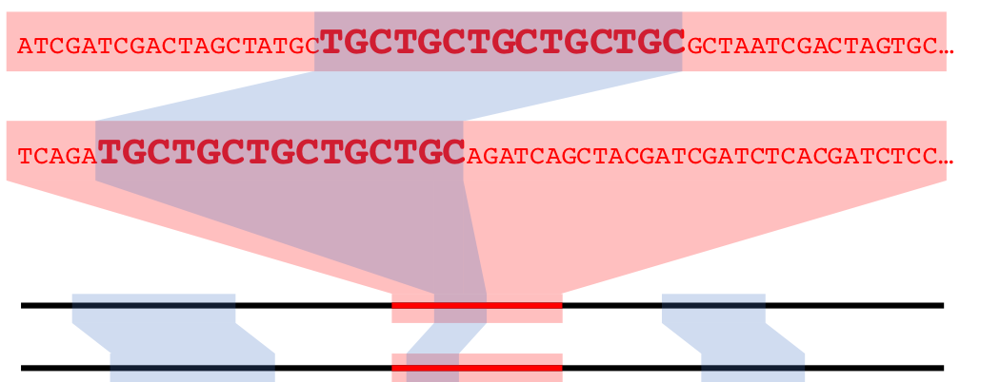

# Working with Genomic Data in R with the DECIPHER package

Authors:
    Nicholas Cooley^[University of Pittsburgh]
Last Modified: 18 July, 2018
    
<!--
  bookdown::render_book("", "bookdown::gitbook")
-->

## Overview

### Workshop Description

In this workshop we will give an introduction to working with biological
sequence data in R using the Biostrings and DECIPHER packages. We will cover:

* Importing, viewing, and manipulating genomes in R
* Construction of sequence databases for organizing genomes
* Mapping syntenic regions between genomes with the FindSynteny function
* Understanding, accessing, and viewing objects of class Synteny
* Using syntenic information to predict orthologous genes
* Alignment of sequences and genomes with DECIPHER
* Downstream analyses enabled by syntenic mapping

### Pre-requisites

* Familiarity with Biostrings
* Familiarity with DECIPHER Databases [^1]

[^1]: [Wright, E. S. The R Journal 2016, 8 (1), 352–359.](https://journal.r-project.org/archive/2016-1/wright.pdf)

### Workshop Participation

This will be a lab where participants follow along on their computers.

### _R_ / _Bioconductor_ packages used

* Biostrings
* DECIPHER
* stringr
* phytools

### Time outline

| Activity                          | Time |
|-----------------------------------|------|
| Packages/Introduction             | 5m   |
| Basic commands for sequences      | 5m   |
| Sequence databases                | 10m  |
| Demonstration of synteny mapping  | 10m  |
| Explanation of function arguments | 10m  |
| Dissecting Synteny objects        | 10m  |
| Visualization of syntenic blocks  | 10m  |
| Alignment of syntenic regions     | 10m  |
| Ortholog prediction from Synteny  | 10m  |
| Constructing phylogenetic trees   | 10m  |

## Workshop goals and objectives

### Learning goals

* Understand a simple workflow for analysis of sequences in R and DECIPHER
* Learn the basic use and appropriate application of functions within DECIPHER

### Learning objectives

* Learn basic commands for working with sequences in R
* Import genomes from online repositories or local files
* Map synteny between genomes
* Analyze a synteny map among multiple genomes
* Develop an understanding of the data structures involved
* Predict orthologs from syntenic maps
* Select core and pan genomes from predicted orthologs
* Construct and interpret phylogenetic trees

#### Workshop

In this worshop we will be walking through a comparative genomics pipeline using functions within the R package DECIPHER, and within a package that is currently under construction under the name FindHomology.

Lipid membranes are ubiquitious in living organisms, however the individual lipid molecules that compose membranes have a wide variety of structures. The biosynthesis of common lipid molecules is well understood, conversely the biosynthesis of more exotic lipid molecules is not. The genomes selected today are from the archaeal phylum Thaumarchaeota, which are known for being anammox archaea, meaning they convert ammonia to nitrite. In addition to that, these archaea all produce a series of unusual lipids. Since these lipids are shared across the entire phylum from which these genomes are pulled, it is possible that the biosynthetic genes responsible for lipid construction are shared across the selected genomes, and part of their 'core' genome.

Archaea are relatively newly characterized as organisms. First classified in the '70s[^2], for their deviations from Prokaryotes, many Archaea are noteable for being isolated from extreme environments. Despite the colorful beginnings of their classification, not all Archaea are extremophiles.

[^2]: [(1) Woese, C. R.; Fox, G. E. Proc. Natl. Acad. Sci. 1977, 74 (11), 5088–5090.](https://www.ncbi.nlm.nih.gov/pmc/articles/PMC432104/)

```{r Grand Prismatic, echo = FALSE, fig.cap = "Grand Prismatic Spring in Yellowstone National Park[^3]", out.height = "75%", out.width = "75%", fig.align = "center"}

```

The aforementioned unusual lipds[^4] are striking in their differences from those common in both Eukaryotes and Prokaryotes.

[^3]: [Grand Prismatic Spring](https://commons.wikimedia.org/wiki/File:Grand_prismatic_spring.jpg)

[^4]: [(1) Caforio, A.; Driessen, A. J. M. Biochimica et Biophysica Acta - Molecular and Cell Biology of Lipids. Elsevier November 1, 2017, pp 1325–1339.](https://www.ncbi.nlm.nih.gov/pubmed/28007654)

```{r Lipids, echo = FALSE, fig.cap = "A. A generic lipid with phosphatidyl serine head group B. A generic Archaeal lipid C. A more exotic Archaeal lipid", out.height = "50%", out.width = "50%", fig.align = "center"}
knitr::include_graphics("./DECIPHERWorkshop/ArchaealLipids.png")
```

Whereas Lipid construction in eucharyotes and prokaryotes relies on iterative incorporation of malonyl-CoA units, archaea utilize the melvonate pathway to construct their lipids through iterative incorporation of dimethylallyl pyrophosphate. Which is responsible for the iterative methyl groups extant to the lipid chain in **B** above. Archaeal lipids are also notable for their lack of ester linkages between the alkyl chain, and glyerol. Even more interesting, and as yet uncharacterized, Archaea incorporate a range of ring structures into their lipids, and additionally appear to *fuse lipid tails together in the bilayer*, as shown above in **C**. 

#### The above is interesting, but so what?

Our goal with this workshop is to show how functions within DECIPHER, in addition to those found within FindHomology can be used to predict homologs between genomes, as well as predict the core genome of a given set of genomes. As stated above, the chemistry and biology involved in some of the construction of archaeal lipids is unknown. Hypothetically, as this chemistry is universal in these organisms, the genes responsible could all be homologs, and be identified as part of the core genome. Further we can compare the core and pan genomes of this set.

To begin with, we will load the required packages:
DECIPHER and FindHomology will provide tools to complete the phylogenetic analysis, while phytools will provide visualization tools, specifically for the visualization of tangelograms, and stringr is used for a specific string operation.

#### Packages and Sequences

```{r things to load}
suppressMessages(library(DECIPHER))
library(FindHomology)
library(stringr)
suppressMessages(library(phytools))
```

#### Genomes, and DECIPHER databases

The first step in this process is selecting the genomes we want to work with. Entrez Direct[^5] allows us to perform searches directly from the unix command line. A command like the one below will select FTP directories for the latest, complete genomes for any organism matching the term "Nitrosopumilus" or "Nitrososphaera" from genbank. Entrez Direct is complex, flexible, and powerful. Alternatively, if your search is not complex, you could navigate NCBI's website to collect the assemblies you are interested in. These are the genomes that will be used in this workshop.

[^5]: [Entrez Direct](https://www.ncbi.nlm.nih.gov/books/NBK179288/)

```{bash ncbi command line, eval = FALSE}
esearch -db assembly -query 'Nitrosopumilus[organism] OR Nitrososphaera and "complete genome"[filter] AND "latest genbank"[filter]"' | efetch -format docsum | xtract -pattern DocumentSummary -block FtpPath -match "@type:genbank" -element FtpPath | sed 's/$/\//' > ftpdirpaths
```

We can similarly pass this command through R to the terminal if we want to skip this step, or we have a big workflow in R and are unwilling to switch between applications, or would like to automate a large workflow entirely within R.

```{r ncbi command line through r, eval = FALSE}
system(paste("esearch -db assembly",
             "-query 'Nitrosopumilus[organism] OR Nitrososphaera[Organism] AND \"complete genome\"[filter]",
             "AND \"latest genbank\"[filter]\"\'",
             "|",
             "efetch -format docsum",
             "|",
             "xtract -pattern DocumentSummary -block FtpPath -match",
             "\"@type:genbank\"",
             "-element FtpPath",
             "|",
             "sed", "'", "s", '/', '$', '/', '\\', '//', "'",
             ">",
             "ftpdirpaths",
             sep = " "))
```

If you chose to commandeer this code for your own use, the paste statement, wrapped inside a system call, will work through the regular R console without a problem. However, a modest workaround will be necessary for this to work in RStudio.[^6]

[^6]: Thanks to [Serdar Balci](https://twitter.com/serdarbalci) for providing this workaround!

```{r commandline through rstudio, eval = FALSE}
myTerm <- rstudioapi::terminalCreate(show = FALSE)
rstudioapi::terminalSend(myTerm, paste("esearch -db assembly",
                                       "-query 'Nitrosopumilus[organism] OR Nitrososphaera[Organism] AND \"complete genome\"[filter]",
                                       "AND \"latest genbank\"[filter]\"\'",
                                       "|",
                                       "efetch -format docsum",
                                       "|",
                                       "xtract -pattern DocumentSummary -block FtpPath -match",
                                       "\"@type:genbank\"",
                                       "-element FtpPath",
                                       "|",
                                       "sed", "'", "s", '/', '$', '/', '\\', '//', "'",
                                       ">",
                                       "ftpdirpaths",
                                       sep = " "))
Sys.sleep(1)
repeat{
    Sys.sleep(0.1)
    if(rstudioapi::terminalBusy(myTerm) == FALSE){
        print("Code Executed")
        break
    }
}
```

One final note about Entrez, when command line utilities are installed they are set to work from a specific `path`. When calling these commands from R, and RStudio, it is always good to check the `path` that either is using before moving forward.

Once these file paths are collected, however you choose to do so, we can grab genomic FASTA files for the genomes, and the .gff files for gene calls and annotations. There are several ways to collect gene calls(the gene boundaries, and strandedness), and annotations, such as Prodigal[^7] (for gene calls) and Prokka[^8] (for annotations), which by default uses Prodigal to find gene boundaries. Using the NCBI annotations is simple and conducive for this workshop. However if you are working on sequence data that you have generated or collected yourself, NCBI annotations will not be available.

[^7]: [(1) Hyatt, D.; Chen, G.-L.; LoCascio, P. F.; Land, M. L.; Larimer, F. W.; Hauser, L. J. BMC Bioinformatics 2010, 11 (1), 119.](https://www.ncbi.nlm.nih.gov/pmc/articles/PMC2848648/)
[^8]: [(1) Seemann, T. Bioinformatics 2014, 30 (14), 2068–2069.](https://www.ncbi.nlm.nih.gov/pubmed/24642063)

For this exercise however, we will be loading our ftp addresses from a pre-generated set. `ftpdirpaths` is a character vector containing the directories for the 8 genomes that match our queries above.

```{r get package data}
data("ftpdirpaths")
```

The collected ftp *directories* contain a large assortment of files including genomic FASTA, .gbk, and .gff files, as well as others. For this workshop, we want the genomic FASTA and the genomic .gff files. Because NCBI uses a clear, and uniform file architecture, a few simple commands in base R and stringr provide us with the addresses for the *files* we wish to collect.

```{r collect files from ftp directories}
Genomes <- ftpdirpaths
x <- strsplit(Genomes,
              split = "/")
Annotations <- vector("character",
                      length = length(Genomes))
GeneCalls <- vector("list",
                    length = length(Genomes))
for (i in seq_along(Annotations)) {
  Annotations[i] <- paste(Genomes[i],
                      x[[i]][10L],
                      "_genomic.gff.gz",
                      sep = "")
  z1 <- gzcon(url(Annotations[i]))
  z2 <- textConnection(readLines(z1))
  z3 <- readLines(z2)
  z4 <- strsplit(z3,
                 split = "\t")
  Start <- sapply(z4,
                  function(x) ifelse(test = length(x) == 9L & x[3] == "CDS",
                                     yes = x[4],
                                     no = NA),
                  USE.NAMES = FALSE)
  Stop <- sapply(z4,
                 function(x) ifelse(test = length(x) == 9L & x[3] == "CDS",
                                    yes = x[5],
                                    no = NA),
                 USE.NAMES = FALSE)
  Strand <- sapply(z4,
                   function(x) ifelse(test = length(x) == 9L & x[3] == "CDS",
                                      yes = x[7],
                                      no = NA),
                   USE.NAMES = FALSE)
  Product <- sapply(z4,
                    function(x) ifelse(test = length(x) == 9L & x[3] == "CDS",
                                       yes = x[9],
                                       no = NA),
                    USE.NAMES = FALSE)
  Product <- str_extract(Product,
                         "(?<=product=)(.*)(?=;protein_id)")
  z5 <- as.integer(Start[which(!is.na(Start) &
                                 !is.na(Stop) &
                                 !is.na(Strand) &
                                 !is.na(Product))])
  z6 <- as.integer(Stop[which(!is.na(Start) &
                                !is.na(Stop) &
                                !is.na(Strand) &
                                !is.na(Product))])
  z7 <- Strand[which(!is.na(Start) &
                       !is.na(Stop) &
                       !is.na(Strand) &
                       !is.na(Product))]
  z8 <- Product[which(!is.na(Start) &
                        !is.na(Stop) &
                        !is.na(Strand) &
                        !is.na(Product))]
  GeneCalls[[i]] <- data.frame("Start" = z5,
                               "Stop" = z6,
                               "Strand" = z7,
                               "Annotation" = z8,
                               stringsAsFactors = FALSE)
}
for (i in seq_along(Genomes)) {
  Genomes[i] <- paste(Genomes[i],
                      x[[i]][10L],
                      "_genomic.fna.gz",
                      sep = "")
}
```

Viable genome web addresses can be directly read by BioStrings to provide a `DNAStringSet` object. A fundamental object for working with sequence data in R.

```{r an xstringset object}
ExampleGenome <- readDNAStringSet(Genomes[1])
```

`DNAStringSets` are containers for `DNAStrings`, which have functionality for working with sequence data. This is what this kind of object looks like.

```{r dnastringsets 1}
ExampleGenome
ExampleGenome[[1]]
```

`DNAStringSets` can contain multiple `DNAStrings`,

```{r dnastringsets 2}
ExampleGenomes <- readDNAStringSet(c(Genomes[1], Genomes[2]))
```

These objects can also be subset, among other manipulations.

```{r dnastringsets 3}
ExampleGenomes
ExampleGenomes[[2]]
```

DNAStringSets are commonly used while working with sequence data in R. In this workshop, we will largely ignore them, as we are getting our annotations directly from the NCBI. If were getting our annotations ourselves from Prokka for instance, having access to our sequence data in R would be necessary for that process. DECIPHER can also export sequence data from it's databases into `DNAStringSet` objects for analysis.

#### DECIPHER and Databases

DECIPHER works with sequence data through SQL databases. There are several reasons for this.

```{r DataBases, echo = FALSE, fig.cap = "Databases are compressable and easily shareable", out.height = "75%", out.width = "75%", fig.align = "center"}

```

Databases allow for file compression, decreasing storage requirements. Databases are also easily transferable, with only a single file required to transfer large amounts of information.

Use of databases also allows for a non-destructive workflow. Sequence data in the database can be accessed as needed, but cannot be accidentally manipulated. It additionally allows for reduction of redundancy, multiple iterations of the same do not have to be recreated for different analysis.

In your own work, it can be inadvisable to use `tempfile()` to specify the location of your .sqlite file, especially if it will be a file you use repeatedly, or takes a significant amount of time to create, or that you will eventually need to share with collaborators. However for this workhshop, it is fine.

```{r decipher part 1}
DBPath <- tempfile()

DBConn <- dbConnect(SQLite(),
                    DBPath)

for (i in seq_along(Genomes)) {
  Seqs2DB(seqs = Genomes[i],
          type = "FASTA",
          dbFile = DBConn,
          identifier = as.character(i),
          tblName = "Seqs",
          verbose = FALSE)
}

IDs <- dbGetQuery(DBConn,
                    "select distinct description from Seqs")$description
SplitIDs <- strsplit(IDs,
                     " ")
LabelLengths <- lengths(SplitIDs)
Labels <- vector("character",
                 length = length(IDs))
for (i in seq_along(Labels)) {
  if (LabelLengths[i] > 6L) {
    Labels[i] <- paste(SplitIDs[[i]][3:4],
                       collapse = " ")
  } else {
    Labels[i] <- paste(SplitIDs[[i]][2:3],
                       collapse = " ")
  }
}

dbDisconnect(DBConn)
```
Identifying details of the database can be viewed in your default browser: `BrowseDB(DBPath)`

#### Comparison of genomes

Comparison of genomes will be accomplished with Synteny. Generically when regions in a genome are the same, they are syntenic matches. Often this is accomplished through matching runs of reciprocal best blast hits. If in genome 1, genes A-B-C are reciprocal best blast hits to genes Z-Y-X in genome 2, the region encompassing those genes would be considered syntenic.

In DECIPHER this is accomplished using k-mer matching, runs of an exact match of length k are identified and recorded as a syntenic hit.

```{r Simple Synteny Example, echo = FALSE, fig.cap = "A syntenic hit in nucleotide space", out.height = "100%", out.width = "100%", fig.align = "center"}

```

We can visualize syntenic hits as above, with co-linear representations of genomes with some graphical links to signify the locations and lengths of syntenic hits. Or we can employ a dotplot, which utilizes the cumulative nucleotide positions of two genomes as the x and y axes in a generic plot.

```{r Simple DotPlot, echo = FALSE, fig.cap = "A syntenic hit, and several hits being chained toegher into a syntenic block", out.height = "100%", out.width = "100%", fig.align = "center"}
knitr::include_graphics("./DECIPHERWorkshop/SyntenyBlocks.png")
```

Syntenic Hits can be chained together, if they are close *enough*, to form larger syntenic blocks. The enough part, has to be measured in nucleotide distance between the hits in question, in both genomes. This also means that syntenic hits can be chained together with differing distances between them in each genome. Making syntenic blocks different lengths in corresponding genomes. Additionally, chaining of hits allows for utilizing smaller syntenic hits that may appear insignificant on their own, to be grouped in with other nearby hits to increase their significance.

DECIPHER's `FindSynteny` function allows users to control the degree to which hits and blocks are recorded through the argument `minScore`, or a minimum score required for a block, or hit, to be kept as a real syntenic match.

In this workflow, we will be determining Synteny between genomes before we consider the gene calls we have already collected. Which stands in contrast to how many current synteny finding programs work.

```{r decipher part 2}
# Here we will use a file path instead of a dbconnection
SyntenyObject <- FindSynteny(dbFile = DBPath,
                             verbose = TRUE)
```

There are multiple ways to view objects of class `synteny`. It has default view options for `plot()`. By default, colors are assigned as a ramp from the first nucleotide position, to the last nucleotide position of the *query* genome, or the first genome selected, and wherever syntenic hits are observed, the bar representing the *subject* genome is marked with the section of the color ramp indicating the syntenic hit in the *query*.

Plotting genomes 2 and 3, which are very syntenic, provides a good example of this.

```{r plot default}
plot(SyntenyObject[2:3, 2:3])
```

Because visualizing large numbers of syntenic hits in genome sized sequences can be non-trivial, additional commands can be passed to plot in order to modify coloring schemes. `frequency` causes bars representing genomes to be colored by **how syntenic** that particular region (as determined by cumulative nucleotide position) of the genome is, indiscriminate of where that hit is in a corresponding genome. Once again genomes 2 and 3 in our set are good examples of this. They are highly syntenic, which this option shows well, but the rearrangements present are no longer shown.

```{r plot frequency}
plot(SyntenyObject[2:3, 2:3],
     "frequency")
```

Because visualizing large numbers of syntenic hits in genome sized sequences can be non-trivial, additional commands can be passed to plot in order to modify coloring schemes. `neighbor` tries to provide each syntenic hit with a unique color, and additionally draws linear connections between them to facilitate better visualization. This can be a useful alternative to the default plotting, if many rearrangements are present in a way that you want to view.

```{r plot neighbors}
plot(SyntenyObject[2:3, 2:3],
     "neighbor")
```

Plotting is a useful tool in analzying sequence data, however sometimes plots of genome sized sequence data can be a bit overwhelming. Plotting our entire database, 8 sequences, though good at representing the complexity present here in this workshop, is daunting to make sense of quickly if you are unused to looking at figures of this type frequently.

```{r plot neighbors 2}
plot(SyntenyObject,
     "neighbor")
```


The most useful way to visualize Synteny data *in my opinion* is through a dot plot, which can be accessed via the `pairs()`. Dot plots, as explained above, utilize each genome being compared, as an axis in a normal x-y scatter plot. Where a *dot* - really a **very** short line, representing a run of nucleotides or amino acids -  is shown, that x,y coordinate is a syntenic hit. Hits can also be chained together into blocks of syntenic hits.

```{r small pairs plot}
pairs(SyntenyObject[2:3, 2:3], labels = Labels[2:3])
```

Syntenic hits are shown in the upper left, while syntenic blocks are shown in the bottom left.

Pairs plots are *my* personal favorite way to visualize syntenic information, but, they can become overwhelming as the number of genomes compared increases.

```{r large pairs plot}
pairs(SyntenyObject,
      labels = Labels)
```

#### Predict homology between genes that are linked by syntenic hits

The FindHomology package contains 3 functions, the first of which is below. `NucleotideOverlap` takes in an object of class `Synteny`, and a list of gene calls. We previously generated the Synteny object  `SyntenyObject`, using DECIPHER's function `FindSynteny`, and a list of gene calls and annotations, called `GeneCalls`. Here we will use these two objects to build what is functionally a list of lists of pairs of genes that are linked by hits.

This is a fun object to scroll through, but is not represented well visually, a simple example would be:

| Genome 1 | Genome 2 | # of Nucleotides |
|----------|----------|------------------|
| Gene A   | Gene Z   |             25L  | 
| Gene B   | Gene Y   |             14L  |
| Gene C   | Gene X   |            145L  |
| Gene ... | Gene ... |             ...  |

The reason we name this "MatrixObject" below is because the shape and dimensions of our data are dependent upon our Synteny object. As in, if our Synteny object we built with 5 genomes, that object is a 5 x 5 matrix. NucleotideOverlap accesses the upper triangle of that object to build a 5 x 5 matrix where each position is built from data in the analogous position from the Synteny object. MatrixObject[1, 2] below was created from SyntenyObject[1, 2] and so on and so forth.

```{r find homology part 1}
MatrixObject <- NucleotideOverlap(SyntenyObject = SyntenyObject,
                                  GeneCalls = GeneCalls,
                                  Verbose = TRUE)
```

The function `Catalog` takes in the output of `NucleotideOverlap` and returns a list of matrices. These matrices represent agglomerated sets of genes that are linked by nucleotide overlap.

This is a fun object to scroll through, but is not represented well visually, a simple example of a matrix represented in a single list position would be:

| Genome 1 | Genome 2 | Genome 3 | Genome 4 |
|----------|----------|----------| ---------|
| Gene A   | Gene B   | NA       | NA       |
| NA       | Gene B   | Gene C   | NA       |
| NA       | NA       | Gene C   | Gene D   |
| Gene A   | NA       | NA       | Gene D   |

Which would indicate that between Genomes **1** and **2**, there is a syntenic hit that links genes *A* to *B*, respectively. Similary, between Genomes **2** and **3**, genes *B* and *C* are connected by a syntenic hit. And Genes *C* and *D*, from Geomes **3** and **4**, respectively are connected by a syntenic hit. And Genes *A* and *D*, from genomes **1** and **4**, respectively, are connected by a syntenic hit.

```{r find homology part 2}
Homologs <- Catalog(MatrixObject,
                    Verbose = TRUE)
```

We can visualize this object as a histogram of the size of these agglomerations, by the number of pairs included in each agglomerated group. Where **1** represents pairs of genes where neither gene is linked to any other gene, *from other genomes*, they are in effect *singleton pairs*. Where **28** *in this case* represents fully linked sets of pairs. This means that each gene has a homolog in every other genome, and those homologs are all homologs to each other.

```{r find homology objects part 1}
hist(sapply(Homologs,
            function(x) nrow(x)),
     main = "Size of Agglomeration",
     ylab = "Integer Count",
     xlab = "Numer of Gene Pairs")
```

We can collect these fully linked sets. For any `N` number of genomes, a set of genes where each genome contains a homolog, and those homologs in turn have agreeing homologs in every other genome, the number of rows of this matrix will be `N * (N-1) / 2`.

```{r determine core sets}
MaxRows <- max(sapply(Homologs,
                      function(x) nrow(x)),
               na.rm = TRUE)
CoreSet <- which(sapply(Homologs,
                        function(x) nrow(x)) == MaxRows)
```

The last function in FindHomology, `CoreAligner`, collects the genes in these sets, from their respective genomes, aligns the respective sets, and then concatonates the alignments. Creating a concatonated core genome for this set of genomes.

```{r align core genes}
CoreGenome <- CoreAligner(Homologs[CoreSet],
                          PATH = DBPath,
                          GeneCalls = GeneCalls,
                          Verbose = TRUE)
CoreDist <- DistanceMatrix(myXStringSet = CoreGenome,
                           verbose = FALSE,
                           correction = "Jukes-Cantor")
CoreDend <- IdClusters(myDistMatrix = CoreDist,
                       myXStringSet = CoreGenome,
                       method = "NJ",
                       verbose = FALSE,
                       showPlot = TRUE,
                       type = "dendrogram")
```

We can now finally tidy up our workspace and unlink our temp file.

```{r tidy up our workspace, echo = TRUE}
unlink(DBPath)
```

The presence and absence of gene pairings across the set of genomes can also be used to create a distance matrix. We can convert our list of matrices from a matrix of integers, representing indices, to a simple logical matrix.

```{r build pan genome}
LogicalMatrix <- vector("list",
                        length = length(Homologs))
IntMatrix <- vector("list",
                    length = length(Homologs))
pBar <- txtProgressBar(style = 1L)
for (i in seq_along(Homologs)) {
  LogicalMatrix[[i]] <- vector("logical",
                               length = ncol(Homologs[[i]]))
  IntMatrix[[i]] <- vector("logical",
                           length = ncol(Homologs[[i]]))
  for (j in seq_along(LogicalMatrix[[i]])) {
    if (length(unique(Homologs[[i]][, j])) > 1L) {
      LogicalMatrix[[i]][j] <- TRUE
      IntMatrix[[i]][j] <- unique(Homologs[[i]][, j])[!is.na(unique(Homologs[[i]][, j]))]
    } else {
      IntMatrix[[i]][j] <- NA
    }
  }
  setTxtProgressBar(pb = pBar,
                    value = i/length(LogicalMatrix))
}

LogicalMatrix <- do.call(cbind,
                         LogicalMatrix)
IntMatrix <- do.call(cbind,
                     IntMatrix)
```

We can visualize this matrix if we so choose.

```{r logicalmatrix}
image(t(LogicalMatrix),
      main = "Presence / Absence Matrix",
      col = c("white", "blue"))
```
This matrix is directly constructed from the object `Homologs` which is a list of matrices. Without going into too much detail, `Homologs` is constructed in such a way that at one point, many of these matrices are redundant, and those redundant matrices are eventually removed. In that process, the unique matrices from the redundant sets that are kept, are the first appearing iteration. This leads to the abundnace of fully homologous sets at the left (or top of the list).

However, the above visualized matrix contains only genes *that are paired*, the complete pan genome includes genes *that have no homolog elsewhere in the set*. So they must be added

```{r}
l1 <- sapply(GeneCalls,
             function(x) nrow(x))
l2 <- vector("integer",
             length = length(GeneCalls))
for (i in seq_along(GeneCalls)) {
  l2[i] <- length(unique(IntMatrix[i, ])[!is.na(unique(IntMatrix[i, ]))])
}
AddRows <- l1 - l2

AdditionalMatrix <- matrix(data = FALSE,
                           ncol = sum(AddRows),
                           nrow = length(GeneCalls))

Count <- 1L
for (i in seq_along(AddRows)) {
  CurrentRows <- AddRows[i]
  AdditionalMatrix[i, (Count:(Count + CurrentRows - 1L))] <- TRUE
  Count <- Count + CurrentRows
}

FullLogicalMatrix <- cbind(LogicalMatrix,
                           AdditionalMatrix)
```

And we can create a dendrogram from it.

```{r create dendrogram from pan genome}
PanGenome <- dist(FullLogicalMatrix,
                  method = "binary")
PanDend <- IdClusters(myDistMatrix = PanGenome,
                      method = "NJ",
                      type = "dendrogram",
                      showPlot = TRUE,
                      verbose = FALSE)
```

We can, additionally, create a simple tangleogram from these two dendrograms. Allowing a comparison of the core, and pan genomes.

```{r simple tangleogram}
tf1 <- tempfile()
tf2 <- tempfile()

WriteDendrogram(x =PanDend,
                file = tf1)

WriteDendrogram(x = CoreDend,
                file = tf2)

PanPhylo <- read.tree(file = tf1)
CorePhylo <- read.tree(file = tf2)

unlink(tf1)
unlink(tf2)
layout(matrix(1:2, nrow = 1L))
p <- par(mar = c(5, 2, 1, 2))
plot(CoreDend, horiz = TRUE, leaflab = "none")
par(mar = c(5, 2, 1, 2))
plot(PanDend, horiz = TRUE, xlim = c(0, attr(PanDend, "height")), leaflab = "none")
C.Ord <- unlist(CoreDend)
P.Ord <- unlist(PanDend)
segments(-0.10, seq_along(C.Ord), -0.01, match(C.Ord, P.Ord), xpd = NA, col = "blue")
par(p)
```

We can also create more intricate tangleograms with packages like `phytools`. Which will do fancy things like rotate nodes.

```{r}
CompObject <- cophylo(tr1 = PanPhylo,
                      tr2 = CorePhylo)
```

```{r}
plot(CompObject,
     link.type = "curved",
     link.lwd = 3,
     link.lty = "solid",
     link.col = make.transparent("blue", 0.25),
     f.size = 0.35)
```

The proposition at the beginning of this workshop was that a specific set of genes, that may not normally be included in a core genome, could be included in the core genome, for this set of Archaea. Specifically, genes involved in some of the unusual chemistry that Archaea do with their lipids. If we wanted to really prove this, a significant amount of labwork would also be required. However we can collect the annotations for all of the sets of homologs that have been predicted, and see how much these annotations agree, and if any of these annotations provide evidence for our proposition.

```{r collect annotations}
CoreGenes <- matrix(data = NA_integer_,
                        ncol = length(GeneCalls),
                        nrow = length(CoreSet))
CoreAnnotations <- matrix(data = NA_character_,
                              ncol = length(GeneCalls),
                              nrow = length(CoreSet))
for (i in seq_len(ncol(CoreGenes))) {
  for (j in seq_len(nrow(CoreGenes))) {
    CoreGenes[j, i] <- unique(Homologs[CoreSet[j]][[1]][, i])[!is.na(unique(Homologs[CoreSet[j]][[1]][, i]))]
    CoreAnnotations[j, i] <- GeneCalls[[i]][CoreGenes[j, i], "Annotation"]
  }
}

CoreAnnotations <- t(CoreAnnotations)
CoreAnnotations <- data.frame(CoreAnnotations,
                                  stringsAsFactors = FALSE)
```

The annotations for each core set can now be viewed. Some provide near-universal agreement, while others return back genes that indicate genes of similar family and function, but potentially not an exact match.

```{r view annotations}
CoreAnnotations[, c(1L, 3L)]
```

There are 60 of these! 

```{r more annotations}
CoreAnnotations[, 2L]
```

Now, a little insider baseball is that the unique chemistry we're interested in is often radical chemistry. A quick perusal of all the sets of annotations provides two sets that support our original hypothesis.

```{r potential hits of interest}
CoreAnnotations[, c(17L, 31L)]
```

This concludes the workshop, as any analysis after this would require work in a wet lab.

Thank you for your time and attention! We hope you learned something, and if you come back to this at a later date and have any questions, concerns, or comments, feel free to [email me](npc19@pitt.edu), or you can [tweet](https://twitter.com/npcooley) at me.


