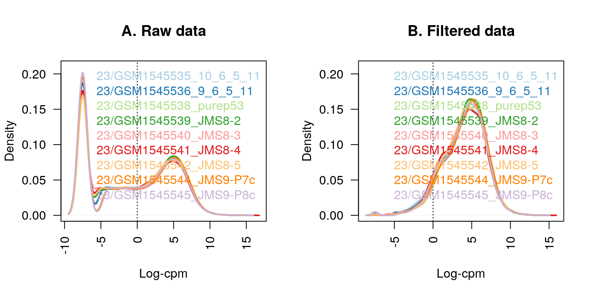
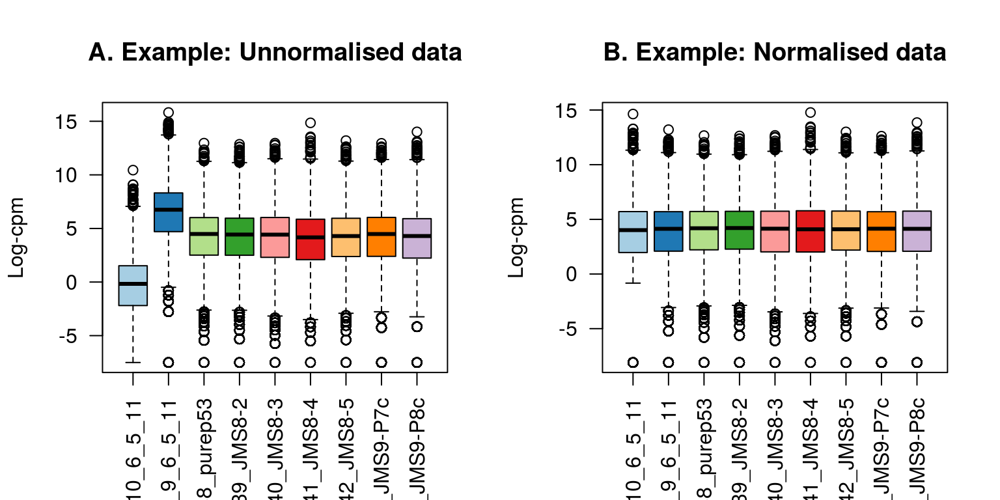
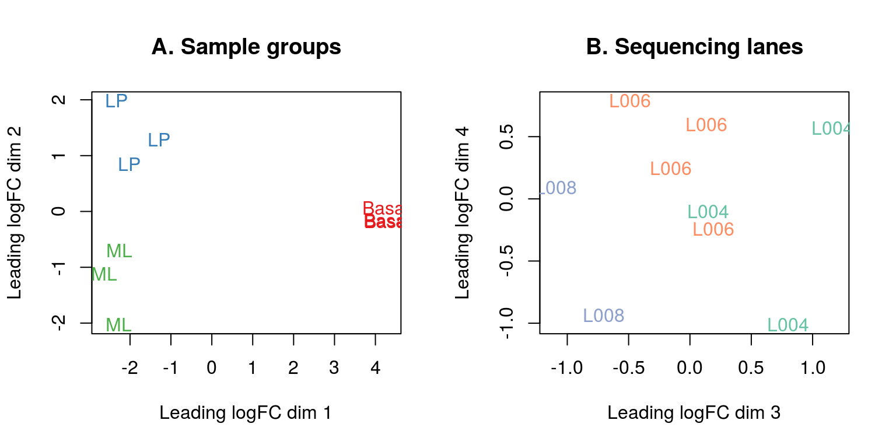
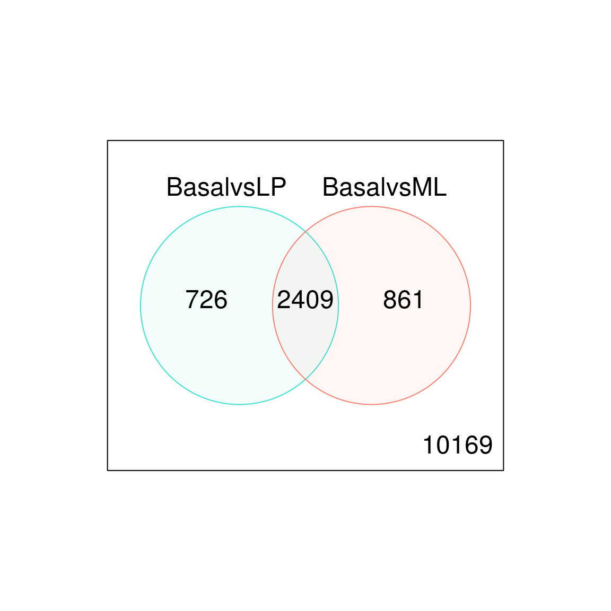

# RNA-seq analysis is easy as 1-2-3 with limma, Glimma and edgeR

## Instructor(s) name(s) and contact information

* Charity Law (law@wehi.edu.au)

## Introduction

RNA-sequencing (RNA-seq) has become the primary technology used for gene expression profiling, with the genome-wide detection of differentially expressed genes between two or more conditions of interest one of the most commonly asked questions by researchers. The **edgeR** and **limma** packages available from the Bioconductor project offer a well-developed suite of statistical methods for dealing with this question for RNA-seq data.

In this article, we describe an **edgeR** - **limma** workflow for analysing RNA-seq data that takes gene-level counts as its input, and moves through pre-processing and exploratory data analysis before obtaining lists of differentially expressed (DE) genes and gene signatures. This analysis is enhanced through the use of interactive graphics from the **Glimma** package, that allows for a more detailed exploration of the data at both the sample and gene-level than is possible using static **R** plots.

The experiment analysed in this workflow is from Sheridan *et al.* (2015) and consists of three cell populations (basal, luminal progenitor (LP) and mature luminal (ML)) sorted from the mammary glands of female virgin mice, each profiled in triplicate. RNA samples were sequenced across three batches on an Illumina HiSeq 2000 to obtain 100 base-pair single-end reads. 
The analysis outlined in this article assumes that reads obtained from an RNA-seq experiment have been aligned to an appropriate reference genome and summarised into counts associated with gene-specific regions. In this instance, reads were aligned to the mouse reference genome (mm10) using the **R** based pipeline available in the **Rsubread** package (specifically the `align` function followed by `featureCounts` for gene-level summarisation based on the in-built *mm10* RefSeq-based annotation).  

Count data for these samples can be downloaded from the Gene Expression Omnibus (GEO) [http://www.ncbi.nlm.nih.gov/geo/](http://www.ncbi.nlm.nih.gov/geo/) using GEO Series accession number GSE63310. Further information on experimental design and sample preparation is also available from GEO under this accession number.


```r
library(limma)
library(Glimma)
library(edgeR)
library(Mus.musculus)
#> Loading required package: AnnotationDbi
#> Loading required package: stats4
#> Loading required package: BiocGenerics
#> Loading required package: parallel
#> 
#> Attaching package: 'BiocGenerics'
#> The following objects are masked from 'package:parallel':
#> 
#>     clusterApply, clusterApplyLB, clusterCall, clusterEvalQ,
#>     clusterExport, clusterMap, parApply, parCapply, parLapply,
#>     parLapplyLB, parRapply, parSapply, parSapplyLB
#> The following object is masked from 'package:limma':
#> 
#>     plotMA
#> The following objects are masked from 'package:stats':
#> 
#>     IQR, mad, sd, var, xtabs
#> The following objects are masked from 'package:base':
#> 
#>     anyDuplicated, append, as.data.frame, basename, cbind,
#>     colMeans, colnames, colSums, dirname, do.call, duplicated,
#>     eval, evalq, Filter, Find, get, grep, grepl, intersect,
#>     is.unsorted, lapply, lengths, Map, mapply, match, mget, order,
#>     paste, pmax, pmax.int, pmin, pmin.int, Position, rank, rbind,
#>     Reduce, rowMeans, rownames, rowSums, sapply, setdiff, sort,
#>     table, tapply, union, unique, unsplit, which, which.max,
#>     which.min
#> Loading required package: Biobase
#> Welcome to Bioconductor
#> 
#>     Vignettes contain introductory material; view with
#>     'browseVignettes()'. To cite Bioconductor, see
#>     'citation("Biobase")', and for packages 'citation("pkgname")'.
#> Loading required package: IRanges
#> Loading required package: S4Vectors
#> 
#> Attaching package: 'S4Vectors'
#> The following object is masked from 'package:base':
#> 
#>     expand.grid
#> Loading required package: OrganismDbi
#> Loading required package: GenomicFeatures
#> Loading required package: GenomeInfoDb
#> Loading required package: GenomicRanges
#> Loading required package: GO.db
#> 
#> Loading required package: org.Mm.eg.db
#> 
#> Loading required package: TxDb.Mmusculus.UCSC.mm10.knownGene
```

## Data packaging


```r
dir.create("Law_RNAseq123")
#> Warning in dir.create("Law_RNAseq123"): 'Law_RNAseq123' already exists
setwd("Law_RNAseq123")
url <- "https://www.ncbi.nlm.nih.gov/geo/download/?acc=GSE63310&format=file"
utils::download.file(url, destfile="GSE63310_RAW.tar", mode="wb")
utils::untar("GSE63310_RAW.tar", exdir = ".")

files <- c("GSM1545535_10_6_5_11.txt", "GSM1545536_9_6_5_11.txt",
    "GSM1545538_purep53.txt", "GSM1545539_JMS8-2.txt", "GSM1545540_JMS8-3.txt",
    "GSM1545541_JMS8-4.txt", "GSM1545542_JMS8-5.txt", "GSM1545544_JMS9-P7c.txt",
    "GSM1545545_JMS9-P8c.txt")

for(i in paste(files, ".gz", sep=""))
    R.utils::gunzip(i, overwrite=TRUE)
setwd("..")      
```

### Reading in count-data

To get started with this analysis, download the file *GSE63310_RAW.tar* available online from [https://www.ncbi.nlm.nih.gov/geo/download/?acc=GSE63310&format=file](https://www.ncbi.nlm.nih.gov/geo/download/?acc=GSE63310&format=file), and extract the relevant files from this archive. Each of these text files contains the raw gene-level counts for a given sample. Note that our analysis only includes the basal, LP and ML samples from this experiment (see associated file names below). 


```r
read.delim(file.path("Law_RNAseq123", files[1]), nrow=5)
#>    EntrezID GeneLength Count
#> 1    497097       3634     1
#> 2 100503874       3259     0
#> 3 100038431       1634     0
#> 4     19888       9747     0
#> 5     20671       3130     1
```

Whilst each of the nine text files can be read into **R** separately and combined into a matrix of counts, **edgeR** offers a convenient way to do this in one step using the `readDGE` function. The resulting DGEList-object contains a matrix of counts with 27,179 rows associated with unique Entrez gene identifiers (IDs) and nine columns associated with the individual samples in the experiment.


```r
x <- readDGE(file.path("Law_RNAseq123", files), columns=c(1,3))
class(x)
#> [1] "DGEList"
#> attr(,"package")
#> [1] "edgeR"
dim(x)
#> [1] 27179     9
```

If the counts from all samples were stored in a single file, the data can be read into **R** and then converted into a DGEList-object using the `DGEList` function.

### Organising sample information

For downstream analysis, sample-level information related to the experimental design needs to be associated with the columns of the counts matrix. This should include experimental variables, both biological and technical, that could have an effect on expression levels. Examples include cell type (basal, LP and ML in this experiment), genotype (wild-type, knock-out), phenotype (disease status, sex, age), sample treatment (drug, control) and batch information (date experiment was performed if samples were collected and analysed at distinct time points) to name just a few.

Our DGEList-object contains a `samples` data frame that stores both cell type (or `group`) and batch (sequencing `lane`) information, each of which consists of three distinct levels. Note that within `x$samples`, library sizes are automatically calculated for each sample and normalisation factors are set to 1.
For simplicity, we remove the GEO sample IDs (GSM*) from the column names of our DGEList-object `x`.


```r
samplenames <- substring(colnames(x), 12, nchar(colnames(x)))
samplenames
#> [1] "23/GSM1545535_10_6_5_11" "23/GSM1545536_9_6_5_11" 
#> [3] "23/GSM1545538_purep53"   "23/GSM1545539_JMS8-2"   
#> [5] "23/GSM1545540_JMS8-3"    "23/GSM1545541_JMS8-4"   
#> [7] "23/GSM1545542_JMS8-5"    "23/GSM1545544_JMS9-P7c" 
#> [9] "23/GSM1545545_JMS9-P8c"
colnames(x) <- samplenames
group <- as.factor(c("LP", "ML", "Basal", "Basal", "ML", "LP", 
                     "Basal", "ML", "LP"))
x$samples$group <- group
lane <- as.factor(rep(c("L004","L006","L008"), c(3,4,2)))
x$samples$lane <- lane
x$samples
#>                                                          files group
#> 23/GSM1545535_10_6_5_11 Law_RNAseq123/GSM1545535_10_6_5_11.txt    LP
#> 23/GSM1545536_9_6_5_11   Law_RNAseq123/GSM1545536_9_6_5_11.txt    ML
#> 23/GSM1545538_purep53     Law_RNAseq123/GSM1545538_purep53.txt Basal
#> 23/GSM1545539_JMS8-2       Law_RNAseq123/GSM1545539_JMS8-2.txt Basal
#> 23/GSM1545540_JMS8-3       Law_RNAseq123/GSM1545540_JMS8-3.txt    ML
#> 23/GSM1545541_JMS8-4       Law_RNAseq123/GSM1545541_JMS8-4.txt    LP
#> 23/GSM1545542_JMS8-5       Law_RNAseq123/GSM1545542_JMS8-5.txt Basal
#> 23/GSM1545544_JMS9-P7c   Law_RNAseq123/GSM1545544_JMS9-P7c.txt    ML
#> 23/GSM1545545_JMS9-P8c   Law_RNAseq123/GSM1545545_JMS9-P8c.txt    LP
#>                         lib.size norm.factors lane
#> 23/GSM1545535_10_6_5_11 32863052            1 L004
#> 23/GSM1545536_9_6_5_11  35335491            1 L004
#> 23/GSM1545538_purep53   57160817            1 L004
#> 23/GSM1545539_JMS8-2    51368625            1 L006
#> 23/GSM1545540_JMS8-3    75795034            1 L006
#> 23/GSM1545541_JMS8-4    60517657            1 L006
#> 23/GSM1545542_JMS8-5    55086324            1 L006
#> 23/GSM1545544_JMS9-P7c  21311068            1 L008
#> 23/GSM1545545_JMS9-P8c  19958838            1 L008
```

### Organising gene annotations

A second data frame named `genes` in the DGEList-object is used to store gene-level information associated with rows of the counts matrix.
This information can be retrieved using organism specific packages such as **Mus.musculus** for mouse (or **Homo.sapiens** for human) or the **biomaRt** package which interfaces the Ensembl genome databases in order to perform gene annotation.

The type of information that can be retrieved includes gene symbols, gene names, chromosome names and locations, Entrez gene IDs, Refseq gene IDs and Ensembl gene IDs to name just a few. **biomaRt** primarily works off Ensembl gene IDs, whereas **Mus.musculus** packages information from various sources and allows users to choose between many different gene IDs as the key. 

The Entrez gene IDs available in our dataset were annotated using the **Mus.musculus** package to retrieve associated gene symbols and chromosome information. 


```r
geneid <- rownames(x)
genes <- select(Mus.musculus, keys=geneid, columns=c("SYMBOL", "TXCHROM"), 
                keytype="ENTREZID")
head(genes)
#>    ENTREZID  SYMBOL TXCHROM
#> 1    497097    Xkr4    chr1
#> 2 100503874 Gm19938    <NA>
#> 3 100038431 Gm10568    <NA>
#> 4     19888     Rp1    chr1
#> 5     20671   Sox17    chr1
#> 6     27395  Mrpl15    chr1
```

As with any gene ID, Entrez gene IDs may not map one-to-one to the gene information of interest. It is important to check for duplicated gene IDs and to understand the source of duplication before resolving them. Our gene annotation contains 28 genes that map to multiple chromosomes (e.g. gene Gm1987 is associated with *chr4* and *chr4\_JH584294\_random* and microRNA Mir5098 is associated with *chr2*, *chr5*, *chr8*, *chr11* and *chr17*).
To resolve duplicate gene IDs one could combine all chromosome information from the multi-mapped genes, such that gene Gm1987 would be is assigned to *chr4 and chr4\_JH584294\_random*, or select one of the chromosomes to represent the gene with duplicate annotation. For simplicity we do the latter, keeping only the first occurrence of each gene ID. 


```r
genes <- genes[!duplicated(genes$ENTREZID),]
```

In this example, the gene order is the same in both the annotation and the data object. If this is not the case due to missing and/or rearranged gene IDs, the `match` function can be used to order genes correctly. The data frame of gene annotations is then added to the data object and neatly packaged in a DGEList-object containing raw count data with associated sample information and gene annotations.


```r
x$genes <- genes
x
#> An object of class "DGEList"
#> $samples
#>                                                          files group
#> 23/GSM1545535_10_6_5_11 Law_RNAseq123/GSM1545535_10_6_5_11.txt    LP
#> 23/GSM1545536_9_6_5_11   Law_RNAseq123/GSM1545536_9_6_5_11.txt    ML
#> 23/GSM1545538_purep53     Law_RNAseq123/GSM1545538_purep53.txt Basal
#> 23/GSM1545539_JMS8-2       Law_RNAseq123/GSM1545539_JMS8-2.txt Basal
#> 23/GSM1545540_JMS8-3       Law_RNAseq123/GSM1545540_JMS8-3.txt    ML
#> 23/GSM1545541_JMS8-4       Law_RNAseq123/GSM1545541_JMS8-4.txt    LP
#> 23/GSM1545542_JMS8-5       Law_RNAseq123/GSM1545542_JMS8-5.txt Basal
#> 23/GSM1545544_JMS9-P7c   Law_RNAseq123/GSM1545544_JMS9-P7c.txt    ML
#> 23/GSM1545545_JMS9-P8c   Law_RNAseq123/GSM1545545_JMS9-P8c.txt    LP
#>                         lib.size norm.factors lane
#> 23/GSM1545535_10_6_5_11 32863052            1 L004
#> 23/GSM1545536_9_6_5_11  35335491            1 L004
#> 23/GSM1545538_purep53   57160817            1 L004
#> 23/GSM1545539_JMS8-2    51368625            1 L006
#> 23/GSM1545540_JMS8-3    75795034            1 L006
#> 23/GSM1545541_JMS8-4    60517657            1 L006
#> 23/GSM1545542_JMS8-5    55086324            1 L006
#> 23/GSM1545544_JMS9-P7c  21311068            1 L008
#> 23/GSM1545545_JMS9-P8c  19958838            1 L008
#> 
#> $counts
#>            Samples
#> Tags        23/GSM1545535_10_6_5_11 23/GSM1545536_9_6_5_11
#>   497097                          1                      2
#>   100503874                       0                      0
#>   100038431                       0                      0
#>   19888                           0                      1
#>   20671                           1                      1
#>            Samples
#> Tags        23/GSM1545538_purep53 23/GSM1545539_JMS8-2
#>   497097                      342                  526
#>   100503874                     5                    6
#>   100038431                     0                    0
#>   19888                         0                    0
#>   20671                        76                   40
#>            Samples
#> Tags        23/GSM1545540_JMS8-3 23/GSM1545541_JMS8-4 23/GSM1545542_JMS8-5
#>   497097                       3                    3                  535
#>   100503874                    0                    0                    5
#>   100038431                    0                    0                    1
#>   19888                       17                    2                    0
#>   20671                       33                   14                   98
#>            Samples
#> Tags        23/GSM1545544_JMS9-P7c 23/GSM1545545_JMS9-P8c
#>   497097                         2                      0
#>   100503874                      0                      0
#>   100038431                      0                      0
#>   19888                          1                      0
#>   20671                         18                      8
#> 27174 more rows ...
#> 
#> $genes
#>    ENTREZID  SYMBOL TXCHROM
#> 1    497097    Xkr4    chr1
#> 2 100503874 Gm19938    <NA>
#> 3 100038431 Gm10568    <NA>
#> 4     19888     Rp1    chr1
#> 5     20671   Sox17    chr1
#> 27174 more rows ...
```

## Data pre-processing

### Transformations from the raw-scale

For differential expression and related analyses, gene expression is rarely considered at the level of raw counts since libraries sequenced at a greater depth will result in higher counts. Rather, it is common practice to transform raw counts onto a scale that accounts for such library size differences. Popular transformations include counts per million (CPM), log2-counts per million (log-CPM), reads per kilobase of transcript per million (RPKM), and fragments per kilobase of transcript per million (FPKM).

In our analyses, CPM and log-CPM transformations are used regularly although they do not account for feature length differences which RPKM and FPKM values do. Whilst RPKM and FPKM values can just as well be used, CPM and log-CPM values can be calculated using a counts matrix alone and will suffice for the type of comparisons we are interested in. Assuming that there are no differences in isoform usage between conditions, differential expression analyses look at gene expression changes between conditions rather than comparing expression across multiple genes or drawing conclusions on absolute levels of expression. In other words, gene lengths remain constant for comparisons of interest and any observed differences are a result of changes in condition rather than changes in gene length. 

Here raw counts are converted to CPM and log-CPM values using the `cpm` function in **edgeR**, where log-transformations use a prior count of 0.25 to avoid taking the log of zero.  RPKM values are just as easily calculated as CPM values using the `rpkm` function in **edgeR** if gene lengths are available. 


```r
cpm <- cpm(x)
lcpm <- cpm(x, log=TRUE)
```

### Removing genes that are lowly expressed

All datasets will include a mix of genes that are expressed and those that are not expressed. Whilst it is of interest to examine genes that are expressed in one condition but not in another, some genes are unexpressed throughout all samples. In fact, 19% of genes in this dataset have zero counts across all nine samples.


```r
table(rowSums(x$counts==0)==9)
#> 
#> FALSE  TRUE 
#> 22026  5153
```

Genes that are not expressed at a biologically meaningful level in any condition should be discarded to reduce the subset of genes to those that are of interest, and to reduce the number of tests carried out downstream when looking at differential expression.
Upon examination of log-CPM values, it can be seen that a large proportion of genes within each sample is unexpressed or lowly-expressed (shown in panel A of the next figure). Using a nominal CPM value of 1 (which is equivalent to a log-CPM value of 0) genes are deemed to be expressed if their expression is above this threshold, and unexpressed otherwise. Genes must be expressed in at least one group (or in at least three samples across the entire experiment) to be kept for downstream analysis. 

Although any sensible value can be used as the expression cutoff, typically a CPM value of 1 is used in our analyses as it separates expressed genes from unexpressed genes well for most datasets. Here, a CPM value of 1 means that a gene is *expressed* if it has at least 20 counts in the sample with the lowest sequencing depth (JMS9-P8c, library size approx. 20 million) or at least 76 counts in the sample with the greatest sequencing depth (JMS8-3, library size approx. 76 million). If sequence reads are summarised by exons rather than genes and/or experiments have low sequencing depth, a lower CPM cutoff may be considered.


```r
keep.exprs <- rowSums(cpm>1)>=3
x <- x[keep.exprs,, keep.lib.sizes=FALSE]
dim(x)
#> [1] 14165     9
```

Using this criterion, the number of genes is reduced to approximately half the number that we started with (14,165 genes, panel B of the next figure). Note that subsetting the entire DGEList-object removes both the counts as well as the associated gene information. Code to produce the figure is given below.


```r
library(RColorBrewer)
nsamples <- ncol(x)
col <- brewer.pal(nsamples, "Paired")
par(mfrow=c(1,2))
plot(density(lcpm[,1]), col=col[1], lwd=2, ylim=c(0,0.21), las=2, 
     main="", xlab="")
title(main="A. Raw data", xlab="Log-cpm")
abline(v=0, lty=3)
for (i in 2:nsamples){
 den <- density(lcpm[,i])
 lines(den$x, den$y, col=col[i], lwd=2)
}
legend("topright", samplenames, text.col=col, bty="n")
lcpm <- cpm(x, log=TRUE)
plot(density(lcpm[,1]), col=col[1], lwd=2, ylim=c(0,0.21), las=2, 
     main="", xlab="")
title(main="B. Filtered data", xlab="Log-cpm")
abline(v=0, lty=3)
for (i in 2:nsamples){
   den <- density(lcpm[,i])
   lines(den$x, den$y, col=col[i], lwd=2)
}
legend("topright", samplenames, text.col=col, bty="n")
```

<div class="figure">

<p class="caption">(\#fig:filterplot1)The density of log-CPM values for raw pre-filtered data (A) and post-filtered data (B) are shown for each sample. Dotted vertical lines mark the log-CPM of zero threshold (equivalent to a CPM value of 1) used in the filtering step.</p>
</div>

### Normalising gene expression distributions
During the sample preparation or sequencing process, external factors that are not of biological interest can affect the expression of individual samples. For example, samples processed in the first batch of an experiment can have higher expression overall when compared to samples processed in a second batch. It is assumed that all samples should have a similar range and distribution of expression values. Normalisation is required to ensure that the expression distributions of each sample are similar across the entire experiment. 

Any plot showing the per sample expression distributions, such as a density or boxplot, is useful in determining whether any samples are dissimilar to others. Distributions of log-CPM values are similar throughout all samples within this dataset (panel B of the figure above).   

Nonetheless, normalisation by the method of trimmed mean of M-values (TMM) is performed using the `calcNormFactors` function in **edgeR**. The normalisation factors calculated here are used as a scaling factor for the library sizes. When working with DGEList-objects, these normalisation factors are automatically stored in `x$samples$norm.factors`. For this dataset the effect of TMM-normalisation is mild, as evident in the magnitude of the scaling factors, which are all relatively close to 1. 


```r
x <- calcNormFactors(x, method = "TMM")
x$samples$norm.factors
#> [1] 0.8957309 1.0349196 1.0439552 1.0405040 1.0323599 0.9223424 0.9836603
#> [8] 1.0827381 0.9792607
```

To give a better visual representation of the effects of normalisation, the data was duplicated then adjusted so that the counts of the first sample are reduced to 5% of their original values, and in the second sample they are inflated to be 5-times larger. 


```r
x2 <- x
x2$samples$norm.factors <- 1
x2$counts[,1] <- ceiling(x2$counts[,1]*0.05)
x2$counts[,2] <- x2$counts[,2]*5
```

The figure below shows the expression distribution of samples for unnormalised and normalised data, where distributions are noticeably different pre-normalisation and are similar post-normalisation. Here the first sample has a small TMM scaling factor of 0.05, whereas the second sample has a large scaling factor of 6.13 -- neither values are close to 1.


```r
par(mfrow=c(1,2))
lcpm <- cpm(x2, log=TRUE)
boxplot(lcpm, las=2, col=col, main="")
title(main="A. Example: Unnormalised data",ylab="Log-cpm")
x2 <- calcNormFactors(x2)  
x2$samples$norm.factors
#> [1] 0.05472223 6.13059440 1.22927355 1.17051887 1.21487709 1.05622968
#> [7] 1.14587663 1.26129350 1.11702264
lcpm <- cpm(x2, log=TRUE)
boxplot(lcpm, las=2, col=col, main="")
title(main="B. Example: Normalised data",ylab="Log-cpm")
```

<div class="figure">

<p class="caption">(\#fig:plotmodifieddata)Example data: Boxplots of log-CPM values showing expression distributions for unnormalised data (A) and normalised data (B) for each sample in the modified dataset where the counts in samples 1 and 2 have been scaled to 5% and 500% of their original values respectively.</p>
</div>

### Unsupervised clustering of samples

In our opinion, one of the most important exploratory plots to examine for gene expression analyses is the multi-dimensional scaling (MDS) plot, or similar. The plot shows similarities and dissimilarities between samples in an unsupervised manner so that one can have an idea of the extent to which differential expression can be detected before carrying out formal tests. Ideally, samples would cluster well within the primary condition of interest, and any sample straying far from its group could be identified and followed up for sources of error or extra variation. If present, technical replicates should lie very close to one another. 

Such a plot can be made in **limma** using the `plotMDS` function. The first dimension represents the leading-fold-change that best separates samples and explains the largest proportion of variation in the data, with subsequent dimensions having a smaller effect and being orthogonal to the ones before it. When experimental design involves multiple factors, it is recommended that each factor is examined over several dimensions. If samples cluster by a given factor in any of these dimensions, it suggests that the factor contributes to expression differences and is worth including in the linear modelling. On the other hand, factors that show little or no effect may be left out of downstream analysis.

In this dataset, samples can be seen to cluster well within experimental groups over dimension 1 and 2, and then separate by sequencing lane (sample batch) over dimension 3 (shown in the plot below). Keeping in mind that the first dimension explains the largest proportion of variation in the data, notice that the range of values over the dimensions become smaller as we move to higher dimensions.

Whilst all samples cluster by groups, the largest transcriptional difference is observed between basal and LP, and basal and ML over dimension 1. For this reason, it is expected that pairwise comparisons between cell populations will result in a greater number of DE genes for comparisons involving basal samples, and relatively small numbers of DE genes when comparing ML to LP. In other datasets, samples that do not cluster by their groups of interest may also show little or no evidence of differential expression in the downstream analysis. 

To create the MDS plots, different colour groupings are assigned to factors of interest. Dimensions 1 and 2 are examined using the color grouping defined by cell types. 

Dimensions 3 and 4 are examined using the colour grouping defined by sequencing lanes (batch).


```r
lcpm <- cpm(x, log=TRUE)
par(mfrow=c(1,2))
col.group <- group
levels(col.group) <-  brewer.pal(nlevels(col.group), "Set1")
col.group <- as.character(col.group)
col.lane <- lane
levels(col.lane) <-  brewer.pal(nlevels(col.lane), "Set2")
col.lane <- as.character(col.lane)
plotMDS(lcpm, labels=group, col=col.group)
title(main="A. Sample groups")
plotMDS(lcpm, labels=lane, col=col.lane, dim=c(3,4))
title(main="B. Sequencing lanes")
```

<div class="figure">

<p class="caption">(\#fig:MDS1)MDS plots of log-CPM values over dimensions 1 and 2 with samples coloured and labeled by sample groups (A) and over dimensions 3 and 4 with samples coloured and labeled by sequencing lane (B). Distances on the plot correspond to the leading fold-change, which is the average (root-mean-square) log2-fold-change for the 500 genes most divergent between each pair of samples by default.</p>
</div>

Alternatively, the **Glimma** package offers the convenience of an interactive MDS plot where multiple dimensions can be explored. The `glMDSPlot` function generates an html page (that is opened in a browser if `launch=TRUE`) with an MDS plot in the left panel and a barplot showing the proportion of variation explained by each dimension in the right panel. Clicking on the bars of the bar plot changes the pair of dimensions plotted in the MDS plot, and hovering over the individual points reveals the sample label. The colour scheme can be changed as well to highlight cell population or sequencing lane (batch). An interactive MDS plot of this dataset can be found at [http://bioinf.wehi.edu.au/folders/limmaWorkflow/glimma-plots/MDS-Plot.html](http://bioinf.wehi.edu.au/folders/limmaWorkflow/glimma-plots/MDS-Plot.html). 


```r
glMDSPlot(lcpm, labels=paste(group, lane, sep="_"), 
          groups=x$samples[,c(2,5)], launch=FALSE)
```

## Differential expression analysis

### Creating a design matrix and contrasts

In this study, it is of interest to see which genes are expressed at different levels between the three cell populations profiled. In our analysis, linear models are fitted to the data with the assumption that the underlying data is normally distributed. To get started, a design matrix is set up with both the cell population and sequencing lane (batch) information.


```r
design <- model.matrix(~0+group+lane)
colnames(design) <- gsub("group", "", colnames(design))
design
#>   Basal LP ML laneL006 laneL008
#> 1     0  1  0        0        0
#> 2     0  0  1        0        0
#> 3     1  0  0        0        0
#> 4     1  0  0        1        0
#> 5     0  0  1        1        0
#> 6     0  1  0        1        0
#> 7     1  0  0        1        0
#> 8     0  0  1        0        1
#> 9     0  1  0        0        1
#> attr(,"assign")
#> [1] 1 1 1 2 2
#> attr(,"contrasts")
#> attr(,"contrasts")$group
#> [1] "contr.treatment"
#> 
#> attr(,"contrasts")$lane
#> [1] "contr.treatment"
```

For a given experiment, there are usually several equivalent ways to set up an appropriate design matrix. 
For example, `~0+group+lane` removes the intercept from the first factor, `group`, but an intercept remains in the second factor `lane`. 
Alternatively, `~group+lane` could be used to keep the intercepts in both `group` and `lane`. 
Understanding how to interpret the coefficients estimated in a given model is key here. 
We choose the first model for our analysis, as setting up model contrasts is more straight forward in the absence of an intercept for `group`. Contrasts for pairwise comparisons between cell populations are set up in **limma** using the `makeContrasts` function. 


```r
contr.matrix <- makeContrasts(
   BasalvsLP = Basal-LP, 
   BasalvsML = Basal - ML, 
   LPvsML = LP - ML, 
   levels = colnames(design))
contr.matrix
#>           Contrasts
#> Levels     BasalvsLP BasalvsML LPvsML
#>   Basal            1         1      0
#>   LP              -1         0      1
#>   ML               0        -1     -1
#>   laneL006         0         0      0
#>   laneL008         0         0      0
```

A key strength of **limma**'s linear modelling approach, is the ability accommodate arbitrary experimental complexity. Simple designs, such as the one in this workflow, with cell type and batch, through to more complicated factorial designs and models with interaction terms can be handled relatively easily. Where experimental or technical effects can be modelled using a random effect, another possibility in **limma** is to estimate correlations using `duplicateCorrelation` by specifying a `block` argument for both this function and in the `lmFit` linear modelling step.

### Removing heteroscedascity from count data

It has been shown that for RNA-seq count data, the variance is not independent of the mean -- this is true of raw counts or when transformed to log-CPM values. Methods that model counts using a Negative Binomial distribution assume a quadratic mean-variance relationship. In **limma**, linear modelling is carried out on the log-CPM values which are assumed to be normally distributed and the mean-variance relationship is accommodated using precision weights calculated by the `voom` function.

When operating on a DGEList-object, `voom` converts raw counts to log-CPM values by automatically extracting library sizes and normalisation factors from `x` itself. Additional normalisation to log-CPM values can be specified within `voom` using the `normalize.method` argument.

The mean-variance relationship of log-CPM values for this dataset is shown in the left-hand panel of the next figure. Typically, the *voom-plot* shows a decreasing trend between the means and variances resulting from a combination of technical variation in the sequencing experiment and biological variation amongst the replicate samples from different cell populations.
Experiments with high biological variation usually result in flatter trends, where variance values plateau at high expression values. 
Experiments with low biological variation tend to result in sharp decreasing trends. 

Moreover, the voom-plot provides a visual check on the level of filtering performed upstream. If filtering of lowly-expressed genes is insufficient, a drop in variance levels can be observed at the low end of the expression scale due to very small counts. If this is observed, one should return to the earlier filtering step and increase the expression threshold applied to the dataset.

Where sample-level variation is evident from earlier inspections of the MDS plot, the `voomWithQualityWeights` function can be used to simultaneously incorporate sample-level weights together with the abundance dependent weights estimated by `voom`. For an example of this, see Liu *et al.* (2016).


```r
par(mfrow=c(1,2))
v <- voom(x, design, plot=TRUE)
v
#> An object of class "EList"
#> $genes
#>    ENTREZID SYMBOL TXCHROM
#> 1    497097   Xkr4    chr1
#> 6     27395 Mrpl15    chr1
#> 7     18777 Lypla1    chr1
#> 9     21399  Tcea1    chr1
#> 10    58175  Rgs20    chr1
#> 14160 more rows ...
#> 
#> $targets
#>                                                          files group
#> 23/GSM1545535_10_6_5_11 Law_RNAseq123/GSM1545535_10_6_5_11.txt    LP
#> 23/GSM1545536_9_6_5_11   Law_RNAseq123/GSM1545536_9_6_5_11.txt    ML
#> 23/GSM1545538_purep53     Law_RNAseq123/GSM1545538_purep53.txt Basal
#> 23/GSM1545539_JMS8-2       Law_RNAseq123/GSM1545539_JMS8-2.txt Basal
#> 23/GSM1545540_JMS8-3       Law_RNAseq123/GSM1545540_JMS8-3.txt    ML
#> 23/GSM1545541_JMS8-4       Law_RNAseq123/GSM1545541_JMS8-4.txt    LP
#> 23/GSM1545542_JMS8-5       Law_RNAseq123/GSM1545542_JMS8-5.txt Basal
#> 23/GSM1545544_JMS9-P7c   Law_RNAseq123/GSM1545544_JMS9-P7c.txt    ML
#> 23/GSM1545545_JMS9-P8c   Law_RNAseq123/GSM1545545_JMS9-P8c.txt    LP
#>                         lib.size norm.factors lane
#> 23/GSM1545535_10_6_5_11 29409426    0.8957309 L004
#> 23/GSM1545536_9_6_5_11  36528591    1.0349196 L004
#> 23/GSM1545538_purep53   59598629    1.0439552 L004
#> 23/GSM1545539_JMS8-2    53382070    1.0405040 L006
#> 23/GSM1545540_JMS8-3    78175314    1.0323599 L006
#> 23/GSM1545541_JMS8-4    55762781    0.9223424 L006
#> 23/GSM1545542_JMS8-5    54115150    0.9836603 L006
#> 23/GSM1545544_JMS9-P7c  23043111    1.0827381 L008
#> 23/GSM1545545_JMS9-P8c  19525423    0.9792607 L008
#> 
#> $E
#>         Samples
#> Tags     23/GSM1545535_10_6_5_11 23/GSM1545536_9_6_5_11
#>   497097               -4.293244              -3.869026
#>   27395                 3.875010               4.400568
#>   18777                 4.707695               5.559334
#>   21399                 4.784462               4.741999
#>   58175                 3.943567               3.294875
#>         Samples
#> Tags     23/GSM1545538_purep53 23/GSM1545539_JMS8-2 23/GSM1545540_JMS8-3
#>   497097              2.522753             3.302006            -4.481286
#>   27395               4.521172             4.570624             4.322845
#>   18777               5.400569             5.171235             5.627798
#>   21399               5.374548             5.130925             4.848030
#>   58175              -1.767924            -1.880302             2.993289
#>         Samples
#> Tags     23/GSM1545541_JMS8-4 23/GSM1545542_JMS8-5 23/GSM1545544_JMS9-P7c
#>   497097            -3.993876             3.306782              -3.204336
#>   27395              3.786547             3.918878               4.345642
#>   18777              5.081794             5.080061               5.757404
#>   21399              4.944024             5.158292               5.036933
#>   58175              3.357379            -2.114104               3.142621
#>         Samples
#> Tags     23/GSM1545545_JMS9-P8c
#>   497097              -5.287282
#>   27395                4.132678
#>   18777                5.150470
#>   21399                4.987679
#>   58175                3.523290
#> 14160 more rows ...
#> 
#> $weights
#>           [,1]      [,2]      [,3]     [,4]      [,5]      [,6]      [,7]
#> [1,]  1.183974  1.183974 20.526779 20.97747  1.773562  1.217142 21.125740
#> [2,] 20.879554 26.561871 31.596323 29.66102 32.558344 26.745293 29.792090
#> [3,] 28.003202 33.695540 34.845507 34.45673 35.148529 33.550527 34.517259
#> [4,] 27.670233 29.595778 34.901302 34.43298 34.841349 33.159425 34.493456
#> [5,] 19.737381 18.658333  3.184207  2.62986 24.191635 24.014937  2.648747
#>           [,8]      [,9]
#> [1,]  1.183974  1.183974
#> [2,] 21.900102 17.150677
#> [3,] 31.440457 25.228325
#> [4,] 26.136796 24.502247
#> [5,] 13.149278 14.351930
#> 14160 more rows ...
#> 
#> $design
#>   Basal LP ML laneL006 laneL008
#> 1     0  1  0        0        0
#> 2     0  0  1        0        0
#> 3     1  0  0        0        0
#> 4     1  0  0        1        0
#> 5     0  0  1        1        0
#> 6     0  1  0        1        0
#> 7     1  0  0        1        0
#> 8     0  0  1        0        1
#> 9     0  1  0        0        1
#> attr(,"assign")
#> [1] 1 1 1 2 2
#> attr(,"contrasts")
#> attr(,"contrasts")$group
#> [1] "contr.treatment"
#> 
#> attr(,"contrasts")$lane
#> [1] "contr.treatment"
vfit <- lmFit(v, design)
vfit <- contrasts.fit(vfit, contrasts=contr.matrix)
efit <- eBayes(vfit)
plotSA(efit, main="Final model: Mean−variance trend")
```


Note that the other data frames stored within the DGEList-object that contain gene- and sample-level information, are retained in the EList-object `v` created by `voom`. The `v$genes` data frame is equivalent to `x$genes`, `v$targets` is equivalent to `x$samples`, and the expression values stored in `v$E` is analogous to `x$counts`, albeit on a transformed scale. In addition to this, the `voom` EList-object has a matrix of precision weights `v$weights` and stores the design matrix in `v$design`.

### Fitting linear models for comparisons of interest

Linear modelling in **limma** is carried out using the `lmFit` and `contrasts.fit` functions originally written for application to microarrays. The functions can be used for both microarray and RNA-seq data and fit a separate model to the expression values for each gene. Next, empirical Bayes moderation is carried out by borrowing information across all the genes to obtain more precise estimates of gene-wise variability. The model's residual variances are plotted against average expression values in the next figure. It can be seen from this plot that the variance is no longer dependent on the mean expression level.

### Examining the number of DE genes

For a quick look at differential expression levels, the number of significantly up- and down-regulated genes can be summarised in a table. Significance is defined using an adjusted *p*-value cutoff that is set at 5% by default. For the comparison between expression levels in basal and LP, 4,127 genes are found to be down-regulated in basal relative to LP and 4,298 genes are up-regulated in basal relative to LP -- a total of 8,425 DE genes. A total of 8,510 DE genes are found between basal and ML (4,338 down- and 4,172 up-regulated genes), and a total of 5,340 DE genes are found between LP and ML (2,895 down- and 2,445 up-regulated). The larger numbers of DE genes observed for comparisons involving the basal population are consistent with our observations from the MDS plots.


```r
summary(decideTests(efit))
#>        BasalvsLP BasalvsML LPvsML
#> Down        4127      4338   2895
#> NotSig      5740      5655   8825
#> Up          4298      4172   2445
```

Some studies require more than an adjusted *p*-value cut-off. For a stricter definition on significance, one may require log-fold-changes (log-FCs) to be above a minimum value. The *treat* method can be used to calculate *p*-values from empirical Bayes moderated *t*-statistics with a minimum log-FC requirement. The number of differentially expressed genes are reduced to a total of 3,135 DE genes for basal versus LP, 3,270 DE genes for basal versus ML, and 385 DE genes for LP versus ML when testing requires genes to have a log-FC that is significantly greater than 1 (equivalent to a 2-fold difference between cell types on the original scale).


```r
tfit <- treat(vfit, lfc=1)
dt <- decideTests(tfit)
summary(dt)
#>        BasalvsLP BasalvsML LPvsML
#> Down        1417      1512    203
#> NotSig     11030     10895  13780
#> Up          1718      1758    182
```

Genes that are DE in multiple comparisons can be extracted using the results from `decideTests`, where 0s represent genes that are not DE, 1s represent genes that are up-regulated, and -1s represent genes that are down-regulated. A total of 2,409 genes are DE in both basal versus LP and basal versus ML, twenty of which are listed below. The `write.fit` function can be used to extract and write results for all three comparisons to a single output file. 


```r
de.common <- which(dt[,1]!=0 & dt[,2]!=0)
length(de.common)
#> [1] 2409
head(tfit$genes$SYMBOL[de.common], n=20)
#>  [1] "Xkr4"          "Rgs20"         "Cpa6"          "Sulf1"        
#>  [5] "Eya1"          "Msc"           "Sbspon"        "Pi15"         
#>  [9] "Crispld1"      "Kcnq5"         "Ptpn18"        "Arhgef4"      
#> [13] "2010300C02Rik" "Aff3"          "Npas2"         "Tbc1d8"       
#> [17] "Creg2"         "Il1r1"         "Il18r1"        "Il18rap"
vennDiagram(dt[,1:2], circle.col=c("turquoise", "salmon"))
```

<div class="figure">

<p class="caption">(\#fig:venn)Venn diagram showing the number of genes DE in the comparison between basal versus LP only (left), basal versus ML only (right), and the number of genes that are DE in both comparisons (center). The number of genes that are not DE in either comparison are marked in the bottom-right.</p>
</div>

```r
write.fit(tfit, dt, file="results.txt")
```

### Examining individual DE genes from top to bottom

The top DE genes can be listed using `topTreat` for results using `treat` (or `topTable` for results using `eBayes`). By default `topTreat` arranges genes from smallest to largest adjusted *p*-value with associated gene information, log-FC, average log-CPM, moderated *t*-statistic, raw and adjusted *p*-value for each gene. The number of top genes displayed can be specified, where `n=Inf` includes all genes. Genes *Cldn7* and *Rasef* are amongst the top DE genes for both basal versus LP and basal versus ML.


```r
basal.vs.lp <- topTreat(tfit, coef=1, n=Inf)
basal.vs.ml <- topTreat(tfit, coef=2, n=Inf)
head(basal.vs.lp)
#>        ENTREZID SYMBOL TXCHROM     logFC  AveExpr         t      P.Value
#> 12759     12759    Clu   chr14 -5.442877 8.857907 -33.44429 3.990899e-10
#> 53624     53624  Cldn7   chr11 -5.514605 6.296762 -32.94533 4.503694e-10
#> 242505   242505  Rasef    chr4 -5.921741 5.119585 -31.77625 6.063249e-10
#> 67451     67451   Pkp2   chr16 -5.724823 4.420495 -30.65370 8.010456e-10
#> 228543   228543   Rhov    chr2 -6.253427 5.486640 -29.46244 1.112729e-09
#> 70350     70350  Basp1   chr15 -6.073297 5.248349 -28.64890 1.380545e-09
#>           adj.P.Val
#> 12759  2.703871e-06
#> 53624  2.703871e-06
#> 242505 2.703871e-06
#> 67451  2.703871e-06
#> 228543 2.703871e-06
#> 70350  2.703871e-06
head(basal.vs.ml)
#>        ENTREZID  SYMBOL TXCHROM     logFC  AveExpr         t      P.Value
#> 242505   242505   Rasef    chr4 -6.510470 5.119585 -35.49093 2.573575e-10
#> 53624     53624   Cldn7   chr11 -5.469160 6.296762 -32.52520 4.978446e-10
#> 12521     12521    Cd82    chr2 -4.667737 7.070963 -31.82187 5.796191e-10
#> 71740     71740 Nectin4    chr1 -5.556046 5.166292 -31.29987 6.760578e-10
#> 20661     20661   Sort1    chr3 -4.908119 6.705784 -31.23083 6.761331e-10
#> 15375     15375   Foxa1   chr12 -5.753884 5.625064 -28.34612 1.487280e-09
#>           adj.P.Val
#> 242505 1.915485e-06
#> 53624  1.915485e-06
#> 12521  1.915485e-06
#> 71740  1.915485e-06
#> 20661  1.915485e-06
#> 15375  2.281914e-06
```

### Useful graphical representations of differential expression results

To summarise results for all genes visually, mean-difference plots, which display log-FCs from the linear model fit against the average log-CPM values can be generated using the `plotMD` function, with the differentially expressed genes highlighted. 


```r
plotMD(tfit, column=1, status=dt[,1], main=colnames(tfit)[1], 
       xlim=c(-8,13))
```

**Glimma** extends this functionality by providing an interactive mean-difference plot via the `glMDPlot` function. 
The output of this function is an html page, with summarised results in the left panel (similar to what is output by `plotMD`), and the log-CPM values from individual samples in the right panel, with a table of results below the plots.
This interactive display allows the user to search for particular genes based on their Gene symbol, which is not possible in a static **R** plot. 
The `glMDPlot` function is not limited to mean-difference plots, with a default version allowing a data frame to be passed with the user able to select the columns of interest to plot in the left panel. 


```r
glMDPlot(tfit, coef=1, status=dt, main=colnames(tfit)[1],
         side.main="ENTREZID", counts=x$counts, groups=group, launch=FALSE)
```

The mean-difference plot generated by the command above is available online (see  [http://bioinf.wehi.edu.au/folders/limmaWorkflow/glimma-plots/MD-Plot.html](http://bioinf.wehi.edu.au/folders/limmaWorkflow/glimma-plots/MD-Plot.html)). 
The interactivity provided by the **Glimma** package allows additional information to be presented in a single graphical window. 
**Glimma** is implemented in **R** and Javascript, with the **R** code generating the data which is converted into graphics using the Javascript library D3 ([https://d3js.org](https://d3js.org)), with the Bootstrap library handling layouts and Datatables generating the interactive searchable tables. 
This allows plots to be viewed in any modern browser, which is convenient for including them as linked files from an Rmarkdown report of the analysis.

Plots shown previously include either all of the genes that are expressed in any one condition (such as the Venn diagram of common DE genes or mean-difference plot) or look at genes individually (log-CPM values shown in right panel of the interactive mean-difference plot). Heatmaps allow users to look at the expression of a subset of genes. This can be give useful insight into the expression of individual groups and samples without losing perspective of the overall study when focusing on individual genes, or losing resolution when examining patterns averaged over thousands of genes at the same time.

A heatmap is created for the top 100 DE genes (as ranked by adjusted p-value) from the basal versus LP contrast using the `heatmap.2` function from the **gplots** package. The heatmap correctly clusters samples into cell type and rearranges the order of genes to form blocks of similar expression. From the heatmap, we observe that the expression of ML and LP samples are very similar for the top 100 DE genes between basal and LP.


```r
library(gplots)
basal.vs.lp.topgenes <- basal.vs.lp$ENTREZID[1:100]
i <- which(v$genes$ENTREZID %in% basal.vs.lp.topgenes)
mycol <- colorpanel(1000,"blue","white","red")
heatmap.2(v$E[i,], scale="row",
   labRow=v$genes$SYMBOL[i], labCol=group, 
   col=mycol, trace="none", density.info="none", 
   margin=c(8,6), lhei=c(2,10), dendrogram="column")
```

<div class="figure">

<p class="caption">(\#fig:heatmap)Heatmap of log-CPM values for top 100 genes DE in basal versus LP. Expression across each gene (or row) have been scaled so that mean expression is zero and standard deviation is one. Samples with relatively high expression of a given gene are marked in red and samples with relatively low expression are marked in blue. Lighter shades and white represent genes with intermediate expression levels. Samples and genes have been reordered by the method of hierarchical clustering. A dendrogram is shown for the sample clustering.</p>
</div>
