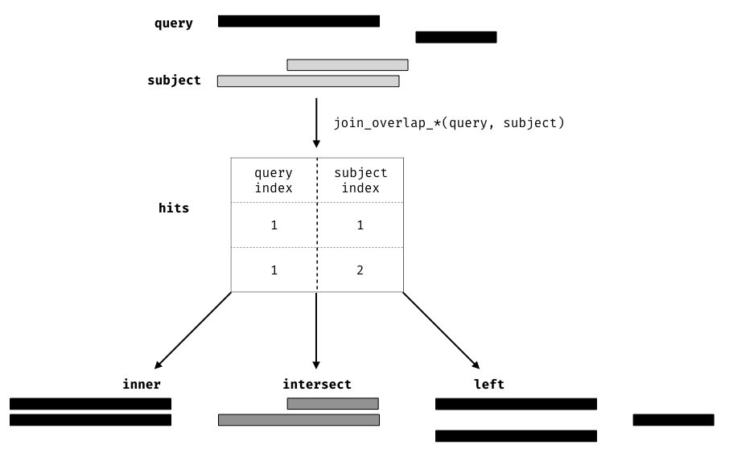

# Fluent genomic data analysis with plyranges

## Instructor(s) name(s) and contact information

* Stuart Lee (lee.s@wehi.edu.au)
* Michael Lawrence (lawremi@gmail.com)

## Workshop Description

In this workshop, we will give an overview of how to perform low-level
analyses of genomic data using the  grammar of genomic data transformation
defined in the plyranges package. We will cover:

- introduction to GRanges
- overview of the core verbs for arithmetic, restriction, and aggregation of GRanges objects
- performing joins between GRanges objects
- designing pipelines to quickly explore data from AnnotationHub
- reading BAM and other file types as GRanges objects

The workshop will be a computer lab, in which the participants will be able to 
ask questions and interact with the instructors.

### Pre-requisites

This workshop is mostly self-contained however familiarity with the following would be useful:

- plyranges [vignette](https://sa-lee.github.io/plyranges/articles/an-introduction.html)
- the GenomicRanges and IRanges packages
- tidyverse approaches to data analysis

 
### Workshop Participation

Students will work through an Rmarkdown document while the instructors respond 
to any questions they have.

### _R_ / _Bioconductor_ packages used

- plyranges
- AnnotationHub
- GenomicRanges
- IRanges
- S4Vectors

### Time outline


| Activity                     | Time |
|------------------------------|------|
| Overview of GRanges          | 5m   |
| The plyranges grammar        | 20m  |
| I/O and data pipelines       | 20m  |

## Workshop goals and objectives

### Learning goals

* Understand that GRanges follows tidy data principles
* Apply the plyranges grammar to genomic data analysis

### Learning objectives

* Use AnnotationHub to find and summarise data
* Read files into R as GRanges objects
* Perform coverage analysis 
* Build data pipelines for analysis based on GRanges

# Workshop

```{r setup}
knitr::opts_chunk$set(message = FALSE, 
                      warning = FALSE, 
                      fig.width = 5, 
                      fig.height = 3, 
                      fig.align = "center",
                      fig.path = "./Lee_Plyranges/")

```    

## Introduction 

### What is plyranges?

The plyranges package is a domain specific language (DSL) built on top of the 
IRanges and GenomicRanges packages. It is designed to quickly and coherently 
analyse genomic data in the form of GRanges objects (more on those later!) and 
from a wide variety of genomic data file types. For users who are familiar with 
the tidyverse, the grammar that plyranges implements will look familiar but with
a few modifications for genomic specific tasks.

### Why use plyranges?

The grammar that plyranges develops is helpful for reasoning
about genomics data analysis, and provides a way of developing 
short readable analysis pipelines. We have tried to emphasise consistency 
and code readability.

One of the goals of plyranges is to provide an alternative entry point 
to analysing genomics data with Bioconductor, especially for R beginners and 
R users who are more familiar with the tidyverse approach to data analysis. 
As a result, we have deemphasised the use of more complicated data structures 
provided by core Bioconductor packages that are useful for programming with.

### Who is this workshop for?

This workshop is intended for new users of Bioconductor, users who are
interested to learn about grammar based approaches for data analysis,
and users who are interested in learning how to use R to perform analyses
like those available in the command line packages BEDTools and deeptools.

If that's you, let's begin!

## Setup

To participate in this workshop you'll need to have R >= 3.5 and install
the plyranges, AnnotationHub, and airway Bioconductor 3.7 packages. You can achieve this
by installing the BiocManager package from CRAN, loading it then running the
install command:
```{r, eval = FALSE}
install.packages("BiocManager")
library(BiocManager)
install(c("plyranges", "AnnotationHub", "airway"))
```
## What are GRanges objects?


(ref:GRanges): An illustration of a GRanges data object for a single
sample from an RNA-seq experiment. The core components of the object
include a seqname column (representing the chromosome), a ranges column
which consists of start and end coordinates for a genomic region, and a
strand identifier (either positive, negative, or unstranded). Metadata
are included as columns to the right of the dotted line as annotations
(gene\_id) or range level covariates (score).

```{r GRanges, fig.cap="(ref:GRanges)", out.width="\\textwidth"}
knitr::include_graphics("./Lee_Plyranges/GRanges.pdf")
```


The plyranges package is built on the core Bioconductor data structure
GRanges. It is very similar to the base R data.frame but with appropriate
semantics for a genomics experiment: it has fixed columns
for the chromosome, start and end coordinates, and the strand, along
with an arbitrary set of additional columns, consisting of
measurements or metadata specific to the data type or experiment
(figure \@ref(GRanges)).  

GRanges balances flexibility with formal
constraints, so that it is applicable to virtually any genomic
workflow, while also being semantically rich enough to support
high-level operations on genomic ranges. As a core data structure,
GRanges enables interoperability between `plyranges` and the rest of
Bioconductor.

Since a GRanges object is similar to a data.frame, we can use plyranges
to construct a GRanges object from a data.frame. We'll start by supposing we 
have a data.frame of genes from the yeast genome:

```{r}
library(plyranges, quietly = TRUE)
genes <- data.frame(seqnames = "VI", 
                    start = c(3322, 3030, 1437,  5066, 6426, 836),
                    end = c(3846, 3338, 2615, 5521, 7565, 1363),
                    strand = c("-", "-", "-", "+", "+", "+"),
                    gene_id=c("YFL064C", "YFL065C", "YFL066C", 
                              "YFL063W", "YFL062W", "YFL067W"),
                    stringsAsFactors = FALSE)
gr <- as_granges(genes)
gr
```
The `as_granges` method takes a data.frame and allows you to quickly convert
it to a GRanges object (and can you can also specify which columns in the 
data.frame correspond to the columns in the GRanges).

GRanges follows the tidy data principles: it is a rectangular
table corresponding to a single biological context. Each row contains
a single observation and each column is a variable describing the
observations. In the example above, each row corresponds to a single gene, and
each column contains information about those genes. As GRanges are tidy,
we have constructed plyranges to follow and extend the grammar in the R package
dplyr.

## The Grammar

Here we provide a quick overview of the functions avaialble in plyranges
and illustrate their use with some toy examples. In the final section 

### Core verbs

The plyranges grammar is simply a set of verbs that define actions to 
be performed on a GRanges (for a complete list see the appendix). 
Verbs can be composed together using the pipe 
operator, `%>%`, which can be read as 'then'. Here's a simple pipeline: first
we will add two columns, one corresponding to the gene_type and another with
the GC content (which we make up by drawing from a uniform distribution). 
Second we will remove genes if they have a width less than 400bp.

```{r}
set.seed(2018-07-28)
gr2 <- gr %>%
  mutate(gene_type = "ORF",
         gc_content = runif(n())) %>%
  filter(width > 400)
gr2
```

The `mutate()` function is used to add columns, here we've added one column
called gene_type where all values are set to "ORF" (standing for open reading
frame) and another called gc_content with random uniform values. The `n()`
operator returns the number of ranges in GRanges object, but can only
be evaluated inside of one of the plyranges verbs. 

The `filter()` operation returns ranges if the expression evaluates to TRUE. 
Multiple expressions can be composed together and will be evaluated as `&`

```{r}
gr2 %>%
  filter(strand == "+", gc_content > 0.5)
# is the same as using `&`
gr2 %>% 
  filter(strand == "+" & gc_content > 0.5)
# but different from using or '|'
gr2 %>%
  filter(strand == "+" | gc_content > 0.5)
```

Now that we have some measurements over our genes, we are most likely
interested in performing the favourite tasks of a biological data scientist:
taking averages and counting. This is achieved with the `summarise()` verb
which will return a DataFrame object (Why is this the case?).

```{r}
gr2 %>%
  summarise(avg_gc = mean(gc_content), 
            n = n())
```

which isn't very exciting when performed without `summarise()`'s best
friend the `group_by()` operator:

```{r}
gr2 %>%
  group_by(strand) %>%
  summarise(avg_gc = mean(gc_content),
            n = n())

```

The `group_by()` operator causes `plyranges` verbs to behave differently.
Instead of acting on all the ranges in a GRanges object, the verbs act within
each group of ranges defined by the values in the grouping column(s).
The `group_by()` operator does not change the appearance the of a GRanges object
(well for the most part):

```{r}
by_strand <- gr2 %>%
  group_by(strand)
by_strand
```

Now any verb we apply to our grouped GRanges, acts on each partition:

```{r}
by_strand %>%
  filter(n() > 2)
by_strand %>%
  mutate(avg_gc_strand = mean(gc_content))
```

To remove grouping use the `ungroup()` verb:
```{r}
by_strand %>%
  ungroup()
```

Finally, metadata columns can be selected using the `select()` verb:

```{r}
gr2 %>%
  select(gene_id, gene_type)
# is the same as not selecting gc_content
gr2 %>%
  select(-gc_content)
# you can also select by metadata column index
gr2 %>%
  select(1:2)
```

### Verbs specific to GRanges

We have seen how you can perform restriction and aggregation on GRanges,
but what about specific actions for genomics data analysis, like arithmetic,
nearest neighbours or finding overlaps?

#### Arithmetic

Arithmetic operations transform range coordinates, as defined by their
_start_, _end_ and _width_  columns. These three variables are mutually
dependent so we have to take care when modifying them. 
For example, changing the _width_ column needs to change
either the _start_, _end_ or both to preserve integrity of the
GRanges:

```{r}
# by default setting width will fix the starting coordinate
gr %>%
  mutate(width = width + 1)
```

We introduce the `anchor_direction()` operator to clarify these 
modifications. Supported anchor points include the start `anchor_start()`, 
end `anchor_end()` and midpoint `anchor_center()`:

```{r}
gr %>%
  anchor_end() %>%
  mutate(width = width*2)

gr %>%
  anchor_center() %>%
  mutate(width = width * 2)
```

Note that the anchoring modifier introduces an important departure from the 
IRanges and GenomicRanges packages: by default we ignore the strandedness of 
a GRanges object, and instead we provide verbs that make stranded actions 
explicit. In this case of anchoring we provide the `anchor_3p()` and 
`anchor_5p()` to perform anchoring on the 3' and 5' ends of a range.

The table in the appendix provides a complete list of arithmetic options
available in plyranges.

#### Genomic aggregation

There are two verbs that can be used to aggregate over nearest neighbours:
`reduce_ranges()` and `disjoin_ranges()`.
The reduce verb merges overlapping and neighbouring ranges:
```{r}
gr %>% reduce_ranges()
```
We could find out which genes are overlapping each other by aggregating
over the gene_id column and storing the result in a List column:
```{r}
gr %>% 
  reduce_ranges(gene_id = List(gene_id))
```

The disjoin verb takes the union of end points over all ranges, and results
in an expanded range

```{r}
gr %>% 
  disjoin_ranges(gene_id = List(gene_id))
```

You may have noticed that the resulting range 

#### Overlaps  

Another important class of operations for genomics data analysis is finding
overlaps or nearest neighbours. Here's where we will 
introduce the `plyranges` join operators and the overlap aggregation 
operators.

Now let's now suppose we have some additional measurements that we have 
obtained from a new experiment on yeast. These measurements are for three different
replicates and represent single nucleotide or insertion deletion intensities 
from an array. Our
collaborator has given us three different data.frames with the data but they
all have names inconsistent with the GRanges data structure. Our goal is to 
unify these into a single GRanges object with column for each measurement
and column for the sample identifier.

Here's our data:

```{r}
set.seed(66+105+111+99+49+56)

pos <- sample(1:10000, size = 100)
size <- sample(1:3, size = 100, replace = TRUE)
rep1 <- data.frame(chr = "VI", 
                  pos = pos,
                  size = size,
                  X = rnorm(100, mean = 2),
                  Y = rnorm(100, mean = 1))

rep2 <- data.frame(chrom = "VI", 
                  st = pos,
                  width = size,
                  X = rnorm(100, mean = 0.5, sd = 3),
                  Y = rnorm(100, sd = 2))

rep3 <- data.frame(chromosome = "VI", 
                  start = pos,
                  width = size,
                  X = rnorm(100, mean = 2, sd = 3),
                  Y = rnorm(100, mean = 4, sd = 0.5))
```

For each replicate we want to construct a GRanges object:

```{r}
# we can tell as_granges which columns in the data.frame
# are the seqnames, and range coordinates
rep1 <- as_granges(rep1, seqnames = chr, start = pos, width = size)
rep2 <- as_granges(rep2, seqnames = chrom, start = st)
rep3 <- as_granges(rep3, seqnames = chromosome)
```

And to construct our final GRanges object we can bind all our replicates 
together:

```{r}
intensities <- bind_ranges(rep1, rep2, rep3, .id = "replicate")
# sort by the starting coordinate
arrange(intensities, start)
```

Now we would like to filter our positions if they overlap one of the genes
we have, one way we could achieve this is with the `filter_by_overlaps()`
operator:

```{r}
olap <- filter_by_overlaps(intensities, gr)
olap
```

Another option would be to perform a join operation. A join
acts on two GRanges objects, a query and a subject. The join operator
retains the metadata from the query and subject
ranges. All join operators generate a set of hits based on overlap or 
proximity of ranges and use those hits to merge the two datasets in different
ways (figure \ref{fig:olaps-fig}, provides an overview of the overlap joins). 
We can further restrict the matching by whether the query is completely _within_
the subject, and adding the _directed_ suffix ensures that 
matching ranges have the same direction (strand).

```{r olaps-fig, echo = FALSE, out.width="\\textwidth", fig.cap="Illustration of the three overlap join operators. Each join takes query and subject range as input (black and light gray rectangles, respectively). An index for the join is computed, returning a Hits object, which contains the indices of where the subject overlaps the query range. This index is used to expand the query ranges by where it was 'hit' by the subject ranges. The join semantics alter what is returned: for an \\textbf{inner} join the query range is returned for each match, for an \\textbf{intersect} the intersection is taken between overlapping ranges, and for a \\textbf{left} join all query ranges are returned even if the subject range does not overlap them. This principle is gnerally applied through the `plyranges` DSL for both overlaps and nearest neighbour operations."}

```

Going back to our example, the overlap inner join will return all intensities
that overlap a gene and propagate which gene_id a given intensity belongs to:
```{r}
olap <- join_overlap_inner(intensities, gr)
```

If we wanted to return all intensities regardless of overlap we could use
the left join, and  a missing value will be propagated to the gene_id
column if there isn't any overlap.

```{r}
join_overlap_left(intensities, gr)
```

If we are interested in finding how much overlap there is we could use 
an intersect join. For example we could compute the fraction of overlap 
of the genes with themselves:

```{r}
gr %>%
  mutate(gene_length = width) %>% 
  join_overlap_intersect(gr, suffix = c(".query", ".subject")) %>% 
  filter(gene_id.query != gene_id.subject) %>%
  mutate(folap = width / gene_length)
```
### Exercises

There are of course many more functions available in plyranges but hopefully
the previous examples are sufficient to give you an idea of how to incorporate
plyranges into your genomic workflows.

Here's a few exercises to help you familiar with the verbs:

1. Find the average intensity of the X and Y measurements for each each replicate
over all positions in the intensities object
1. Add a new column to the intensities object that is the distance from
each position to its closest gene (hint IRanges::distance)
1. Find flanking regions downstream of the genes in gr that have width of 8bp
(hint: type: flank_ and see what comes up!)
1. Are any of the intensities positions within the flanking region? (use an
overlap join to find out!)

## Data import and creating pipelines

Here we provide some realistic examples of using plyranges to import genomic
data and perform exploratory analyses.

### Worked example: exploring BigWig files from AnnotationHub

In the workflow of ChIP-seq data analysis, we are often interested in 
finding peaks from islands of coverage over a chromosome. Here we will use plyranges
to explore data from the Human Epigenome Roadmap project.

This data is available on Bioconductor's AnnotationHub. First we construct
an AnnotationHub, and then query for all bigWigFiles related to 
the project that correspond to the following conditions:

1. are from methylation marks (H3K4ME in the title)
2. correspond to primary T CD8+ memory cells from peripheral blood
3. correspond to unimputed log10 P-values 

First we construct a hub that contains all references to the EpigenomeRoadMap
data and extract the metadata as a data.frame:

```{r}
library(AnnotationHub)
library(magrittr)
ah <- AnnotationHub()
roadmap_hub <- ah %>% 
  query("EpigenomeRoadMap") 

metadata <- ah %>% 
  query("Metadata") %>% 
  extract2(names(.))

head(metadata)
```

To find out the name of the sample corresponding to 
primary memory T-cells we can filter the data.frame:
```{r}
primary_tcells <-  metadata %>% 
  filter(ANATOMY == "BLOOD") %>% 
  filter(TYPE == "PrimaryCell") %>% 
  filter(EDACC_NAME == "CD8_Memory_Primary_Cells") %>% 
  extract2("EID") %>% 
  as.character()
primrary_tcells
```

Now we can take our roadmap hub and query it based on our other conditions:

```{r}
methylation_files <- roadmap_hub %>% 
  query("BigWig") %>% 
  query(primary_tcells) %>% 
  query("H3K4ME[1-3]") %>% 
  query("pval.signal")

methylation_files
```

So we'll take the first two entries and download them as BigWigFiles

```{r}
bw_files <- lapply(c("AH33454", "AH33455"), function(id) ah[[id]]) 
```


call peaks from islands of coverage above 8 then plot the region
surrounding the tallest peak.


First, we extract the genome information from the BigWig file and filter
to get the range for chromosome 10. This range will be used as a filter when 
reading the file.

```{r load-bw}
chr10_ranges <- bw_file %>% 
  get_genome_info() %>%
  filter(seqnames == "chr10")
```

Then we read the BigWig file only extracting scores if they overlap chromosome
10. We also add the genome build information to the resulting ranges. This
book-keeping is good practice as it ensures the integrity of any 
downstream operations such as finding overlaps.

```{r}
chr10_scores <- bw_file %>%
  read_bigwig(overlap_ranges = chr10_ranges) %>%
  set_genome_info(genome = "hg19")
```

After filtering for regions with a coverage score greater than 8, we can
reduce individual runs to ranges representing the islands of coverage by
using the `reduce_ranges()` function. This function allows a summary
to be computer over each island: in this case we take the maximum of 
the scores to find the coverage peaks over chromosome 10.

```{r}
all_peaks <- chr10_scores %>% 
  filter(score > 8) %>% 
  reduce_ranges(score = max(score))
```

Returning to the GRanges object containing normalised coverage scores, 
we filter to find the coordinates of the peak containing the maximum coverage 
score. We can then find a 5000 nt region centered around the maximum position 
by anchoring and modifying the width. 

```{r max-score-region}
chr10_max_score_region <- chr10_scores %>%
  filter(score == max(score)) %>% 
  anchor_center() %>%
  mutate(width = 5000)
```

Finally, the overlap inner join is used to restrict the chromosome 10
coverage islands, to the islands that are contained in the 5000nt region that 
surrounds the max peak.

```{r peak_region}
peak_region <- chr10_scores %>%
  join_overlap_inner(chr10_max_score_region)
```


- this is a modified example from the paper, where we explore data from Human Epigenomics
Roadmap consortium, we take more time here to go through the core parts of the grammar


### Worked example: reading BAM files

Modified version of BAM example in paper (maybe using airway package)


### Exercises 

Lead the workshop participant through computing the first example in 
(does not have to use the same data necessarily but is a good use case imo)
http://deeptools.readthedocs.io/en/latest/content/example_gallery.html#normalized-chip-seq-signals-and-peak-regions


# Appendix 

\begin{table}[!htbp]
\centering
\begin{tabular}{|l|l|p{6cm}|}
  \hline
  & Verb &  Description \\ 
  \hline
   & \textbf{\emph{summarise()}} & aggregate over column(s) \\ 
   Aggregation & \emph{disjoin\_ranges()} & aggregate column(s) over the union of end coordinates \\
   &  \emph{reduce\_ranges()} & aggregate column(s) by merging overlapping and neighbouring ranges \\
   \hline
   &  \textbf{\emph{mutate()}} & modifies any column \\
   & \textbf{\emph{select()}} & select columns \\
  Arithmetic (Unary) & \textbf{\emph{arrange()}} & sort by columns \\
   & \emph{stretch()} & extend range by fixed amount \\
   &  \emph{shift\_(direction)} & shift coordinates \\
   & \emph{flank\_(direction)} & generate flanking regions \\
   & \emph{\%intersection\% } & row-wise intersection \\
   & \emph{\%union\%} & row-wise union \\
   & \emph{compute\_coverage} & coverage over all ranges \\
  Arithmetic (Binary) &  \emph{\%setdiff\%} & row-wise set difference \\
   & \emph{between()} & row-wise gap range \\
   & \emph{span()} & row-wise spanning range \\
   \hline
    & \emph{join\_overlap\_*()} & merge by overlapping ranges \\
    & \emph{join\_nearest} & merge by nearest neighbour ranges \\
    & \emph{join\_follow} & merge by following ranges \\
    Merging & \emph{join\_precedes} & merge by preceding ranges \\
    & \emph{union\_ranges} & range-wise union \\
    & \emph{intersect\_ranges} & range-wise intersect \\
    & \emph{setdiff\_ranges} & range-wise set difference \\
    & \emph{complement\_ranges} & range-wise union \\
  \hline
   & \emph{anchor\_direction()} & fix coordinates at direction \\
  Modifier & \textbf{\emph{group\_by()}} & partition by column(s)  \\ 
   & \emph{group\_by\_overlaps()} & partition by overlaps \\
   \hline
   & \textbf{\emph{filter()}} & subset rows \\
  Restriction & \emph{filter\_by\_overlaps()} & subset by overlap \\
    & \emph{filter\_by\_non\_overlaps()} & subset by no overlap \\
   \hline
\end{tabular}
\caption{Overview of the \texttt{plyranges} grammar. The core verbs are
briefly described and categorised into one of: aggregation, unary or binary
arithmetic, merging, modifier, or restriction. A verb is given bold text if
its origin is from the \texttt{dplyr} grammar.}\label{tab:grammar}
\end{table}