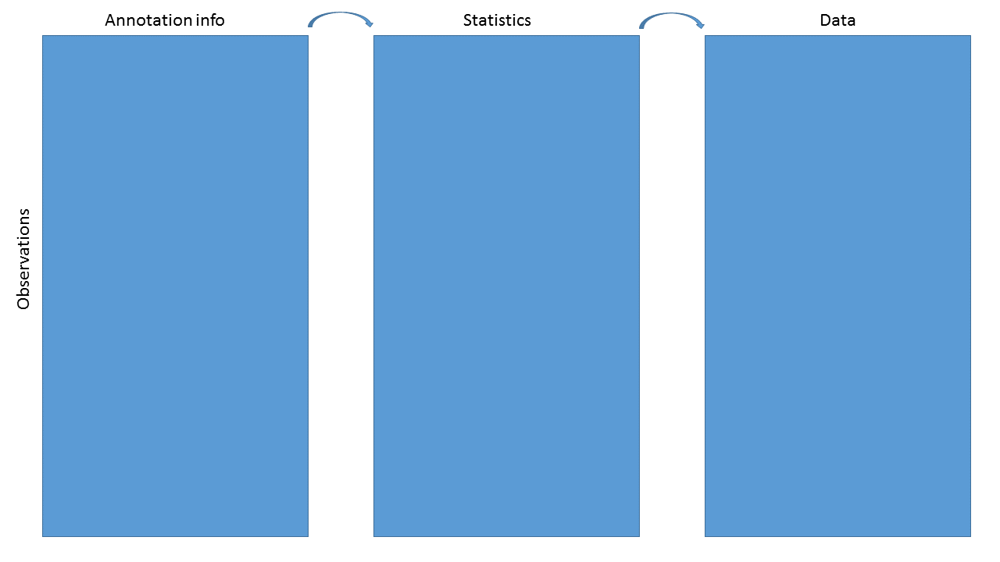

# Introduction to Bioconductor annotation resources

## Instructors

* James W. MacDonald (jmacdon@uw.edu)
* Lori Shepherd (lori.shepherd@roswellpark.org)

## Workshop Description

There are various annotation packages provided by the Bioconductor
project that can be used to incorporate additional information to
results from high-throughput experiments. This can be as simple as
mapping Ensembl IDs to corresponding HUGO gene symbols, to much more
complex queries involving multiple data sources. In this workshop we
will cover the various classes of annotation packages, what they
contain, and how to use them efficiently. 

### Prerequisites

* Basic knowledge of R syntax
* Basic understanding of the various annotation sources (NCBI, EBI/EMBL)

Useful background reading

* The
  [AnnotationDbi](https://www.bioconductor.org/packages/release/bioc/vignettes/AnnotationDbi/inst/doc/IntroToAnnotationPackages.pdf)
  vignette.
* The
  [biomaRt](https://www.bioconductor.org/packages/release/bioc/vignettes/biomaRt/inst/doc/biomaRt.html)
  vignette.
* The
  [GenomicFeatures](https://www.bioconductor.org/packages/release/bioc/vignettes/GenomicFeatures/inst/doc/GenomicFeatures.pdf)
  vignette.
  

### Workshop Participation

After each type of annotation package is introduced, students will be
given the opportunity to practice making their own queries. 

### _R_ / _Bioconductor_ packages used

* AnnotationDbi
* AnnotationHub
* BSgenome
* biomaRt
* ensembldb
* org.Hs.eg.db
* TxDb.Hsapiens.UCSC.hg19.knownGene
* EnsDb.Hsapiens.v79
* EnsDb.Mmusculus.v79
* Homo.sapiens 
* BSgenome.Hsapiens.UCSC.hg19
* hugene20sttranscriptcluster.db


## Workshop goals and objectives

Annotating data is a complex task. For any high-throughput experiment
the analyst usually starts with a set of identifiers for each thing
that was measured, and in order to make the results useful to
collaborators these identifiers need to be mapped to other identifiers
that are either more familiar to collaborators, or that can be used
for further analyses. As an example, RNA-Seq data may only have Entrez
Gene IDs for each gene measured, and as part of the output you may
want to include the gene symbols, which are more likely to be familiar
to a Biologist.

### Learning goals

* Understand what sort of annotation data are available
* Understand the difference between annotation sources (NCBI and EBI/EMBL)
* Gain familiarity with the various ways to query annotation packages
* Get some practice making queries

### Learning objectives

* Be able to use select and mapIds to map between identifiers
* Be able to extract data from TxDb and EnsDb packages
* Be able to make queries using biomaRt
* Extract and utilize various data from AnnotationHub

## Annotation Workshop

### Goals for this workshop

- Learn about various annotation package types

- Learn the basics of querying these resources

- Discuss annotations in regard to Bioc data structures

- Get in some practice

```{r setup, include = FALSE, warning = FALSE}

library(Bioc2018Anno)
library(hugene20sttranscriptcluster.db)
library(EnsDb.Mmusculus.v79)
library(org.Hs.eg.db)
library(TxDb.Hsapiens.UCSC.hg19.knownGene)
library(Homo.sapiens)
library(BSgenome)
library(BSgenome.Hsapiens.UCSC.hg19)
library(AnnotationHub)
library(Organism.dplyr)

```


### What do we mean by annotation?

Map a known ID to other functional or positional information

```{r, out.wdth = "75%", echo = FALSE}

knitr::include_graphics("./.MacDonald_Annotation/mapping.png")

```


### Specific goal

We have data and statistics, and we want to add other useful
information

```{r, out.width = "75%", echo = FALSE}



```

The end result might be as simple as a data.frame or HTML table, or as complex as a
`RangedSummarizedExperiment`

### Data containers

```{r, out.width = "75%", echo = FALSE}

knitr::include_graphics("./.MacDonald_Annotation/eset.png")

```

### ExpressionSet


```{r, warning = FALSE}

load(system.file("extdata/eset.Rdata", package = "Bioc2018Anno"))
eset

```
### ExpressionSet (continued)

```{r, warning = FALSE}

head(exprs(eset))
head(pData(phenoData(eset)))


```
### ExpressionSet (continued)

```{r, warning = FALSE}

head(pData(featureData(eset)))


```

### BioC containers vs basic structures

#### Pros

* Validity checking

* Subsetting

* Function dispatch

* Automatic behaviors

#### Cons

* Difficult to create

* Cumbersome to extract data by hand

* Useful only within R

### Annotation sources

```{r, results = "asis", echo = FALSE, warning = FALSE}

df <- data.frame("Package type" = c("ChipDb","OrgDb","TxDb/EnsDb","OrganismDb","BSgenome","Others","AnnotationHub","biomaRt"),
		 Example = c("hugene20sttranscriptcluster.db","org.Hs.eg.db","TxDb.Hsapiens.UCSC.hg19.knownGene; EnsDb.Hsapiens.v75",
			     "Homo.sapiens","BSgenome.Hsapiens.UCSC.hg19","GO.db; KEGG.db", "Online resource","Online resource"), check.names = FALSE)
knitr::kable(df)

```


### Interacting with AnnoDb packages

The main function is `select`:

select(*annopkg*, *keys*, *columns*, *keytype*)

Where

* annopkg is the annotation package

* keys are the IDs that we **know**

* columns are the values we **want**

* keytype is the type of key used
    + if the keytype is the **central** key, it can remain unspecified


### Simple example

Say we have analyzed data from an Affymetrix Human Gene ST 2.0 array
and want to know what the genes are. For purposes of this lab, we
just select some IDs at random.

```{r, warning = FALSE}

library(hugene20sttranscriptcluster.db)
set.seed(12345)
ids <- featureNames(eset)[sample(1:25000, 5)]
ids
select(hugene20sttranscriptcluster.db, ids, "SYMBOL")


```


### Questions!

How do you know what the central keys are?

* If it's a ChipDb, the central key are the manufacturer's probe IDs

* It's sometimes in the name - org.Hs.eg.db, where 'eg' means Entrez
  Gene ID

* You can see examples using e.g., head(keys(*annopkg*)), and infer
  from that

* But note that it's never necessary to know the central key, as long
  as you specify the keytype

### More questions!

What keytypes or columns are available for a given annotation package?

```{r, warning = FALSE}

keytypes(hugene20sttranscriptcluster.db)
columns(hugene20sttranscriptcluster.db)

```
### Another example

There is one issue with `select` however.

```{r, warning = FALSE}

ids <- c('16737401','16657436' ,'16678303')
select(hugene20sttranscriptcluster.db, ids, c("SYMBOL","MAP"))


```
### The `mapIds` function

An alternative to `select` is `mapIds`, which gives control of
duplicates

* Same arguments as `select` with slight differences

    - The columns argument can only specify one column

    - The keytype argument **must** be specified

    - An additional argument, multiVals used to control duplicates

```{r, warning = FALSE}

mapIds(hugene20sttranscriptcluster.db, ids, "SYMBOL", "PROBEID")

```

### Choices for multiVals

Default is `first`, where we just choose the first of the
duplicates. Other choices are `list`, `CharacterList`, `filter`,
`asNA` or a user-specified function.

```{r, warning = FALSE}

mapIds(hugene20sttranscriptcluster.db, ids, "SYMBOL", "PROBEID", multiVals = "list")


```

### Choices for multiVals (continued)

```{r, warning = FALSE}

mapIds(hugene20sttranscriptcluster.db, ids, "SYMBOL", "PROBEID", multiVals = "CharacterList")
mapIds(hugene20sttranscriptcluster.db, ids, "SYMBOL", "PROBEID", multiVals = "filter")
mapIds(hugene20sttranscriptcluster.db, ids, "SYMBOL", "PROBEID", multiVals = "asNA")


```
### ChipDb/OrgDb questions

Using either the hugene20sttranscriptcluster.db or org.Hs.eg.db package,

* What gene symbol corresponds to Entrez Gene ID 1000?

* What is the Ensembl Gene ID for PPARG?

* What is the UniProt ID for GAPDH?

* How many of the probesets from the ExpressionSet (eset) we loaded map to a
  single gene? How many don't map to a gene at all?

### TxDb packages

TxDb packages contain positional information; the contents can be
inferred by the package name

**TxDb.Species.Source.Build.Table**

* TxDb.Hsapiens.UCSC.hg19.knownGene

	- *Homo sapiens*

	- UCSC genome browser

	- hg19 (their version of GRCh37)

	- knownGene table

TxDb.Dmelanogaster.UCSC.dm3.ensGene
TxDb.Athaliana.BioMart.plantsmart22

### EnsDb packages

EnsDb packages are similar to TxDb packages, but based on Ensembl
mappings

EnsDb.Hsapiens.v79
EnsDb.Mmusculus.v79
EnsDb.Rnorvegicus.v79

### Transcript packages

As with ChipDb and OrgDb packages, `select` and `mapIds` can be used
to make queries

```{r, warning = FALSE}

select(TxDb.Hsapiens.UCSC.hg19.knownGene, c("1","10"),
       c("TXNAME","TXCHROM","TXSTART","TXEND"), "GENEID")
select(EnsDb.Hsapiens.v79, c("1", "10"),
       c("GENEID","GENENAME","SEQNAME","GENESEQSTART","GENESEQEND"), "ENTREZID")

```
But this is not how one normally uses them...

### GRanges

The normal use case for transcript packages is to extract positional
information into a `GRanges` or `GRangesList` object. An example is
the genomic position of all genes:

```{r, warning = FALSE}

gns <- genes(TxDb.Hsapiens.UCSC.hg19.knownGene)
gns

```
### GRangesList

Or the genomic position of all transcripts **by** gene:

```{r, warning = FALSE}

txs <- transcriptsBy(TxDb.Hsapiens.UCSC.hg19.knownGene)
txs

```
### Other accessors

* Positional information can be extracted for `transcripts`, `genes`, coding
  sequences (`cds`), `promoters`  and `exons`.

* Positional information can be extracted for most of the above, grouped
  by a second element. For example, our `transcriptsBy` call was all
  transcripts, grouped by gene.

* More detail on these *Ranges objects is beyond the scope of this
  workshop, but why we want them is not.

### Why *Ranges objects

The main rationale for *Ranges objects is to allow us to easily select
and subset data based on genomic position information. This is really
powerful!

`GRanges` and `GRangesLists` act like data.frames and lists, and can
be subsetted using the `[` function. As a really artificial example:

```{r, warning = FALSE}

txs[txs %over% gns[1:2,]]


```

### *Ranges use cases

* Gene expression changes near differentially methylated CpG islands

* Closest genes to a set of interesting SNPs

* Genes near DNAseI hypersensitivity clusters

* Number of CpGs measured over Gene X by Chip Y

### SummarizedExperiment objects

SummarizedExperiment objects are like ExpressionSets, but the row-wise
annotations are GRanges, so you can subset by genomic locations:

```{r, out.width = "75%", echo = FALSE}

knitr::include_graphics("./.MacDonald_Annotation/subset.png")

```

SummarizedExperiment objects are popular objects for representing expression
data and other rectangular data (feature x sample data). Incoming packages are
now strongly recommended to use this class representation instead of
ExpressionSet.


### TxDb exercises

* How many transcripts does PPARG have, according to UCSC?

* Does Ensembl agree?

* How many genes are between 2858473 and 3271812 on chr2 in the hg19
genome?
    - Hint: you make a `GRanges` like this - `GRanges("chr2", IRanges(2858473,3271812))`

### OrganismDb packages

OrganismDb packages are meta-packages that contain an OrgDb, a TxDb,
and a GO.db package and allow cross-queries between those packages.

All previous accessors work; `select`, `mapIds`, `transcripts`, etc.

```{r, warning = FALSE}

library(Homo.sapiens)
Homo.sapiens


```

### OrganismDb packages

* Updateable - can change TxDb object

* columns and keytypes span all underlying objects

* Calls to TxDb accessors include a 'columns' argument

```{r , warning = FALSE}

head(genes(Homo.sapiens, columns = c("ENTREZID","ALIAS","UNIPROT")),4)

```

### OrganismDb exercises

* Get all the GO terms for BRCA1

* What gene does the UCSC transcript ID uc002fai.3 map to?

* How many other transcripts does that gene have?

* Get all the transcripts from the hg19 genome build, along with their
  Ensembl gene ID, UCSC transcript ID and gene symbol

### Organism.dplyr package

* Combines the data from TxDb and Org.Db associated packages into local database.

* Allows functions from both _org.\*_ and _TxDb.\*_
    - `keytypes()`, `select()`, ...
    - `exons()`, `promoters()`, ...

* Allows for filtering and display of combined TxDb and Org.Db information
  through `dplyr` functions.

```{r, warning = FALSE}
library(Organism.dplyr)

# src = src_organism("TxDb.Hsapiens.UCSC.hg19.knownGene")
src <- src_organism(dbpath = hg38light())
src
```

## Organism.dplyr 

Get promoters from a TxDb object (we use a small version)

```{r, warning = FALSE}

options(width = 120)
promoters(src)

```
## Organism.dplyr 

Extract a table from the underlying database

```{r, warning = FALSE}

tbl(src, "id")


```

## Organism.dplyr
Make a complex query between tables in the underlying database

```{r, warning = FALSE}

inner_join(tbl(src, "id"), tbl(src, "ranges_gene")) %>%
		    filter(symbol %in% c("ADA", "NAT2")) %>%
		    dplyr::select(gene_chrom, gene_start, gene_end,
		    gene_strand, symbol, alias, map)

```


### Organism.dplyr exercises

* How many supported organisms are implemented in Organism.dplyr?

* Display the ensembl Id and genename description for symbol "NAT2".

* Show all the alias for "NAT2" in the database.

* Display Gene ontology (GO) information for gene symbol “NAT2”.


### BSgenome packages

BSgenome packages contain sequence information for a given
species/build. There are many such packages - you can get a listing
using `available.genomes`

```{r, warning = FALSE}

library(BSgenome)
head(available.genomes())

```
### BSgenome packages

We can load and inspect a BSgenome package

```{r, warning = FALSE}

library(BSgenome.Hsapiens.UCSC.hg19)
Hsapiens

```

### BSgenome packages

The main accessor is `getSeq`, and you can get data by sequence (e.g.,
entire chromosome or unplaced scaffold), or by
passing in a GRanges object, to get just a region.

```{r, warning = FALSE}

getSeq(Hsapiens, "chr1")
getSeq(Hsapiens, gns["5467",])


```
The Biostrings package contains most of the code for dealing with
these `*StringSet` objects - please see the Biostrings vignettes and
help pages for more information.

### BSgenome exercises

* Get the sequences for all transcripts of the TP53 gene

### AnnotationHub

AnnotationHub is a package that allows us to query and download many
different annotation objects, without having to explicitly install
them.

```{r, include = FALSE}

library(AnnotationHub)
hub <- AnnotationHub()


```

```{r, warning = FALSE}

library(AnnotationHub)
hub <- AnnotationHub()
hub


```
### Querying AnnotationHub

Finding the 'right' resource on AnnotationHub is like using Google - a
well posed query is necessary to find what you are after. Useful
queries are based on

* Data provider

* Data class

* Species

* Data source

```{r, warning = FALSE}

names(mcols(hub))

```


### AnnotationHub Data providers

```{r, warning = FALSE}

unique(hub$dataprovider)

```

### AnnotationHub Data classes

```{r, warning = FALSE}

unique(hub$rdataclass)

```
### AnnotationHub Species

```{r, warning = FALSE}

head(unique(hub$species))
length(unique(hub$species))


```
### AnnotationHub Data sources

```{r, warning = FALSE}

unique(hub$sourcetype)

```
### AnnotationHub query

```{r, warning = FALSE}

qry <- query(hub, c("granges","homo sapiens","ensembl"))
qry

```
### AnnotationHub query

```{r, warning = FALSE}

qry$sourceurl

```

### Selecting AnnotationHub resource

```{r, message = FALSE, warning = FALSE}

whatIwant <- qry[["AH50377"]]

```
We can use these data as they are, or convert to a TxDb format:

```{r, warning = FALSE}

GRCh38TxDb <- makeTxDbFromGRanges(whatIwant)
GRCh38TxDb

```
### AnnotationHub exercises

* How many resources are on AnnotationHub for Atlantic salmon (Salmo
  salar)?

* Get the most recent Ensembl build for domesticated dog (Canis
  familiaris) and make a TxDb

### biomaRt

The biomaRt package allows queries to an Ensembl Biomart server. We
can see the choices of servers that we can use:

```{r, warning = FALSE}

library(biomaRt)
listMarts()

```
### biomaRt data sets

And we can then check for the available data sets on a particular
server.

```{r, warning = FALSE}

mart <- useMart("ENSEMBL_MART_ENSEMBL")
head(listDatasets(mart))

```
### biomaRt queries

After setting up a `mart` object pointing to the server and data set
that we care about, we can make queries. We first set up the `mart` object.

```{r, warning = FALSE}

mart <- useMart("ENSEMBL_MART_ENSEMBL","hsapiens_gene_ensembl")

```
Queries are of the form

getBM(*attributes*, *filters*, *values*, *mart*)

where

* attributes are the things we **want**

* filters are the *types of* IDs we **have**

* values are the IDs we **have**

* mart is the `mart` object we set up

### biomaRt attributes and filters

Both attributes and filters have rather inscrutable names, but a
listing can be accessed using

```{r, warning = FALSE}

atrib <- listAttributes(mart)
filts <- listFilters(mart)
head(atrib)
head(filts)


```

### biomaRt query

A simple example query

```{r, warning = FALSE}

afyids <- c("1000_at","1001_at","1002_f_at","1007_s_at")
getBM(c("affy_hg_u95av2", "hgnc_symbol"), c("affy_hg_u95av2"), afyids, mart)

```

### biomaRt exercises

* Get the Ensembl gene IDs and HUGO symbol for Entrez Gene IDs 672, 5468 and 7157

* What do you get if you query for the 'gene_exon' for GAPDH?
