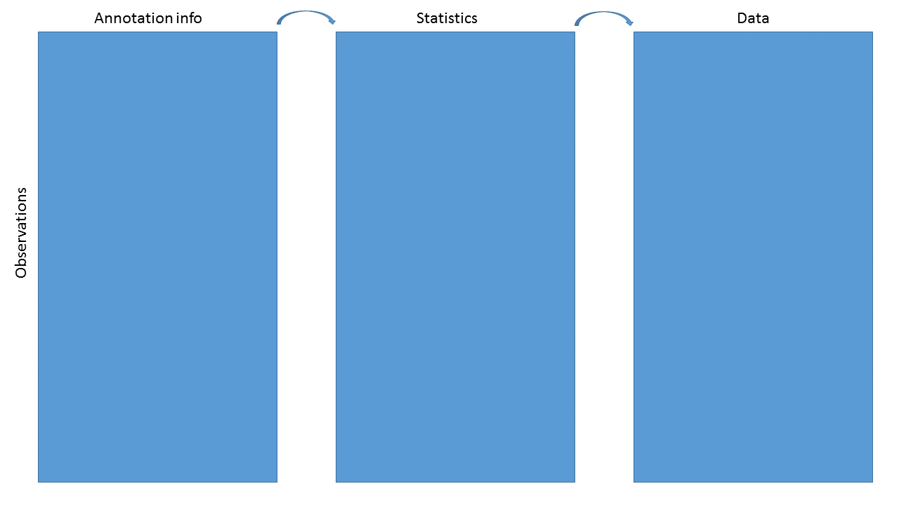

# Introduction to Bioconductor annotation resources

## Instructors

* James W. MacDonald (jmacdon@uw.edu)
* Lori Shepherd (lori.shepherd@roswellpark.org)

## Workshop Description

There are various annotation packages provided by the Bioconductor
project that can be used to incorporate additional information to
results from high-throughput experiments. This can be as simple as
mapping Ensembl IDs to corresponding HUGO gene symbols, to much more
complex queries involving multiple data sources. In this workshop we
will cover the various classes of annotation packages, what they
contain, and how to use them efficiently. 

### Prerequisites

* Basic knowledge of R syntax
* Basic understanding of the various annotation sources (NCBI, EBI/EMBL)

Useful background reading

* The
  [AnnotationDbi](https://www.bioconductor.org/packages/release/bioc/vignettes/AnnotationDbi/inst/doc/IntroToAnnotationPackages.pdf)
  vignette.
* The
  [biomaRt](https://www.bioconductor.org/packages/release/bioc/vignettes/biomaRt/inst/doc/biomaRt.html)
  vignette.
* The
  [GenomicFeatures](https://www.bioconductor.org/packages/release/bioc/vignettes/GenomicFeatures/inst/doc/GenomicFeatures.pdf)
  vignette.
  

### Workshop Participation

After each type of annotation package is introduced, students will be
given the opportunity to practice making their own queries. 

### _R_ / _Bioconductor_ packages used

* AnnotationDbi
* AnnotationHub
* BSgenome
* biomaRt
* ensembldb
* org.Hs.eg.db
* TxDb.Hsapiens.UCSC.hg19.knownGene
* EnsDb.Hsapiens.v79
* EnsDb.Mmusculus.v79
* Homo.sapiens 
* BSgenome.Hsapiens.UCSC.hg19
* hugene20sttranscriptcluster.db


## Workshop goals and objectives

Annotating data is a complex task. For any high-throughput experiment
the analyst usually starts with a set of identifiers for each thing
that was measured, and in order to make the results useful to
collaborators these identifiers need to be mapped to other identifiers
that are either more familiar to collaborators, or that can be used
for further analyses. As an example, RNA-Seq data may only have Entrez
Gene IDs for each gene measured, and as part of the output you may
want to include the gene symbols, which are more likely to be familiar
to a Biologist.

### Learning goals

* Understand what sort of annotation data are available
* Understand the difference between annotation sources (NCBI and EBI/EMBL)
* Gain familiarity with the various ways to query annotation packages
* Get some practice making queries

### Learning objectives

* Be able to use select and mapIds to map between identifiers
* Be able to extract data from TxDb and EnsDb packages
* Be able to make queries using biomaRt
* Extract and utilize various data from AnnotationHub

## Annotation Workshop

### Goals for this workshop

- Learn about various annotation package types

- Learn the basics of querying these resources

- Discuss annotations in regard to Bioc data structures

- Get in some practice


### What do we mean by annotation?

Map a known ID to other functional or positional information


### Specific goal

We have data and statistics, and we want to add other useful
information



The end result might be as simple as a data.frame or HTML table, or as complex as a
`RangedSummarizedExperiment`

### Data containers


### ExpressionSet


```r
load(system.file("extdata/eset.Rdata", package = "Bioc2018Anno"))
eset
```

```
## ExpressionSet (storageMode: lockedEnvironment)
## assayData: 33552 features, 6 samples 
##   element names: exprs 
## protocolData: none
## phenoData
##   sampleNames: GSM2194079 GSM2194080 ... GSM2194084 (6 total)
##   varLabels: title characteristics_ch1.1
##   varMetadata: labelDescription
## featureData
##   featureNames: 16657436 16657440 ... 17118478 (33552 total)
##   fvarLabels: PROBEID ENTREZID SYMBOL GENENAME
##   fvarMetadata: labelDescription
## experimentData: use 'experimentData(object)'
## Annotation: pd.hugene.2.0.st
```
### ExpressionSet (continued)


```r
head(exprs(eset))
```

```
##          GSM2194079 GSM2194080 GSM2194081 GSM2194082 GSM2194083 GSM2194084
## 16657436   8.505158   9.046577   8.382674   9.115481   8.715343   8.566301
## 16657440   7.948860   8.191222   7.901911   8.459781   8.191793   8.219658
## 16657450  10.932934  11.228553  10.948120  11.462231  11.300046  11.300886
## 16657469   9.172462   9.344630   9.193450   9.465584   9.464020   9.135715
## 16657473   6.222049   6.551035   6.000246   6.398798   5.892654   5.592125
## 16657476   8.514300   8.474073   8.407196   8.811238   8.780833   8.874606
```

```r
head(pData(phenoData(eset)))
```

```
##                          title characteristics_ch1.1
## GSM2194079   SW620-miR625-rep1     shRNA: miR-625-3p
## GSM2194080   SW620-miR625-rep2     shRNA: miR-625-3p
## GSM2194081   SW620-miR625-rep3     shRNA: miR-625-3p
## GSM2194082 SW620-scramble-rep1       shRNA: scramble
## GSM2194083 SW620-scramble-rep2       shRNA: scramble
## GSM2194084 SW620-scramble-rep3       shRNA: scramble
```
### ExpressionSet (continued)


```r
head(pData(featureData(eset)))
```

```
##           PROBEID  ENTREZID      SYMBOL
## 16657436 16657436     84771     DDX11L2
## 16657440 16657440 100302278   MIR1302-2
## 16657450 16657450    402483   LINC01000
## 16657469 16657469    140849 LINC00266-1
## 16657473 16657473    729759      OR4F29
## 16657476 16657476    388574   RPL23AP87
##                                                   GENENAME
## 16657436                     DEAD/H-box helicase 11 like 2
## 16657440                                   microRNA 1302-2
## 16657450       long intergenic non-protein coding RNA 1000
## 16657469      long intergenic non-protein coding RNA 266-1
## 16657473 olfactory receptor family 4 subfamily F member 29
## 16657476              ribosomal protein L23a pseudogene 87
```

### BioC containers vs basic structures

#### Pros

* Validity checking

* Subsetting

* Function dispatch

* Automatic behaviors

#### Cons

* Difficult to create

* Cumbersome to extract data by hand

* Useful only within R

### Annotation sources


Package type    Example                                               
--------------  ------------------------------------------------------
ChipDb          hugene20sttranscriptcluster.db                        
OrgDb           org.Hs.eg.db                                          
TxDb/EnsDb      TxDb.Hsapiens.UCSC.hg19.knownGene; EnsDb.Hsapiens.v75 
OrganismDb      Homo.sapiens                                          
BSgenome        BSgenome.Hsapiens.UCSC.hg19                           
Others          GO.db; KEGG.db                                        
AnnotationHub   Online resource                                       
biomaRt         Online resource                                       


### Interacting with AnnoDb packages

The main function is `select`:

select(*annopkg*, *keys*, *columns*, *keytype*)

Where

* annopkg is the annotation package

* keys are the IDs that we **know**

* columns are the values we **want**

* keytype is the type of key used
    + if the keytype is the **central** key, it can remain unspecified


### Simple example

Say we have analyzed data from an Affymetrix Human Gene ST 2.0 array
and want to know what the genes are. For purposes of this lab, we
just select some IDs at random.


```r
library(hugene20sttranscriptcluster.db)
set.seed(12345)
ids <- featureNames(eset)[sample(1:25000, 5)]
ids
```

```
## [1] "16908472" "16962185" "16920686" "16965513" "16819952"
```

```r
select(hugene20sttranscriptcluster.db, ids, "SYMBOL")
```

```
## 'select()' returned 1:1 mapping between keys and columns
```

```
##    PROBEID    SYMBOL
## 1 16908472 LINC01494
## 2 16962185      ALG3
## 3 16920686      <NA>
## 4 16965513      <NA>
## 5 16819952      CBFB
```


### Questions!

How do you know what the central keys are?

* If it's a ChipDb, the central key are the manufacturer's probe IDs

* It's sometimes in the name - org.Hs.eg.db, where 'eg' means Entrez
  Gene ID

* You can see examples using e.g., head(keys(*annopkg*)), and infer
  from that

* But note that it's never necessary to know the central key, as long
  as you specify the keytype

### More questions!

What keytypes or columns are available for a given annotation package?


```r
keytypes(hugene20sttranscriptcluster.db)
```

```
##  [1] "ACCNUM"       "ALIAS"        "ENSEMBL"      "ENSEMBLPROT" 
##  [5] "ENSEMBLTRANS" "ENTREZID"     "ENZYME"       "EVIDENCE"    
##  [9] "EVIDENCEALL"  "GENENAME"     "GO"           "GOALL"       
## [13] "IPI"          "MAP"          "OMIM"         "ONTOLOGY"    
## [17] "ONTOLOGYALL"  "PATH"         "PFAM"         "PMID"        
## [21] "PROBEID"      "PROSITE"      "REFSEQ"       "SYMBOL"      
## [25] "UCSCKG"       "UNIGENE"      "UNIPROT"
```

```r
columns(hugene20sttranscriptcluster.db)
```

```
##  [1] "ACCNUM"       "ALIAS"        "ENSEMBL"      "ENSEMBLPROT" 
##  [5] "ENSEMBLTRANS" "ENTREZID"     "ENZYME"       "EVIDENCE"    
##  [9] "EVIDENCEALL"  "GENENAME"     "GO"           "GOALL"       
## [13] "IPI"          "MAP"          "OMIM"         "ONTOLOGY"    
## [17] "ONTOLOGYALL"  "PATH"         "PFAM"         "PMID"        
## [21] "PROBEID"      "PROSITE"      "REFSEQ"       "SYMBOL"      
## [25] "UCSCKG"       "UNIGENE"      "UNIPROT"
```
### Another example

There is one issue with `select` however.


```r
ids <- c('16737401','16657436' ,'16678303')
select(hugene20sttranscriptcluster.db, ids, c("SYMBOL","MAP"))
```

```
## 'select()' returned 1:many mapping between keys and columns
```

```
##     PROBEID       SYMBOL     MAP
## 1  16737401        TRAF6   11p12
## 2  16657436      DDX11L1 1p36.33
## 3  16657436 LOC102725121 1p36.33
## 4  16657436      DDX11L2  2q14.1
## 5  16657436      DDX11L9 15q26.3
## 6  16657436     DDX11L10 16p13.3
## 7  16657436      DDX11L5  9p24.3
## 8  16657436     DDX11L16    Xq28
## 9  16657436     DDX11L16    Yq12
## 10 16678303         ARF1 1q42.13
```
### The `mapIds` function

An alternative to `select` is `mapIds`, which gives control of
duplicates

* Same arguments as `select` with slight differences

    - The columns argument can only specify one column

    - The keytype argument **must** be specified

    - An additional argument, multiVals used to control duplicates


```r
mapIds(hugene20sttranscriptcluster.db, ids, "SYMBOL", "PROBEID")
```

```
## 'select()' returned 1:many mapping between keys and columns
```

```
##  16737401  16657436  16678303 
##   "TRAF6" "DDX11L1"    "ARF1"
```

### Choices for multiVals

Default is `first`, where we just choose the first of the
duplicates. Other choices are `list`, `CharacterList`, `filter`,
`asNA` or a user-specified function.


```r
mapIds(hugene20sttranscriptcluster.db, ids, "SYMBOL", "PROBEID", multiVals = "list")
```

```
## 'select()' returned 1:many mapping between keys and columns
```

```
## $`16737401`
## [1] "TRAF6"
## 
## $`16657436`
## [1] "DDX11L1"      "LOC102725121" "DDX11L2"      "DDX11L9"     
## [5] "DDX11L10"     "DDX11L5"      "DDX11L16"    
## 
## $`16678303`
## [1] "ARF1"
```

### Choices for multiVals (continued)


```r
mapIds(hugene20sttranscriptcluster.db, ids, "SYMBOL", "PROBEID", multiVals = "CharacterList")
```

```
## 'select()' returned 1:many mapping between keys and columns
```

```
## CharacterList of length 3
## [["16737401"]] TRAF6
## [["16657436"]] DDX11L1 LOC102725121 DDX11L2 DDX11L9 DDX11L10 DDX11L5 DDX11L16
## [["16678303"]] ARF1
```

```r
mapIds(hugene20sttranscriptcluster.db, ids, "SYMBOL", "PROBEID", multiVals = "filter")
```

```
## 'select()' returned 1:many mapping between keys and columns
```

```
## 16737401 16678303 
##  "TRAF6"   "ARF1"
```

```r
mapIds(hugene20sttranscriptcluster.db, ids, "SYMBOL", "PROBEID", multiVals = "asNA")
```

```
## 'select()' returned 1:many mapping between keys and columns
```

```
## 16737401 16657436 16678303 
##  "TRAF6"       NA   "ARF1"
```
### ChipDb/OrgDb questions

Using either the hugene20sttranscriptcluster.db or org.Hs.eg.db package,

* What gene symbol corresponds to Entrez Gene ID 1000?

* What is the Ensembl Gene ID for PPARG?

* What is the UniProt ID for GAPDH?

* How many of the probesets from the ExpressionSet (eset) we loaded map to a
  single gene? How many don't map to a gene at all?

### TxDb packages

TxDb packages contain positional information; the contents can be
inferred by the package name

**TxDb.Species.Source.Build.Table**

* TxDb.Hsapiens.UCSC.hg19.knownGene

	- *Homo sapiens*

	- UCSC genome browser

	- hg19 (their version of GRCh37)

	- knownGene table

TxDb.Dmelanogaster.UCSC.dm3.ensGene
TxDb.Athaliana.BioMart.plantsmart22

### EnsDb packages

EnsDb packages are similar to TxDb packages, but based on Ensembl
mappings

EnsDb.Hsapiens.v79
EnsDb.Mmusculus.v79
EnsDb.Rnorvegicus.v79

### Transcript packages

As with ChipDb and OrgDb packages, `select` and `mapIds` can be used
to make queries


```r
select(TxDb.Hsapiens.UCSC.hg19.knownGene, c("1","10"),
       c("TXNAME","TXCHROM","TXSTART","TXEND"), "GENEID")
```

```
## 'select()' returned 1:many mapping between keys and columns
```

```
##   GENEID     TXNAME TXCHROM  TXSTART    TXEND
## 1      1 uc002qsd.4   chr19 58858172 58864865
## 2      1 uc002qsf.2   chr19 58859832 58874214
## 3     10 uc003wyw.1    chr8 18248755 18258723
```

```r
select(EnsDb.Hsapiens.v79, c("1", "10"),
       c("GENEID","GENENAME","SEQNAME","GENESEQSTART","GENESEQEND"), "ENTREZID")
```

```
##   ENTREZID          GENEID GENENAME SEQNAME GENESEQSTART GENESEQEND
## 1        1 ENSG00000121410     A1BG      19     58345178   58353499
## 2       10 ENSG00000156006     NAT2       8     18391245   18401218
```
But this is not how one normally uses them...

### GRanges

The normal use case for transcript packages is to extract positional
information into a `GRanges` or `GRangesList` object. An example is
the genomic position of all genes:


```r
gns <- genes(TxDb.Hsapiens.UCSC.hg19.knownGene)
gns
```

```
## GRanges object with 23056 ranges and 1 metadata column:
##         seqnames              ranges strand |     gene_id
##            <Rle>           <IRanges>  <Rle> | <character>
##       1    chr19   58858172-58874214      - |           1
##      10     chr8   18248755-18258723      + |          10
##     100    chr20   43248163-43280376      - |         100
##    1000    chr18   25530930-25757445      - |        1000
##   10000     chr1 243651535-244006886      - |       10000
##     ...      ...                 ...    ... .         ...
##    9991     chr9 114979995-115095944      - |        9991
##    9992    chr21   35736323-35743440      + |        9992
##    9993    chr22   19023795-19109967      - |        9993
##    9994     chr6   90539619-90584155      + |        9994
##    9997    chr22   50961997-50964905      - |        9997
##   -------
##   seqinfo: 93 sequences (1 circular) from hg19 genome
```
### GRangesList

Or the genomic position of all transcripts **by** gene:


```r
txs <- transcriptsBy(TxDb.Hsapiens.UCSC.hg19.knownGene)
txs
```

```
## GRangesList object of length 23459:
## $1 
## GRanges object with 2 ranges and 2 metadata columns:
##       seqnames            ranges strand |     tx_id     tx_name
##          <Rle>         <IRanges>  <Rle> | <integer> <character>
##   [1]    chr19 58858172-58864865      - |     70455  uc002qsd.4
##   [2]    chr19 58859832-58874214      - |     70456  uc002qsf.2
## 
## $10 
## GRanges object with 1 range and 2 metadata columns:
##       seqnames            ranges strand | tx_id    tx_name
##   [1]     chr8 18248755-18258723      + | 31944 uc003wyw.1
## 
## $100 
## GRanges object with 1 range and 2 metadata columns:
##       seqnames            ranges strand | tx_id    tx_name
##   [1]    chr20 43248163-43280376      - | 72132 uc002xmj.3
## 
## ...
## <23456 more elements>
## -------
## seqinfo: 93 sequences (1 circular) from hg19 genome
```
### Other accessors

* Positional information can be extracted for `transcripts`, `genes`, coding
  sequences (`cds`), `promoters`  and `exons`.

* Positional information can be extracted for most of the above, grouped
  by a second element. For example, our `transcriptsBy` call was all
  transcripts, grouped by gene.

* More detail on these *Ranges objects is beyond the scope of this
  workshop, but why we want them is not.

### Why *Ranges objects

The main rationale for *Ranges objects is to allow us to easily select
and subset data based on genomic position information. This is really
powerful!

`GRanges` and `GRangesLists` act like data.frames and lists, and can
be subsetted using the `[` function. As a really artificial example:


```r
txs[txs %over% gns[1:2,]]
```

```
## GRangesList object of length 3:
## $1 
## GRanges object with 2 ranges and 2 metadata columns:
##       seqnames            ranges strand |     tx_id     tx_name
##          <Rle>         <IRanges>  <Rle> | <integer> <character>
##   [1]    chr19 58858172-58864865      - |     70455  uc002qsd.4
##   [2]    chr19 58859832-58874214      - |     70456  uc002qsf.2
## 
## $10 
## GRanges object with 1 range and 2 metadata columns:
##       seqnames            ranges strand | tx_id    tx_name
##   [1]     chr8 18248755-18258723      + | 31944 uc003wyw.1
## 
## $162968 
## GRanges object with 2 ranges and 2 metadata columns:
##       seqnames            ranges strand | tx_id    tx_name
##   [1]    chr19 58865723-58874214      - | 70457 uc002qsh.2
##   [2]    chr19 58865723-58874214      - | 70458 uc002qsi.2
## 
## -------
## seqinfo: 93 sequences (1 circular) from hg19 genome
```

### *Ranges use cases

* Gene expression changes near differentially methylated CpG islands

* Closest genes to a set of interesting SNPs

* Genes near DNAseI hypersensitivity clusters

* Number of CpGs measured over Gene X by Chip Y

### SummarizedExperiment objects

SummarizedExperiment objects are like ExpressionSets, but the row-wise
annotations are GRanges, so you can subset by genomic locations:


SummarizedExperiment objects are popular objects for representing expression
data and other rectangular data (feature x sample data). Incoming packages are
now strongly recommended to use this class representation instead of
ExpressionSet.


### TxDb exercises

* How many transcripts does PPARG have, according to UCSC?

* Does Ensembl agree?

* How many genes are between 2858473 and 3271812 on chr2 in the hg19
genome?
    - Hint: you make a `GRanges` like this - `GRanges("chr2", IRanges(2858473,3271812))`

### OrganismDb packages

OrganismDb packages are meta-packages that contain an OrgDb, a TxDb,
and a GO.db package and allow cross-queries between those packages.

All previous accessors work; `select`, `mapIds`, `transcripts`, etc.


```r
library(Homo.sapiens)
Homo.sapiens
```

```
## OrganismDb Object:
## # Includes GODb Object:  GO.db 
## # With data about:  Gene Ontology 
## # Includes OrgDb Object:  org.Hs.eg.db 
## # Gene data about:  Homo sapiens 
## # Taxonomy Id:  9606 
## # Includes TxDb Object:  TxDb.Hsapiens.UCSC.hg19.knownGene 
## # Transcriptome data about:  Homo sapiens 
## # Based on genome:  hg19 
## # The OrgDb gene id ENTREZID is mapped to the TxDb gene id GENEID .
```

### OrganismDb packages

* Updateable - can change TxDb object

* columns and keytypes span all underlying objects

* Calls to TxDb accessors include a 'columns' argument


```r
head(genes(Homo.sapiens, columns = c("ENTREZID","ALIAS","UNIPROT")),4)
```

```
## 'select()' returned 1:many mapping between keys and columns
```

```
## GRanges object with 4 ranges and 3 metadata columns:
##        seqnames            ranges strand |                 ALIAS
##           <Rle>         <IRanges>  <Rle> |       <CharacterList>
##      1    chr19 58858172-58874214      - |       A1B,ABG,GAB,...
##     10     chr8 18248755-18258723      + |   AAC2,NAT-2,PNAT,...
##    100    chr20 43248163-43280376      - |                   ADA
##   1000    chr18 25530930-25757445      - | CD325,CDHN,CDw325,...
##                         UNIPROT     ENTREZID
##                 <CharacterList> <FactorList>
##      1            P04217,V9HWD8            1
##     10            A4Z6T7,P11245           10
##    100 A0A0S2Z381,P00813,F5GWI4          100
##   1000        P19022,A0A024RC42         1000
##   -------
##   seqinfo: 93 sequences (1 circular) from hg19 genome
```

### OrganismDb exercises

* Get all the GO terms for BRCA1

* What gene does the UCSC transcript ID uc002fai.3 map to?

* How many other transcripts does that gene have?

* Get all the transcripts from the hg19 genome build, along with their
  Ensembl gene ID, UCSC transcript ID and gene symbol

### Organism.dplyr package

* Combines the data from TxDb and Org.Db associated packages into local database.

* Allows functions from both _org.\*_ and _TxDb.\*_
    - `keytypes()`, `select()`, ...
    - `exons()`, `promoters()`, ...

* Allows for filtering and display of combined TxDb and Org.Db information
  through `dplyr` functions.


```r
library(Organism.dplyr)

# src = src_organism("TxDb.Hsapiens.UCSC.hg19.knownGene")
src <- src_organism(dbpath = hg38light())
src
```

```
## src:  sqlite 3.22.0 [/usr/local/lib/R/R-3.5-bioc-devel/Organism.dplyr/extdata/light.hg38.knownGene.sqlite]
## tbls: id, id_accession, id_go, id_go_all, id_omim_pm, id_protein,
##   id_transcript, ranges_cds, ranges_exon, ranges_gene, ranges_tx
```

### Organism.dplyr

Get promoters from a TxDb object (we use a small version)


```r
options(width = 120)
promoters(src)
```

```
## <SQL>
## SELECT *
## FROM `ranges_tx`
```

```
## GRanges object with 88 ranges and 2 metadata columns:
##                      seqnames              ranges strand |     tx_id     tx_name
##                         <Rle>           <IRanges>  <Rle> | <integer> <character>
##   uc001hzz.2             chr1 243843037-243845236      - |     15880  uc001hzz.2
##   uc021plu.1             chr1 243843385-243845584      - |     15881  uc021plu.1
##   uc001iab.3             chr1 243843083-243845282      - |     15882  uc001iab.3
##   uc057qvr.1             chr1 243849929-243852128      - |     15883  uc057qvr.1
##   uc057qvt.1             chr1 243614947-243617146      - |     15884  uc057qvt.1
##          ...              ...                 ...    ... .       ...         ...
##   uc064xqh.1 chrUn_GL000220v1       110025-112224      + |    197741  uc064xqh.1
##   uc064xqi.1 chrUn_GL000220v1       112151-114350      + |    197742  uc064xqi.1
##   uc064xqj.1 chrUn_GL000220v1       115428-117627      + |    197743  uc064xqj.1
##   uc064xqk.1 chrUn_GL000220v1       116197-118396      + |    197744  uc064xqk.1
##   uc033dnj.2 chrUn_GL000220v1       153997-156196      + |    197750  uc033dnj.2
##   -------
##   seqinfo: 455 sequences (1 circular) from hg38 genome
```
### Organism.dplyr

Extract a table from the underlying database


```r
tbl(src, "id")
```

```
## # Source:   table<id> [?? x 6]
## # Database: sqlite 3.22.0 []
##    entrez map      ensembl         symbol genename               alias   
##    <chr>  <chr>    <chr>           <chr>  <chr>                  <chr>   
##  1 1      19q13.4  ENSG00000121410 A1BG   alpha-1-B glycoprotein A1B     
##  2 1      19q13.4  ENSG00000121410 A1BG   alpha-1-B glycoprotein ABG     
##  3 1      19q13.4  ENSG00000121410 A1BG   alpha-1-B glycoprotein GAB     
##  4 1      19q13.4  ENSG00000121410 A1BG   alpha-1-B glycoprotein HYST2477
##  5 1      19q13.4  ENSG00000121410 A1BG   alpha-1-B glycoprotein A1BG    
##  6 10     8p22     ENSG00000156006 NAT2   N-acetyltransferase 2  AAC2    
##  7 10     8p22     ENSG00000156006 NAT2   N-acetyltransferase 2  NAT-2   
##  8 10     8p22     ENSG00000156006 NAT2   N-acetyltransferase 2  PNAT    
##  9 10     8p22     ENSG00000156006 NAT2   N-acetyltransferase 2  NAT2    
## 10 100    20q13.12 ENSG00000196839 ADA    adenosine deaminase    ADA     
## # ... with more rows
```

### Organism.dplyr
Make a complex query between tables in the underlying database


```r
inner_join(tbl(src, "id"), tbl(src, "ranges_gene")) %>%
		    filter(symbol %in% c("ADA", "NAT2")) %>%
		    dplyr::select(gene_chrom, gene_start, gene_end,
		    gene_strand, symbol, alias, map)
```

```
## Joining, by = "entrez"
```

```
## # Source:   lazy query [?? x 7]
## # Database: sqlite 3.22.0 []
##   gene_chrom gene_start gene_end gene_strand symbol alias map     
##   <chr>           <int>    <int> <chr>       <chr>  <chr> <chr>   
## 1 chr8         18391245 18401218 +           NAT2   AAC2  8p22    
## 2 chr8         18391245 18401218 +           NAT2   NAT-2 8p22    
## 3 chr8         18391245 18401218 +           NAT2   PNAT  8p22    
## 4 chr8         18391245 18401218 +           NAT2   NAT2  8p22    
## 5 chr20        44619522 44651742 -           ADA    ADA   20q13.12
```


### Organism.dplyr exercises

* How many supported organisms are implemented in Organism.dplyr?

* Display the ensembl Id and genename description for symbol "NAT2".

* Show all the alias for "NAT2" in the database.

* Display Gene ontology (GO) information for gene symbol “NAT2”.


### BSgenome packages

BSgenome packages contain sequence information for a given
species/build. There are many such packages - you can get a listing
using `available.genomes`


```r
library(BSgenome)
head(available.genomes())
```

```
## [1] "BSgenome.Alyrata.JGI.v1"                 "BSgenome.Amellifera.BeeBase.assembly4"  
## [3] "BSgenome.Amellifera.UCSC.apiMel2"        "BSgenome.Amellifera.UCSC.apiMel2.masked"
## [5] "BSgenome.Athaliana.TAIR.04232008"        "BSgenome.Athaliana.TAIR.TAIR9"
```
### BSgenome packages

We can load and inspect a BSgenome package


```r
library(BSgenome.Hsapiens.UCSC.hg19)
Hsapiens
```

```
## Human genome:
## # organism: Homo sapiens (Human)
## # provider: UCSC
## # provider version: hg19
## # release date: Feb. 2009
## # release name: Genome Reference Consortium GRCh37
## # 93 sequences:
## #   chr1                  chr2                  chr3                  chr4                  chr5                 
## #   chr6                  chr7                  chr8                  chr9                  chr10                
## #   chr11                 chr12                 chr13                 chr14                 chr15                
## #   chr16                 chr17                 chr18                 chr19                 chr20                
## #   chr21                 chr22                 chrX                  chrY                  chrM                 
## #   ...                   ...                   ...                   ...                   ...                  
## #   chrUn_gl000227        chrUn_gl000228        chrUn_gl000229        chrUn_gl000230        chrUn_gl000231       
## #   chrUn_gl000232        chrUn_gl000233        chrUn_gl000234        chrUn_gl000235        chrUn_gl000236       
## #   chrUn_gl000237        chrUn_gl000238        chrUn_gl000239        chrUn_gl000240        chrUn_gl000241       
## #   chrUn_gl000242        chrUn_gl000243        chrUn_gl000244        chrUn_gl000245        chrUn_gl000246       
## #   chrUn_gl000247        chrUn_gl000248        chrUn_gl000249                                                   
## # (use 'seqnames()' to see all the sequence names, use the '$' or '[[' operator to access a given sequence)
```

### BSgenome packages

The main accessor is `getSeq`, and you can get data by sequence (e.g.,
entire chromosome or unplaced scaffold), or by
passing in a GRanges object, to get just a region.


```r
getSeq(Hsapiens, "chr1")
```

```
##   249250621-letter "DNAString" instance
## seq: NNNNNNNNNNNNNNNNNNNNNNNNNNNNNNNNNNNNNNNNNNNNNNNNNNNNNNNN...NNNNNNNNNNNNNNNNNNNNNNNNNNNNNNNNNNNNNNNNNNNNNNNNNNNNNNNN
```

```r
getSeq(Hsapiens, gns["5467",])
```

```
##   A DNAStringSet instance of length 1
##     width seq                                                                                       names               
## [1] 85634 GCGGAGCGTGTGACGCTGCGGCCGCCGCGGACCTGGGGATTAA...ACTTTAAATAAATGGGAATTAAATATTTAAGAGCTGACTGGAA 5467
```
The Biostrings package contains most of the code for dealing with
these `*StringSet` objects - please see the Biostrings vignettes and
help pages for more information.

### BSgenome exercises

* Get the sequences for all transcripts of the TP53 gene

### AnnotationHub

AnnotationHub is a package that allows us to query and download many
different annotation objects, without having to explicitly install
them.


```r
library(AnnotationHub)
hub <- AnnotationHub()
```

```
## snapshotDate(): 2018-06-27
```

```r
hub
```

```
## AnnotationHub with 44925 records
## # snapshotDate(): 2018-06-27 
## # $dataprovider: BroadInstitute, Ensembl, UCSC, ftp://ftp.ncbi.nlm.nih.gov/gene/DATA/, Haemcode, Inparanoid8, Pazar,...
## # $species: Homo sapiens, Mus musculus, Drosophila melanogaster, Bos taurus, Pan troglodytes, Rattus norvegicus, Dan...
## # $rdataclass: GRanges, BigWigFile, FaFile, TwoBitFile, Rle, OrgDb, ChainFile, EnsDb, Inparanoid8Db, TxDb
## # additional mcols(): taxonomyid, genome, description, coordinate_1_based, maintainer, rdatadateadded,
## #   preparerclass, tags, rdatapath, sourceurl, sourcetype 
## # retrieve records with, e.g., 'object[["AH2"]]' 
## 
##             title                                                   
##   AH2     | Ailuropoda_melanoleuca.ailMel1.69.dna.toplevel.fa       
##   AH3     | Ailuropoda_melanoleuca.ailMel1.69.dna_rm.toplevel.fa    
##   AH4     | Ailuropoda_melanoleuca.ailMel1.69.dna_sm.toplevel.fa    
##   AH5     | Ailuropoda_melanoleuca.ailMel1.69.ncrna.fa              
##   AH6     | Ailuropoda_melanoleuca.ailMel1.69.pep.all.fa            
##   ...       ...                                                     
##   AH63655 | phastCons46wayPrimates.UCSC.hg19.chrX.rds               
##   AH63656 | phastCons46wayPrimates.UCSC.hg19.chrY.rds               
##   AH63657 | Alternative Splicing Annotation for Homo sapiens (Human)
##   AH63658 | Allele data from the IPD IMGT/HLA database              
##   AH63659 | Allele data from the IPD KIR database
```
### Querying AnnotationHub

Finding the 'right' resource on AnnotationHub is like using Google - a
well posed query is necessary to find what you are after. Useful
queries are based on

* Data provider

* Data class

* Species

* Data source


```r
names(mcols(hub))
```

```
##  [1] "title"              "dataprovider"       "species"            "taxonomyid"         "genome"            
##  [6] "description"        "coordinate_1_based" "maintainer"         "rdatadateadded"     "preparerclass"     
## [11] "tags"               "rdataclass"         "rdatapath"          "sourceurl"          "sourcetype"
```


### AnnotationHub Data providers


```r
unique(hub$dataprovider)
```

```
##  [1] "Ensembl"                               "UCSC"                                 
##  [3] "RefNet"                                "Inparanoid8"                          
##  [5] "NHLBI"                                 "ChEA"                                 
##  [7] "Pazar"                                 "NIH Pathway Interaction Database"     
##  [9] "Haemcode"                              "BroadInstitute"                       
## [11] "PRIDE"                                 "Gencode"                              
## [13] "CRIBI"                                 "Genoscope"                            
## [15] "MISO, VAST-TOOLS, UCSC"                "UWashington"                          
## [17] "Stanford"                              "dbSNP"                                
## [19] "BioMart"                               "GeneOntology"                         
## [21] "KEGG"                                  "URGI"                                 
## [23] "ftp://ftp.ncbi.nlm.nih.gov/gene/DATA/" "EMBL-EBI"
```

### AnnotationHub Data classes


```r
unique(hub$rdataclass)
```

```
##  [1] "FaFile"                            "GRanges"                           "data.frame"                       
##  [4] "Inparanoid8Db"                     "TwoBitFile"                        "ChainFile"                        
##  [7] "SQLiteConnection"                  "biopax"                            "BigWigFile"                       
## [10] "AAStringSet"                       "MSnSet"                            "mzRpwiz"                          
## [13] "mzRident"                          "list"                              "TxDb"                             
## [16] "Rle"                               "EnsDb"                             "VcfFile"                          
## [19] "igraph"                            "OrgDb"                             "data.frame, DNAStringSet, GRanges"
```
### AnnotationHub Species


```r
head(unique(hub$species))
```

```
## [1] "Ailuropoda melanoleuca" "Anolis carolinensis"    "Bos taurus"             "Caenorhabditis elegans"
## [5] "Callithrix jacchus"     "Canis familiaris"
```

```r
length(unique(hub$species))
```

```
## [1] 1971
```
### AnnotationHub Data sources


```r
unique(hub$sourcetype)
```

```
##  [1] "FASTA"        "UCSC track"   "GTF"          "TSV"          "Inparanoid"   "TwoBit"       "Chain"       
##  [8] "GRASP"        "Zip"          "CSV"          "BioPax"       "BioPaxLevel2" "RData"        "BED"         
## [15] "BigWig"       "tab"          "mzTab"        "mzML"         "mzid"         "GFF"          "ensembl"     
## [22] "VCF"          "NCBI/ensembl" "NCBI/UniProt"
```
### AnnotationHub query


```r
qry <- query(hub, c("granges","homo sapiens","ensembl"))
qry
```

```
## AnnotationHub with 56 records
## # snapshotDate(): 2018-06-27 
## # $dataprovider: Ensembl, UCSC
## # $species: Homo sapiens
## # $rdataclass: GRanges
## # additional mcols(): taxonomyid, genome, description, coordinate_1_based, maintainer, rdatadateadded,
## #   preparerclass, tags, rdatapath, sourceurl, sourcetype 
## # retrieve records with, e.g., 'object[["AH5046"]]' 
## 
##             title                                          
##   AH5046  | Ensembl Genes                                  
##   AH5160  | Ensembl Genes                                  
##   AH5311  | Ensembl Genes                                  
##   AH5434  | Ensembl Genes                                  
##   AH5435  | Ensembl EST Genes                              
##   ...       ...                                            
##   AH60085 | Homo_sapiens.GRCh38.91.gtf                     
##   AH61125 | Homo_sapiens.GRCh38.92.abinitio.gtf            
##   AH61126 | Homo_sapiens.GRCh38.92.chr.gtf                 
##   AH61127 | Homo_sapiens.GRCh38.92.chr_patch_hapl_scaff.gtf
##   AH61128 | Homo_sapiens.GRCh38.92.gtf
```
### AnnotationHub query


```r
qry$sourceurl
```

```
##  [1] "rtracklayer://hgdownload.cse.ucsc.edu/goldenpath/hg19/database/ensGene"                                  
##  [2] "rtracklayer://hgdownload.cse.ucsc.edu/goldenpath/hg18/database/ensGene"                                  
##  [3] "rtracklayer://hgdownload.cse.ucsc.edu/goldenpath/hg17/database/ensGene"                                  
##  [4] "rtracklayer://hgdownload.cse.ucsc.edu/goldenpath/hg16/database/ensGene"                                  
##  [5] "rtracklayer://hgdownload.cse.ucsc.edu/goldenpath/hg16/database/ensEstGene"                               
##  [6] "ftp://ftp.ensembl.org/pub/release-70/gtf/homo_sapiens/Homo_sapiens.GRCh37.70.gtf.gz"                     
##  [7] "ftp://ftp.ensembl.org/pub/release-69/gtf/homo_sapiens/Homo_sapiens.GRCh37.69.gtf.gz"                     
##  [8] "ftp://ftp.ensembl.org/pub/release-71/gtf/homo_sapiens/Homo_sapiens.GRCh37.71.gtf.gz"                     
##  [9] "ftp://ftp.ensembl.org/pub/release-72/gtf/homo_sapiens/Homo_sapiens.GRCh37.72.gtf.gz"                     
## [10] "ftp://ftp.ensembl.org/pub/release-73/gtf/homo_sapiens/Homo_sapiens.GRCh37.73.gtf.gz"                     
## [11] "ftp://ftp.ensembl.org/pub/release-74/gtf/homo_sapiens/Homo_sapiens.GRCh37.74.gtf.gz"                     
## [12] "ftp://ftp.ensembl.org/pub/release-75/gtf/homo_sapiens/Homo_sapiens.GRCh37.75.gtf.gz"                     
## [13] "ftp://ftp.ensembl.org/pub/release-78/gtf/homo_sapiens/Homo_sapiens.GRCh38.78.gtf.gz"                     
## [14] "ftp://ftp.ensembl.org/pub/release-76/gtf/homo_sapiens/Homo_sapiens.GRCh38.76.gtf.gz"                     
## [15] "ftp://ftp.ensembl.org/pub/release-79/gtf/homo_sapiens/Homo_sapiens.GRCh38.79.gtf.gz"                     
## [16] "ftp://ftp.ensembl.org/pub/release-77/gtf/homo_sapiens/Homo_sapiens.GRCh38.77.gtf.gz"                     
## [17] "ftp://ftp.ensembl.org/pub/release-80/gtf/homo_sapiens/Homo_sapiens.GRCh38.80.gtf.gz"                     
## [18] "ftp://ftp.ensembl.org/pub/release-81/gtf/homo_sapiens/Homo_sapiens.GRCh38.81.gtf.gz"                     
## [19] "ftp://ftp.ensembl.org/pub/release-82/gtf/homo_sapiens/Homo_sapiens.GRCh38.82.gtf.gz"                     
## [20] "ftp://ftp.ensembl.org/pub/release-83/gtf/homo_sapiens/Homo_sapiens.GRCh38.83.gtf.gz"                     
## [21] "ftp://ftp.ensembl.org/pub/release-84/gtf/homo_sapiens/Homo_sapiens.GRCh38.84.abinitio.gtf.gz"            
## [22] "ftp://ftp.ensembl.org/pub/release-84/gtf/homo_sapiens/Homo_sapiens.GRCh38.84.chr.gtf.gz"                 
## [23] "ftp://ftp.ensembl.org/pub/release-84/gtf/homo_sapiens/Homo_sapiens.GRCh38.84.chr_patch_hapl_scaff.gtf.gz"
## [24] "ftp://ftp.ensembl.org/pub/release-84/gtf/homo_sapiens/Homo_sapiens.GRCh38.84.gtf.gz"                     
## [25] "ftp://ftp.ensembl.org/pub/release-85/gtf/homo_sapiens/Homo_sapiens.GRCh38.85.abinitio.gtf.gz"            
## [26] "ftp://ftp.ensembl.org/pub/release-85/gtf/homo_sapiens/Homo_sapiens.GRCh38.85.chr.gtf.gz"                 
## [27] "ftp://ftp.ensembl.org/pub/release-85/gtf/homo_sapiens/Homo_sapiens.GRCh38.85.chr_patch_hapl_scaff.gtf.gz"
## [28] "ftp://ftp.ensembl.org/pub/release-85/gtf/homo_sapiens/Homo_sapiens.GRCh38.85.gtf.gz"                     
## [29] "ftp://ftp.ensembl.org/pub/release-86/gtf/homo_sapiens/Homo_sapiens.GRCh38.86.abinitio.gtf.gz"            
## [30] "ftp://ftp.ensembl.org/pub/release-86/gtf/homo_sapiens/Homo_sapiens.GRCh38.86.chr.gtf.gz"                 
## [31] "ftp://ftp.ensembl.org/pub/release-86/gtf/homo_sapiens/Homo_sapiens.GRCh38.86.chr_patch_hapl_scaff.gtf.gz"
## [32] "ftp://ftp.ensembl.org/pub/release-86/gtf/homo_sapiens/Homo_sapiens.GRCh38.86.gtf.gz"                     
## [33] "ftp://ftp.ensembl.org/pub/release-87/gtf/homo_sapiens/Homo_sapiens.GRCh38.87.abinitio.gtf.gz"            
## [34] "ftp://ftp.ensembl.org/pub/release-87/gtf/homo_sapiens/Homo_sapiens.GRCh38.87.chr.gtf.gz"                 
## [35] "ftp://ftp.ensembl.org/pub/release-87/gtf/homo_sapiens/Homo_sapiens.GRCh38.87.chr_patch_hapl_scaff.gtf.gz"
## [36] "ftp://ftp.ensembl.org/pub/release-87/gtf/homo_sapiens/Homo_sapiens.GRCh38.87.gtf.gz"                     
## [37] "ftp://ftp.ensembl.org/pub/release-88/gtf/homo_sapiens/Homo_sapiens.GRCh38.88.abinitio.gtf.gz"            
## [38] "ftp://ftp.ensembl.org/pub/release-88/gtf/homo_sapiens/Homo_sapiens.GRCh38.88.chr.gtf.gz"                 
## [39] "ftp://ftp.ensembl.org/pub/release-88/gtf/homo_sapiens/Homo_sapiens.GRCh38.88.chr_patch_hapl_scaff.gtf.gz"
## [40] "ftp://ftp.ensembl.org/pub/release-88/gtf/homo_sapiens/Homo_sapiens.GRCh38.88.gtf.gz"                     
## [41] "ftp://ftp.ensembl.org/pub/release-89/gtf/homo_sapiens/Homo_sapiens.GRCh38.89.abinitio.gtf.gz"            
## [42] "ftp://ftp.ensembl.org/pub/release-89/gtf/homo_sapiens/Homo_sapiens.GRCh38.89.chr.gtf.gz"                 
## [43] "ftp://ftp.ensembl.org/pub/release-89/gtf/homo_sapiens/Homo_sapiens.GRCh38.89.chr_patch_hapl_scaff.gtf.gz"
## [44] "ftp://ftp.ensembl.org/pub/release-89/gtf/homo_sapiens/Homo_sapiens.GRCh38.89.gtf.gz"                     
## [45] "ftp://ftp.ensembl.org/pub/release-90/gtf/homo_sapiens/Homo_sapiens.GRCh38.90.abinitio.gtf.gz"            
## [46] "ftp://ftp.ensembl.org/pub/release-90/gtf/homo_sapiens/Homo_sapiens.GRCh38.90.chr.gtf.gz"                 
## [47] "ftp://ftp.ensembl.org/pub/release-90/gtf/homo_sapiens/Homo_sapiens.GRCh38.90.chr_patch_hapl_scaff.gtf.gz"
## [48] "ftp://ftp.ensembl.org/pub/release-90/gtf/homo_sapiens/Homo_sapiens.GRCh38.90.gtf.gz"                     
## [49] "ftp://ftp.ensembl.org/pub/release-91/gtf/homo_sapiens/Homo_sapiens.GRCh38.91.abinitio.gtf.gz"            
## [50] "ftp://ftp.ensembl.org/pub/release-91/gtf/homo_sapiens/Homo_sapiens.GRCh38.91.chr.gtf.gz"                 
## [51] "ftp://ftp.ensembl.org/pub/release-91/gtf/homo_sapiens/Homo_sapiens.GRCh38.91.chr_patch_hapl_scaff.gtf.gz"
## [52] "ftp://ftp.ensembl.org/pub/release-91/gtf/homo_sapiens/Homo_sapiens.GRCh38.91.gtf.gz"                     
## [53] "ftp://ftp.ensembl.org/pub/release-92/gtf/homo_sapiens/Homo_sapiens.GRCh38.92.abinitio.gtf.gz"            
## [54] "ftp://ftp.ensembl.org/pub/release-92/gtf/homo_sapiens/Homo_sapiens.GRCh38.92.chr.gtf.gz"                 
## [55] "ftp://ftp.ensembl.org/pub/release-92/gtf/homo_sapiens/Homo_sapiens.GRCh38.92.chr_patch_hapl_scaff.gtf.gz"
## [56] "ftp://ftp.ensembl.org/pub/release-92/gtf/homo_sapiens/Homo_sapiens.GRCh38.92.gtf.gz"
```

### Selecting AnnotationHub resource


```r
whatIwant <- qry[["AH50377"]]
```
We can use these data as they are, or convert to a TxDb format:


```r
GRCh38TxDb <- makeTxDbFromGRanges(whatIwant)
GRCh38TxDb
```

```
## TxDb object:
## # Db type: TxDb
## # Supporting package: GenomicFeatures
## # Genome: GRCh38
## # transcript_nrow: 199184
## # exon_nrow: 675836
## # cds_nrow: 270225
## # Db created by: GenomicFeatures package from Bioconductor
## # Creation time: 2018-07-19 09:27:22 -0400 (Thu, 19 Jul 2018)
## # GenomicFeatures version at creation time: 1.33.0
## # RSQLite version at creation time: 2.1.1
## # DBSCHEMAVERSION: 1.2
```
### AnnotationHub exercises

* How many resources are on AnnotationHub for Atlantic salmon (Salmo
  salar)?

* Get the most recent Ensembl build for domesticated dog (Canis
  familiaris) and make a TxDb

### biomaRt

The biomaRt package allows queries to an Ensembl Biomart server. We
can see the choices of servers that we can use:


```r
library(biomaRt)
listMarts()
```

```
##                biomart               version
## 1 ENSEMBL_MART_ENSEMBL      Ensembl Genes 93
## 2   ENSEMBL_MART_MOUSE      Mouse strains 93
## 3     ENSEMBL_MART_SNP  Ensembl Variation 93
## 4 ENSEMBL_MART_FUNCGEN Ensembl Regulation 93
```
### biomaRt data sets

And we can then check for the available data sets on a particular
server.


```r
mart <- useMart("ENSEMBL_MART_ENSEMBL")
head(listDatasets(mart))
```

```
##                       dataset                        description      version
## 1  acarolinensis_gene_ensembl     Anole lizard genes (AnoCar2.0)    AnoCar2.0
## 2   amelanoleuca_gene_ensembl              Panda genes (ailMel1)      ailMel1
## 3     amexicanus_gene_ensembl        Cave fish genes (AstMex102)    AstMex102
## 4     anancymaae_gene_ensembl Ma's night monkey genes (Anan_2.0)     Anan_2.0
## 5 aplatyrhynchos_gene_ensembl          Duck genes (BGI_duck_1.0) BGI_duck_1.0
## 6        btaurus_gene_ensembl                 Cow genes (UMD3.1)       UMD3.1
```
### biomaRt queries

After setting up a `mart` object pointing to the server and data set
that we care about, we can make queries. We first set up the `mart` object.


```r
mart <- useMart("ENSEMBL_MART_ENSEMBL","hsapiens_gene_ensembl")
```
Queries are of the form

getBM(*attributes*, *filters*, *values*, *mart*)

where

* attributes are the things we **want**

* filters are the *types of* IDs we **have**

* values are the IDs we **have**

* mart is the `mart` object we set up

### biomaRt attributes and filters

Both attributes and filters have rather inscrutable names, but a
listing can be accessed using


```r
atrib <- listAttributes(mart)
filts <- listFilters(mart)
head(atrib)
```

```
##                            name                  description         page
## 1               ensembl_gene_id               Gene stable ID feature_page
## 2       ensembl_gene_id_version       Gene stable ID version feature_page
## 3         ensembl_transcript_id         Transcript stable ID feature_page
## 4 ensembl_transcript_id_version Transcript stable ID version feature_page
## 5            ensembl_peptide_id            Protein stable ID feature_page
## 6    ensembl_peptide_id_version    Protein stable ID version feature_page
```

```r
head(filts)
```

```
##              name              description
## 1 chromosome_name Chromosome/scaffold name
## 2           start                    Start
## 3             end                      End
## 4      band_start               Band Start
## 5        band_end                 Band End
## 6    marker_start             Marker Start
```

### biomaRt query

A simple example query


```r
afyids <- c("1000_at","1001_at","1002_f_at","1007_s_at")
getBM(c("affy_hg_u95av2", "hgnc_symbol"), c("affy_hg_u95av2"), afyids, mart)
```

```
##   affy_hg_u95av2 hgnc_symbol
## 1        1000_at       MAPK3
## 2      1007_s_at        DDR1
## 3      1002_f_at            
## 4      1002_f_at     CYP2C19
## 5        1001_at        TIE1
```

### biomaRt exercises

* Get the Ensembl gene IDs and HUGO symbol for Entrez Gene IDs 672, 5468 and 7157

* What do you get if you query for the 'gene_exon' for GAPDH?
